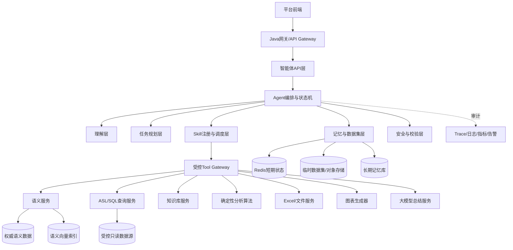
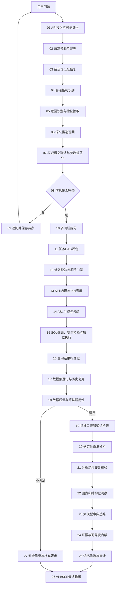
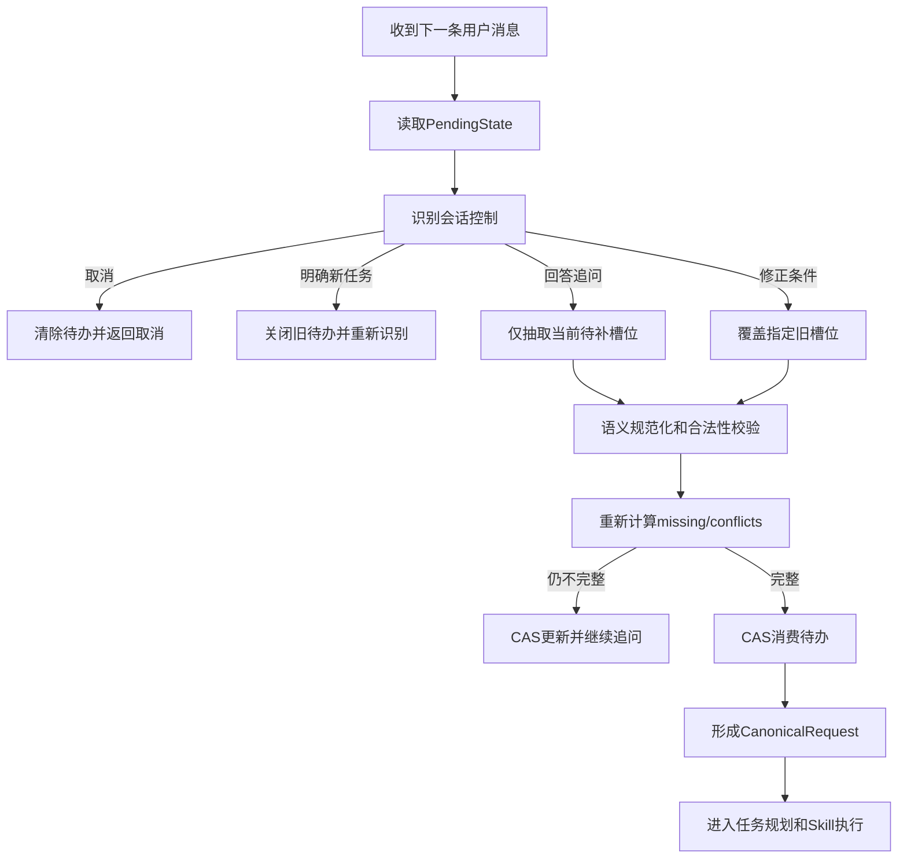
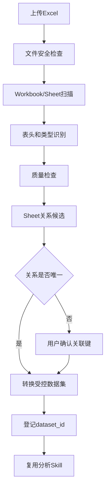
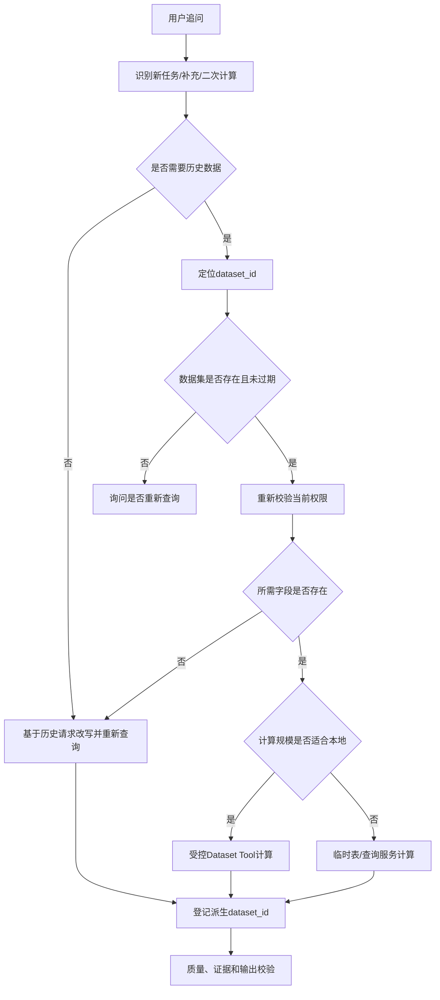
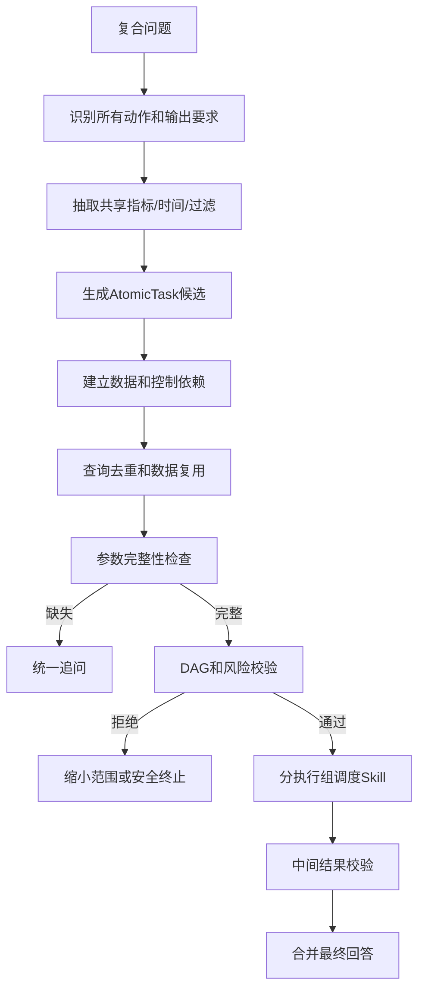
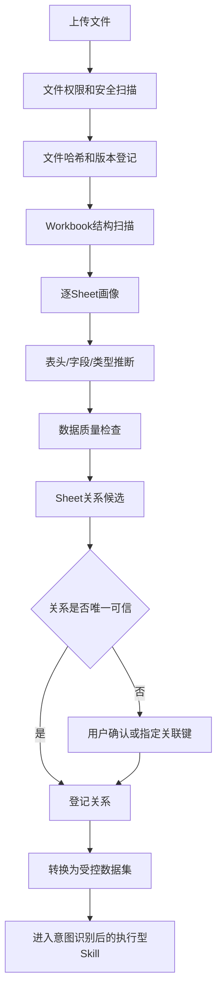
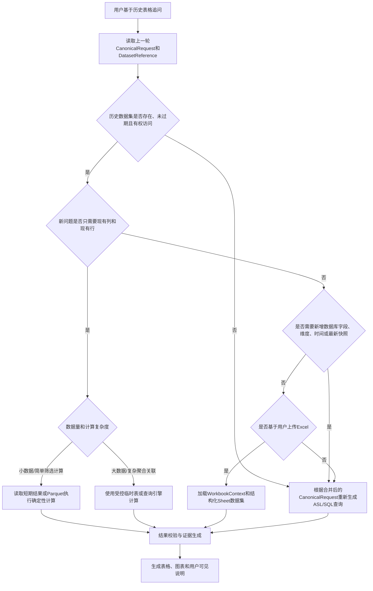
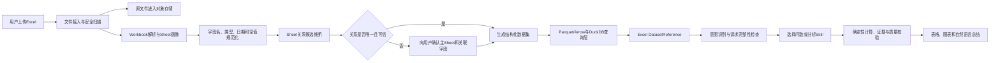

# 数据分析智能体目标架构与关键节点设计

> 文档性质：零基础目标架构设计稿  
> 适用阶段：项目尚未开发，正在设计架构、关键节点、Skill、Tool 和接口  
> 设计边界：本文只描述目标方案，不代表任何能力已经完成  
> 更新日期：2026-08-21

> Milvus、Redis和MinIO的生产检索路由、数据量分级、准确性门禁及降级策略，详见`MILVUS_REDIS_MINIO_RETRIEVAL_DESIGN.md`。

> 知识检索首版固定采用`混合召回 → RRF融合 → 作用域校验 → 去重/多样性控制 → 可信度门禁`，不部署独立Reranker模型。

## 1. 建设目标

建设一个面向企业经营数据的通用分析智能体，支持：

- 指标和明细查询。
- 趋势、对比、占比、异常和归因分析。
- 时序预测和数据质量分析。
- 报表、图表、指标口径和数据血缘。
- 基于历史问题和历史数据集继续追问。
- 多问题拆分、任务规划和工具调度。
- 多 Sheet Excel 问数与分析。

核心原则：

### 意图识别前置改写节点

用户原问题进入意图识别前，必须依次经过：短期记忆上下文补全、Oagnet实体属性候选检索、别名/错漏规范化和改写安全校验。在线检索调用`POST /vector/entity-attributes/search`，不得误用负责同步刷新整个作用域索引的`POST /vector/entity-attributes/sync`。

改写节点同时保留`original_question`和`rewritten_question`，并记录改写事件、置信度、是否使用上下文及是否发生降级。只有高置信、候选明显领先且不改变“同比、环比、预测、归因、口径、血缘”等意图词时才自动替换；候选冲突时保留原文并进入后续澄清。Oagnet超时或缺少语义模型/业务域时不得阻断请求，应使用原问题继续识别并记录降级。

```text
大模型负责理解、规划和表达
确定性程序负责查询、计算、校验和关键决策
语义层负责确认指标、实体、维度和业务含义
信息不足先追问，证据不足不生成结论
```

## 2. 总体架构



## 3. 用户问题到最终输出的完整流程



## 4. 关键节点总表

| 编号 | 节点 | 核心职责 | 关键输出 |
|---|---|---|---|
| 01 | API接入与可信身份 | 建立租户、用户、应用、角色上下文 | TrustedContext |
| 02 | 请求校验与幂等 | Schema、大小、消息ID和请求指纹 | ValidatedRequest |
| 03 | 会话与记忆恢复 | 恢复待办、历史条件、数据集和偏好 | ConversationContext |
| 04 | 会话控制识别 | 识别继续、取消、修正和新任务 | ConversationControl |
| 05 | 意图识别与槽位抽取 | 识别任务并抽取指标、时间、维度等 | IntentCandidate |
| 06 | 语义候选召回 | 召回指标、实体、维度和样例候选 | SemanticCandidates |
| 07 | 权威语义确认 | 确认ID、版本、合法组合和标准值 | CanonicalRequest |
| 08 | 信息完整性判断 | 按意图检查必填槽位 | CompletenessReport |
| 09 | 追问与待办 | 组合追问并保存待补任务 | PendingTask |
| 10 | 多问题拆分 | 将复合问题拆成原子任务 | AtomicTasks |
| 11 | 任务DAG规划 | 建立依赖、输入、输出和复用关系 | TaskPlan |
| 12 | 计划校验 | 校验循环、越界、成本和可执行性 | ApprovedPlan |
| 13 | Skill与Tool调度 | 控制白名单、并行、重试和取消 | ExecutionState |
| 14 | ASL生成与校验 | 生成结构化查询并处理歧义 | ValidatedASL |
| 15 | SQL翻译与执行 | 独立翻译、只读校验和受控数据源执行 | RawQueryResult |
| 16 | 查询结果标准化 | 统一列、行数、快照和质量 | Dataset |
| 17 | 数据集登记 | 生成dataset_id供追问复用 | DatasetReference |
| 18 | 质量与适用性 | 判断数据能否支撑目标算法 | ApplicabilityReport |
| 19 | 口径和知识检索 | 核验指标并检索业务背景 | KnowledgeContext |
| 20 | 确定性算法 | 趋势、异常、归因、预测等计算 | AnalysisFacts |
| 21 | 结果交叉校验 | 校验守恒、单位、基期和证据 | ValidationReport |
| 22 | 图表与洞察 | 生成ChartSpec和结构化洞察 | ChartSpecs/Insights |
| 23 | 大模型事实总结 | 只表达已验证事实 | Narrative |
| 24 | 证据与可靠度 | 计算门禁、限制和可靠度 | ReliabilityReport |
| 25 | 记忆与审计 | 生成记忆候选和审计事件 | MemoryCandidates/Audit |
| 26 | API/SSE输出 | 返回结果、进度、图表和证据 | AgentResponse |
| 27 | 安全降级 | 依赖或证据不足时安全终止 | SafeFallback |

## 5. 节点设计要点

### 5.1 API、身份和幂等

请求需要：`application_id`、`conversation_id`、`message_id`、`question`、应用绑定的语义模型、业务域和知识库。Tenant、User、Application、Roles 和 Trace ID 只能由可信 Java 网关注入。

幂等作用域：

```text
tenant + user + application + conversation + message_id
```

同消息ID且同请求返回原结果；同消息ID承载不同请求必须拒绝。

### 5.2 会话和记忆

短期记忆保存：待补任务、上一规范化请求、最近数据集引用、任务状态和幂等结果。长期记忆只保存经用户确认的指标别名、默认筛选、展示偏好和非敏感业务上下文。

禁止把完整SQL结果、隐私明细和模型隐藏推理作为长期记忆。

### 5.3 意图和槽位

主意图：指标、明细、趋势、对比、占比、异常、归因、预测、报表、口径、血缘、质量、帮助、闲聊和越界。

槽位：指标、实体、时间范围、粒度、维度、过滤值、返回字段、对比类型、Top N、预测步长、历史建模范围和输出格式。

识别策略：

```text
规则强信号 + 大模型结构化分类 + 语义向量候选
→ 确定性冲突门禁 → 权威语义确认
```

### 5.4 完整性和追问

| 意图 | 必填信息 |
|---|---|
| 指标查询 | 指标、时间范围 |
| 明细查询 | 实体、时间范围、字段 |
| 趋势分析 | 指标、历史范围、粒度 |
| 对比分析 | 指标、范围、对比类型 |
| 占比分析 | 指标、范围、分组维度 |
| 异常分析 | 指标、历史范围、粒度 |
| 归因分析 | 指标、目标变化范围、驱动维度 |
| 预测分析 | 指标、预测步长、历史范围、粒度 |

追问应回显已理解信息、缺失槽位、歧义候选和可直接回复的示例。

### 5.5 多问题和任务DAG

“查询本月销售额，和上月比较，再分析下降原因”应拆为查询、对比、归因和图表任务。规划器需要限制任务数、查询数、总行数、并发、耗时、循环依赖、重复任务和非白名单工具。

### 5.6 ASL和SQL

```text
CanonicalRequest → ASL → Schema校验 → 歧义检查
→ `/api/translate`只生成SQL → 智能体只读安全检查 → `/api/execute`执行 → 标准结果
```

翻译和执行必须是两个独立调用阶段。SQL服务与智能体边界均须强制只读：禁止DDL/DML、多语句、危险函数、写文件和锁操作，并限制执行时间、扫描量、返回行数、字节数和并发。数据源必须由服务端绑定，不能接受用户提供数据库连接信息。

### 5.7 数据集和历史追问

查询和文件解析结果统一登记为：

```json
{
  "dataset_id": "dataset-001",
  "query_fingerprint": "sha256...",
  "snapshot_id": "snapshot-001",
  "columns": ["月份", "销售额"],
  "row_count": 12,
  "storage_ref": "受控存储引用",
  "expires_at": "2026-08-21T20:00:00+08:00"
}
```

追问如果只是二次计算则复用数据集；需要新字段、改变业务过滤或数据过期时重新查询。

### 5.8 数据质量和算法

检查字段、类型、行数、截断、空值、重复、时间连续性、新鲜度、样本量、单位、币种、时区和算法适用性。

确定性算法负责描述统计、增长率、同比环比、排名、趋势、波动、异常、变点、维度贡献、驱动贡献、漏斗、价格数量结构和预测。预测必须先进行适用性检查和回测选模。

归因必须区分：已证实原因、数据支持候选、知识库候选和无法确认原因。

### 5.9 图表、总结和可靠度

图表由确定性规则选择；大模型只读取已锁定事实和证据。模型编造数字、修改预测值、引用未知证据或夸大因果时，必须丢弃模型结果。

可靠度综合意图置信度、语义确认、数据质量、新鲜度、算法适用性、知识证据和交叉校验。

## 6. Skill体系

### 6.1 分层

| 层级 | 定义 | 示例 |
|---|---|---|
| Tool | 原子接口或算法 | 指标解析、SQL执行、同比计算 |
| Skill | 完整业务流程 | 趋势分析、归因分析 |
| Framework | 选择、规划、安全、记忆和兜底 | Agent状态机 |

Skill 的调用边界必须固定：

```text
用户问题进入
→ Framework完成意图识别
→ Framework完成语义确认和参数补全
→ Framework完成追问和任务规划
→ 用户意图和执行参数已经明确
→ 才选择并执行对应Skill
→ Skill返回结构化业务结果
→ Framework统一完成证据校验、总结、图表和输出
```

Skill 不负责判断用户究竟想做什么，也不负责跨轮追问。Skill 接收到的必须是已经规范化并通过计划校验的执行请求。

### 6.2 执行型Skill清单

目标Skill只包括意图明确后的业务执行流程，分为查询、分析、报表、跨数据集和文件分析。每个Skill都应可独立注册、测试、版本化和审计，不等同于单个接口。

#### 6.2.1 `metric_query`：指标查询Skill

功能：查询某个指标在指定时间、范围和过滤条件下的结果。

典型问题：

- “本月销售额是多少？”
- “查询华东地区昨天的订单量。”
- “今年各门店的客单价是多少？”

必填输入：指标、时间范围。  
可选输入：维度、过滤条件、粒度、单位、排序和Top N。

执行步骤：

```text
指标解析 → 时间规范化 → 维度合法性检查
→ 生成ASL → 只读查询 → 结果标准化
→ 指标口径核验 → 可靠度计算
```

依赖Tool：`resolve_metric`、`list_allowed_dimensions`、`generate_asl`、`validate_asl`、`execute_query`、`normalize_query_result`、`verify_metric_in_knowledge`。

输出：指标值、单位、时间范围、过滤条件、数据时间、证据和可靠度。

追问或终止条件：指标不存在或多义、时间缺失、维度不允许、数据源不可用、返回数据不完整。

#### 6.2.2 `detail_query`：明细查询Skill

功能：查询订单、商品、客户、支付记录等实体明细。

典型问题：

- “查询昨天的订单明细。”
- “列出退款金额超过1000元的订单号和门店。”

必填输入：实体、时间范围、返回字段。  
可选输入：过滤条件、排序、分页和最大行数。

执行步骤：实体解析 → 字段白名单 → 敏感字段检查 → ASL → 查询 → 脱敏 → 分页和截断说明。

依赖Tool：`normalize_entity_value`、`list_entity_attributes`、`generate_asl`、`guard_read_only_query`、`execute_query`、脱敏工具。

输出：字段说明、脱敏明细、分页信息、截断状态和数据快照。

追问或终止条件：实体或字段不明确、请求敏感字段、行数过大、没有明细访问范围、查询被截断且用户要求全量分析。

#### 6.2.3 `ranking_query`：排行查询Skill

功能：按照指标对门店、区域、商品、渠道等维度进行Top/Bottom排序。

典型问题：“本月销售额最高的10家门店。”

必填输入：指标、维度、时间范围、排序方向和数量。  
依赖Tool：指标解析、维度校验、分组聚合、排序、查询和结果校验。

输出：排名、对象、指标值、并列处理方式和是否截断。

必须限制Top N最大值；存在并列时需要使用稳定排序规则。

#### 6.2.4 `metadata_definition`：指标口径Skill

功能：解释指标定义、计算公式、单位、默认过滤、版本和负责人。

典型问题：“销售额口径是什么？”“客单价怎么算？”

必填输入：指标。  
依赖Tool：`resolve_metric`、`get_metric_definition`、`retrieve_metric_document`。

输出：权威口径、公式、单位、版本、生效时间、来源文档和限制。

指标多义或版本不明确时必须追问，不允许大模型自行解释口径。

#### 6.2.5 `data_lineage`：数据血缘Skill

功能：解释指标来自哪些上游指标、实体、表、字段和数据源。

典型问题：“销售额来自哪张表？”“这个指标依赖什么字段？”

必填输入：指标及版本。  
依赖Tool：`get_metric_lineage`、`resolve_entity_relation`。

输出：业务血缘、技术血缘、依赖版本、数据更新时间和可展示范围。

数据库连接信息、账号密码等内部敏感信息不能返回用户。

#### 6.2.6 `trend_analysis`：趋势分析Skill

功能：判断指标在一段时间内的方向、速度、波动和稳定性。

典型问题：“分析最近12个月销售额趋势。”

必填输入：指标、历史时间范围、时间粒度。  
可选输入：维度、过滤条件、平滑窗口和比较基线。

执行步骤：历史数据查询 → 时间轴检查 → 缺失期处理 → 稳健趋势计算 → 波动分析 → 图表 → 事实总结。

依赖Tool：`trend_diagnostics`、`growth_rate`、`volatility_analysis`、`dataset_quality_check`、`build_chart_spec`。

输出：首尾变化、变化率、稳健斜率、方向一致性、波动、异常提示和趋势图。

时间点不足、频率不规则或缺失过多时不能输出可靠趋势。

#### 6.2.7 `comparison_analysis`：对比分析Skill

功能：比较两个时期、对象、人群或方案之间的指标差异。

典型问题：“本月销售额与上月相比怎么样？”“华东和华南订单量对比。”

必填输入：指标、对比对象或对比期间、对比类型。  
依赖Tool：`period_comparison`、同比/环比、单位校验和快照校验。

输出：基期值、当前值、绝对变化、相对变化、方向和图表。

必须处理基期为零、币种不一致、粒度不一致和快照不一致。

#### 6.2.8 `composition_analysis`：构成占比Skill

功能：分析某指标由哪些区域、门店、渠道、商品等部分构成。

典型问题：“各渠道销售额占比是多少？”

必填输入：指标、时间范围、分组维度。  
依赖Tool：`group_aggregation`、占比计算、守恒校验和图表工具。

输出：各分组数值、占比、累计占比、主要贡献者和长尾情况。

必须校验总和、空值分组、负值场景和“其他”分组规则。

#### 6.2.9 `anomaly_analysis`：异常分析Skill

功能：识别异常点、异常区间、突升、突降和结构变化。

典型问题：“最近销售额有什么异常？”

必填输入：指标、历史范围、时间粒度。  
可选输入：敏感度、业务阈值、维度和基线周期。

执行步骤：适用性检查 → 基线构建 → 异常检测 → 变点检测 → 业务阈值复核 → 异常图表。

依赖Tool：`anomaly_detection`、`change_point_detection`、`dataset_quality_check`。

输出：异常时间、实际值、基线、偏离程度、检测方法和证据。

异常只说明“数据偏离基线”，不能直接当成业务原因。

#### 6.2.10 `root_cause_analysis`：归因分析Skill

功能：对下降、增长或异常进行候选原因拆解和贡献排序。

典型问题：“为什么本月销售额下降？”

必填输入：目标指标、变化期间、比较基期。  
可选输入：驱动指标、候选维度、业务事件范围和分析深度。

执行步骤：确认变化事实 → 获取驱动数据 → 维度贡献 → 驱动贡献 → 业务事件检索 → 候选排序 → 证据分级。

依赖Tool：`dimension_contribution`、`driver_contribution`、`funnel_decomposition`、`price_volume_mix`、`retrieve_business_event`、`evidence_grounding_check`。

输出必须分为：

- 已证实原因。
- 数据支持的高相关候选。
- 知识库提供的业务候选。
- 当前无法确认的原因。

没有驱动数据时只能说明“无法归因”和需要补充的数据，不能让大模型生成原因。

#### 6.2.11 `forecast_analysis`：预测分析Skill

功能：基于历史序列预测未来指标并给出误差区间。

典型问题：“预测下个月销售额。”

必填输入：指标、历史范围、粒度、预测步长。  
可选输入：外生变量、节假日、促销计划和置信水平。

执行步骤：预测适用性 → 频率和缺失检查 → 候选模型回测 → 按指标选模 → 训练 → 预测 → 区间 → 风险说明。

依赖Tool：`forecast_readiness_check`、`forecast_backtest`、`forecast_model_selection`、`prediction_interval`。

输出：预测值、上下区间、模型、回测误差、历史长度、限制和预测图。

历史不足、结构变化严重、粒度不规则或预测范围超出能力时必须拒绝预测并说明需求。

#### 6.2.12 `data_quality_analysis`：数据质量Skill

功能：分析数据完整性、唯一性、有效性、一致性、连续性和新鲜度。

典型问题：“这批销售数据质量怎么样？”

必填输入：数据集或数据对象。  
依赖Tool：`dataset_quality_check`、规则引擎、字段画像和时间连续性检查。

输出：质量分项、问题字段、影响范围、严重度和修复建议。

质量问题不能自动修改源数据，只能报告或生成待确认处理建议。

#### 6.2.13 `report_generation`：报表生成Skill

功能：组合多个查询和分析结果形成结构化报告。

典型问题：“生成本月销售经营分析报告。”

必填输入：报告主题、时间范围、报告模板或受众。  
依赖Tool：任务规划、多Skill执行、图表、事实总结和文档渲染。

输出：摘要、指标卡、趋势、对比、异常、原因候选、图表、数据范围和证据目录。

报告只能组合已验证结果，不允许为了填满模板生成不存在的数据。

#### 6.2.14 执行型Skill汇总

当用户意图已经明确后，Framework只能从以下业务Skill中选择：

| Skill | 对应明确意图或操作 |
|---|---|
| `metric_query` | 查询指标值 |
| `detail_query` | 查询实体明细 |
| `ranking_query` | 查询Top/Bottom排行 |
| `metadata_definition` | 查询指标口径 |
| `data_lineage` | 查询数据血缘 |
| `trend_analysis` | 执行趋势分析 |
| `comparison_analysis` | 执行同比、环比或对象对比 |
| `composition_analysis` | 执行构成和占比分析 |
| `anomaly_analysis` | 执行异常检测 |
| `root_cause_analysis` | 执行归因分析 |
| `forecast_analysis` | 执行预测分析 |
| `data_quality_analysis` | 执行数据质量分析 |
| `report_generation` | 生成综合分析报告 |
| `cross_dataset_analysis` | 联合多个已登记数据集分析 |
| `excel_query` | 对已完成画像的Excel问数 |
| `excel_multi_sheet_analysis` | 对已确认关系的多Sheet分析 |
| `database_excel_compare` | 数据库结果与Excel数据对比 |

不在该表中的追问、记忆、任务拆分、计划校验、文件安全、图表、总结、可靠度和降级能力均属于 Framework 或 Tool。

### 6.3 不属于Skill的前置框架能力

以下能力发生在Skill执行之前，由Agent Framework统一负责，不能注册成可选业务Skill。

#### 6.3.1 `clarification`：追问澄清节点

定位：澄清追问是 Agent Framework 的核心状态机节点，发生在执行型Skill之前。它负责把不完整、有歧义或相互冲突的用户请求逐步补齐成可以执行的 CanonicalRequest，但自己不查询数据、不调用分析算法，也不产生业务结论。

##### A. 追问触发条件

只有以下情况允许追问：

1. 必填槽位缺失，例如没有指标或时间范围。
2. 一个用户说法匹配多个权威语义对象。
3. 用户条件互相冲突，例如同时要求“本月”和“去年全年”。
4. 指标与维度组合不合法，例如指标不支持按该维度拆分。
5. 实体值无法唯一规范化，例如“华东”可能是大区或部门。
6. 预测、异常或归因的数据要求不明确，例如缺少历史窗口或比较基期。
7. 多问题之间的依赖或范围不清楚。
8. 用户要求的数据量、输出字段或分析深度可能超过系统限制。

以下情况不应追问：

- 可以用业务规则唯一、无风险地规范化。
- 用户已明确给出完整条件。
- 外部服务故障，此时应安全降级而不是反复询问用户。
- 系统不支持该能力，应说明能力边界而不是假装补信息后可以执行。
- 请求越界或要求写库，应直接拒绝。

##### B. 追问前的输入

```json
{
  "conversation_context": {},
  "canonical_request_draft": {},
  "intent": "FORECAST_ANALYSIS",
  "intent_confidence": 0.96,
  "resolved_slots": {},
  "missing_slots": [],
  "conflicting_slots": [],
  "semantic_candidates": [],
  "semantic_ambiguities": [],
  "capability_constraints": [],
  "current_round": 1,
  "state_version": 3
}
```

意图置信度、语义匹配置信度和请求完整度必须分开，不能因为意图置信度高就认为参数已经完整。

##### C. 追问优先级

追问按照以下顺序处理：

```text
请求是否越界或不可支持
→ 用户是否取消或开始新任务
→ 核心业务对象是否明确
→ 指标/实体语义歧义
→ 时间范围和比较基期
→ 维度、过滤和返回字段
→ 算法特殊要求
→ 输出格式偏好
```

优先补充会影响后续所有步骤的槽位。例如指标不明确时，不应先询问图表颜色或返回格式。

##### D. 一轮追问问多少内容

默认采用“最少轮次、有限问题”的策略：

- 强相关且用户可以一次回答的缺失项合并询问。
- 一轮最多询问 3 个短问题。
- 多个语义候选优先提供 2～5 个选项。
- 高风险歧义一次只确认一个核心问题。
- 不询问系统可以从可信应用上下文获得的信息。
- 不重复询问已经确认且未被用户修改的条件。

示例：

```text
我已理解：你想预测销售额，预测目标是下个月。
还需要确认：
1. 使用多长的历史数据建模？
2. 按日、周还是月粒度预测？
可以直接回复：使用过去12个月，按月预测。
```

##### E. 追问话术结构

每次追问必须包含：

1. `understood_slots`：系统已理解的条件。
2. `missing_slots`：缺少的信息编码。
3. `conflicts`：冲突条件及来源。
4. `clarification_questions`：面向用户的问题。
5. `candidate_options`：可选择的权威候选。
6. `reply_example`：用户可以直接照抄的回复。
7. `clarification_round`：当前轮次。
8. `pending_version`：状态版本。

禁止只返回“信息不完整，请补充”这类无法行动的话术。

##### F. PendingState 状态结构

```json
{
  "schema_version": "1.0",
  "tenant_id": "tenant-001",
  "user_id": "user-001",
  "application_id": "app-001",
  "conversation_id": "conversation-001",
  "request_id": "request-001",
  "original_question": "预测销售额",
  "canonical_request_draft": {},
  "intent": "FORECAST_ANALYSIS",
  "intent_source": "HYBRID",
  "resolved_slots": {},
  "missing_slots": ["forecast_horizon", "forecast_history_range"],
  "semantic_ambiguities": [],
  "clarification_round": 1,
  "state_version": 3,
  "created_at": "2026-08-21T10:00:00+08:00",
  "updated_at": "2026-08-21T10:01:00+08:00",
  "expires_at": "2026-08-21T12:01:00+08:00"
}
```

Redis Key 必须包含：

```text
tenant + user + application + conversation
```

不能只使用 `conversation_id`，否则可能发生跨租户、跨用户或跨应用串会话。

##### G. 用户回复的处理流程



追问回复阶段采用“expected-slot-aware extraction”：只针对当前待补槽位提取，不重新自由分类整个问题，防止短回答被误识别为新指标或新意图。

##### H. 继承、覆盖和修正规则

1. 用户未提及的已确认槽位可以继承。
2. 用户明确说“改成、不是、换成、按……”时覆盖对应槽位。
3. “不是销售额，是订单量”应替换指标，不能保留两个指标。
4. 当前可信请求中的应用、身份、角色、知识库和权限不能从历史继承。
5. 空知识库名单代表当前没有绑定，不能继续使用历史知识库。
6. 时间补充不能静默覆盖用户此前明确的其他时间条件。
7. 多指标、多维度和多字段需要逐项规范化，不能把整段文本当成一个值。

##### I. 新任务识别

以下表达通常表示开始新任务：

- “换个问题”。
- “另外查询”。
- “重新分析”。
- “先不看这个”。
- 新问题具有完整且与待办明显不同的意图和对象。

判断顺序：显式会话控制词 → 新请求完整度 → 与旧待办的语义差异 → 用户确认。无法确定时可询问：“你是补充上一问题，还是开始一个新分析？”

##### J. 并发、幂等和状态一致性

- PendingState 使用 `state_version` 和 Redis CAS/Lua 原子更新。
- 相同消息ID、相同请求指纹只处理一次。
- 相同消息ID承载不同内容返回冲突错误。
- 同一会话默认串行执行用户消息。
- 消费PendingState必须使用预期版本，防止清除其他并发消息创建的新状态。
- 查询执行失败后是否保留待办由错误类型决定，不能无条件删除状态。

##### K. 轮次、TTL和退出机制

- 建议最大澄清轮次为 3，可按意图配置。
- 待办TTL建议 1～2 小时，并与平台聊天历史配合恢复。
- 超过轮次后不继续机械追问，输出当前已理解内容和仍缺信息。
- 状态过期后，可使用 Java 提供的最近历史做一次受控恢复。
- 恢复失败时重新确认核心条件，不能猜测。
- 用户取消、任务完成或明确开始新任务后清除旧待办。

##### L. 追问输出Schema

```json
{
  "status": "NEEDS_CLARIFICATION",
  "intent": "FORECAST_ANALYSIS",
  "intent_confidence": 0.96,
  "answer": "我已理解你要预测销售额，目标是下个月。还需要确认历史建模范围和时间粒度。",
  "understood_slots": {
    "metric": "销售额",
    "forecast_horizon": "下个月"
  },
  "missing_slots": ["forecast_history_range", "granularity"],
  "conflicts": [],
  "clarification_questions": [
    "使用多长的历史数据建模？",
    "按日、周还是月粒度预测？"
  ],
  "candidate_options": {},
  "reply_example": "使用过去12个月，按月预测",
  "clarification_round": 1,
  "pending_version": 3
}
```

##### M. 特殊场景处理

| 场景 | 处理方式 |
|---|---|
| 用户只回复“本月” | 只补当前待补的时间槽位 |
| 用户回复“北京”但缺的是指标 | 不得把北京当指标，继续追问 |
| 日期可唯一规范化 | 自动转换，不追问 |
| 日期非法或结束早于开始 | 明确指出日期问题 |
| 指标匹配多个候选 | 展示候选名称、口径摘要和业务域 |
| 用户要求预测但历史不足 | 说明最低数据要求，不进入预测Skill |
| 外部语义服务超时 | 安全降级，不让用户反复补同一信息 |
| 用户取消 | CAS清除待办并返回CANCELLED |
| 用户改问闲聊 | 关闭或挂起旧待办，不继续追问 |
| 历史数据集过期 | 询问是否重新查询，不能继续使用旧结果 |
| 达到最大追问轮次 | 返回未完成原因和可复制的完整请求模板 |

##### N. 追问质量指标

建议监控：

- 首轮问题完整率。
- 追问触发率。
- 一轮补齐率。
- 三轮内补齐率。
- 重复追问率。
- 错误继承率。
- 新任务误合并率。
- 应追问但未追问率。
- 不应追问却追问率。
- Pending CAS冲突率。
- 状态过期恢复成功率。

##### O. 测试场景

至少覆盖：

1. 缺指标、时间、维度、字段、比较类型、预测历史范围。
2. 一次缺多个槽位并在一轮补齐。
3. 指标、实体值和日期多义。
4. 日/号、相对时间、省略年月和非法日期。
5. 用户纠正指标、时间、维度和字段。
6. 用户取消、换问题、闲聊后继续。
7. 同消息ID重试和异内容冲突。
8. 同会话并发消息和CAS冲突。
9. Redis状态损坏、过期和Java历史恢复。
10. 外部语义服务失败。
11. 达到最大轮次。
12. 跨租户、跨用户、跨应用隔离。
13. 历史知识库解绑后不得继承。
14. 多指标、多维度和多字段短回答。
15. 数据不足与信息不足的区别。

只有补齐参数、解决歧义、通过语义确认并形成 CanonicalRequest 后，Framework 才允许进入任务规划和执行型Skill。

#### 6.3.2 `contextual_follow_up`：上下文解析节点

功能：处理“那上个月呢”“按门店看”“为什么”等依赖上一问题的表达。

输入：当前问题、上一规范化请求、会话控制和历史结果引用。

执行步骤：判断新任务还是追问 → 解析继承项 → 应用用户修正 → 重新校验完整性。

输出：新的CanonicalRequest和继承/覆盖说明。

不能继承身份、应用权限和已解绑知识库；这些作用域必须以当前可信请求为准。

#### 6.3.3 `dataset_follow_up`：历史数据集路由节点

功能：基于上一查询结果进行二次筛选、计算、排序、图表或总结。

典型问题：“去掉最高和最低两个月，再算平均值。”

输入：dataset_id、原快照、用户操作。  
依赖Tool：`load_dataset`、`transform_dataset`、`compare_snapshots`、数据质量工具。

该节点先把用户追问改写成明确操作，再路由到查询、趋势、对比、图表等执行型Skill。它本身不承担业务算法。

输出：新的执行请求、目标dataset_id、继承条件和操作类型。

数据集过期、权限变化或缺少所需字段时重新查询或追问。

#### 6.3.4 `multi_question_analysis`：多问题拆分与规划节点

功能：拆分并执行一个请求中的多个相互依赖问题。

输入：复合问题、作用域、成本预算。  
依赖Tool：多问题拆分器、DAG规划器、计划校验器和Skill调度器。

输出：待执行任务图和每个任务对应的Skill类型。子任务结果由对应执行型Skill产生，合并结论由Framework后处理节点产生。

必须限制任务数量和总成本；不能无限递归拆解。

### 6.4 跨数据集和文件执行型Skill

#### 6.4.1 `cross_dataset_analysis`：跨数据集分析Skill

功能：联合两个或多个数据库查询结果、Excel数据集或历史结果。

输入：多个dataset_id、关联键、时间和单位规则。  
依赖Tool：`join_datasets`、字段映射、关联基数检查、守恒和快照校验。

输出：关联后的派生数据集、关联覆盖率、未匹配记录和分析结果。

关联关系不唯一或可能造成数据膨胀时必须让用户或语义层确认。

#### 6.4.2 `excel_profile`：Excel预处理节点

功能：检查Excel结构并生成可分析性报告。

输入：经过授权的文件引用。  
依赖Tool：`file_security_scan`、`inspect_workbook`、`profile_sheet`。

输出：Sheet列表、表头、字段类型、行列数、公式、空值、重复列和风险。

该节点属于文件进入分析系统前的强制预处理，不作为用户业务意图对应的Skill，也不直接得出业务结论。

#### 6.4.3 `excel_query`：Excel问数Skill

功能：把单Sheet或已经确认结构的Excel转换成数据集并完成查询。

输入：文件、Sheet、问题和字段映射。  
依赖Tool：文件安全、Sheet画像、数据集转换、白名单数据转换和查询工具。

输出：查询结果、dataset_id、数据质量和来源Sheet。

表头或字段类型不确定时必须追问。

#### 6.4.4 `excel_multi_sheet_analysis`：多Sheet分析Skill

功能：识别并确认多个Sheet之间的关联关系后进行联合分析。

输入：文件、目标问题和关联候选。  
依赖Tool：`infer_sheet_relationships`、`confirm_sheet_relationships`、`join_datasets`。

输出：关系图、关联结果、覆盖率、异常关联和分析结果。

模型只能提出关联候选，不能未经确认直接使用高风险关联键。

#### 6.4.5 `database_excel_compare`：数据库与Excel对比Skill

功能：将上传文件中的计划、预算或人工台账与数据库实际数据对比。

输入：数据库数据集、Excel数据集、字段映射、时间和单位。  
输出：匹配率、差异、缺失记录、异常对象和对比图表。

必须验证口径、币种、粒度和快照，不能只按同名列直接对比。

### 6.5 不属于Skill的统一后处理能力

以下能力在执行型Skill完成后统一运行，属于Framework后处理节点或Tool，不应由意图分类直接选成业务Skill。

#### 6.5.1 `insight_generation`：洞察组织节点

功能：把多个已验证分析事实组织成业务洞察。

输入：AnalysisFacts、证据、限制和受众。  
依赖Tool：`evidence_grounding_check`、`summarize_verified_facts`。

输出：主要发现、候选解释、风险、限制和下一步分析建议。

该节点不能新增计算结果，也不能把建议写成自动经营决策。

#### 6.5.2 `chart_generation`：图表后处理节点

功能：选择合适图表并生成前端可渲染的ChartSpec。

输入：数据集、分析类型、字段和展示限制。  
依赖Tool：`select_chart_type`、`build_chart_spec`、图表数据校验。

输出：图表类型、标题、坐标字段、数据、标注、单位和说明。

趋势使用折线图，对比使用柱状图，归因使用贡献度条形图或瀑布图，预测展示历史、预测值和区间。

#### 6.5.3 `executive_summary`：管理层摘要渲染器

功能：把复杂报告压缩为管理者容易阅读的摘要。

输入：已验证事实、图表、风险、限制和受众级别。  
输出：核心结果、主要变化、原因候选、风险和建议关注事项。

不得隐藏数据不足、低可靠度和口径限制。

#### 6.5.4 `analysis_explanation`：分析过程渲染器

功能：向用户展示可核验的处理步骤，而不是模型隐藏思维链。

输出示例：

```text
1. 识别为趋势分析
2. 确认指标和时间范围
3. 查询12个月数据
4. 检查时间连续性
5. 使用稳健趋势算法
6. 校验计算结果和证据
```

输出可以包含工具、数据范围、算法名称和限制，但不得暴露密钥、内部提示词、完整SQL明细和模型隐藏推理。

#### 6.5.5 `capability_help`：框架能力说明节点

功能：根据当前应用实际启用的Skill和Tool，回答“你能做什么”“需要提供什么信息”。

输入：应用启用能力、语义模型范围和用户角色。  
输出：真实可用能力、示例问题、所需参数和明确限制。

不能使用写死的超前话术宣称尚未启用的能力。

#### 6.5.6 `safe_fallback`：框架安全降级节点

功能：当依赖失败、信息不足、数据不够、权限不允许或证据校验失败时安全终止。

输入：失败节点、标准错误码、重试结果、已有事实和补充要求。

输出必须说明：

- 当前没有完成什么。
- 为什么不能可靠完成。
- 已经确认了哪些事实。
- 用户或其他系统需要补什么。
- 是否可以重试。

该节点不能掩盖失败，也不能使用虚构结果替代真实数据。

### 6.6 Skill标准

```text
NL_Agent/skills/{code}/{slug}/
├── SKILL.md
└── references/              # 可选，仅存放说明性参考资料
```

平台以 `code + slug` 标识一个Skill。`slug`兼容中文，但禁止斜杠、反斜杠、`.`、`..`和控制字符。每个Skill必须在 `SKILL.md` 中声明适用范围、输入输出、必填槽位、绑定Tool、数据要求、依赖、并行性、超时、重试、降级和证据要求。

Skill允许按需更新。数据智能体每次准备调用绑定Tool时检查 `SKILL.md` 的修改时间和文件大小：未变化直接使用内存缓存；发生变化时重新读取并生成SHA-256版本号，下一次请求立即生效，不需要重启服务。更新应采用“写临时文件后原子替换”的发布方式，避免读取到半个文件。

稳定性规则：

- Skill文件为空、非UTF-8、读取失败或超过128 KiB时，不加载损坏版本；已有缓存时继续使用上一版可用内容并标记 `stale=true`。
- 响应中的扩展工具结果记录 `_skill.version`，用于审计本次实际使用的Skill版本。
- Skill内容只能指导已绑定Tool的业务步骤和输出要求，不能动态执行其中的Python、Shell或SQL代码。
- Skill不能关闭SQL只读校验、证据校验、数据范围校验、确定性算法和可靠度门禁。
- 更新分析公式或预测方法必须先修改并测试确定性算法代码；不能只修改SKILL.md就改变数值计算。
- 多实例部署时所有实例必须挂载同一版本化Skill目录，或者后续接入统一Skill Registry；不能依赖各实例独立的本地副本。

## 7. Tool体系

语义工具：`resolve_metric`、`get_metric_definition`、`get_metric_lineage`、`normalize_entity_value`、`list_allowed_dimensions`、`list_entity_attributes`、`resolve_entity_relation`、`semantic_search`。

查询工具：`generate_asl`、`validate_asl`、`translate_asl_to_sql`、`guard_read_only_query`、`execute_query`、`cancel_query`、`normalize_query_result`。

数据集工具：`register_dataset`、`load_dataset`、`transform_dataset`、`join_datasets`、`compare_snapshots`、`expire_dataset`。

分析工具：`descriptive_statistics`、`growth_rate`、`group_aggregation`、`ranking`、`trend_diagnostics`、`period_comparison`、`anomaly_detection`、`change_point_detection`、`dimension_contribution`、`driver_contribution`、`funnel_decomposition`、`price_volume_mix`、`forecast_readiness_check`、`forecast_backtest`、`forecast_model_selection`、`prediction_interval`。

校验工具：`dataset_quality_check`、`analysis_applicability_check`、`calculation_invariant_check`、`evidence_grounding_check`、`llm_output_guard`、`reliability_calculator`。

知识工具：`verify_metric_in_knowledge`、`retrieve_metric_document`、`retrieve_analysis_context`、`retrieve_business_event`。

文件工具：`file_security_scan`、`inspect_workbook`、`profile_sheet`、`infer_sheet_relationships`、`confirm_sheet_relationships`、`convert_sheet_to_dataset`。

输出工具：`select_chart_type`、`build_chart_spec`、`summarize_verified_facts`、`build_executive_summary`、`render_analysis_process`。

## 8. 框架强制能力

身份隔离、Schema校验、幂等、会话CAS、SQL只读、权限、脱敏、限行、超时、证据校验、审计、可靠度和安全降级不能由Skill决定是否执行。

并行只适用于互不依赖的口径、血缘、知识检索、多查询和多维度计算；ASL与SQL、查询与算法、算法与总结、校验与输出必须保持依赖顺序。

## 9. 语义层数据设计

语义层必须提供：语义模型、业务域、指标、维度、实体、属性、关系、枚举、同义词、负向别名、指标维度绑定、指标实体绑定、意图样例、歧义规则、版本和发布状态。

### 9.1 指标字段

| 字段组 | 内容 |
|---|---|
| 身份 | metric_id、code、name |
| 作用域 | semantic_model_id、business_domain_id |
| 口径 | definition、formula、unit、format_rule |
| 语言 | synonyms、negative_aliases |
| 时间 | time_field、default/supported granularity |
| 约束 | allowed_dimension_ids、bound_entity_ids、default_filters |
| 数据 | data_source_id |
| 治理 | owner、version、有效期、status、is_deleted、updated_at |

### 9.2 维度字段

dimension_id/code/name、semantic_model_id、description、synonyms、data_type、hierarchy、field_mapping、supported_operators、enum_set_id、bound_metric_ids和版本治理字段。

### 9.3 实体、属性和关系字段

实体包含ID、编码、名称、业务域、描述、同义词、主键、时间字段、展示字段和敏感字段。

属性包含ID、实体ID、编码、名称、类型、字段映射、敏感标记、脱敏规则、是否允许过滤和输出。

关系包含来源实体、目标实体、关系类型、关联键、查询方向和版本治理字段。

### 9.4 枚举字段

enum_set_id、所属维度/属性、canonical_code、canonical_value、synonyms、parent_code、有效期、敏感标记和版本治理字段。

## 10. 语义向量库

### 10.1 应进入向量库

- 指标名、定义、同义词、单位和应用场景。
- 维度名、同义词、层级和含义。
- 实体名、别名、描述和典型用途。
- 属性名、别名和描述。
- 实体关系的自然语言说明。
- 低敏感、低基数枚举值。
- 业务域名称和边界。
- 经审核的真实意图样例。
- 正确/错误使用示例和歧义规则。

### 10.2 Metadata

每条记录必须包含 tenant_id、project_id、semantic_model_id、business_domain_id、document_type、object_id、version、status、is_deleted、有效期、updated_at和embedding_model。

必须先按租户、应用绑定模型、业务域、类型、发布状态和版本过滤，再执行关键词与向量混合检索。

### 10.3 禁止进入向量库

- 密码、连接串和API Key。
- 完整业务明细和高基数交易记录。
- 手机号、证件号等隐私数据。
- 未脱敏聊天历史。
- 临时分析结果和预测值。
- 草稿、已删除或未审核对象。
- 完整SQL和内部错误堆栈。

低基数地区、状态、类别可向量化；中等规模门店应分应用并混合检索；高基数商品使用专门实体搜索；客户和隐私标识禁止向量化；库存和金额等实时事实从数据库查询。

## 11. 语义接口

建议提供：

- `POST /semantic/metrics/resolve`
- `GET /semantic/metrics/{id}/definition`
- `GET /semantic/metrics/{id}/lineage`
- `GET /semantic/metrics/{id}/dimensions`
- `POST /semantic/entities/normalize`
- `GET /semantic/entities/{id}/attributes`
- `POST /semantic/relations/resolve`
- `POST /semantic/search`
- `GET /semantic/models/{id}/version`
- `GET /semantic/changes?since=...`

接口必须返回对象ID、版本、作用域、发布状态、唯一命中状态、候选、歧义、更新时间和标准错误码。

## 12. 语义发布和向量同步

```text
权威数据变更 → 业务审核 → 发布校验 → 版本化事件
→ 稳定文本模板 → Embedding → Upsert向量
→ 删除失效记录 → 清理缓存 → 回归测试 → 灰度发布
```

权威语义库是事实源，向量库是可重建索引；`object_id + version` 作为幂等键；删除对象同步删除向量和缓存；记录Embedding版本并支持全量重建。

## 13. Excel多Sheet



需要处理多行表头、合并单元格、重复列、隐藏Sheet、公式、日期金额格式、大文件、损坏文件、密码、宏和一对多关系。Excel必须结构化后计算，不能仅依赖向量检索。

## 14. 受控Python

优先建设白名单算法工具。若必须支持动态脚本，应使用禁止网络、只读输入、资源限制、白名单依赖、AST检查和执行后销毁的独立沙箱；输出仍需通过数据和证据校验。

## 15. 最终输出

响应包含请求/会话ID、状态、意图、已理解槽位、回答、分析步骤、洞察、图表、证据、补充要求、可靠度、数据集引用和时间。

状态建议：`COMPLETED`、`NEEDS_CLARIFICATION`、`SAFE_FALLBACK`、`REJECTED`、`CANCELLED`、`PARTIAL_SUCCESS`。

## 16. 安全、稳定性和可观测性

必须具备租户/应用隔离、可信身份、服务端数据源绑定、只读SQL、脱敏、幂等、背压、超时、重试预算、熔断、数据集TTL、日志脱敏、全链路Trace、版本化Schema和安全降级。

每个节点记录request_id、task_id、节点版本、耗时、Tool状态、重试、数据集和快照ID、错误码、模型耗时和可靠度门禁，不记录敏感明细。

## 17. 测试与验收

测试包括：Schema单测、Tool契约、Skill流程、多轮会话、语义检索、算法黄金集、端到端、并发故障注入、安全越权和业务验收。

| 指标 | 建议目标 |
|---|---|
| 主意图准确率 | ≥97% |
| 高风险意图召回率 | ≥98% |
| 指标Top-1准确率 | ≥97% |
| 指标Top-3召回率 | ≥99% |
| 应追问但未追问率 | <1% |
| 跨租户错误召回 | 0 |
| 删除对象残留召回 | 0 |
| SQL写操作成功数 | 0 |
| 无证据数值结论 | 0 |

## 19. 建设路线

### 阶段一：架构和契约

确定意图/槽位、CanonicalRequest、Skill/Tool、ASL、查询结果、语义字段、向量Metadata、身份、幂等和审计规范，并建立Mock与契约测试。

### 阶段二：基础问数

建设API、状态机、意图、语义确认、追问、指标/明细Skill、ASL/SQL、结果标准化、质量、证据、可靠度和SSE。

### 阶段三：分析闭环

建设趋势、对比、占比、异常、归因、预测、图表和大模型受控总结。

### 阶段四：复杂任务

建设数据集复用、多问题DAG、并行调度、异步任务和多数据集联合分析。

### 阶段五：文件和高级分析

建设多Sheet Excel、数据库与文件联合分析、多步/季节性/多变量预测和受控Python沙箱。

## 21. 重点场景专项规划

本章针对三个需要提前规划的核心场景给出完整目标方案：

1. 基于历史问题和历史查询数据继续追问。
2. 一个用户问题中的多问题拆分和执行。
3. 基于上传的多Sheet Excel进行问数和分析。

这三项能力共享 CanonicalRequest、TaskPlan、DatasetReference、Evidence 和可靠度体系，不能分别建设三套互不兼容的临时逻辑。

## 22. 基于历史问题和历史数据继续追问

### 22.1 目标场景

需要支持以下追问类型：

| 类型 | 示例 | 应采用的处理方式 |
|---|---|---|
| 修改时间 | “那上个月呢？” | 继承指标，覆盖时间，重新查询 |
| 增加维度 | “按门店拆开看。” | 继承指标和时间，增加维度，重新生成ASL |
| 修改过滤 | “只看华东地区。” | 增加标准过滤，重新查询 |
| 替换指标 | “订单量呢？” | 替换指标，重新查询 |
| 历史结果计算 | “去掉最高最低值再算平均。” | 复用历史dataset_id，执行受控计算 |
| 历史结果筛选 | “只看下降的月份。” | 复用历史dataset_id，执行筛选 |
| 历史结果图表 | “把刚才结果画成折线图。” | 复用dataset_id，生成ChartSpec |
| 历史结果解释 | “为什么6月份下降？” | 基于历史数据定位目标，再规划补充驱动查询 |
| SQL扩展 | “再加上渠道字段。” | 基于上一CanonicalRequest/ASL重新生成，不拼接原SQL |
| Excel追问 | “刚才第二个Sheet按区域汇总。” | 使用Excel派生dataset_id进行计算 |

### 22.2 统一数据对象

每一次查询或文件解析都必须生成数据集引用：

```json
{
  "dataset_id": "ds-01J6ABC",
  "tenant_id": "tenant-001",
  "user_id": "user-001",
  "application_id": "app-001",
  "conversation_id": "conversation-001",
  "source_type": "DATABASE_QUERY",
  "source_ref": "query-task-001",
  "canonical_request_ref": "request-spec-001",
  "asl_ref": "asl-001",
  "query_fingerprint": "sha256...",
  "snapshot_id": "snapshot-001",
  "data_as_of": "2026-08-21T10:00:00+08:00",
  "quality_status": "PASS",
  "columns": ["月份", "销售额"],
  "row_count": 12,
  "byte_size": 4096,
  "storage_type": "REDIS",
  "storage_ref": "dataset:ds-01J6ABC",
  "parent_dataset_ids": [],
  "transformation_log": [],
  "created_at": "2026-08-21T10:00:01+08:00",
  "expires_at": "2026-08-21T12:00:01+08:00"
}
```

关键要求：

- 数据集必须按租户、用户、应用和会话隔离。
- 每个数据集绑定查询快照和数据时间。
- 派生数据集记录父数据集和转换日志。
- 数据集引用可以进入短期记忆，完整大数据不能无限写入Redis。
- 权限变化后必须重新校验数据集是否仍可读取。

### 22.3 分级存储方案

| 数据规模 | 建议存储 | 用途 |
|---|---|---|
| 极小结果 | 请求响应缓存 | 幂等重放 |
| 小结果 | Redis压缩JSON/MessagePack | 短时间二次计算 |
| 中等结果 | MinIO中的Parquet/Arrow | 多轮分析和跨进程读取 |
| 大结果 | 数据库结果缓存或临时中间表 | 大数据聚合和二次查询 |
| Excel原文件 | 对象存储 | 文件留存和重新解析 |
| Excel结构化结果 | Parquet或临时表 | 精确问数和跨Sheet分析 |

建议阈值作为可配置策略，不写死在模型提示词中。例如：

```text
≤ 1,000行且≤ 1MB：Redis
≤ 1,000,000行且≤ 256MB：Parquet/对象存储
更大或需要数据库计算：临时中间表/结果缓存
```

具体阈值需要根据部署资源和SLA压测后确定。

### 22.4 Redis保存什么

Redis只保存：

- PendingState。
- 上一次CanonicalRequest。
- 最近有限个DatasetReference。
- 小型数据集或数据集缓存位置。
- 任务状态和进度。
- 幂等请求指纹和响应。
- 数据集租约和版本。

Redis不保存：

- 无限增长的完整聊天历史。
- 大批量业务明细。
- 长期有效的原始SQL结果。
- 用户隐私和数据库连接信息。
- 模型隐藏推理过程。

### 22.5 临时中间表方案

当数据量较大或追问需要继续由数据库执行聚合时，可以创建受控临时中间表。

要求：

- 由查询服务创建，智能体不能直连数据库建表。
- 使用专用临时Schema和只允许受控操作的服务账户。
- 表名由服务端生成，不能接受用户输入。
- 表记录tenant/application/user/dataset_id作用域。
- 设置创建时间、过期时间和自动清理任务。
- 限制最大行数、总存储量和单用户配额。
- 禁止通过临时表跨租户Join。
- 派生查询仍经过AST和只读策略校验。
- 审计创建、读取、续期和删除事件。

临时表接口建议：

```text
POST   /datasets/materialize
POST   /datasets/{dataset_id}/query
POST   /datasets/{dataset_id}/renew
DELETE /datasets/{dataset_id}
```

### 22.6 基于上一问题重新生成SQL

不允许使用字符串方式拼接上一条SQL，例如：

```text
错误方式：上一SQL + "AND region='华东'"
```

正确方式：

```text
上一CanonicalRequest
→ 合并本轮用户修改
→ 重新完成语义规范化
→ 生成新的CanonicalRequest
→ 生成新ASL
→ ASL Schema校验
→ SQL服务重新生成和校验SQL
```

只有查询服务可以持有完整SQL；智能体记忆层优先保存CanonicalRequest、ASL引用和查询指纹。

### 22.7 历史追问路由决策



### 22.8 Excel历史追问

Excel进入系统后需要同时保存：

- 原始文件引用。
- Workbook版本和文件哈希。
- 每个Sheet的数据集ID。
- Sheet画像和字段映射。
- 已确认的Sheet关系。
- 派生数据集和转换记录。

用户说“刚才第二个Sheet”时，应依据会话中的WorkbookContext解析；文件被重新上传后必须产生新版本，不能静默复用旧Sheet。

### 22.9 数据一致性和过期

- 数据库数据集必须携带真实snapshot_id和data_as_of。
- 两个不同快照的数据对比需要明确说明。
- 数据集TTL到期后不能继续计算。
- 用户可以申请重新查询，但必须生成新dataset_id。
- 临时表和对象存储文件删除后同步清理Redis引用。
- 服务异常时使用租约和后台清理器回收孤儿数据。

### 22.10 验收场景

至少验证：

1. 那上个月呢。
2. 换成订单量。
3. 按门店拆分。
4. 增加过滤条件。
5. 去掉极值后二次计算。
6. 基于上一结果生成图表。
7. 数据集过期后重新查询。
8. 权限变化后拒绝旧数据集。
9. 不同快照对比提示。
10. 小结果Redis复用。
11. 中等结果Parquet复用。
12. 大结果临时表二次查询。
13. Excel Sheet追问。
14. 并发追问不串状态。
15. 跨租户、跨应用、跨用户访问全部拒绝。

## 23. 多问题拆分与任务规划

### 23.0 当前首版实现状态（2026-08-25）

当前代码已经落地可运行的首版闭环：

- 先用确定性信号判断是否疑似多问题，避免每条消息都额外调用模型。
- 疑似多问题交给Qwen输出结构化原子任务和依赖下标；模型不可用或输出非法时降级为规则拆分。
- 单轮最多5个原子任务，每个任务重新执行问题改写、意图识别、完整性检查、ASL/SQL、分析与可靠性判断。
- 计划执行前确定性校验任务数量、任务ID、前向依赖、自依赖和环路。
- 无依赖任务在同一DAG层并行；依赖任务按层执行，并把前序问答作为受限历史上下文。
- 子任务使用内部隔离会话，避免并行任务互相覆盖短期记忆；依赖链复用同一个内部会话。
- 单个分支异常不会中止其他独立分支；其下游标记为 `SKIPPED`，总响应标记 `PARTIAL_SUCCESS`。
- 响应增加 `task_plan` 和 `task_results`，每个子任务分别返回状态、意图、答案、dataset_id、可靠性、图表和证据编号。

当前版本已经完成以下DAG增强能力：

- 对规范化问题及其依赖集合生成确定性查询指纹；同一DAG中的相同查询只执行一次，重复任务在最终结果中复用标准任务响应。
- 当一个后续任务明确依赖两个或以上分支并表达“合并/关联/联表”时，从各分支的`dataset_id`恢复MinIO数据集，按公共业务键执行受控Inner Join，并登记新的不可变派生数据集及父数据集血缘。
- Join要求关联键在所有数据集中存在，当前每一步要求右侧数据集关联键唯一，发现多对多膨胀风险直接拒绝；字段重名时保留左侧字段并为右侧字段增加来源后缀。
- 每个成功原子任务完成后，将计划指纹、任务响应和内部会话引用写入Redis DAG检查点。服务中断并使用相同消息重试时，只恢复同一计划中已成功的任务，继续执行剩余节点；最终响应成功落库后删除检查点。

当前边界：自动Join仅在公共候选键唯一，或用户在问题中明确指出一个公共键时执行；关联键缺失或存在多个未消歧候选时拒绝自动合并，避免静默错连数据。

### 23.1 目标场景

用户可能一次提出多个问题：

```text
查询本月销售额和订单量，和上月比较，找出下降最大的门店，
再分析原因并生成一张趋势图。
```

该问题需要拆成查询、对比、排行、归因和图表任务，并复用中间数据，不能只选择一个主意图后忽略其他要求。

### 23.2 多问题识别

拆分器需要识别：

- 并列问题：“销售额和订单量分别是多少”。
- 顺序任务：“先查询，再比较”。
- 条件依赖：“如果下降，再分析原因”。
- 结果引用：“找出其中下降最大的门店”。
- 输出要求：“最后生成图表和摘要”。
- 多个独立问题：“查询销售额，另外解释客单价口径”。

拆分器输出候选任务，不直接执行Tool。

### 23.3 AtomicTask结构

```json
{
  "task_id": "t3",
  "task_type": "ROOT_CAUSE_ANALYSIS",
  "description": "分析下降最大门店的销售额下降原因",
  "canonical_request": {},
  "depends_on": ["t1", "t2"],
  "input_bindings": {
    "target_store": "${t2.output.top_declining_store}"
  },
  "required_skill": "root_cause_analysis",
  "required_tools": [],
  "output_schema": "RootCauseResultV1",
  "optional": false,
  "failure_policy": "STOP_DEPENDENTS",
  "timeout_seconds": 30,
  "estimated_cost": {}
}
```

### 23.4 TaskPlan结构

```json
{
  "plan_id": "plan-001",
  "tasks": [],
  "execution_groups": [
    {"group": 1, "parallel_tasks": ["t1", "t2"]},
    {"group": 2, "parallel_tasks": ["t3"]},
    {"group": 3, "parallel_tasks": ["t4", "t5"]}
  ],
  "final_outputs": ["t4", "t5"],
  "max_parallelism": 3,
  "deadline_seconds": 60,
  "estimated_query_count": 3,
  "estimated_max_rows": 10000
}
```

### 23.5 拆分流程



### 23.6 参数继承原则

- 明确共享的时间、指标和过滤条件可以复制到子任务。
- 子任务显式条件优先于全局条件。
- 语义不明确时不能擅自共享。
- 权限、应用、知识库和数据源作用域由当前可信请求统一注入，不由模型复制。
- 每个子任务仍需独立完成语义和完整性检查。

### 23.7 查询去重和结果复用

如果趋势、对比和归因需要同一批基础数据，应只查询一次，并将dataset_id提供给多个下游任务。去重键至少包含：

```text
语义模型 + 业务域 + 指标 + 时间 + 粒度 + 维度 + 过滤 + 快照要求
```

两个请求只是输出形式不同，可以复用数据；任何影响数据范围的条件不同，都不能错误合并。

### 23.8 并行规则

可以并行：

- 完全独立的指标查询。
- 指标口径、血缘和知识检索。
- 多个互不依赖的维度贡献分析。
- 已有数据后的多个图表生成。

不能并行：

- 追问和待补任务。
- 查询与依赖查询结果的算法。
- 对比与依赖对比结果选择对象的归因。
- 算法和依赖算法事实的总结。
- 证据校验和最终发布。

### 23.9 计划安全门禁

必须限制：

- 最大原子任务数，例如5～10个。
- 最大DAG深度。
- 最大并行度。
- 最大查询次数。
- 最大返回行数和字节数。
- 最大总执行时间。
- 最大模型调用次数。
- 禁止循环依赖。
- 禁止递归生成新计划。
- 禁止调用未授权Skill和Tool。
- 禁止写库和外部副作用操作。

复杂度超限时应让用户选择优先问题或拆成多次执行。

### 23.10 失败策略

| 任务类型 | 建议策略 |
|---|---|
| 必要上游查询失败 | 停止所有依赖任务 |
| 可选图表失败 | 保留文本结果并标记部分成功 |
| 一个独立问题失败 | 其他独立问题继续执行 |
| 归因证据不足 | 返回变化事实，不生成原因 |
| 预测数据不足 | 返回数据要求，不影响其他查询 |
| 总截止时间到达 | 取消未开始任务，返回已验证部分 |

最终响应需要区分 `COMPLETED`、`PARTIAL_SUCCESS` 和 `SAFE_FALLBACK`。

### 23.11 验收场景

至少覆盖：

1. 两个独立指标查询。
2. 查询后对比。
3. 查询、排行、归因、图表链。
4. 条件分支问题。
5. 多任务共享同一数据集。
6. 子任务分别缺少不同参数时统一追问。
7. DAG循环检测。
8. 任务数和成本超限。
9. 一个可选任务失败后的部分成功。
10. 必要上游失败停止依赖任务。
11. 并发取消和总超时。
12. 不同任务证据不串用。

## 24. 多Sheet Excel问数与分析

### 24.1 目标场景

需要支持：

- 一个Sheet的查询、汇总和分析。
- 多个Sheet分别问数。
- 多Sheet之间关联分析。
- Excel与数据库结果对比。
- 基于Excel历史数据进行趋势、异常和预测。
- 对清洗、转换和关联过程进行审计。

### 24.2 文件进入系统的强制流程



文件安全和画像属于Framework前处理，不是业务Skill。

### 24.3 WorkbookContext

```json
{
  "workbook_id": "wb-001",
  "file_id": "file-001",
  "file_hash": "sha256...",
  "file_name": "销售经营数据.xlsx",
  "tenant_id": "tenant-001",
  "application_id": "app-001",
  "owner_user_id": "user-001",
  "sheet_count": 3,
  "sheets": [],
  "relationship_candidates": [],
  "confirmed_relationships": [],
  "created_at": "2026-08-21T10:00:00+08:00",
  "expires_at": "2026-08-22T10:00:00+08:00"
}
```

### 24.4 SheetProfile

每个Sheet记录：

- Sheet ID和原始名称。
- 可见、隐藏或非常隐藏状态。
- 行数和列数。
- 表头起始行和表头层级。
- 原始列名和规范列名。
- 推断数据类型和置信度。
- 空值率、唯一值数和重复率。
- 示例值，必须脱敏和限制数量。
- 公式、合并单元格和错误单元格。
- 候选主键和时间字段。
- 单位、币种和日期格式。
- 敏感字段分类。
- 对应dataset_id和质量状态。

### 24.5 Excel边界情况

必须处理：

- 多行表头和合并表头。
- 空白行、备注行和尾部合计行。
- 重复列名和空列名。
- 隐藏Sheet和隐藏列。
- 公式及公式缓存值。
- 日期序列号、字符串日期和混合日期。
- 金额中的货币符号、千分位和括号负数。
- 百分比和普通小数混用。
- 同一列混合数字和文本。
- 密码保护、宏、外部链接和损坏文件。
- 超大文件、压缩炸弹和恶意文件。
- Sheet名称重复或用户使用“第2个Sheet”等位置引用。

无法安全识别表头、字段类型或单位时必须让用户确认。

### 24.6 多Sheet关系推断

关系候选可以参考：

- 规范化列名一致。
- 数据类型一致。
- 值重合率。
- 唯一性和基数。
- 时间范围一致。
- 语义层实体关系。
- 用户问题中的业务描述。

RelationshipCandidate示例：

```json
{
  "left_sheet_id": "sheet-orders",
  "right_sheet_id": "sheet-items",
  "left_keys": ["order_id"],
  "right_keys": ["order_id"],
  "cardinality": "ONE_TO_MANY",
  "match_rate": 0.98,
  "left_unmatched_count": 12,
  "right_unmatched_count": 0,
  "confidence": 0.94,
  "requires_confirmation": true,
  "warnings": []
}
```

不得仅因列名相同就自动Join。多对多关系、重复键、匹配率低或关联后行数爆炸时必须阻止执行。

### 24.7 Excel数据集转换

每个Sheet转换为独立dataset_id，建议使用Parquet/Arrow保存。转换过程记录：

- 列名映射。
- 类型转换。
- 日期解析规则。
- 单位和币种转换。
- 删除的空白/备注/合计行。
- 缺失值处理。
- 错误记录和拒绝记录。
- 原始文件哈希和Sheet版本。

任何影响数值的清洗都必须在结果中可追溯，不能静默修改。

### 24.8 Excel问数路由

当用户意图明确后：

- 单Sheet查询 → `excel_query` Skill。
- 多Sheet关联分析 → `excel_multi_sheet_analysis` Skill。
- Excel和数据库对比 → `database_excel_compare` Skill。
- 已转换数据集上的趋势/异常/预测 → 复用对应分析Skill。

Excel不需要单独复制趋势、异常和预测算法，所有结构化数据统一进入Dataset和AnalysisFacts协议。

### 24.9 数据库与Excel对比

对比前必须确认：

- 指标口径一致。
- 时间范围和粒度一致。
- 币种和单位一致。
- 实体编码映射一致。
- Excel文件版本和数据库快照明确。
- 聚合层级一致。

输出：匹配记录、差异记录、缺失记录、差异金额、差异率、覆盖率和证据。不能只按同名字段直接比较。

### 24.10 Excel安全和生命周期

- 文件只能通过平台授权引用访问。
- 不允许智能体读取任意本地路径或URL。
- 文件必须经过病毒和恶意内容扫描。
- 原文件、解析结果和派生数据集分别设置TTL。
- 删除文件时清理Sheet数据集、关系和会话引用。
- 限制单文件大小、Sheet数、总单元格数和并发解析数。
- 解析器运行在隔离进程或容器。
- 日志不记录完整数据内容。

### 24.11 验收场景

至少覆盖：

1. 标准单Sheet表格。
2. 多行和合并表头。
3. 多Sheet分别问数。
4. 一对多Sheet关联。
5. 多对多关系拦截。
6. 低匹配率要求用户确认。
7. 隐藏Sheet和公式。
8. 日期、金额和百分比混合格式。
9. 空行、备注行和合计行。
10. 大文件和资源限制。
11. 密码、宏和恶意文件拒绝。
12. Excel历史追问。
13. Excel趋势、异常和预测。
14. Excel与数据库快照对比。
15. 文件过期、删除和跨用户隔离。

## 25. 三项能力的统一落地方案

### 25.1 统一核心对象

三个场景统一使用以下对象：

```text
CanonicalRequest：用户问题的权威结构化表示
PendingState：未补齐请求的短期状态
TaskPlan/AtomicTask：多问题任务图
DatasetReference：数据库或Excel数据集引用
WorkbookContext：Excel文件和Sheet上下文
AnalysisFacts：确定性算法事实
Evidence：查询、语义、知识和算法证据
AgentResponse：统一最终输出
```

### 25.2 统一组件

需要建设：

1. Conversation Context Manager：管理会话、继承、修正和新任务。
2. Dataset Registry：登记、加载、续期和删除数据集。
3. Result Storage Policy：选择Redis、Parquet或临时表。
4. Multi-question Decomposer：输出AtomicTask候选。
5. DAG Planner/Validator：依赖、成本、权限和风险校验。
6. Skill Scheduler：执行明确意图对应的Skill。
7. Workbook Profiler：安全解析Excel和Sheet画像。
8. Relationship Resolver：推断并确认Sheet关系。
9. Evidence Validator：确保所有结果可追溯。
10. Lifecycle Cleaner：清理过期会话、数据集、文件和临时表。

### 25.3 推荐建设顺序

```text
第一步：定义CanonicalRequest、DatasetReference和TaskPlan Schema
第二步：实现Redis会话状态和Dataset Registry
第三步：实现历史请求改写和数据集追问路由
第四步：实现多问题拆分、DAG校验和查询去重
第五步：实现对象存储/Parquet和临时中间表适配器
第六步：实现Excel安全、画像和单Sheet数据集转换
第七步：实现多Sheet关系确认和联合分析
第八步：补齐并发、TTL、清理、审计和故障恢复
第九步：完成专项评测和端到端验收
```

### 25.4 总体方案结论

历史追问不能只记住聊天文本，也不能直接拼接上一条SQL；应以 CanonicalRequest 和 DatasetReference 为核心，根据问题决定复用历史数据还是重新生成ASL查询。

多问题拆分不能让大模型拆完后直接调用工具；模型只提出AtomicTask候选，确定性DAG校验器负责依赖、去重、成本、权限和并行计划，执行型Skill负责各子任务。

多Sheet Excel不能只做向量检索；必须经过文件安全、Sheet画像、类型规范化、关系确认和结构化数据集转换，再复用统一的查询和分析Skill。

最终统一链路为：

```text
用户问题/历史上下文/Excel文件
→ Framework理解和规范化
→ 必要时追问
→ 多问题TaskPlan
→ 查询或加载Dataset
→ 执行型Skill
→ 确定性算法
→ 证据和质量校验
→ 图表、总结和统一输出
```

这样可以避免为历史追问、多问题和Excel分别建设三套智能体，同时保证数据隔离、结果复用、过程审计和后续扩展能力。

## 26. 追问数量限制与历史结果表格追问的最终方案

### 26.1 单轮最多追问5项

一次智能体回复最多向用户提出 **5个需要补充或确认的问题**。这里的“一轮”是指智能体的一次回复，不是整个会话最多只能追问5次。

追问生成器必须执行以下规则：

1. 先收集所有缺失、冲突和歧义信息，再按照“无法执行程度、结果影响程度、用户回答成本”排序。
2. 每轮只返回优先级最高的5项，剩余问题保存在 `PendingState.remaining_questions` 中，不能丢失。
3. 能从登录信息、应用绑定、语义层、历史上下文或唯一候选中安全确定的信息自动补齐，不向用户重复询问。
4. 可以合并的问题应合并。例如“查询时间和对比时间”可组成一个带示例的时间问题，但不能把多个无关问题拼成难以回答的长句。
5. 每个问题必须说明需要什么，并尽量给出可直接选择或照抄的回答示例。
6. 用户一次回答多个问题时，应同时填充多个槽位，不能只消费第一项。
7. 用户修正已经识别的条件时，以最新明确表达为准，并在执行前回显关键条件。
8. 如果剩余问题超过5项，本轮响应中应提示“本轮先确认以下5项，确认后可能还需要补充其他信息”。
9. 达到配置的最大澄清轮数后仍不完整时，不猜测数据条件，返回缺失项清单和兜底说明。
10. 追问不是Skill，而是Framework中的请求完整性和澄清节点。

建议响应结构：

```json
{
  "status": "NEEDS_CLARIFICATION",
  "understood_slots": {
    "metric": "销售额",
    "time_range": "2026-07-01/2026-08-01"
  },
  "clarification_questions": [
    {"slot": "dimension", "question": "需要按什么维度分析？例如门店、地区或渠道。"},
    {"slot": "comparison", "question": "需要同比、环比，还是与指定时间段比较？"}
  ],
  "remaining_question_count": 0,
  "clarification_round": 1,
  "state_version": 3
}
```

系统必须校验 `clarification_questions` 数量为 `0～5`；`PendingState` 更新使用版本号或CAS，避免用户连续发送消息时互相覆盖。

### 26.2 历史查询表格追问的核心判断

当用户针对上一轮生成的表格继续提问时，不能固定采用一种存储或查询方式。最稳妥的办法是使用 **“结构化请求 + 数据集引用 + 分级结果存储 + 必要时重新查询”** 的组合方案。

每个成功查询都登记一个 `DatasetReference`，至少包含：

```text
dataset_id、tenant_id、user_id、application_id、conversation_id
source_type、storage_type、storage_ref、schema、row_count
canonical_request、query_fingerprint、snapshot_id、data_as_of
created_at、expires_at、sensitivity、quality_status
```

Redis中只保存 `DatasetReference`、上一轮 `CanonicalRequest`、列结构、少量摘要、追问状态和幂等信息；不长期保存整张大表，也不把完整SQL结果反复塞入模型上下文。

### 26.3 四种方式的适用边界

| 方式 | 适合场景 | 不适合场景 | 结论 |
|---|---|---|---|
| Redis | 保存会话状态、查询条件、数据集引用、小型结果缓存和幂等响应 | 大表、长期保存、复杂聚合 | 必须使用，但主要承担“索引和短期状态”，不是主数据仓库 |
| 临时中间表 | 大结果集需要反复筛选、关联、聚合；数据库侧计算明显更高效 | 只看一次的小结果；缺少租户隔离和清理机制 | 按需使用，必须带TTL、租户作用域、只读控制和自动清理 |
| Excel/Parquet结果文件 | 用户上传Excel；查询结果需要短期复用、下载或跨服务分析 | 高频随机更新；把文件当作语义层或权限系统 | Excel保留原件，分析副本优先转Parquet/Arrow；不建议反复读原始Excel计算 |
| 基于上次问题重新生成SQL | 改时间、改指标、增加数据库维度、需要最新数据或旧结果已过期 | 能在现有可信小结果上完成的排序、筛选、简单计算 | 数据变化或查询语义变化时首选；必须从CanonicalRequest重新生成ASL/SQL，禁止直接拼接旧SQL |

### 26.4 推荐路由规则



具体决策示例：

1. “把刚才表格按销售额从高到低排序”——复用历史结果，不重新查库。
2. “只看华东地区”——历史表格已有地区列时本地过滤；没有地区列时重新生成ASL/SQL。
3. “再加上毛利率”——历史结果没有构成毛利率的可信字段时重新查询，不能让模型估算。
4. “把时间改成上个月”——重新生成查询，不能在本月表格上修改标签冒充上月数据。
5. “用刚才的数据预测下个月”——先加载历史数据集并运行预测适用性检查；样本不足时明确告诉用户所缺数据。
6. “把刚才数据库结果和我上传的Excel对比”——分别加载数据库快照和Excel结构化数据，确认连接键、口径、粒度和时间后再执行。
7. “刚才的数据现在有没有变化”——必须重新查询最新快照，并与旧 `snapshot_id` 对比。

### 26.5 SQL二次生成的安全要求

历史追问时保存上一条SQL只用于审计和证据展示，不能作为字符串模板继续拼接。正确流程是：

```text
上一轮CanonicalRequest
+ 用户本轮新增、修改或删除的条件
→ 条件合并与冲突检查
→ 指标、维度、时间和实体重新解析
→ 生成新的ASL
→ ASL Schema校验
→ ASL转SQL
→ 只读、安全、成本、行数和超时校验
→ 执行并登记新的DatasetReference
```

这样可以避免重复 `WHERE`、条件覆盖错误、SQL注入、使用过期表名、越权字段以及“问题已经改变但仍执行旧SQL”等风险。

### 26.6 生命周期与异常处理

1. 小结果缓存建议保存分钟级到小时级；会话引用的TTL不得短于追问状态TTL。
2. Parquet、Excel分析副本和临时表设置明确到期时间，并由后台清理任务兜底删除。
3. 用户再次使用即将过期的数据时，可以续期引用，但不能绕过源文件或数据权限状态检查。
4. 数据集过期、文件被删除、临时表丢失或快照不可访问时，优先重新查询；不能重建时说明原因并要求用户重新上传或补充条件。
5. 所有引用必须按租户、用户、应用和会话隔离；仅凭客户端传入的 `dataset_id` 不得读取数据。
6. 历史表格列名、类型、口径和快照必须参与校验，防止把不同版本的数据误当成同一张表。
7. 模型只负责理解追问和总结结果；筛选、聚合、关联、趋势、归因和预测必须由确定性程序或经过验证的算法执行。

### 26.7 最终推荐方案

最佳方案不是在 Redis、临时中间表、Excel 和重新生成SQL之间四选一，而是组合使用：

1. **Redis作为会话控制层**：保存上一轮结构化问题、数据集引用、追问状态和幂等信息。
2. **对象存储中的Parquet/Arrow作为通用短期结果层**：保存需要继续分析的中小型查询结果和Excel结构化副本。
3. **受控临时中间表作为大数据计算层**：仅在大结果反复聚合、关联时创建，并强制隔离、TTL和自动清理。
4. **ASL/SQL重新生成作为权威取数路径**：凡是改变时间、指标、维度、数据范围，要求最新数据，或者历史数据不包含所需字段时，都重新生成并执行查询。
5. **Excel原件作为来源文件而非计算缓存**：先安全解析并转换为统一数据集，再进入与数据库结果一致的分析流程。

因此，历史表格追问的默认优先级应为：

```text
能安全复用现有结果 → 直接复用结构化结果
现有结果较大或需要复杂计算 → Parquet/临时表计算
查询语义或数据快照发生变化 → 重新生成ASL/SQL
来源是Excel → 使用结构化Excel数据集，必要时与数据库快照联合分析
```

该方案兼顾响应速度、数据准确性、资源成本、故障恢复和审计能力，也能避免Redis存大表、Excel反复全量读取以及直接修改旧SQL带来的稳定性和安全风险。

## 27. 上传多Sheet Excel问数与分析的最佳实施方案

### 27.1 最终设计原则

多Sheet Excel不能作为普通文档切片后只存入向量库，也不应在每次提问时重新读取整个Excel。最佳方式是把Excel当作一个临时结构化数据库：保留原始文件，同时生成可查询的数据副本、Sheet画像、Sheet关系和统一的数据集引用。

推荐总体架构：



### 27.2 上传接口与文件接入

文件上传建议由Java平台或独立文件服务统一负责，智能体不直接信任浏览器传入的本地路径。上传成功后，平台向智能体传递不可伪造的 `file_id` 或 `dataset_id`。

建议接口分工：

```text
POST /files/upload
    Java文件服务接收文件，返回file_id、file_name、size、hash和状态

POST /excel/workbooks/profile
    解析Workbook并生成Sheet画像，返回workbook_id和候选关系

POST /excel/workbooks/{workbook_id}/confirm-schema
    用户确认表头、主Sheet、关联键和类型修正

GET /excel/workbooks/{workbook_id}/status
    查询扫描、解析、转换和失败状态

DELETE /excel/workbooks/{workbook_id}
    删除原文件、分析副本、缓存和引用
```

调用智能体时建议只传：

```json
{
  "question": "分析各地区销售额趋势，并找出下降最明显的地区",
  "dataset_ids": ["excel_ds_01"],
  "conversation_id": "c_001",
  "message_id": "m_001"
}
```

不要让前端传服务器磁盘路径、对象存储密钥、任意Bucket地址或未经授权的临时表名。

### 27.3 文件安全与资源门禁

Excel进入解析器前必须执行：

1. 校验扩展名、MIME和文件魔数，不能只看 `.xlsx` 后缀。
2. 限制文件大小、Sheet数量、总单元格数、单元格字符串长度和解压后体积。
3. 拒绝或隔离含宏的 `.xlsm`、密码保护文件、损坏文件和压缩炸弹。
4. 公式默认只读取缓存值，不在服务器执行Excel公式、宏或外部链接。
5. 禁止自动访问外部数据连接、URL、共享盘和OLE对象。
6. 在受限进程或容器中解析，设置CPU、内存和执行超时。
7. 对文件、用户、租户和应用进行绑定，下载和查询时重新校验作用域。
8. 文件哈希相同且权限一致时可以复用解析结果，避免重复消耗资源。

### 27.4 Workbook和Sheet画像

每个Workbook生成 `WorkbookProfile`，每个Sheet生成 `SheetProfile`。画像至少包含：

```text
workbook_id、file_id、file_hash、sheet_count、parse_status
sheet_id、sheet_name、visible、header_row、data_start_row
columns、inferred_types、nullable、unique_ratio、sample_values
row_count、column_count、primary_key_candidates、foreign_key_candidates
date_range、formula_ratio、merged_cell_regions、quality_issues
```

画像阶段需要处理：

- 多行表头和合并表头；
- 标题行、说明行、空白行和尾部合计行；
- 同一列混合数字、文本、百分比、货币和日期；
- 重复列名、空列名和不规范字段名；
- 隐藏Sheet、空Sheet、透视表和公式列；
- `订单号` 等长数字被Excel转成科学计数法；
- 日期序列值、1900/1904日期系统和时区语义；
- 单位写在标题、列名或单独说明Sheet中的情况。

系统要同时保留原始列名和规范化列名，最终展示时仍使用用户能理解的原始名称。

### 27.5 多Sheet关系识别

Sheet之间的关系不能只根据列名相似就自动JOIN。应综合使用：

1. 列名、别名和业务语义匹配。
2. 字段类型是否兼容。
3. 主键唯一率、空值率和重复率。
4. 两列值集合的覆盖率和匹配率。
5. 一对一、一对多或多对多基数检查。
6. 日期粒度、数据周期和业务口径是否一致。
7. 用户确认过的关系和语义层实体定义。

关系候选建议携带：

```json
{
  "left_sheet": "订单",
  "left_column": "商品编码",
  "right_sheet": "商品主数据",
  "right_column": "商品编码",
  "cardinality": "many_to_one",
  "match_rate": 0.986,
  "confidence": 0.94,
  "warnings": ["订单表有14行无法匹配商品主数据"]
}
```

仅当关系唯一、类型兼容、匹配率和基数达到阈值时自动采用；候选冲突、低覆盖率或多对多关系必须追问用户。系统不得为得到结果而静默放大行数。

### 27.6 数据转换和查询引擎

推荐保留三层数据：

1. **原始层**：对象存储中的原始Excel，只读保留，用于下载、审计和重新解析。
2. **标准层**：每个Sheet转换为Parquet/Arrow，保留字段映射、类型修正和质量报告。
3. **查询层**：使用DuckDB读取Parquet完成过滤、聚合、排序、窗口计算和多Sheet关联。

DuckDB + Parquet适合首版Excel问数，因为无需为每个文件创建长期数据库表，列式读取快，支持标准SQL和多文件查询，也方便设置进程资源限制。以下情况再升级到受控临时数据库表或分布式引擎：

- 文件转换后仍非常大；
- 多用户高并发反复查询同一数据集；
- 需要复杂索引、持续更新或跨超大数据集关联；
- 单机内存、CPU或执行时间超过阈值。

### 27.7 Excel问数执行流程

```text
用户问题 + dataset_id
→ 校验数据集归属、状态和有效期
→ 识别意图、指标、维度、时间、Sheet和字段
→ 检查是否缺少Sheet、关联键、口径或分析目标
→ 必要时单轮最多追问5项
→ 生成ExcelQueryPlan，而不是直接生成任意Python代码
→ 校验允许的Sheet、列、JOIN、聚合、行数和成本
→ 编译为参数化DuckDB SQL或受控DataFrame操作
→ 执行并生成新DatasetReference
→ 调用确定性趋势、对比、异常、归因或预测算法
→ 校验结果完整性、重复行、粒度、单位和样本量
→ 大模型只根据AnalysisFacts和Evidence总结
```

`ExcelQueryPlan` 至少描述：数据集、Sheet、选择列、过滤、聚合、分组、排序、限制、JOIN及预期粒度。模型可以提出候选计划，但最终必须由确定性校验器批准。

不建议让模型生成任意Python脚本直接在服务器执行。确实需要Python计算时，只能调用预先封装并带输入Schema、资源限制和结果校验的分析Skill。

### 27.8 分析能力的实现

Excel经过结构化后，与数据库查询结果共用分析算法：

| 意图 | Excel所需最低条件 | 执行方式 |
|---|---|---|
| 指标/明细查询 | 指标列或可计算字段、必要过滤条件 | DuckDB聚合或明细查询 |
| 趋势分析 | 时间列、指标列、连续且足够的时间点 | 时间排序、重采样、变化率和趋势检验 |
| 对比/占比 | 可比较分组、统一口径和粒度 | 分组聚合、基期对齐、贡献率计算 |
| 异常分析 | 足够历史点、稳定粒度和缺失处理规则 | 稳健统计或时序异常算法 |
| 归因分析 | 目标指标、候选维度、对照期和足够覆盖 | 贡献分解、分层下钻和证据排序 |
| 预测分析 | 时间序列、足够样本、合理频率和质量 | 多模型回测、择优、区间预测 |

如果Excel缺少时间列、指标列、关联键、单位、口径或足够样本，系统必须返回具体缺失信息，不能用大模型猜测或生成看似合理的原因和预测。

### 27.9 向量库的正确用途

Excel的数值明细和结构化表格不应只存向量库。向量库可保存或索引：

- Workbook和Sheet的业务说明；
- 字段说明、别名、口径和单位；
- 数据字典、备注Sheet和使用说明；
- Sheet摘要、主题标签和血缘说明；
- 用户确认过的表关系描述。

真实数字、完整行、聚合计算和JOIN仍由Parquet/DuckDB或受控数据库完成。向量检索只帮助“找到可能相关的Sheet、字段和口径”，不能替代精确问数。

### 27.10 历史追问与结果复用

每次Excel查询都登记新的 `DatasetReference`，记录来源Workbook、使用的Sheet、过滤条件、关联关系、快照和字段Schema。

- “刚才的结果按地区排序”——直接复用上次结果。
- “再加商品名称”——若历史结果没有商品字段，但存在已确认的商品关系，则重新执行查询计划。
- “换成另一个Sheet的数据”——基于原Workbook生成新计划，不能把旧结果改标签。
- “把刚才Excel结果和数据库结果比较”——先确认连接键、口径、粒度、时间和单位。
- 原文件过期或被删除——禁止继续依赖孤立缓存，提示重新上传或按生命周期策略重建。

Redis仍只保存Workbook/Dataset引用和会话状态；转换后的Sheet与结果放对象存储，复杂大结果按需进入临时表。

### 27.11 输出、证据和可解释性

最终响应除了自然语言结论，还应包含：

1. 使用了哪个文件和哪些Sheet。
2. 识别或确认了哪些Sheet关联关系。
3. 采用了哪些过滤、聚合、时间和口径条件。
4. 输入行数、有效行数、未匹配行数和输出行数。
5. 数据质量警告、缺失值和异常值处理方式。
6. 计算得到的确定性指标、趋势、贡献或预测区间。
7. 可用于前端绘图的图表Schema和表格数据引用。
8. `dataset_id`、查询计划指纹和结果快照，便于继续追问和审计。

不得向用户展示模型私有思维链；可以展示经过整理的“分析步骤、使用的数据、算法、证据和限制”。

### 27.12 失败、降级与恢复

1. 解析失败：指出具体Sheet、行列或文件格式问题，不返回伪结果。
2. 关系不确定：展示候选关系并让用户确认，每轮最多5项。
3. 单个Sheet失败：若其他Sheet仍可独立分析，明确降级范围；否则整体安全终止。
4. 大文件超限：转异步任务、分块转换或临时计算层，返回任务状态而非持续占用请求线程。
5. 分析样本不足：返回所需字段、粒度、时间跨度和最低样本要求。
6. 会话或缓存丢失：通过 `dataset_id` 和对象存储元数据恢复；无法恢复时要求重新上传。
7. 执行超时：取消底层查询并清理中间资源，不能让任务在后台无限运行。
8. 结果校验失败：不让大模型包装错误数字，返回安全兜底和可定位的错误编号。

### 27.13 建设顺序

```text
第一阶段：安全上传、对象存储、Workbook/Sheet画像、单Sheet查询
第二阶段：Parquet转换、DuckDB查询、DatasetReference和历史追问
第三阶段：多Sheet关系推断、用户确认、JOIN基数与质量校验
第四阶段：趋势、对比、占比、异常和归因算法复用
第五阶段：预测适用性检查、多模型回测和区间预测
第六阶段：异步大文件、临时计算层、配额、监控和自动清理
```

### 27.14 最终推荐结论

多Sheet Excel问数与分析的最佳落地组合是：

```text
Java文件服务负责可信上传和权限绑定
+ 对象存储保留原始Excel
+ Workbook Profiler完成Sheet画像和质量检查
+ 关系解析器推断并确认多Sheet关联
+ Parquet/Arrow保存标准化数据
+ DuckDB执行受控精确问数和多Sheet计算
+ DatasetReference支持历史追问和结果复用
+ 确定性算法完成趋势、异常、归因和预测
+ 大模型只做意图理解、必要澄清和证据约束下的总结
```

这个方案比“每次直接用Python读取Excel”更稳定，比“把Excel全部转向量”更准确，也比“每个文件都导入正式业务数据库”更轻量。只有当文件规模、并发量或持续更新需求超过单机查询能力时，再把对应数据集升级到受控临时数据库或分布式计算平台。

## 28. 基于实体示例数据的参数规范化完整方案

### 28.1 目标与边界

实体规范化负责把用户口语中的业务对象转换为语义层中的权威对象。例如把“华东”“上海一店”“已付款订单”分别转换为标准的大区编码、门店ID和订单状态编码。

该节点发生在意图和初步槽位识别之后、生成ASL之前。它可以提供候选和置信度，但不能自行创造实体，也不能在多个候选间无依据地选择。

### 28.2 语义层需要提供的数据

| 数据对象 | 必要字段 |
|---|---|
| EntityType | entity_type_id、code、name、business_domain_id、description、primary_key、display_field、status、version |
| EntityValue | entity_id、entity_type_id、canonical_code、canonical_name、aliases、parent_id、valid_from、valid_to、status |
| Attribute | attribute_id、entity_type_id、code、name、data_type、operators、sensitivity、filterable、displayable |
| Enumeration | enum_set_id、canonical_code、canonical_value、aliases、parent_code、status、version |
| Relationship | source_type、target_type、relation_type、join_keys、cardinality、direction、status、version |
| Example | utterance、expected_object_id、context、positive_or_negative、review_status、version |

高基数、实时变化的客户、商品和订单不能全部写入向量库，应通过专用实体搜索接口查询；地区、状态、类型等低基数值可以进入混合检索索引。敏感字段只返回脱敏展示值和内部ID。

### 28.3 规范化接口

建议语义层提供：

```http
POST /semantic/entities/normalize
```

```json
{
  "tenant_id": "tenant-01",
  "application_id": "app-01",
  "semantic_model_id": 5,
  "business_domain_id": 2,
  "entity_type_hint": "store",
  "raw_value": "上海一店",
  "context": {
    "metric_ids": ["sales_amount"],
    "dimension_ids": ["store"],
    "time_range": {"start": "2026-07-01", "end_exclusive": "2026-08-01"}
  },
  "limit": 5
}
```

返回：

```json
{
  "status": "AMBIGUOUS",
  "normalized_text": "上海一店",
  "candidates": [
    {
      "object_id": "store-1001",
      "canonical_code": "SH-001",
      "canonical_name": "上海第一门店",
      "entity_type": "store",
      "score": 0.94,
      "match_reasons": ["alias_exact", "business_domain_match"],
      "version": 8
    }
  ],
  "ambiguity_reason": "存在两个历史名称相同的门店"
}
```

状态统一为 `RESOLVED`、`AMBIGUOUS`、`NOT_FOUND`、`FORBIDDEN`、`STALE_VERSION`。接口必须先做作用域、版本和发布状态过滤，再返回候选。

### 28.4 候选召回与确定性排序

```text
文本清洗但保留原始值
→ 精确编码/名称匹配
→ 别名和枚举匹配
→ 关键词检索
→ 向量候选召回
→ 专用实体搜索
→ 作用域、状态、时间有效性过滤
→ 类型、业务域、父级和上下文重排
→ 唯一性门禁
```

评分应组合精确匹配、别名匹配、词法相似、向量相似、实体类型、业务域、层级路径、时间有效性和用户显式上下文。大模型可以提取上下文，最终候选必须来自权威数据。

自动确认必须同时满足：第一候选高于阈值、与第二候选差距达到阈值、类型及业务域一致、对象有效且无冲突。否则进入澄清。

### 28.5 示例数据的用途和治理

实体示例数据用于：

1. 训练或评测实体类型识别和别名匹配。
2. 提供不同业务域中同名对象的消歧上下文。
3. 形成关键词与向量混合检索的候选索引。
4. 验证规范化版本升级没有造成准确率回退。

示例必须区分正例、负例和易混淆例，记录来源、审核人、适用业务域、语义版本和失效时间。用户一次临时表达不能自动成为全局别名；应先形成候选，经业务审核后发布。

### 28.6 澄清与纠正规则

- 无候选：告诉用户未找到哪个值，并给出允许的查询方式。
- 一个高可信候选：自动规范化，并在 `understood_slots` 中回显。
- 多个接近候选：展示最多5个候选及必要区别，如地区、编码、状态。
- 用户明确纠正：“不是上海第一门店，是上海旗舰店”——替换旧值，不能同时保留两个冲突过滤。
- 多实体输入：逐项规范化，部分成功时不得静默丢弃失败项。
- 历史继承：只继承对象ID和版本；若对象已失效或语义版本变化，必须重新确认。

### 28.7 缓存、版本与安全

缓存键至少包括租户、应用、语义模型、业务域、实体类型、规范化文本和语义版本。权威对象变更发布后主动清理相关缓存。

日志只记录必要的对象ID、匹配策略、分数区间和追踪ID，不能记录未脱敏客户信息。禁止让用户通过模糊搜索枚举其无权访问的实体。

### 28.8 验收标准

测试集应覆盖精确名、别名、缩写、错别字、拼音、同名对象、跨业务域、父子地区、过期对象、敏感实体、多值输入、否定纠正和无候选。分别统计实体类型准确率、Top-1准确率、Top-5召回率、错误自动确认率、澄清率和接口延迟。

最重要的发布门禁是“错误自动确认率”，宁可追问也不能把用户条件静默映射到错误对象。

## 29. 受控Python计算与脚本执行完整方案

### 29.1 默认原则

常用数据计算优先封装为经过测试的确定性Tool或Skill，不为增长率、排序、聚合、趋势和预测等标准任务临时生成代码。只有现有白名单工具无法表达、且用户请求属于允许的数据计算范围时，才进入受控Python路径。

大模型只能生成受限的 `ComputationPlan` 或候选代码，不能直接获得服务器Shell、网络、业务数据库连接、对象存储密钥和宿主机文件系统权限。

### 29.2 分级执行策略

```text
L1：已有确定性Tool → 直接调用，默认选择
L2：声明式DataFrame/SQL计划 → 校验后编译执行
L3：模板化Python算法 → 只允许选择模板和参数
L4：动态Python代码 → 严格沙箱，默认关闭，按应用白名单启用
```

能用L1或L2完成时禁止升级到L4。

### 29.3 ComputationPlan

```json
{
  "schema_version": "1.0",
  "dataset_ids": ["dataset-001"],
  "operation": "grouped_rolling_average",
  "inputs": {"value_column": "销售额", "group_by": ["地区"], "window": 3},
  "expected_output": {"columns": ["地区", "月份", "移动平均"], "max_rows": 10000},
  "resource_limits": {"timeout_seconds": 20, "memory_mb": 512, "cpu_seconds": 10},
  "reason": "现有标准Tool不支持分组移动平均"
}
```

计划必须先通过数据集归属、字段存在性、类型、操作白名单、资源预算、输出行数和算法适用性校验。

### 29.4 动态代码安全门禁

如果确需生成代码，至少执行：

1. 解析AST并拒绝未知节点和动态执行能力。
2. 禁止 `import` 任意模块，只开放固定版本的白名单库。
3. 禁止 `eval`、`exec`、`compile`、反射、序列化利用和动态属性逃逸。
4. 禁止网络、子进程、线程创建、系统调用和环境变量读取。
5. 文件系统只挂载只读输入目录和一次性输出目录。
6. 不向沙箱注入数据库密码、模型密钥或云凭证。
7. 限制CPU、内存、临时磁盘、进程数、输出字节和墙钟时间。
8. 容器使用非root用户、只读根文件系统、seccomp/AppArmor或等价隔离。
9. 输入使用Parquet/Arrow受控加载，禁止接受任意路径和URL。
10. 执行后销毁沙箱，输出重新进行Schema、大小和敏感信息校验。

仅靠正则检查代码不够；必须使用进程或容器级隔离。

### 29.5 执行接口

建议独立计算服务提供：

```http
POST /compute/jobs
GET  /compute/jobs/{job_id}
POST /compute/jobs/{job_id}/cancel
GET  /compute/jobs/{job_id}/result
```

创建任务时传 `ComputationPlan`、数据集引用和幂等键，不传原始存储凭据。返回 `QUEUED/RUNNING/SUCCEEDED/FAILED/CANCELLED/TIMED_OUT` 状态、资源使用量、代码或模板版本、输出数据集引用和错误码。

短任务可以同步等待，长任务必须异步执行并通过SSE或任务查询返回进度。取消请求必须真正终止底层进程并清理临时资源。

### 29.6 结果契约和校验

执行结果至少包含：

```text
job_id、plan_hash、runtime_image、algorithm_version
input_dataset_ids、input_snapshot_ids、output_dataset_id
columns、types、row_count、resource_usage、warnings
validation_status、created_at、expires_at
```

执行成功不等于业务结果正确。仍需校验字段类型、行数、空值、无穷值、单位、排序、分组守恒、数值范围和与基准实现的一致性。

### 29.7 降级与失败处理

- 代码校验失败：拒绝执行并返回不允许的能力类别。
- 资源预测超限：建议缩小数据范围、聚合后计算或进入异步大数据引擎。
- 运行超时/内存溢出：终止任务，不返回不完整结果。
- 输出Schema不符：丢弃结果并标记 `VALIDATION_FAILED`。
- 沙箱不可用：回退到已有白名单Tool；无法完成时安全说明。
- 相同幂等键和相同计划返回已有任务；同键不同计划返回冲突。

### 29.8 审计与验收

审计记录输入数据集ID、快照、计划指纹、模板/代码哈希、运行镜像、资源用量、输出引用和校验结果，不记录密钥或模型私有推理。

验收需包含正常计算、恶意导入、网络访问、路径穿越、环境变量读取、fork炸弹、超大输出、死循环、内存耗尽、取消、重复提交、沙箱重启、结果污染和跨租户数据访问测试。

## 30. 分析结果分层校验完整方案

### 30.1 校验目标

结果校验不是最后简单检查一个数值，而是贯穿“输入数据、计算过程、分析事实、模型总结和最终展示”的多层门禁。任何关键层失败都不能让后续大模型把错误结果包装成正常答案。

### 30.2 七层校验链

| 层级 | 校验内容 | 失败处理 |
|---|---|---|
| V1 请求语义 | 意图、指标、维度、时间、过滤、口径是否明确且无冲突 | 追问或拒绝执行 |
| V2 查询计划 | ASL Schema、字段授权、JOIN基数、时间边界、成本预算 | 修正计划或安全终止 |
| V3 查询结果 | Schema、类型、行数、截断、快照、新鲜度、重复和空值 | 重试、重新查询或标记不可用 |
| V4 算法适用性 | 样本量、粒度、连续性、分布、基期、预测跨度 | 降级算法或说明缺少数据 |
| V5 计算不变量 | 守恒、范围、单位、分母、排序、时间对齐和交叉计算 | 丢弃结果并记录错误 |
| V6 证据与总结 | 每个数字和结论能否映射到AnalysisFacts/Evidence | 重写或丢弃模型总结 |
| V7 输出契约 | 表格、图表、答案、可靠度、时间和数据引用是否一致 | 阻止发布并返回安全响应 |

### 30.3 查询结果质量报告

```json
{
  "status": "LIMITED",
  "checks": {
    "schema_valid": true,
    "row_count_consistent": true,
    "truncated": false,
    "freshness_ok": true,
    "duplicate_rate": 0.0,
    "missing_rate": 0.03,
    "time_continuity": 0.92
  },
  "warnings": ["2026年2月有2天缺失"],
  "usable_for": ["趋势描述"],
  "not_usable_for": ["日级预测"]
}
```

质量不能只给总分，必须保留各项门禁和“可用于什么、不可用于什么”。

### 30.4 各类分析的不变量

- 指标查询：返回指标、单位、时间和过滤条件必须与请求一致。
- 明细查询：声明行数等于实际行数；截断、脱敏和排序必须显式标记。
- 增长率：基期不为零；时间区间无重叠错误；绝对变化与相对变化方向一致。
- 对比分析：两组口径、粒度、单位、币种和时间长度可比。
- 占比分析：分子属于分母范围；非重叠分类总占比在容差内接近100%。
- 排名分析：排序字段、升降序、并列规则和Top N一致。
- 趋势分析：时间有序、频率稳定、缺失期处理明确，不能把两个点称为稳定趋势。
- 异常分析：基线长度达标；异常阈值、算法版本和多重检验规则明确。
- 归因分析：维度贡献满足守恒或解释残差；相关关系不能表述为已证实因果。
- 预测分析：训练窗口和预测窗口无泄漏；完成回测；区间上下界合法；误差和适用范围可见。
- 跨数据集分析：连接键、基数、匹配率、重复放大、单位和快照时间均通过检查。

### 30.5 交叉校验策略

关键指标可使用两种独立计算路径进行交叉验证，例如数据库聚合值与明细重算、算法输出与简化基准、分维度合计与总体值。允许配置绝对和相对误差容差。

交叉校验不能无条件执行两次昂贵查询，应根据金额风险、用户级别、异常程度、发布场景和采样策略触发。高风险报告、异常大幅波动和管理层报表优先启用。

### 30.6 Evidence与AnalysisFacts

算法输出先形成不可由大模型修改的 `AnalysisFacts`：

```json
{
  "fact_id": "fact-001",
  "fact_type": "period_change",
  "value": -0.128,
  "unit": "ratio",
  "scope": {"metric_id": "sales", "current_period": "2026-07"},
  "algorithm": "period_comparison@2.1.0",
  "evidence_ids": ["query-current", "query-baseline"],
  "validation_status": "PASSED"
}
```

大模型总结中的数字、方向、排名、原因和预测必须引用对应 `fact_id` 或 `evidence_id`。无法定位来源的句子不得进入最终答案。

### 30.7 原因结论分级

归因输出必须区分：

1. **已计算贡献**：由数据分解直接支持，如华东区域贡献了总下降的42%。
2. **数据支持候选**：统计上相关但尚未证明因果。
3. **知识事件候选**：知识库检索到的政策、活动或业务事件，需时间与对象对齐。
4. **待验证假设**：合理但缺数据，不得写成确定事实。

系统只能在有受控实验、明确业务规则或权威因果证据时使用“导致”。其他情况使用“相关”“贡献”“可能解释”，并列出验证需要的数据。

### 30.8 可靠度计算

可靠度由确定性规则计算，不采用大模型自报置信度。建议输入：

```text
意图和槽位完整性
语义对象唯一性与版本
查询成功、快照和新鲜度
数据质量和覆盖率
算法适用性、回测和误差
交叉校验结果
证据覆盖率
知识事件匹配强度
```

任何硬门禁失败时，即使其他分数很高也不能输出 `HIGH`。可靠度等级使用 `HIGH`、`LIMITED`、`FAIL`，并同时返回每项门禁和警告，避免只有一个不可解释的分数。

### 30.9 失败决策矩阵

| 情况 | 系统行为 |
|---|---|
| 必要槽位缺失 | `NEEDS_CLARIFICATION`，单轮最多5项 |
| 查询依赖不可用 | 有安全缓存则注明快照降级，否则 `SAFE_FALLBACK` |
| 数据被截断 | 不执行需要完整总体的占比、归因和预测 |
| 样本不足 | 告知最低历史长度、粒度和所需字段 |
| 不变量失败 | 丢弃计算结果，禁止模型总结 |
| 部分独立子任务失败 | `PARTIAL_SUCCESS`，明确成功和失败范围 |
| 模型总结校验失败 | 重试一次受约束总结，仍失败则返回模板化事实 |
| 图表失败 | 保留已验证文本和表格，标记图表不可用 |

### 30.10 可观测性与审计

每层记录检查名称、版本、耗时、输入引用、结果、警告和错误码，并用 `request_id/task_id/dataset_id/fact_id/evidence_id` 串联。监控重点包括查询失败率、数据质量失败率、算法拒绝率、交叉校验差异、模型事实越界率和安全降级率。

### 30.11 测试与发布门禁

需要建立：

1. 人工验证的算法黄金数据集。
2. 空值、重复、截断、乱序、单位错误和快照不一致的污染数据集。
3. 趋势、占比、归因和预测的不变量测试。
4. SQL结果与独立重算的交叉验证测试。
5. 大模型篡改数字、夸大因果和伪造引用的红队测试。
6. 上游超时、部分失败、缓存过期和重试的故障注入测试。

发布必须同时满足算法误差、硬门禁漏检率、证据覆盖率和模型事实越界率要求；不能只以接口返回200或大模型回答流畅作为验收标准。

## 31. 补全后的总体结论

至此，最初提出的九项能力均已有对应的目标架构方案：历史数据追问、实体规范化、受控Python、多问题拆分、多Sheet Excel、任务DAG、工具并行调度、分析结果校验以及图表洞察输出。

统一职责边界为：

```text
Framework：身份、会话、意图、澄清、规范化、计划、调度、校验和降级
Skill：意图明确后的完整查询或分析工作流
Tool：语义、查询、数据集、算法、文件和输出的原子能力
确定性算法：产生数值、趋势、异常、贡献、归因证据和预测
大模型：理解语言、提出受约束计划候选并基于已验证事实总结
```

任何查询或分析结果都必须先通过分层校验再进入最终输出；任何动态Python都必须低于白名单Tool的优先级并运行在独立沙箱；任何实体参数都必须绑定权威对象ID和版本。这样才能同时保证功能完整性、稳定性、安全性、准确性和后续可扩展性。
