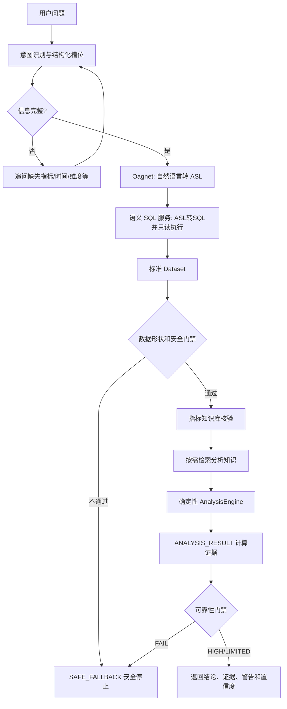
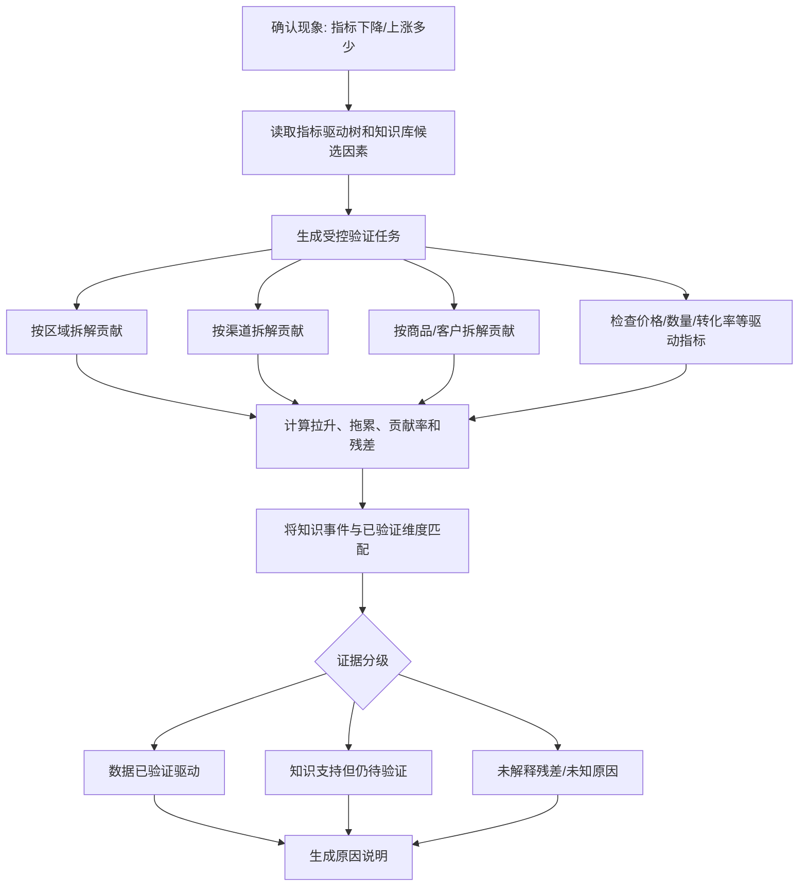

# DataAnalysis Agent 分析、归因、异常与预测实现说明

> 文档版本：1.0  
> 更新时间：2026-08-20  
> 对应代码：`app/services/orchestrator.py`、`app/analysis/engine.py`  
> 适用范围：当前首版确定性分析执行链。本文会明确区分“已经实现的安全基线”和“仍需算法团队提供的生产模型”。

## 1. 一句话理解

智能体不直接让大模型看着数据库结果自由发挥，而是先由平台把自然语言转换成 ASL 和只读 SQL，取得结构化数据；随后 Python 分析执行器使用确定性算法计算趋势、对比、占比、异常候选、贡献候选和预测结果；知识库只补充业务背景；最后把查询证据、计算事实、知识来源和风险警告一起送入可靠性门禁，证据不足就停止，不生成看似合理但无法验证的结论。Qwen 只负责把已锁定的算法结果整理成易读文字，不参与模型选择、方向判断、原因排序、数值计算或可靠性决策。

生活中的类比：这套流程像医院体检。大模型负责理解“你想检查什么”，数据库负责提供化验结果，Python 算法按固定公式计算，知识库像医学手册提供可能解释，最终报告必须标明化验依据和限制，不能只根据一句描述直接下诊断。

## 2. 完整执行链



### 2.1 意图与槽位

当前与计算有关的主意图包括：

- `TREND_ANALYSIS`：历史趋势。
- `COMPARISON_ANALYSIS`：同比、环比或两个对象比较。
- `COMPOSITION_ANALYSIS`：占比和构成。
- `ANOMALY_ANALYSIS`：统计异常候选。
- `ROOT_CAUSE_ANALYSIS`：维度贡献和原因候选。
- `FORECAST_ANALYSIS`：未来预测。
- `REPORT_GENERATION`：报表摘要。
- `DATA_QUALITY`：结果集质量检查。

意图识别完成后，还要检查指标、时间范围、比较类型、维度、明细实体和字段等槽位。缺少关键槽位时保存 Pending 状态并追问，不提前查询数据库。

### 2.2 数据获取

智能体自身不拼接或执行自由 SQL。实际链路为：

1. Oagnet 接收问题、`semantic_model_id` 和 `business_domain_id`，生成 ASL。
2. 语义 SQL 服务把 ASL 转换成受控 SQL并执行。
3. 智能体只接收标准化的 `DataQueryResult`。

关键数据结构：

```json
{
  "asl": {},
  "sql": "SELECT ...",
  "data_source_id": "sales-dw",
  "dataset": {
    "columns": ["月份", "销售额"],
    "rows": [
      {"月份": "2026-01", "销售额": 100},
      {"月份": "2026-02", "销售额": 125}
    ],
    "row_count": 2,
    "snapshot_id": "snapshot-001",
    "data_as_of": "2026-08-20T08:00:00Z",
    "quality_status": "PASS",
    "truncated": false
  }
}
```

ASL 中解析到的正式指标会重新绑定到请求，形成 `metric_id`、指标版本和规范名称，后续再经过知识库核验，避免大模型臆造指标。

## 3. 通用数据安全校验

在进入具体算法前执行以下门禁：

1. 数据不能为空。
2. `columns` 不能为空、不能重复。
3. 每一行只能包含声明过的列。
4. `row_count` 必须与真实数据行数一致，这部分同时在 HTTP Adapter 校验。
5. 超过 `DATA_AGENT_DATA_QUERY_MAX_ROWS` 时停止，要求用户缩小范围。
6. `truncated=true` 时禁止进入高级分析，因为部分数据可能产生完全相反的结论。
7. 指标列必须能转换成有限数值，不能包含 `NaN`、无穷大、空值或混杂文本。
8. 有多个数值指标列且无法根据正式指标绑定确定目标列时拒绝猜测。
9. 趋势和预测必须具有可解析、唯一且升序的时间列。
10. 重复分组必须先由 SQL 服务聚合，不能在智能体里随意合并不同口径。

数值解析支持整数、小数、`Decimal`、包含千位分隔符的字符串和百分数字符串。布尔值不作为数字，防止 `true` 被当成 `1`。

## 4. 趋势分析

当前趋势决策采用组合算法，不再只看首尾两个点：

1. 首尾差值和变化率用于回答“总共变化了多少”。
2. 逐期差值用于识别最大单期上升、最大单期下降和中间波动。
3. Theil–Sen 两两斜率中位数用于判断稳健方向，降低单个异常点对趋势方向的影响。
4. `direction_consistency` 表示各期变化方向的一致程度。
5. `coefficient_of_variation` 描述序列相对波动程度。

最终方向由算法字段 `trend_diagnostics.direction` 给出，Qwen 只能转述，不允许根据语言感觉把 `FLAT` 改成上升或下降。所有结果都带 `decision_source=DETERMINISTIC_ALGORITHM`、`llm_role=PRESENTATION_ONLY` 和算法契约版本。

### 4.1 输入要求

- 至少2个历史时间点。
- 必须有明确时间列，例如日期、月份、季度、年份。
- 时间值必须可解析、不能重复，并按升序返回。
- 必须明确唯一指标列。

### 4.2 当前计算方法

当前首版计算：

```text
绝对变化 = 最后一期值 - 第一期值
变化率 = 绝对变化 / |第一期值|
```

同时计算区间最低值、最高值、起点、终点和观测点数量。

如果第一期为0，只返回绝对变化，不伪造无限大变化率。

示例：

```text
2026-01销售额=100
2026-02销售额=125
```

结果：

```text
销售额整体上升25，变化率25.00%，区间最低100、最高125。
```

### 4.3 当前限制

当前趋势结论描述首尾整体变化，不判断季节性、结构突变或统计显著性。后续可以增加移动平均、趋势分解和季节调整，但必须经过算法回测。

## 5. 对比分析

### 5.1 输入要求

当前执行器只接受明确的两行结果：

- 第一行：基期或基准对象。
- 第二行：本期或对比对象。

超过两行时拒绝计算，因为不能根据未知顺序随意选取两个对象。

### 5.2 计算方法

```text
绝对差异 = 对比值 - 基准值
变化率 = 绝对差异 / |基准值|
```

基准值为0时，只返回差值，并明确说明变化率无法计算。

### 5.3 上游仍需补充

正式接口最好明确返回 `role=baseline/current`，不能长期依赖数组第一行、第二行表达业务角色。

## 6. 占比与构成分析

### 6.1 输入要求

- 至少2个分组。
- 分组标签唯一。
- 数值不能为负。
- 所有分组合计必须大于0。

### 6.2 计算方法

```text
某组占比 = 某组数值 / 所有分组合计
```

结果按占比从高到低排序，回答最多展示前5组，完整结构化证据中保留全部分组。

为什么拒绝负值：退款、冲销等指标可能出现负值，但普通“占总额比例”在正负抵消后容易失真，必须先由语义层提供已确认的占比口径。

## 7. 异常分析

### 7.1 输入要求

- 至少5个有效观测点。
- 指标列必须完整，不能静默丢弃缺失值。

### 7.2 当前算法：MAD稳健异常检测

首先计算中位数：

```text
median = 所有观测值的中位数
```

再计算绝对中位差：

```text
MAD = median(|xi - median|)
robust_z = 0.6745 × (xi - median) / MAD
```

当：

```text
|robust_z| >= 3.5
```

该点被列为统计异常候选。

MAD 比均值和标准差更不容易被极端值本身拉偏。

### 7.3 MAD为0时

如果大部分数值完全相同，MAD可能为0，无法计算 `robust_z`。当前采用保守降级：偏离中位数至少50%才列为候选，防止 `100、100、100、100、101` 被误报。

### 7.4 输出边界

系统只说“统计异常候选”，不会直接说“系统故障”或“业务异常”。异常点还要结合活动、节假日、补录、口径变更等知识验证。

生产版仍需要算法团队补充季节性基线、业务阈值和异常评分模型。

## 8. 归因分析

### 8.0 原因不是大模型“写出来”的，而是逐层验证出来的

完整原因生成应经过以下步骤：



因此一份合格回答不是简单说“销售额下降可能因为市场环境”，而应该类似：

```text
本期销售额下降50万元。
数据贡献拆解显示：华东区域拖累80万元，占绝对影响的72.7%；
华南区域拉升30万元，抵消了部分下降。
维度贡献合计与整体下降一致，残差为0，覆盖度100%。
运营知识库记录显示华东本期促销结束，该事件与最大拖累维度匹配，
可作为重点原因候选；但若要证明促销是因果原因，仍需活动对照或实验数据。
```

当前代码已经实现贡献、拖累/拉升、贡献份额、残差、覆盖度和知识维度匹配。尚未实现的是根据驱动树自动发起多个追加 ASL 查询；目前要求 Oagnet/语义查询链一次返回已经拆解好的贡献数据。下一阶段应增加 `CauseVerificationPlan` 工具接口，让智能体提交结构化验证任务，而不是自己生成SQL。

### 8.1 为什么不能直接让大模型归因

知识库中写着“促销结束可能导致销量下降”，不代表本次下降确实由促销造成。如果只把数据和知识文本交给大模型，它很容易把“可能因素”写成“真实原因”。

因此当前链路严格分为：

1. 数据侧贡献候选。
2. 知识库业务因素候选。
3. 两者都不自动升级成因果结论。

### 8.2 数据要求

SQL结果必须返回按维度拆解的贡献或变化字段，字段名需要具有明确语义，例如：

- `销售额变化`
- `下降贡献`
- `影响金额`
- `增量`
- `delta`

如果只返回各渠道当前销售额水平，系统拒绝归因，因为“销售额最大”不等于“导致下降最多”。

### 8.3 当前计算

按贡献绝对值从大到小排列，并计算：

```text
绝对贡献份额 = |某维度贡献| / 所有维度贡献绝对值合计
```

正负号保留，用于区分拉升和拖累。

如果上游同时返回 `整体变化`，还会计算：

```text
贡献合计 = 所有维度贡献之和
未解释残差 = 整体变化 - 贡献合计
覆盖度 = 1 - |未解释残差| / |整体变化|
```

覆盖度低于80%时可靠性降低，并明确告诉用户仍有较大部分原因没有被当前维度解释。

### 8.4 知识库参与方式

Milvus知识库检索可提供：促销计划、业务规则、节假日、已知事件、指标口径和历史经验。返回内容被标记为“未验证的候选因素”，不会覆盖数据计算结果。

当前会把贡献维度名称与知识文档内容匹配。例如最大拖累维度是“华东”，知识文档中也明确出现“华东促销结束”，该文档会被放入“与贡献维度匹配的业务依据”；完全没有提到任何贡献维度的文档只能进入“其他待验证候选因素”。匹配并不等于因果证明，但比无条件拼接知识库文本更安全。

### 8.5 当前限制

目前是贡献拆解，不是严格因果推断。生产归因工具还应返回：

```text
baseline
current
dimension
contribution
contribution_rate
residual
method
```

如果需要真正因果分析，还需要实验设计、因果图、控制变量或因果推断模型，不能仅靠相关数据实现。

## 9. 预测分析

### 9.0 2026-08 重构后的正式执行原则

下面旧版“一元线性趋势基线”说明仅用于解释历史版本。当前代码已经升级为确定性候选模型选择器：

- `naive_last`：延续最近一期，适合稳定水平或结构突变后的短期预测。
- `recent_mean_3`：最近三期均值，适合短期随机波动。
- `linear_drift`：线性漂移，适合近似稳定的上升或下降趋势。

系统使用扩展窗口滚动回测：每次只使用当时可见的历史预测下一期，计算各候选的样本外 `MAE` 和 `MAPE`，以最低 MAE 选择模型；相同误差时优先选择更简单的模型。最终区间使用被选模型滚动回测绝对误差的 P90 生成，并明确记录 `interval_method`、验证期数、候选得分和限制。

模型选择、预测值、区间和警告完全由 Python 算法产生。Qwen 无权重新选模型、修改预测值、扩大或缩小区间，也不能把候选原因写成确定原因。若算法结果没有 `decision_source=DETERMINISTIC_ALGORITHM` 和 `llm_role=PRESENTATION_ONLY`，Qwen 总结器会直接拒绝执行。

### 9.0.1 预测前的两级可行性检查

预测不会在“有几行数据就直接算”的模式下运行。

第一级在访问数据库前检查用户问题：

- 是否明确预测指标；
- 是否明确未来多少期；
- 是否明确按天、周、月、季度或年预测；
- 是否明确用于建模的历史范围或窗口。

例如“预测下个月销售额”会先追问历史窗口；“预测销售额”会同时追问预测目标和历史窗口。用户可以回复“基于过去12个月，预测下个月”。

第二级在数据库返回数据后检查：

- 是否只有一个已绑定、可计算的指标序列；
- 是否至少有6期有效数据，通常建议不少于12期；
- 时间字段是否唯一、可解析、升序；
- 相邻周期是否连续，是否存在缺月、缺周或混合粒度；
- 历史数据粒度是否与预测目标粒度一致；
- 当前算法是否经过相应预测步数的回测验证。

不满足时返回 `SAFE_FALLBACK`，并通过 `requirements` 返回结构化清单：

```json
{
  "code": "forecast_minimum_history",
  "category": "DATA",
  "description": "当前只有4期有效数据，最低需要6期，建议至少12期。",
  "action": "请至少补充2期连续历史数据；存在季节性时应提供不少于两个完整季节周期。"
}
```

`category=USER_INPUT` 表示用户需要说明条件，`DATA` 表示数据库或数据接口需要补齐，`ALGORITHM_CAPABILITY` 表示当前算法没有通过该场景的验证。任何一类缺口都不能由 Qwen 猜测补全。

### 9.1 输入要求

- 至少6个连续历史观测点。
- 时间列唯一且升序。
- 指标列完整。

### 9.2 当前算法：一元线性趋势基线

把连续时间点编码为：

```text
x = 0, 1, 2, ..., n-1
```

使用最小二乘拟合：

```text
y = intercept + slope × x
```

下一期预测：

```text
forecast = intercept + slope × n
```

计算拟合残差的均方根误差：

```text
RMSE = sqrt(mean((actual - fitted)^2))
```

当前展示的是残差参考区间：

```text
[forecast - 2×RMSE, forecast + 2×RMSE]
```

该区间不是经过统计校准的正式95%预测区间，因此代码和回答中明确称为“残差参考区间”。

同时计算 `R²`。如果 `R² < 0.3`，增加“线性趋势拟合度较低，预测不稳定”警告，可靠性降为 `LIMITED`。

如果所有历史值非负，但线性外推结果为负，系统直接拒绝，而不是偷偷把负数修改成0。

### 9.3 当前限制

当前预测只是联调和兜底基线，没有处理：

- 周期和季节性。
- 节假日、促销和价格变化。
- 缺失时间点。
- 多变量特征。
- 多步预测误差累积。
- 模型漂移。

算法团队应提供版本化时序工具，返回：

```json
{
  "model_name": "...",
  "model_version": "...",
  "training_window": {},
  "feature_version": "...",
  "forecast_horizon": 7,
  "predictions": [],
  "prediction_interval": [],
  "backtest_metrics": {
    "mae": 0,
    "rmse": 0,
    "mape": 0
  },
  "drift_status": "PASS"
}
```

只有模型版本、回测结果、漂移状态和输入快照全部存在时，才能将生产预测标为高可靠度。

## 10. 报表生成

当前报表能力生成结构化摘要：

- 行数和列数。
- 数值列合计。
- 数值列平均值。
- 最小值和最大值。
- 不暴露样例原值的数据画像：字段类型、空值率、唯一值率、数值均值/中位数/标准差。
- 通用 `ChartSpec`：折线图、柱状图和饼图的字段映射及最多200个展示点。

`ID`、编号、序号和排名等标识字段不会参与求和。

当前还没有Excel/PDF文件导出、图片文件生成、跨章节一致快照和章节失败隔离。因此现阶段属于“报表数据摘要 + 前端图表协议”，不是完整文件报表系统。

## 11. 数据质量分析

当前检查返回结果中的：

- 空值。
- 空字符串。
- 完全重复行。
- 字段类型推断。
- 字段唯一值数量和比例。
- 数值列的最小值、最大值、均值、中位数和标准差。

质量检查只针对本次SQL返回结果，不代表整个源表已经完成完整质量审计。生产数据质量还需要唯一性、及时性、完整性、准确性、跨系统一致性和业务规则检测接口。

## 12. 知识库与数据如何结合

知识库主要承担两类工作：

### 12.1 指标真实性核验

每个指标必须在知识库或语义层中存在正式记录。核验失败时不返回数值，避免产生不存在的指标。

### 12.2 分析背景补充

异常、归因和预测会检索当前应用绑定的知识库，获取业务口径、影响因素、分析方法和已知事件。

安全原则：

- 知识库名称必须由Java平台根据应用绑定关系传递。
- 不允许大模型自己编造知识库名称。
- 不把查询结果行发送给知识库，只发送问题、指标和有限的数据摘要。
- 知识内容只能作为背景或候选解释，不能修改确定性计算事实。

## 13. Evidence证据结构

### 13.0 Qwen总结位于证据生成之后

`AnalysisEngine`先产生不可变的计算事实和 `ANALYSIS_RESULT`，然后Qwen才会收到有限证据并生成结构化claims。Qwen输出分为：

- `VERIFIED_FACT`：只能引用查询或算法证据，禁止使用因果词。
- `SUPPORTED_HYPOTHESIS`：必须引用分析知识证据，并明确使用“可能、候选、待核实、尚未验证、需验证”。
- `LIMITATION`：保留数据和方法限制。

服务端再次校验每条claim：Evidence ID必须存在；所有数字必须能在确定性答案或facts中找到；候选原因不能冒充已证实原因；`causality_established=false`时禁止输出严格因果结论。校验成功后增加 `ANSWER_SYNTHESIS` Evidence；校验失败则退回确定性答案。

最终响应可能包含：

### 13.1 查询证据

```json
{
  "kind": "QUERY_RESULT",
  "payload": {
    "columns": ["月份", "销售额"],
    "row_count": 2,
    "data_as_of": "...",
    "quality_status": "PASS",
    "result_fingerprint": "snapshot-001"
  }
}
```

### 13.2 指标核验证据

```json
{
  "kind": "KNOWLEDGE_VERIFICATION",
  "payload": {
    "metric_id": "sales",
    "verified": true
  }
}
```

### 13.3 分析计算证据

```json
{
  "kind": "ANALYSIS_RESULT",
  "source_ref": "deterministic:first_last_change",
  "payload": {
    "method": "first_last_change",
    "facts": {
      "start": 100,
      "end": 125,
      "absolute_change": 25,
      "change_rate": 0.25
    },
    "warnings": []
  }
}
```

### 13.4 知识库证据

只记录知识库、文件、块ID、分数和命中数量，不把来源伪装成数据事实。

## 14. 可靠性判断

当前可靠性门禁包括：

- `query_succeeded`：查询是否成功。
- `metric_bound`：指标是否绑定正式ID和版本。
- `knowledge_verified`：指标是否经过知识库核验。
- `analysis_succeeded`：请求高级分析时是否真正产生计算证据。
- `analysis_knowledge_available`：归因、异常、预测等强知识意图是否拿到分析知识。

结果级别：

- `HIGH`：全部门禁通过且没有警告。
- `LIMITED`：核心证据通过，但存在模型基线、数据质量或算法限制警告。
- `FAIL`：关键证据缺失，返回安全兜底，不输出结论。

归因的非因果声明、基线预测、低拟合度、上游质量异常都会进入 warnings，因此不能显示为无条件高置信。

## 15. 三层兜底

### 第一层：重试

适用于可安全重试的模型、网络、429和服务端5xx。Qwen意图模型默认最多额外重试1次。昂贵查询和SQL执行不能无条件重复。

### 第二层：降级

- Qwen意图模型失败：降级到规则分类。
- 长期记忆不可用：只使用当前问题和短期会话。
- 非强依赖知识检索失败：保留数据计算并降低可靠性。
- 生产级多变量/季节性预测工具未接入：当前使用经过滚动回测选择的确定性单变量模型，并明确输出样本量、误差和限制。

### 第三层：安全话术

数据为空、被截断、样本不足、列歧义、指标未核验、知识不足或计算失败时返回 `SAFE_FALLBACK`，告诉用户缺少什么，不生成猜测结论。

## 16. 当前已经实现与尚未实现

| 能力 | 当前状态 | 生产前仍需完成 |
|---|---|---|
| 趋势 | 已实现首尾变化、逐期变化、Theil–Sen稳健方向、一致性与波动诊断 | 季节分解、显著性、趋势转折 |
| 对比 | 已实现严格两组对比 | 上游明确baseline/current角色、多组比较 |
| 占比 | 已实现非负份额 | 可加性和冲销口径 |
| 异常 | 已实现MAD候选 | 季节性、业务阈值、回测 |
| 归因 | 已实现拖累/拉升、贡献份额、残差、覆盖度、知识维度匹配 | 自动追加验证查询、正式驱动树、因果验证 |
| 预测 | 已实现三候选模型、扩展窗口回测选型、MAE/MAPE与回测误差区间 | 季节模型、外生特征、多步回测与漂移监控 |
| 报表 | 已实现数据摘要、数据画像和ChartSpec | 文档模板、图片生成、Excel/PDF、同快照 |
| 数据质量 | 已实现结果集空值/重复、类型、唯一值比例和数值分布 | 全表质量规则、时效性、业务约束和对账服务 |

## 17. 用户可见的分析过程

接口响应新增 `analysis_process`。前端可以把它做成默认折叠的“查看分析过程”，逐步展示：理解问题、检查信息完整性、获取数据、核验指标口径、检索业务知识、执行确定性分析、Qwen 解释总结、可靠性校验和安全结束。

这里展示的是可审计执行轨迹，不是模型隐藏思维链。每个步骤只有以下字段：

- `stage`：标准阶段代码，便于前端显示图标和排序。
- `status`：`COMPLETED`、`NEEDS_INPUT`、`SKIPPED`、`DEGRADED` 或 `FAILED`。
- `title`、`summary`：适合直接给用户阅读的短说明。
- `evidence_ids`：该步骤依赖的证据编号，可与响应中的 `evidence` 对照。

过程信息不会包含模型 Prompt、隐藏推理、密钥、原始 SQL、原始数据行或内部异常堆栈。例如趋势分析完成后，用户可以看到“已取得多少行数据”“使用了什么确定性方法”“Qwen 是否通过证据校验”“最终可靠性是多少”，但不能看到敏感内部信息。

## 18. 供应商—科室匹配度排名

“某商品科室匹配度前十的供应商”按通用覆盖率排名处理，不把医院、口罩或供应商数量写死在智能体代码中。

指标公式：

```text
科室匹配度 =
购买指定商品且购买指定供应商的去重有效科室数
÷ 当前统计范围内的有效科室总数
× 100%
```

例如有效科室总数为5：供应商覆盖5个去重科室时为100%，覆盖4个时为80%。同一科室重复采购只能计数一次。

语义层必须登记以下内容：

- 指标编码建议：`department_supplier_match_rate`。
- 指标名称：`科室匹配度`；别名可包括`科室覆盖率`、`供应商科室匹配率`。
- 分子：按商品、供应商过滤后的 `COUNT(DISTINCT department_id)`。
- 分母：相同机构、相同时间、相同有效科室口径下的有效科室总数。
- 排名维度：供应商ID和供应商名称。
- 必选过滤：具体商品ID或唯一商品编码；用户只说“某商品”时必须追问。
- 可选过滤：医院、院区、时间范围、科室类型、采购状态。
- 排除规则：取消/删除采购记录、无效科室、测试科室、无效供应商和不属于目标商品的记录。

ASL/SQL执行结果必须至少返回：

```json
{
  "供应商": "供应商1",
  "匹配科室数": 5,
  "有效科室总数": 5,
  "科室匹配度": 100
}
```

智能体不会直接相信SQL中的百分比和顺序，而会执行二次确定性校验：

1. 供应商必须唯一且非空。
2. 分母必须大于0，并且同一次排名中的分母统计范围一致。
3. 分子必须处于0到分母之间。
4. 重新计算 `分子/分母`，允许0.5个百分点以内的展示舍入误差。
5. 匹配度必须处于0%到100%。
6. SQL结果必须已经按匹配度正确排序，返回数量不能超过用户要求的TopN。
7. 任一检查失败时返回安全兜底，不输出错误排名。

追问时也会返回过程：第一步说明已识别的意图，第二步明确还缺哪些槽位；用户补充后，同一会话的新消息会继续执行后续步骤。若模型总结不可用，过程会标记 `MODEL_SYNTHESIS=DEGRADED`，并明确已退回确定性分析结果；若证据不足，则以 `SAFE_TERMINATION` 结束，避免编造原因。

前端建议：只展示 `title` 和 `summary`，将 `evidence_ids` 做成“查看依据”链接；不要把 `evidence.payload` 中的技术字段未经筛选直接展示给普通用户。

## 18. 代码位置与测试

- 分析执行器：`app/analysis/engine.py`
- 编排与可靠性：`app/services/orchestrator.py`
- 数据模型：`app/domain/models.py`
- HTTP取数适配：`app/adapters/http.py`
- 算法单元测试：`tests/test_analysis_engine.py`
- 完整链路测试：`tests/test_analysis_orchestration.py`

当前全量自动化测试基线：`290 passed`。
