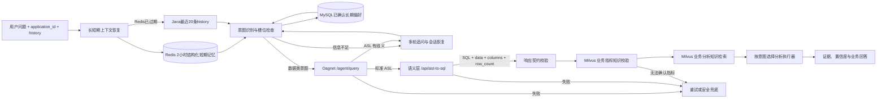

# 数据分析智能体代码架构（按现有平台真实接口修订）

## 职责边界

`DataAnalysis_Agent` 负责意图识别、多轮追问、数据查询链调度、结果分析、知识库校验、证据和置信度，不负责自然语言转 ASL、ASL 转 SQL 或直接连接业务数据库。



## 真实接口契约

1. Oagnet：`POST /agent/query`，输入 `query/business_domain_id/semantic_model_id`，外层 `result` 是 ASL JSON 字符串。
2. 语义层：`POST /api/ast-to-sql`，输入 `asl/modelId`，外层 `result` 是二次编码 JSON 字符串。
3. 语义层内层结果：`sql/success/data/columns/row_count/error/data_source`。
4. 智能体只保留 `data_source.id`；主机、库名等内部连接信息不会进入领域模型或用户回答。对外证据也不包含完整 SQL、ASL 或原始数据行，只暴露结果指纹、列名和行数。
5. Milvus 知识检索复用 `information_safety_test` 的 `POST /knowledge_base/search_docs`；该项目本地默认监听 `127.0.0.1:7873`，跨机器部署时通过 `DATA_AGENT_KNOWLEDGE_BASE_URL` 指向实际服务地址。
6. 用户上传文件后，`information_safety_test` 会将知识库登记到 MySQL `knowledge_base.kb_name` 并完成向量入库。但该表没有应用/业务域归属字段，因此智能体不会不加区分地搜索全部知识库；Java 调用聊天接口时应把当前应用已经绑定的知识库名称放进 `knowledge_base_names`。
7. 用户长期偏好不写入上述知识库 Milvus。它使用 MySQL `agent_long_term_memory` 作为权威数据源，避免把个人偏好、原始问答和正式业务知识混在一起。

聊天请求示例：

```json
{
  "application_id": "APP_SALES",
  "conversation_id": "c-001",
  "message_id": "m-001",
  "question": "为什么本月销售额下降？",
  "business_domain_id": 13,
  "semantic_model_id": 8,
  "knowledge_base_names": ["KB_当前应用知识库"],
  "use_longterm_memory": true,
  "history": [
    {
      "role": "user",
      "content": "查询本月销售额",
      "message_id": "m-prev-1",
      "created_at": "2026-08-20T10:00:00+08:00"
    }
  ]
}
```

请求 Header 由 Java 网关注入 `X-Tenant-Id`、`X-User-Id` 和 `X-Application-Id`；其中 `X-Application-Id` 必须与 Body 的 `application_id` 一致。开发环境可暂时只传 Body，生产环境强制要求可信 Header。

## 稳定性与准确性

- 两层 JSON 都进行类型校验；`row_count` 必须与实际行数一致。
- ASL 或 SQL 翻译产生歧义时停止执行并进入可恢复追问。
- SQL 服务不自动重试，避免重复执行昂贵查询；网络型只读依赖按配置指数退避。
- 高级分析有最低数据量门槛，数据不足时不冒充分析结果。
- 指标必须经过 Milvus 知识检索确认；无法确认时不返回指标数值。
- 分析类意图会再次检索 Milvus，查询内容只包含问题、指标、列名和行数，不上传完整 SQL 查询明细；异常、归因和预测缺少知识依据时停止生成解释性结论。
- 上游目前不返回数据库快照时间，所以响应置信度会降为 `LIMITED`，并明确 `data_as_of` 只是本服务接收时间。

## 当前完成度

已完成真实两段式取数适配器代码、双重 JSON 解析、响应校验、歧义追问、错误分级、知识校验、证据封装、数据量门槛、Redis 短期记忆、Java `history` 冷恢复、MySQL 长期偏好生命周期和 164 项自动化测试。当前运行配置仍是 Mock，因此只代表演示链路可用，不代表真实数据库已联通。趋势、对比、占比等目前只返回结构化基础数据；生产级统计计算、异常检测、归因算法、Python 时序预测和报表渲染仍需作为独立分析执行器继续实现，不能把大模型文字总结当成算法结果。

## 意图识别策略

采用“高确定性规则快速路由 + Qwen 结构化分类复杂表达 + 确定性约束复核 + 低置信度规则降级”。规则层负责同比环比、明细、口径、血缘、预测、危险写操作等明确表达；陌生指标、隐含意图和复杂多意图交给 Qwen。模型必须返回严格枚举 JSON，低于阈值、结构非法、指标不在用户原话中或与强安全规则冲突时不能覆盖规则结果。当前 30 条合成 Smoke Set 只用于开发回归，不能代表真实生产准确率；发布前仍需使用脱敏真实问句扩展评测集并报告 Macro F1、各意图召回率和混淆矩阵。

## 追问与短期记忆

- 信息不完整时保存结构化 `PendingState`，包括原问题、已确认槽位、缺失槽位、知识库范围、追问轮数和状态版本。
- 用户补充内容只覆盖明确出现的新槽位，原指标、时间、维度不会被无关短回答清空；支持取消和纠正。
- 查询完成后只保存最近一次结构化请求，不保存完整 SQL 结果明细；“那华东呢”“再看上个月”等追问会继承上一轮指标、意图和条件，并把新问题交给 Oagnet 重新生成 ASL。
- Redis Key 使用租户、用户、应用、会话和消息标识的 SHA-256 隔离；结构化会话记忆采用滑动 TTL，默认 2 小时，因此一小时后的追问仍能继承上一轮条件。
- Java 可按从旧到新的顺序传入最近 20 条 `role/content/message_id/created_at` 历史。Redis 已过期时，智能体会识别上一条助手追问并恢复上一条用户问题；不会把整段历史无条件拼进当前问题。
- PendingState 使用 Lua CAS 比较状态版本，避免两条并发补充互相覆盖。
- 相同 `message_id` 且请求指纹一致时返回第一次缓存响应，不重复生成 ASL、执行 SQL 或调用分析模型；同一 ID 携带不同问题、历史、模型域、知识库范围或可信角色时返回 HTTP `409 MESSAGE_ID_REUSE_CONFLICT`，不允许静默命中旧响应。
- 幂等指纹与响应至少保留到会话/追问状态过期（默认 2 小时）。旧版本缓存没有请求指纹，升级后会安全拒绝并要求使用新的 `message_id`，不会猜测它是否为同一请求。
- 追问状态的创建、推进和删除都使用 `state_version` 做 CAS。终态请求只删除自己消费过的版本；如果另一条并发消息已经写入更新版本，旧请求不能把新状态清掉。损坏或不兼容的 Redis pending/last-request 会被隔离删除并从 Java `history` 冷恢复；损坏的幂等响应不会触发重复查询，而是要求使用新的 `message_id`。
- 本次指纹协议升级使用新的 Redis 前缀 `youo:data-analysis:v2`；旧前缀只等待 TTL 自然过期，不回填、读取或批量删除。平台尚未发布，因此允许本地旧演示会话在升级后失效。
- 自然日期先走确定性归一化，支持“日/号”、同年同月省略和 `2026年7月1号到30号` 等表达，统一保存为右开区间；追问响应通过 `understood_slots` 回显已识别值，并只询问真实 `missing_slots`。
- 开发测试可使用进程内 TTL Store；生产启动强制要求 Redis，禁止使用进程内会话。
- 服务按 `E:\YouoAgent\.env`（平台公共默认）→ `New_Agent/.env`（共享模型配置）→ `DataAnalysis_Agent/.env`（本项目覆盖）的顺序加载配置；Redis 可直接继承公共文件中的 `REDIS_HOST/PORT/DB/PASSWORD`，无需复制密码。当前环境已经完成 Redis PING 和 PendingState 写入/读取/清理验证。

## 长期记忆

- 当前平台一个应用对应一个数据分析智能体，因此使用已有 `application_id` 即可，不新增重复的 `agent_id`。只有将来一个应用内存在多个必须互相隔离记忆的智能体时，才扩展 `agent_id`。
- 长期记忆只保存用户明确提出并确认的稳定偏好或业务术语，例如“默认看本月”“金额用万元”。原始问题、完整聊天记录、SQL、查询结果行和分析结论禁止入库。
- 长期记忆采用治理 Schema：`memory_type` 必须匹配 `memory_key`，每种 key 仅允许固定值字段；过滤操作符使用白名单。嵌套 SQL、Prompt、推理内容、令牌/密码、任意扩展字段、非有限数值、空前缀键和无时区有效期都会在入库前被拒绝。
- 生命周期为 `candidate → active → superseded/deleted`。新确认的同类型、同 `memory_key` 偏好会原子替代旧值；删除采用软删除，保留版本、来源消息、确认人和时间用于审计。
- 所有读写强制携带 `tenant_id + user_id + application_id`，并使用参数化 SQL。候选创建按来源消息和逻辑键做 SHA-256 幂等，重复网络请求不会生成两条记录；并发确认同一逻辑偏好使用 MySQL 锁串行化。
- 工作流顺序固定为：先用 Redis/`history` 补全当前问题，再读取 MySQL 中已确认且未过期的偏好；当前问题中的明确条件永远优先于默认偏好。
- 长期记忆不可用时不阻断明确的数据查询，系统降级为仅使用当前问题和短期会话，并在可靠性报告中提示；`/ready` 会分别检查 Redis 和 MySQL，任一必需依赖不可用即返回 HTTP 503。
