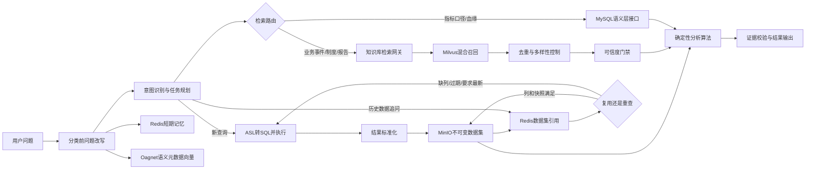

# 数据智能体 Milvus、Redis、MinIO 分层检索设计

> 目标：在不重复建设存储系统的前提下，为意图识别、ASL生成、知识补充、数据查询追问和分析提供准确、快速、可降级的统一检索方案。  
> 设计原则：Milvus找“相关知识”，Redis找“当前状态和索引”，MinIO取“历史数据集内容”；三者不能互相代替。

## 1. 结论

现有技术选型无需替换，但现有使用方式只适合首版联调，不能直接作为大数据量生产方案：

- Milvus继续使用平台`information_safety_test`知识库接口，不由数据智能体直接连接Milvus；需要在调用侧增加查询规划、作用域过滤、RRF融合、去重、多样性控制和可信度门禁。
- Redis继续保存短期记忆、幂等结果、最近数据集引用和热点缓存；禁止保存完整大表、Excel文件或大段知识库原文。
- MinIO继续保存不可变查询结果和派生数据集；小数据可继续使用现有`JSON.GZ`，中大数据必须使用Parquet、分区和Manifest，追问时只读取所需列与分区。
- MySQL/语义层仍是指标口径、实体关系和数据血缘的权威来源；Milvus中的相关文档只能补充解释，不能覆盖权威定义。

## 2. 总体架构



## 3. Milvus检索设计

### 3.1 Milvus存什么

平台Milvus知识库适合保存：

- 业务制度、运营规则和产品说明；
- 促销、节假日、故障、停运和组织调整等业务事件；
- 已发布分析报告和经过审核的历史结论；
- 指标口径补充说明文档，但不能作为指标是否存在的最终依据；
- 文档块与其文件、版本、发布时间、适用业务域之间的元数据。

以下内容不得存入该知识库作为普通文档检索：

- SQL查询结果明细；
- 用户每轮会话全文；
- MinIO数据集内容；
- 密钥、账号、连接串和敏感原始数据；
- 未审核的大模型推测原因。

Oagnet的实体、属性值、别名、指标、维度向量属于另一类“语义元数据索引”，与业务文档知识库逻辑隔离。它用于问题规范化和ASL生成，不用于归因事件检索。

### 3.2 在线检索步骤

每次检索采用六步：

1. 查询分类：判断是口径核验、业务事件、分析方法还是历史报告。
2. 查询改写：从规范化问题生成最多3个检索子句，不允许无限扩展。
3. 强制过滤：必须带应用绑定知识库列表；可用时增加业务域、文档类型、有效期、版本、发布时间和标签过滤。
4. 混合召回：使用语义向量和全文关键词召回，分别取候选后使用RRF融合。
5. 去重与多样性控制：按稳定`block_id`、内容指纹和父文档去重；合并同一文件的相邻或高度相似块，并限制单一文件的最终候选数量。
6. 可信度门禁：综合RRF顺序、原始相关度、来源有效期、作用域、冲突和证据覆盖度；相关度不足、来源过期、跨域或多来源冲突时，不生成确定性原因。

推荐参数不是固定常数，应通过真实评测集校准：

| 阶段 | 初始建议 |
|---|---:|
| 每个子查询向量召回 | Top 20 |
| 每个子查询全文召回 | Top 20 |
| RRF融合候选 | 最多30条 |
| 去重后保留 | 5至8条 |
| 单一文件最多 | 2条 |
| 注入模型的单块长度 | 300至800字 |

`information_safety_test`当前相关度分值定义为距离型分值时“越小越相关”，智能体不得把它误当成“越大越相关”。接口契约应明确返回`score_type=distance|similarity`和阈值含义，调用侧统一换算为0到1的`normalized_relevance`。

### 3.3 准确性规则

- 指标是否存在、公式和版本：只信语义层。
- 事件是否发生：至少需要带来源、发生时间和适用范围的文档证据。
- “某事件造成指标下降”不能仅靠向量相似度确认；必须同时有算法发现的异常时间/贡献维度与文档事件在时间和对象上的一致性。
- 多个来源互相矛盾时，返回“存在冲突”，不让大模型自行选择。
- 知识库无结果时，归因只返回数据贡献因素，不编造业务原因。

### 3.4 速度设计

- 对`规范化问题 + 知识库范围 + 过滤条件 + 索引版本`计算哈希，在Redis缓存最终去重结果5至15分钟。
- 相同任务中的指标口径、业务事件和方法知识可并行检索。
- 只向模型注入去重并通过可信度门禁后的短摘要和来源ID，不注入全部候选原文。
- 知识库超时预算建议2至5秒；归因场景可降级为仅数据归因，普通指标查询不应等待业务知识库。

## 4. Redis检索设计

### 4.1 Redis存什么

Redis只存“小、热、短”的数据：

- 待澄清状态和CAS版本；
- 上一条规范化请求、意图、指标、时间、维度和过滤条件；
- 幂等请求指纹和最终响应；
- 最近数据集`dataset_id`及其MinIO引用、列名、行数、快照和过期时间；
- Milvus热点检索结果；
- 分布式锁、限流计数和清理任务游标。

禁止存入：完整SQL结果、完整Excel、Parquet字节、大段文档原文、模型完整Prompt和无限增长的聊天记录。

### 4.2 Key和TTL

所有Key必须包含租户、用户、应用和会话作用域的不可逆哈希，避免串会话：

```text
youo:data-analysis:v3:pending:{scope_hash}
youo:data-analysis:v3:last-request:{scope_hash}
youo:data-analysis:v3:response:{scope_hash}:{message_hash}
youo:data-analysis:v3:dataset-recent:{scope_hash}
youo:data-analysis:v3:dataset-ref:{dataset_id_hash}
youo:data-analysis:v3:kb-cache:{query_scope_version_hash}
youo:data-analysis:v3:lock:{operation_scope_hash}
```

建议TTL：

| 内容 | TTL |
|---|---:|
| 待澄清和上一请求 | 2小时，用户活跃时续期 |
| 幂等响应 | 不短于会话TTL |
| 最近数据集列表 | 2小时 |
| 数据集引用 | 不短于MinIO对象TTL，并额外保留清理缓冲期 |
| 知识检索缓存 | 5至15分钟，索引版本变化立即失效 |
| 分布式锁 | 按任务最大时长设置，并使用唯一Token安全释放 |

当前Redis会话实现已经具备哈希Key、TTL、CAS、响应指纹和数据集引用，不需要推翻。需要新增的是知识检索缓存、索引版本参与缓存键、缓存击穿保护和指标监控。

当前代码已增加知识检索短缓存，并将租户、用户、角色、应用、知识库范围、检索参数和`knowledge_index_version`全部纳入缓存键。知识库完成重建或发布新版本时，运维只需更新该配置版本即可立即绕开旧缓存。缓存击穿保护采用Redis `SET NX EX`所有者令牌锁、限定等待、结果复用、慢请求租约续期和Lua安全解锁；续期与解锁都必须校验所有者令牌。Redis异常时旁路缓存，不能阻断知识检索。完整监控指标仍需接入平台可观测系统。

## 5. MinIO数据集检索设计

### 5.1 MinIO存什么

MinIO保存SQL结果快照、Excel解析后的结构化数据、派生数据集和报表文件。每个数据集不可原地修改，所有操作生成新版本并记录父数据集和转换日志。

对象路径不能暴露原始用户名或业务敏感词，继续采用作用域哈希：

```text
data-analysis/datasets/{scope_hash}/{yyyy}/{mm}/{dd}/{dataset_id}/manifest.json
data-analysis/datasets/{scope_hash}/{yyyy}/{mm}/{dd}/{dataset_id}/part-00000.parquet
```

### 5.2 数据量路由

| 类型 | 判断条件，取任一较大者 | 存储和读取方式 |
|---|---|---|
| 小数据 | 不超过1万行且压缩后不超过5MB | JSON.GZ或单个Parquet；允许一次读取 |
| 中数据 | 1万至100万行或5MB至256MB | Parquet；按时间/业务维度分区；投影所需列 |
| 大数据 | 超过100万行或256MB | 优先回SQL引擎计算；确需落盘时使用多Parquet分区和异步任务 |

阈值必须允许配置，并根据真实行宽、网络和内存压测调整。不能只按行数判断。

### 5.3 Manifest

每个数据集必须有一个小型Manifest，Redis只缓存该Manifest的引用和关键字段：

```json
{
  "dataset_id": "ds-xxx",
  "schema_version": "1.0",
  "storage_format": "PARQUET",
  "columns": ["date", "region", "sales_amount"],
  "row_count": 820000,
  "byte_size": 73400320,
  "partitions": ["date_month"],
  "snapshot_id": "snapshot-20260824",
  "data_as_of": "2026-08-24T10:00:00+08:00",
  "content_sha256": "...",
  "expires_at": "2026-08-24T12:00:00+08:00",
  "parent_dataset_ids": [],
  "transformation_log": []
}
```

### 5.4 追问读取路由

用户追问时先读Redis中的Manifest引用，不立即下载MinIO对象：

1. 判断数据集是否属于当前租户、用户、应用和会话。
2. 判断TTL、快照和校验和是否有效。
3. 判断历史数据集是否包含追问所需字段和时间范围。
4. 只做筛选、排序、Top N、选列和简单计算时，从Parquet读取必要列和分区。
5. 改变指标、增加缺失维度、要求最新数据或历史结果被截断时，重新生成ASL/SQL。
6. 大数据聚合优先下推SQL/DuckDB/受控算法服务，禁止下载整个对象到API进程内存。

当前实现保留`MinioFollowupStore`作为小数据JSON.GZ适配器，并新增`ParquetMinioFollowupStore`和`HybridMinioFollowupStore`。混合路由按行数与估算字节数自动选择JSON.GZ或分片Parquet；Parquet使用ZSTD压缩、Manifest、分片及整体SHA-256校验、作用域路径校验、不可变派生和TTL清理。`select`和`aggregate`追问只解码所需列，`limit`读取足够分片后提前停止；每个已读取分片仍必须通过SHA-256校验。超过中数据阈值的结果拒绝落入API进程，继续留在查询引擎。通用谓词下推和DuckDB计算仍属于下一步性能增强。

## 6. 统一检索路由

| 用户需求 | 首选来源 | 是否访问其他存储 |
|---|---|---|
| “销售额是什么意思” | 语义层 | Milvus只补充说明文档 |
| “销售额来自哪些表” | 语义层血缘 | 不需要MinIO |
| “为什么7月销售额下降” | SQL/MinIO数据集 + 算法 | Milvus检索同期业务事件 |
| “刚才结果只看华东” | Redis找dataset_id，MinIO投影读取 | 缺少地区列时重新查SQL |
| “把刚才结果改成最新数据” | 重新生成ASL/SQL | 不复用旧MinIO快照 |
| “继续分析上传的Excel” | Redis找dataset_id，MinIO读取对应Sheet数据集 | 不进入Milvus |
| “公司当时是否有促销活动” | Milvus业务文档 | 数据分析需要时再结合SQL |

## 7. 三层降级

1. Milvus不可用：指标查询照常执行；归因只给数据贡献因素，并明确缺少业务背景证据。
2. Redis不可用：生产环境拒绝需要多轮状态和幂等的请求；只读、无状态请求可按配置有限降级，不能假装拥有历史上下文。
3. MinIO不可用：当前查询结果仍可回答；禁止历史数据集追问，改为重新执行ASL/SQL。不能把大数据临时塞进Redis兜底。

## 8. 必需接口

知识库服务需要保持或补充：

```text
POST /knowledge_base/search_docs
```

响应建议增加：`score_type`、`normalized_relevance`、`index_version`、`document_version`、`published_at`、`valid_from`、`valid_to`、`business_domain_id`、`document_type`和稳定`block_id`。

数据集层内部接口建议为：

```text
POST /v1/datasets                         注册查询结果
GET  /v1/datasets/{dataset_id}/manifest   读取清单
POST /v1/datasets/{dataset_id}:query      投影/筛选/聚合
DELETE /v1/datasets/{dataset_id}          受控清理
```

首版可以由数据智能体内部适配器实现；多实例和大数据生产环境应独立为Dataset Registry/Query服务。

## 9. 实施顺序

### 第一阶段：复用并加固

- 保留现有Milvus知识库接口、RedisSessionStore和MinioFollowupStore。
- Milvus调用增加查询分类、作用域强过滤、RRF融合、去重、多样性控制和证据门禁。
- Redis增加知识检索短缓存及缓存版本。
- MinIO只允许小数据使用JSON.GZ，超过阈值明确转SQL重查，不整包下载。

当前完成状态：本阶段代码已经实现。知识结果支持平台响应解包、距离分归一化、显式跨知识库结果剔除、`block_id/内容指纹`去重、单来源数量限制和最低相关度门禁；Redis缓存限制单项最大1MB且故障时自动旁路；MinIO写入前同时按行数和估算字节数路由，中大数据不会进入JSON整包适配器。

### 第二阶段：中等数据

- 已新增分片Parquet Dataset Store、Manifest和JSON/Parquet混合路由。
- 已实现ZSTD压缩、分片校验、整体内容校验、路径隔离、失败残片清理和过期对象清理。
- 已支持选列/聚合列投影和limit分片提前停止；待增强通用谓词下推、按业务时间分区读取及受控DuckDB计算。
- 待接入独立Dataset Registry、血缘和生命周期监控。

### 第三阶段：大数据和高并发

- 大计算下推SQL/独立算法服务。
- 已增加单实例Redis缓存击穿保护；生产部署仍需Redis Cluster或哨兵高可用、指标和压测。
- Milvus检索压测、离线评测、索引版本灰度和重排模型评测。

## 10. 验收指标

- Milvus：Recall@20、nDCG@5、无关文档率、跨业务域泄漏率必须用脱敏真实问题评测；跨域泄漏目标为0。
- Redis：P95读取低于20ms；CAS冲突、缓存命中率、过期引用和内存使用可观测。
- MinIO：小数据P95读取低于500ms；中数据投影读取不下载无关列；校验和失败必须阻断使用。
- 端到端：同一问题、作用域、索引版本和数据快照必须产生可复现证据；任何降级必须向最终可靠性报告披露。
