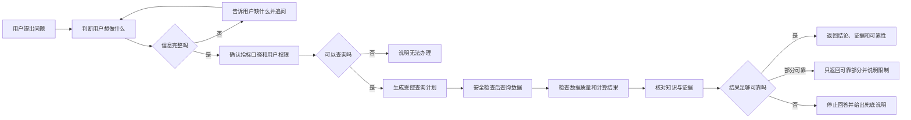

# DataAnalysis Agent 通俗说明

> 面向对象：业务人员、产品经理、项目管理人员及非技术团队成员  
> 文档版本：1.0  
> 更新日期：2026-08-19

## 1. 一句话说明这个项目

这个项目要做的是一名“懂公司指标、会查数据、会分析、知道自己什么时候不能乱回答”的数字分析助手。用户可以像问同事一样问“本月销售额是多少”“为什么下降”“下个月可能卖多少”，系统会先确认用户到底想做什么、信息是否完整、用户有没有权限，再查询公司认可的数据和指标口径，最后只根据查到的证据回答；如果条件不足，它会追问，如果无法保证准确，就明确说不能可靠回答，而不是编造结果。

生活中的例子：它更像一位谨慎的银行柜员，而不是一个什么都敢回答的聊天机器人。银行柜员会先确认你要查余额还是办转账、检查身份证和账户权限、核对系统记录，然后才办理；资料不全时会告诉你缺什么，而不会凭感觉告诉你账户里有多少钱。

## 2. 用户的一次问题是怎样被处理的



可以把这条流程理解为“去餐厅点餐”：服务员先听懂你要点什么，发现你只说“来一份面”时会追问口味和份量；厨房检查食材和做法，出餐员核对桌号，最后才把正确的餐送到正确的人手里。任何一步不确定，都不应该随便端一盘菜出来。

## 3. 第一步：理解用户到底想做什么

系统把问题分成以下类型：

| 用户想做的事 | 例子 |
|---|---|
| 查询一个指标 | 本月销售额是多少 |
| 查询业务明细 | 昨天有哪些退款订单 |
| 查看历史趋势 | 最近一年销售额走势如何 |
| 比较两个时期或对象 | 本月销售额同比增长多少 |
| 查看组成占比 | 各区域销售额占比是多少 |
| 发现异常 | 哪些门店最近销售异常 |
| 分析变化原因 | 为什么本月销售额下降 |
| 预测未来 | 预测下个月销售额 |
| 生成报表 | 生成本月经营分析报告 |
| 解释指标口径 | 销售额是怎么计算的 |
| 查看数据来源 | 销售额来自哪些数据 |
| 检查数据质量 | 为什么今天的数据还不全 |
| 能力帮助、闲聊或能力外请求 | 你能做什么、你好、帮我删除数据 |

“意图识别”听起来比较抽象，实际就是判断顾客来医院是要挂号、缴费、拿药还是看检查报告。虽然都发生在医院，但后面的办理流程完全不同。同样，“查销售额”和“预测销售额”都提到销售额，前者只查已经发生的事实，后者还需要历史数据和预测模型，不能走同一条流程。

当前采用“明确规则 + Qwen 模型”的混合方式：像“同比、环比、明细、口径、预测”这样非常明确的说法由规则快速判断；像“最近销售情况不太对，帮我看看”这种没有说出“异常”的含蓄表达，再交给 Qwen 模型理解。这样既快，又能处理自然语言，还可以防止模型高置信度地判断错。

生活中的例子：十字路口的红绿灯不需要请专家判断，看到红灯就必须停，这是明确规则；遇到没有标志的复杂事故现场，才需要交警根据情况判断。不能所有事情都找专家，也不能所有事情只看简单标志。

## 4. 第二步：信息不完整时先追问

用户经常只问“帮我查一下增长率”，但没有说明哪个指标、哪个时间段、同比还是环比。系统会把完成任务必须具备的信息称为“槽位”，缺少关键槽位时先逐项追问，补齐后继续原来的任务。

生活中的例子：你打电话订机票，只说“帮我订一张票”是不够的，客服必须继续问出发地、目的地、日期和乘机人。没有这些信息就直接出票，速度再快也是错的。

设计亮点是系统会保存“正在等待补充什么”，用户下一句只回答“本月，环比”也能接着处理，而不是要求把完整问题重新说一遍。但追问次数有限，多轮仍无法补齐时会结束任务，避免无休止对话。

## 5. 第三步：先确认“销售额”到底是什么意思

公司里同一个词可能有不同口径。例如销售额是否扣除退款、是否包含税费、以付款时间还是发货时间统计，都可能影响最终数字。系统不会直接把用户说的词拼成数据库字段，而是先到公司的指标中心确认：指标是否存在、当前有效版本、计算公式、单位、时间口径和允许使用的维度。

生活中的例子：“工资”可以指税前工资、税后工资、基本工资或包含奖金的总收入。两个人都说“工资一万元”，如果口径不同，就不能直接比较。指标中心就像公司统一发布的薪资说明书。

MySQL 中已审批、已发布的指标是最终依据；知识库文档只用于帮助解释和搜索。如果文档说法与正式指标版本冲突，不能用旧文档覆盖新口径。

生活中的例子：搜索到的交通法规解读文章可以帮助理解，但真正处理违章时，要以当前有效的正式法规为准。

## 6. 第四步：确认用户能看什么数据

系统会在理解问题前、执行查询前和展示结果前多次检查权限，包括租户、业务域、指标、数据行、字段和脱敏规则。聚合指标和明细数据分开处理，订单号、客户信息等明细走更严格的权限路径。

生活中的例子：公司员工都可以看到全公司的营业收入，但未必都能看到每位客户的姓名和电话。就像小区住户可以知道小区总人数，但不能随意拿到所有住户的身份证复印件。

权限不足时，系统不会通过错误信息告诉用户“这个敏感指标确实存在，只是你无权查看”，以免从侧面泄露信息。

生活中的例子：保险箱密码输错时，系统只提示无法打开，而不会提示“第三位数字已经正确”，因为这种提示会帮助别人逐步猜出密码。

## 7. 第五步：把问题转换成安全查询

系统不会让大模型拿着数据库账号随意写 SQL。正确方式是：智能体先生成一份与物理数据库无关的查询清单 QuerySpec，例如“查销售额、时间为本月、按区域分组”；专门的服务再生成候选 SQL；SQL Guard 检查是否只读、是否越权、是否扫描过多数据；最后执行服务只接受已经批准的查询编号。

生活中的例子：在仓库领料时，员工先填领料单，主管审批后，仓库管理员根据批准的单号发货。员工不能直接拿着仓库钥匙进去随便搬东西。QuerySpec 是领料单，SQL Guard 是主管审批，Query Executor 是仓库管理员。

这套拆分可以避免模型生成删除、修改或高成本 SQL，也可以限制查询时间、返回行数和数据库资源。

## 8. 第六步：不同分析由不同工具完成

大模型主要负责理解语言和解释结果，不负责凭感觉计算数字。

| 任务 | 实际处理方式 | 生活中的例子 |
|---|---|---|
| 指标查询 | 数据库精确聚合 | 收银机汇总当天所有小票，而不是店长估计营业额 |
| 对比和占比 | 固定公式重新计算 | 比赛计分使用统一规则，不能由解说员决定比分 |
| 趋势 | 时间序列统计、移动平均等 | 看一周体温记录判断变化，而不是只看今天一次体温 |
| 异常 | 数据质量排除后再做统计检测 | 体重突然下降前，先确认秤有没有坏 |
| 预测 | Python 时序模型、历史回测和预测区间 | 天气预报要用历史观测和模型，还要说明降雨概率，不能只说“我觉得会下雨” |
| 归因 | 数学贡献拆解和关联证据 | 销售下降可拆成客流减少、转化率下降等贡献，但不能仅因二者同时发生就断言因果 |
| 报表 | 多个受控子任务组合 | 月度体检报告由血常规、影像和医生结论组成，不是一段模型自由发挥的文章 |

## 9. 第七步：每个数字都要有证据

系统会为查询结果建立 Evidence Bundle，可以理解为“证据包”，其中记录指标版本、查询条件、数据快照、计算过程、数据质量和知识来源。最终回答中的数字必须能对应到证据包，找不到来源的数字不能展示。

生活中的例子：财务报销不能只写“花了 500 元”，必须附发票、时间、用途和审批记录。Evidence Bundle 就是智能体答案的电子报销凭证。

这也意味着未来发现答案有问题时，可以追查到底是指标口径、源数据、查询、计算还是表达环节出了问题。

## 10. 第八步：可靠性不是模型自己打分

系统返回的可靠性不能只问模型“你有多确定”。它会检查指标是否唯一、版本是否有效、权限是否通过、数据质量是否合格、数字是否有证据、计算是否可复算，再给出 `HIGH`、`LIMITED` 或 `FAIL`。

生活中的例子：食品检验合格不是厨师自己说“我有 95% 把握没问题”，而是检查原料来源、保质期、加工温度和检测记录。可靠性来自检查项，而不是信心表达。

- `HIGH`：证据和硬门禁全部通过，可以正常回答。
- `LIMITED`：只返回可靠部分，并明确告诉用户哪些地方有限制。
- `FAIL`：不输出数值或结论，返回安全说明。

## 11. 系统出故障时怎样降级

降级不是“换一种方式继续猜”，而是在不降低安全和准确性的前提下，尽量保留还能可靠完成的能力。

```text
明确规则
→ 复杂问题使用 Qwen
→ 模型失败时退回规则
→ 信息不足时追问
→ 证据或权限仍不满足时安全终止
```

生活中的例子：导航软件断网后可以使用已经下载的离线地图，这是合理降级；如果离线地图也没有，就应该提示无法规划路线，而不是随便画一条路让司机开过去。

不同错误不能一律重试：网络短暂抖动可以有限重试；权限拒绝、SQL 安全检查失败、指标不存在不应该通过重试绕过。

生活中的例子：门锁偶尔识别失败可以再刷一次门卡，但门卡明确显示无权限时，连续刷一百次也不应该开门。

## 12. 这个设计最重要的亮点

### 12.1 大模型不是系统的最高权限

模型可以提出候选意图和查询计划，但权限、指标存在性、SQL 安全和最终数值都由确定性系统确认。

生活中的例子：实习生可以起草合同，但合同必须经过法务和负责人审核后才能盖章。

### 12.2 先问清楚，再行动

缺少关键信息时追问，避免快速给出一个与用户真正需求无关的答案。

生活中的例子：医生不会因为患者只说“肚子疼”就立即安排手术，而会先问疼痛位置、时间和其他症状。

### 12.3 指标、数据和知识三方核对

指标中心确认正式口径，数据库提供事实值，知识库辅助解释，三者职责分开。

生活中的例子：产品说明书规定标准，检测仪给出实际数据，培训手册帮助员工理解；培训手册不能修改产品标准或检测结果。

### 12.4 历史事实、分析推断和未来预测分层

回答会区分已经发生的事实、根据数据得到的分析，以及带不确定性的预测。

生活中的例子：“昨天降雨 20 毫米”是事实，“近期进入多雨期”是分析，“明天下雨概率 70%”是预测，三句话的确定程度完全不同。

### 12.5 从一开始就考虑多租户和敏感数据

权限不是最后补一个登录页面，而是贯穿指标解析、查询、存储和展示。

生活中的例子：银行不能先把所有客户账单放在大厅，再靠员工提醒大家不要乱看；数据从取出时就必须隔离。

### 12.6 每一步都可追踪、可恢复、可审计

任务会记录状态、版本和证据；重复请求不能重复执行高成本任务，服务中断后可以从安全位置恢复。

生活中的例子：快递的揽收、运输、到站和签收都有记录，包裹丢失时能定位在哪一站，而不是只知道“还没收到”。


当前效果演示使用的是 Mock 数据。生活中的例子：样板房已经把户型、门窗和水电位置展示出来，但水、电、燃气还没有全部接入城市管网，因此可以验证设计和走动路线，不能当作已经正式入住。

## 14. 目前还需要解决什么

| 待解决问题 | 为什么重要 | 生活中的例子 |
|---|---|---|
| 接入真实身份和 Policy | 防止越权和跨租户数据泄露 | 酒店必须确认房卡只能打开自己的房间 |
| 改造 Oagnet 语义接口 | 让自然语言绑定正式指标版本 | 商品昵称最终要对应唯一条形码 |
| 重构 NL2SQL | 阻止任意 SQL 直接执行 | 领料必须经过申请、审批、发放三步 |
| 接入真实只读数据库 | 当前结果仍是模拟值 | 消防演习通过不等于真实火警系统已经联网 |
| 使用 Redis 会话 | 支持重启、多实例和并发追问 | 银行排队号码不能只记在某个柜员脑中 |
| 建设真实业务金标 | 确认意图和答案在业务语言中准确 | 驾照考试不能只练三道示例题 |
| 实现趋势、对比、占比和质量计算器 | 这些能力目前只会识别，还不能正式执行 | 前台能听懂“我要体检”，但体检设备还没安装 |
| 建设预测、异常和归因模型 | 高级分析必须回测和校准 | 新药需要临床验证，不能写完说明书就上市 |
| 完成监控、熔断、重试和灾备 | 保证真实高并发和故障下稳定 | 商场需要备用电源、消防通道和应急预案 |
| 扩充报表模板和前端展示 | 让复杂结果可读且不泄露内部信息 | 体检报告既要准确，也要让普通人看得懂 |


## 16. 建议的上线顺序

1. 先选择一个租户、一个销售业务域和 3～5 个低敏指标。
2. 接入真实身份、权限、指标中心和只读测试数据库。
3. 跑通指标查询并与人工标准 SQL 完全对账。
4. 再开放受控明细、趋势、对比、占比和数据质量。
5. 基础能力稳定后开放报表。
6. 最后通过独立门禁开放预测、异常和归因。

生活中的例子：新医院应先把挂号、收费、药房和基础检验跑稳，再逐步开放复杂手术中心，而不是第一天就同时开放所有科室。

## 17. 怎样判断项目真的可以发布

不能用“模型回答看起来不错”作为发布标准。至少需要确认：数字与基准 SQL 一致、权限测试无泄露、每个数字有证据、关键意图达到评测门槛、服务故障时不会编造、并发和恢复测试通过、日志没有密钥和敏感明细、备份和回滚已经演练。

生活中的例子：汽车能启动并不代表可以上市，还要通过刹车、碰撞、耐久、排放等测试。智能体能聊天也不代表可以接触企业数据。

## 18. 最终希望达到的效果

用户不需要知道数据库表名、SQL 或分析模型，只需用日常语言描述问题；系统负责问清楚、找对指标、守住权限、正确计算、说明证据和不确定性。它的价值不只是“回答得快”，而是让企业数据查询变得更容易，同时保持与传统数据系统相同甚至更严格的安全、准确和审计要求。

生活中的例子：自动驾驶的目标不是让乘客学会发动机和道路控制，而是在乘客只说目的地后，车辆能遵守交通规则、安全到达，并在无法继续时可靠停车。


