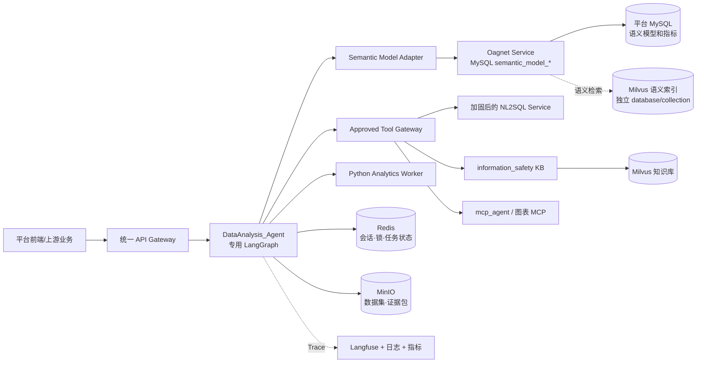
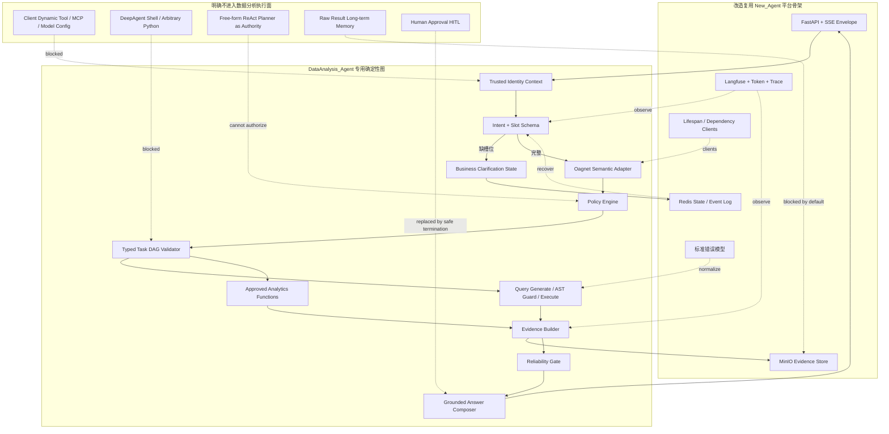
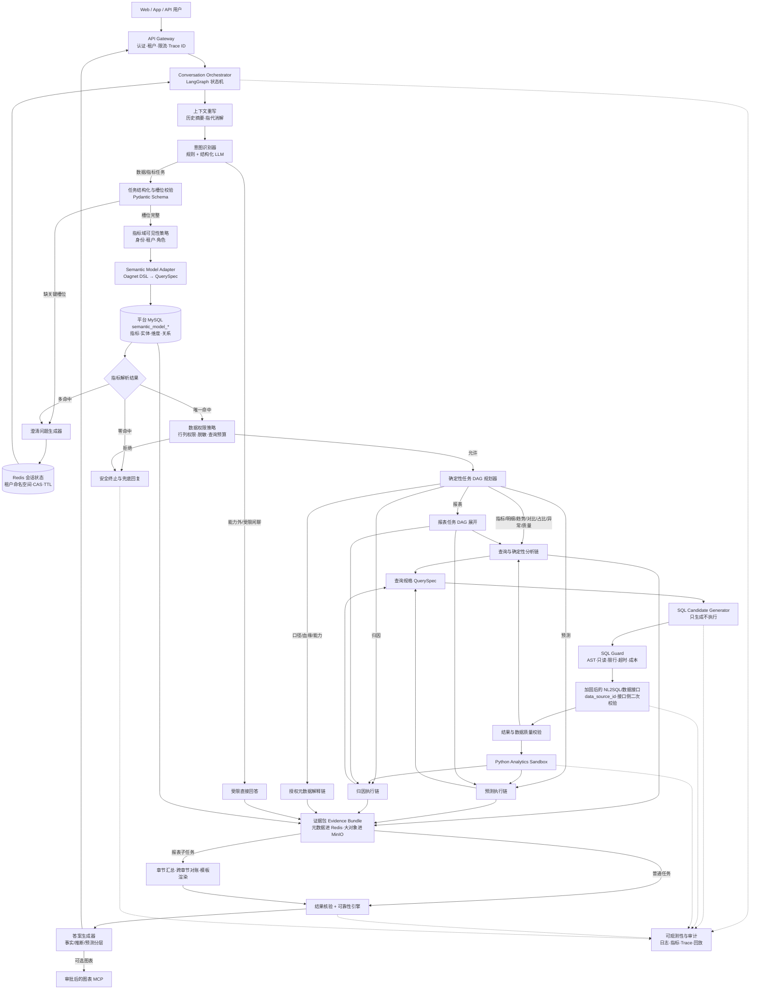
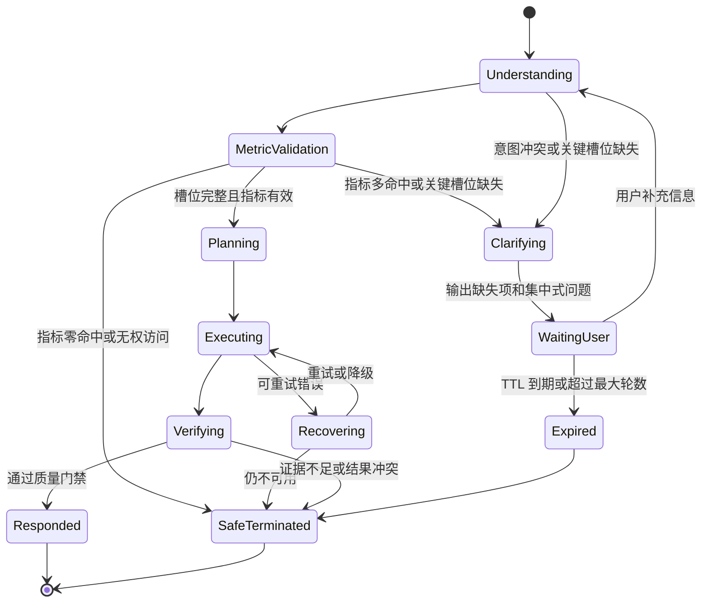
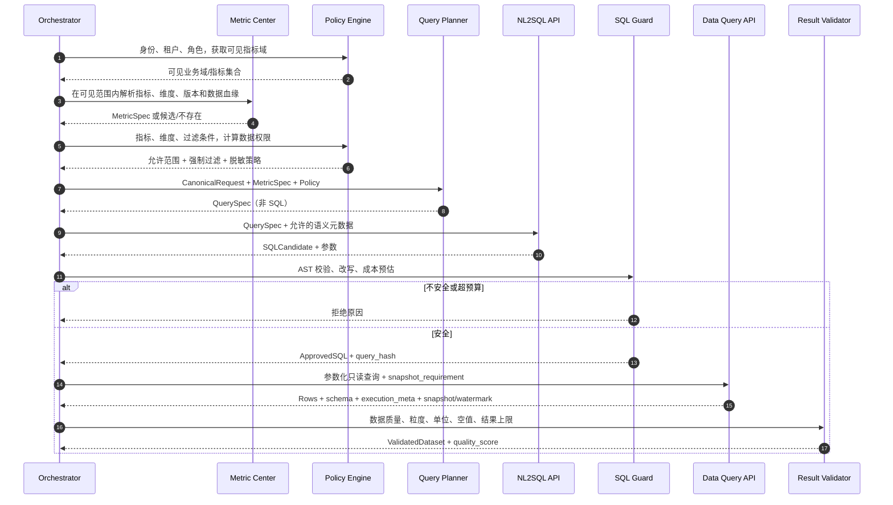
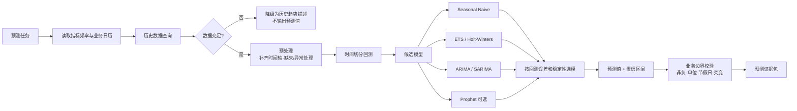
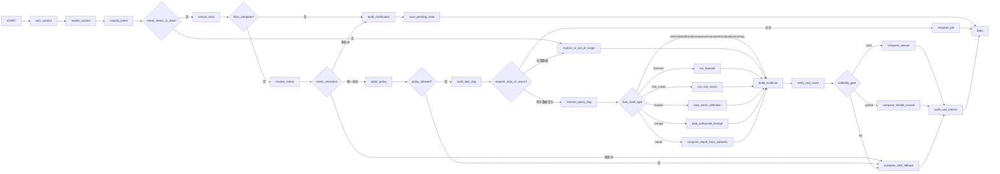

# DataAnalysis Agent 架构设计

> 文档状态：架构设计稿 1.82（发布前收敛实施版）  
> 项目位置：`DataAnalysis_Agent`（独立部署，复用 `New_Agent` 平台基础设施模式并通过 API 集成现有服务）  
> 建设范围：架构与接口设计，不包含实现代码  
> 基线技术：Python、FastAPI、LangGraph、Pydantic、MySQL、Oagnet 语义模型、Redis、MinIO、Milvus、MCP、现有 NL2SQL 服务、Python 时序分析组件


## 1. 建设目标

构建一个面向企业经营数据的对话式分析智能体，将自然语言问题稳定地转化为可审计的结构化任务，在指标口径真实存在、权限允许且数据满足要求时，完成数据查询、指标计算、趋势预测或下降归因，并返回带证据、限制说明和置信度的结论。

系统必须满足：

- 不完整问题先追问，追问状态跨轮保存，信息补齐后从原任务继续。
- 指标必须经过 MySQL 指标中心验证；不存在或口径不唯一时禁止生成 SQL。
- SQL 只读、可校验、可限流、可超时、可审计，模型不能直接连接数据库。
- “查询”“预测”“归因”使用确定性路由和不同执行链，不由模型随意决定是否调用高风险工具。
- 输出区分事实、模型推断和预测，不把相关性写成因果性。
- 每个关键环节具备重试、降级、安全终止三层兜底，不接人工流程。

## 2. 范围与关键假设

### 2.1 本期范围

- 指标查询、同比/环比、排行、构成、异常检测。
- 基于历史数据的 Python 时序预测与趋势判断。
- 基于驱动指标的下降贡献度分析和候选原因排序。
- 多轮澄清、置信度、审计、监控、安全控制和兜底话术。

### 2.2 不在本期范围

- 自动写库、修改业务数据或执行 DDL/DML。
- 自动经营决策、自动触达用户、自动创建工单。
- 将观察性数据的相关关系宣称为严格因果关系。
- 在线训练大型基础模型。

### 2.3 假设

- 数据查询能力由已存在的受控接口提供，智能体不持有生产库直连凭据。
- 权威指标定义存在 MySQL；至少可提供指标名、别名、公式、粒度、维度、数据源映射、版本和有效期。
- 若指标中心缺字段，应按本文 6.2 的模型补齐，否则相关能力降级。
- 时间统一使用业务时区，默认 `Asia/Shanghai`；“本月”等相对时间在结构化任务中固化为绝对区间。

### 2.4 YouoAgent 现有平台梳理

本设计不是绿地项目。代码审视确认平台已有以下能力，后续实现必须通过适配器复用，禁止在新项目中复制一套同名基础设施：

| 现有子项目 | 当前职责 | 本项目定位 |
|---|---|---|
| `New_Agent` | FastAPI + LangGraph 通用智能体；意图、任务拆解、执行、研判、输出；Redis 会话、MinIO 大结果、Milvus 长期记忆、MCP/HTTP 动态工具、Langfuse | 复用服务入口、SSE、模型初始化、观测和基础设施适配方式；数据分析图单独编排，不直接复用自由规划执行链 |
| `NL_Agent` | 面向问数的旧版 Plan/Execute/Reflect/RePlan 与 Skills 路由 | 仅作为测试样例来源，不做接口兼容，不作为新项目运行时依赖 |
| `Oagnet` | 从 MySQL `semantic_model_*` 表加载实体、属性、关系、指标、维度和枚举；经 Chroma 检索生成 DSL | 升级为平台语义模型服务；作为 Metric/Dimension/Relation 的权威入口，通过 DSL Adapter 转成 Canonical QuerySpec |
| `information_safety_test` | 基础知识库、Milvus 检索，以及现有 NL2SQL、问题增强、图表 Agent 等工作流 | 复用知识库检索和待加固的 NL2SQL/图表能力；不得直接复用其客户端传凭据和弱 SQL 校验模式 |
| `mcp_agent` | MCP/HTTP 工具接入、Skills、长期记忆和多媒体工具 | 复用协议与受控工具目录；数据分析仅允许审批后的工具 |
| `graphrag_latest` | 图知识库服务 | 可选用于业务关系解释，不作为指标真实性的权威源 |
| `LangExtract` | 文档解析/结构化抽取 | 用于指标文档导入候选，不得绕过 MySQL 审批直接发布指标 |
| `rag_as` | RAG 评测、QA 数据集和异步评测任务 | 复用评测思路，不进入在线请求关键路径 |
| `volumes_milvus` | Milvus、etcd、MinIO 基础部署 | 复用现有基础设施，生产环境需替换示例凭据并补齐高可用 |



### 2.5 平台适配的上线前置条件

以下不是远期优化，而是生产启用数据分析能力前必须完成的 P0 条件：

1. `Oagnet` 增加统一认证、租户/项目/语义模型授权、超时和稳定错误码；不能信任客户端直接提交的 `semantic_model_id/business_domain_id`。
2. `Oagnet` 的自然语言 DSL 输出必须做 JSON Schema 校验、指标主键回查和 DSL→QuerySpec 确定性转换；LLM 文本不能直接进入 NL2SQL。
3. 现有 NL2SQL 接口停止接收客户端提供的 DB Host、用户名、密码、LLM Key/Base URL，改为接收服务端登记的 `data_source_id` 和 `model_profile_id`。
4. NL2SQL 的字符串前缀校验替换为 SQL Parser/AST Guard；精确命中 Q→SQL 示例也必须经过同一指标、权限、AST、成本和快照校验，不允许直接执行示例 SQL。
5. 动态 HTTP/MCP 工具由客户端传 URL、Headers 和额外参数的模式改为服务端 Tool Registry 引用；禁止任意目标地址、任意 Header 和 Schema `extra=allow` 进入生产数据链。
6. Redis 会话键从仅 `session_id` 升级为 `tenant_id:application_id:user_id:session_id`，并实施原子 CAS/锁；现有“上层保证同会话无并发”不满足生产条件。
7. 清除代码、默认参数、Compose 和文档中的硬编码密钥/示例密码，完成凭据轮换；日志对 Prompt、工具参数、URL、Header、SQL 和数据样本执行分级脱敏。
8. 统一服务发现和内部 TLS，逐步取消硬编码内网 IP 与 `network_mode: host`；所有运行时服务提供 readiness/liveness、超时、熔断和依赖健康信息。
9. 各子项目保持独立容器和锁定依赖，不把不同 LangChain/Pydantic 版本强装进一个 Python 环境；通过版本化 API/OpenAPI Contract Test 集成。
10. 删除单一静态 Bearer Key 方案。网关必须签发或透传可验证的租户、用户、应用、角色和请求身份，下游不得信任 Body 中的 `user_id/department/application_id`。
11. 删除服务模块 import/启动时“索引为空即全量重建”的副作用；启动只加载已发布索引并就绪检查，索引缺失进入语义降级或 Not Ready，由受控异步 Job 构建。
12. 将“向 stdout 打印 API Key、完整 Prompt、历史、SQL、工具结果或环境变量”的代码纳入发布阻断扫描；不仅要配置日志脱敏，也要清理 `print()` 和测试入口泄露路径。

### 2.6 New_Agent 复用边界

`New_Agent` 是平台通用智能体参考实现，但数据分析属于高准确性、强权限、可复算场景，不能直接复制其自由规划链。按以下边界复用：

| New_Agent 能力 | 决策 | DataAnalysis_Agent 处理方式 |
|---|---|---|
| FastAPI lifespan、SSE/EventSourceResponse、统一事件推送 | 改造复用 | 沿用生命周期和流式交互模式，事件升级为版本化 Envelope，支持事件 ID、断线续传、取消和终态唯一性 |
| LangGraph 显式节点和条件路由 | 直接参考 | 建立专用数据分析图；节点输入输出使用 Pydantic Schema，不使用可被任意节点随意写入的宽 TypedDict |
| `start → breakdown → execute → ResultVerify → output` 分层 | 改造复用 | 映射为理解/追问→语义编译→确定性任务 DAG→查询/分析→证据核验→回答；不复用自由 ReAct 执行链 |
| `tasks + task_dependencies` 混合 DAG 调度 | 改造复用 | 保留并行/串行调度思想，增加 DAG 环检测、最大节点/深度/扇出、资源预算、失败传播和确定性 Task Type |
| 追问短路和跨轮补充 | 改造复用 | 使用结构化 `missing_slots/pending_request`，不依赖 `<<CLARIFICATION>>` 文本标记或 LLM 自由格式 |
| `build_common_context` 集中构造上下文 | 改造复用 | 建立 Context Policy Builder，只拼入受权、最小、带来源的数据；客户端 Prompt、身份、工具和密钥不能进入可信系统上下文 |
| Tool Call History、事实提取、ResultVerify | 不直接复用 | 原始工具结果进入 Evidence Bundle；事实和数值由确定性解析/计算器提取，LLM 研判只能生成候选解释，不能成为正确性门禁 |
| MCP 按服务隔离、连接失败后保留其他服务 | 改造复用 | 保留隔离和部分降级；工具必须来自 Approved Tool Registry，超时受请求 deadline 控制，客户端不能传地址/Header |
| 工具错误五分类 | 改造复用 | 扩充为稳定错误码、可重试性、责任域和用户可见级别；不能把无法解析响应默认成功，也不能把 HTTP 500 固定归业务错误 |
| Graph LRU 缓存 | 改造复用 | 缓存编译后的静态图/工具目录版本；Key 不包含密钥/Header，按策略版本失效，淘汰时关闭 MCP/HTTP 资源 |
| Redis SessionHistory/Checkpointer | 改造复用 | 使用租户化 Key、CAS/锁、事件日志和恢复校验；不依赖“上层保证无并发”，不使用进程内 MemorySaver 做跨重启状态 |
| 大工具结果本地化 | 改造复用 | 统一写入租户隔离的 MinIO Evidence Store，只在 State 中保存不透明引用、Schema、Checksum 和 TTL |
| Langfuse、Token Usage、节点 Span | 改造复用 | 保留观测模型，默认脱敏与采样；Trace 不存完整 Prompt、SQL、结果、文件内容和工具认证 |
| Skills 读取和部门过滤 | 不作为授权复用 | Skill 可提供业务说明，但真正授权来自网关身份与 Policy Engine；客户端传 `department/authority` 不能形成权限 |
| 长期记忆 Milvus | 默认不复用 | 数据结果、指标值和筛选条件不默认进入长期记忆；只存经过治理允许的用户偏好或非敏感摘要 |
| Sandboxed Shell/DeepAgent 自由代码执行 | 禁止复用 | 预测和归因只调用审批后的 Analytics Function，不向 LLM 暴露 Shell、文件系统或任意 Python |
| 动态 LLM、HTTP、MCP、文件路径配置 | 禁止复用 | 请求只引用服务端登记的 Profile/Tool/File ID，禁止传 Key、URL、Header、任意对象路径和 `extra=allow` 参数 |

实现时不要直接把 `New_Agent` 目录加入 `PYTHONPATH` 后跨项目 import。其模块包含全局单例、运行时 Patch、进程内缓存和应用生命周期假设，直接引用会造成隐式副作用与依赖耦合。首期通过 HTTP/Redis/MinIO 等稳定契约复用平台服务；真正通用且通过测试的 SSE Envelope、错误模型、Trace Context 等再提取为独立版本化 `youo-agent-sdk`，由两个项目分别依赖。

### 2.7 基于 New_Agent 的落地架构图



## 3. 总体架构图



### 3.1 设计原则

1. **Workflow first，Agent second**：主链路由显式状态机控制，LLM 只承担语义理解、候选生成和表述，不掌握数据库权限。
2. **Semantic layer first**：先解析并验证指标，再规划查询；表字段不是业务口径。
3. **Evidence first**：任何数值结论必须能追溯到指标版本、查询规格、查询结果和计算过程。
4. **Fail closed**：指标不明、权限不明、SQL 不安全、数据不足时不猜测。
5. **幂等可恢复**：每一步写入状态与执行记录，重试不重复产生不可控调用。
6. **一致性快照**：同一分析任务的所有子查询绑定同一数据快照、水位和指标版本。
7. **双层授权**：解析前限制可见指标域，查询前计算行列权限，输出前再次脱敏。
8. **平台复用优先**：语义资产沿用 `semantic_model_*`，会话沿用 Redis，大结果沿用 MinIO，知识检索沿用 Milvus；新项目只新增领域编排与缺失的安全控制。

### 3.2 不可妥协的查询接口边界

现有查询接口必须满足以下方案之一，按推荐顺序排列：

1. **首选：只接收 QuerySpec**。查询服务根据已审批语义模型生成 SQL，并在服务内部完成 AST、权限、成本和只读校验。
2. **次选：生成与执行分离**。NL2SQL 接口提供 `generate_only`，返回 SQL Candidate；智能体侧 SQL Guard 通过后，再交给独立数据接口执行，执行接口再次校验。
由于平台尚未发布，不保留“生成并立即执行 SQL”的黑盒兼容模式。现有 `toolCallFlow` 必须在首次发布前完成 generate/guard/execute 拆分，旧请求字段和弱执行入口直接删除。任何“模型生成任意 SQL 并直接执行、执行后才检查”的接口均不得进入集成环境的发布候选。系统启动时执行 Capability Handshake，确认 SQL 方言、参数化、快照、超时和审计能力；能力不满足时对应 Capability 保持关闭。

### 3.3 控制面与数据面隔离

- 控制面管理语义模型发布、指标版本、数据源、模型配置、工具注册、策略、密钥引用和索引构建；只允许管理角色访问，变更需审计和审批。
- 数据面只接受已发布、不可变的版本 ID 和短期授权决策，不能在用户请求中临时注册数据源、模型、工具、Prompt 或权限。
- 控制面故障时，数据面可在明确 TTL 内使用最后一个已验证快照继续只读服务；TTL 到期后 Fail Closed。数据面故障不影响控制面回滚错误版本。
- 发布使用“构建→校验→原子切换 alias→观察→回滚”的流程，禁止原地修改正在被请求使用的指标、索引或策略。

## 4. 意图识别体系

意图识别输出采用三层结构：一个主业务意图、零到多个分析算子、一个会话控制类型，并附带风险和完整度信息。这样避免把“排行”“过滤”“追问回复”等执行细节与真正业务目标放在同一层。

### 4.1 主业务意图

| 主意图 | 中文名称 | 说明 | 示例 | 默认执行链 |
|---|---|---|---|---|
| `METRIC_QUERY` | 指标查询 | 查询聚合指标、派生指标或指标集合 | 本月销售额是多少 | 指标验证 → 聚合查询 → 确定性计算 |
| `DETAIL_QUERY` | 明细查询 | 查询订单、客户、商品等行级记录 | 查询昨天退款的订单明细 | 实体/字段验证 → 强权限/脱敏 → 限行明细查询 |
| `TREND_ANALYSIS` | 趋势分析 | 描述已有历史数据的方向、拐点和变化速度，不预测未来 | 最近一年销售额趋势 | 时序查询 → 趋势统计 → 解释 |
| `COMPARISON_ANALYSIS` | 对比分析 | 同比、环比、目标、期间、对象或分组对比 | 本月销售额同比和环比 | 多期/多组查询 → 对齐 → 确定性比较 |
| `COMPOSITION_ANALYSIS` | 占比分析 | 构成、份额、贡献占比和结构变化 | 各区域销售额占比 | 总体+分组查询 → 对账 → 占比计算 |
| `ANOMALY_ANALYSIS` | 异常分析 | 识别异常点、突变、偏离基线和异常维度 | 哪些门店最近销售异常 | 查询 → 数据质量排除 → 异常检测 |
| `ROOT_CAUSE_ANALYSIS` | 归因分析 | 对已确认变化给出数学贡献和关联线索 | 销售额下降的主要因素 | 目标+驱动指标 → 贡献拆解 → 证据分级 |
| `FORECAST_ANALYSIS` | 预测分析 | 预测未来数值或趋势并给出区间 | 预测下个月销售额 | 历史查询 → 回测选模 → 预测与区间 |
| `REPORT_GENERATION` | 报表生成 | 按模板组合多个查询和分析，生成结构化报告 | 生成本月经营分析报表 | 模板解析 → 子任务 DAG → 报告校验与渲染 |
| `METRIC_DEFINITION` | 解释口径 | 解释指标定义、公式、单位、过滤和适用范围 | 销售额口径是什么 | 语义模型/指标文档双检索，不查事实值 |
| `DATA_LINEAGE` | 数据血缘 | 查询指标到实体、表、字段、任务和版本的血缘 | 销售额来自哪些数据 | 已授权血缘查询 → 敏感信息裁剪 |
| `DATA_QUALITY` | 数据质量 | 查询完整性、及时性、对账、刷新和闭账状态 | 为什么今天销售数据不全 | 质量规则/水位/任务状态查询 |
| `CAPABILITY_HELP` | 能力帮助 | 说明系统支持的指标、维度、问法和限制 | 你能分析哪些数据 | 按用户权限返回能力目录 |
| `CHAT` | 闲聊 | 无需业务数据的普通交流 | 你好 | 受限直接回复，不加载数据工具 |
| `OUT_OF_SCOPE` | 能力外请求 | 与平台目标无关或明确不支持 | 帮我修改数据库数据 | 能力边界/安全说明 |

不合并的原因：

- `METRIC_QUERY` 与 `DETAIL_QUERY` 必须分开：一个主要返回聚合值，另一个涉及行级敏感数据、字段权限、最小必要列、分页和导出控制。
- `TREND_ANALYSIS` 与 `FORECAST_ANALYSIS` 必须分开：前者只描述历史事实，后者包含未来不确定性、回测和预测区间。
- `COMPARISON_ANALYSIS` 与 `COMPOSITION_ANALYSIS` 不合并：比较关注对象/期间差异，占比关注分子与统一总体分母及可加总对账。
- `METRIC_DEFINITION` 与 `DATA_LINEAGE` 不合并：业务用户可查看口径，但物理表列和任务血缘可能受更严格权限限制。
- `REPORT_GENERATION` 是组合意图：它自身不产生事实，内部必须拆成上述基础意图的 Typed Task DAG。

### 4.2 分析算子

分析算子描述“如何处理”，不是主业务意图：

`FILTER`、`GROUP_BY`、`AGGREGATE`、`COMPARE`、`RATIO`、`TOP_N`、`BOTTOM_N`、`SORT`、`PIVOT`、`TIME_BUCKET`、`MOVING_AVERAGE`、`DECOMPOSE`、`ANOMALY_DETECT`、`FORECAST`、`EXPLAIN`、`RENDER_TABLE`、`RENDER_CHART`。

同一句可以组合，例如“预测下月各区域销售额并找出下降最大的区域”为 `FORECAST_ANALYSIS + GROUP_BY + FORECAST + BOTTOM_N`。执行计划必须表示为有依赖关系的任务 DAG，不能用单一 `analysis_type` 枚举丢失复合目标。

### 4.3 会话控制类型

| 类型 | 说明 | 处理 |
|---|---|---|
| `NEW_REQUEST` | 新业务问题 | 创建新 Turn |
| `CLARIFICATION_RESPONSE` | 回答系统上一轮缺失槽位 | 合并 pending request 后重新校验 |
| `FOLLOW_UP` | 对上一结果继续过滤、比较或解释 | 继承允许继承的指标/时间/维度，再重新分类主意图 |
| `CORRECTION` | 修改上一轮条件或口径 | 作废受影响的旧 Task/Evidence，重新执行 |
| `CANCEL` | 取消当前任务 | 传播取消令牌，禁止迟到结果覆盖状态 |
| `FEEDBACK` | 对答案正确性或体验反馈 | 记录评测事件，不自动修改指标口径 |

### 4.4 分类与冲突规则

意图识别采用以下决策顺序：

1. 规则识别明显的时间、比较、预测和归因词。
2. LLM 按固定 JSON Schema 输出候选，不允许自由文本。
3. Schema 校验和枚举约束。
4. 低置信度或候选冲突时进入澄清，不自动选择高成本意图。
5. 多目标问题选择用户最终交付物作为主意图，其余转为子任务；例如“查询销售额并生成报表”的主意图是 `REPORT_GENERATION`。
6. “走势/趋势”默认 `TREND_ANALYSIS`；只有明确包含未来时间或“预测/预计”等表达才进入 `FORECAST_ANALYSIS`。
7. “为什么下降”先验证下降是否真实；若未给指标或比较基准先追问，不能直接进入归因工具。
8. “查订单/客户名单/明细/记录”优先 `DETAIL_QUERY`，即使同时包含汇总要求，也对明细分支实施更高风险策略。

## 5. 结构化任务与追问机制

### 5.1 CanonicalAnalysisRequest

```json
{
  "request_id": "uuid",
  "conversation_id": "uuid",
  "tenant_id": "tenant-a",
  "user_id": "user-1",
  "original_question": "帮我分析下个月销售额趋势",
  "rewritten_question": "预测 2026-09-01 至 2026-09-30 的销售额趋势",
  "primary_intent": "FORECAST_ANALYSIS",
  "conversation_control": "NEW_REQUEST",
  "operators": ["AGGREGATE", "FORECAST"],
  "metrics": [{"input": "销售额", "metric_id": null, "version": null}],
  "dimensions": [],
  "filters": [],
  "time_range": {"start": "2026-09-01", "end_exclusive": "2026-10-01", "timezone": "Asia/Shanghai"},
  "comparison": null,
  "forecast": {"horizon": 30, "grain": "DAY", "prediction_interval": 0.95},
  "root_cause": null,
  "detail_query": null,
  "report": null,
  "lineage": null,
  "output": {"format": "TEXT_WITH_TABLE", "top_n": 10},
  "risk_level": "MEDIUM",
  "missing_slots": [],
  "assumptions": [],
  "schema_version": "1.0"
}
```

生产 Schema 还应包含：

```json
{
  "message_id": "client-generated-or-server-issued-id",
  "parent_turn_id": "previous-turn-id",
  "state_version": 7,
  "task_mode": "SYNC_OR_ASYNC",
  "snapshot_requirement": "CONSISTENT",
  "metric_as_of": "2026-08-18T10:00:00+08:00",
  "request_deadline": "2026-08-18T10:00:30+08:00"
}
```

### 5.2 按意图定义必填槽位

| 意图 | 必填槽位 | 可安全默认 | 必须追问的典型情况 |
|---|---|---|---|
| `METRIC_QUERY` | 指标、时间范围 | 无维度=总体 | 指标缺失或同名多口径 |
| `DETAIL_QUERY` | 实体、时间/筛选条件、所需字段、查询目的 | 默认仅返回已批准的最小字段集和首个分页 | 实体或字段不明确、范围过宽、涉及敏感字段或目的不足以授权 |
| `TREND_ANALYSIS` | 指标、历史时间范围、时间粒度 | 粒度可按区间和指标配置推导 | 区间太短、不支持该粒度或“趋势”实际指未来预测 |
| `COMPARISON_ANALYSIS` | 指标、比较对象/期间、基准 | 明确配置时“本月增长率”可默认环比 | 不清楚同比、环比、目标还是对象比较 |
| `COMPOSITION_ANALYSIS` | 指标、构成维度、时间、总体口径 | Top N 默认 10，并保留“其他”保证对账 | 分母范围或维度语义不清、指标不可加总 |
| `ANOMALY_ANALYSIS` | 指标、检测区间、基线规则 | 可使用指标登记的默认季节周期 | 样本不足、基线未登记或异常对象不明确 |
| `ROOT_CAUSE_ANALYSIS` | 目标指标、异常/比较期间、基准期间 | 驱动维度从已批准依赖图生成 | 不知道哪个指标变化、相对什么变化 |
| `FORECAST_ANALYSIS` | 指标、预测区间、粒度 | 可从“下月”等表达解析绝对区间 | 对象范围不明、历史长度不足或未登记预测能力 |
| `REPORT_GENERATION` | 报表模板/目的、期间、业务范围、输出格式 | 已发布模板可提供默认章节 | 未指定模板且不同模板会实质改变内容，或子任务关键槽位缺失 |
| `METRIC_DEFINITION` | 指标 | 返回当前有效版本 | 同名多口径或用户问的是数值而非定义 |
| `DATA_LINEAGE` | 指标/实体、血缘层级 | 默认只展示业务血缘 | 请求物理表列、任务或跨域血缘但授权不足 |
| `DATA_QUALITY` | 指标/数据源、检查范围或时间 | 使用已登记质量规则 | 未说明检查对象，或“异常”究竟是业务异常还是数据故障 |
| `CAPABILITY_HELP` / `CHAT` / `OUT_OF_SCOPE` | 无数据槽位 | 仅返回授权能力目录或受限文本 | 不得通过追问诱导用户扩大数据权限 |

“可安全默认”必须来源于租户配置或指标定义，并在最终答案中披露。不能把模型偏好当默认值。

### 5.3 追问状态机



追问策略：

- 一次列出全部已知缺失项，但问题数量不超过 3 个，优先询问会改变执行路径的槽位。
- 保存 `pending_request`、已确认槽位、候选值和指标版本；用户回复只补丁更新，不丢弃原问题。
- 每轮重新做权限与指标有效期检查，避免沿用过期口径。
- 最大追问 3 轮；仍无法确定时安全终止，并给出可复制的完整提问模板。

### 5.4 多轮并发、乱序与恢复

- 每条新消息必须有全局唯一 `message_id`。同一作用域下“相同 ID + 相同有效请求”返回第一次缓存结果；“相同 ID + 不同问题、历史或执行上下文”返回 HTTP `409 MESSAGE_ID_REUSE_CONFLICT`，绝不返回旧答案。
- 状态写入携带 `state_version` 并使用乐观锁；冲突时重新加载最新状态，不做覆盖写。
- 同一会话的状态变更串行化，耗时分析任务可并行运行，但提交结果前必须检查其 `parent_turn_id` 是否仍为当前有效轮次。
- 用户在追问期间发送内容时，先分类为“槽位补充”“修改原问题”“全新问题”或“取消”。全新问题挂起或取消旧任务，不能强行合并。
- 后发请求先完成时，旧请求的结果标记为 `STALE`，不得覆盖新状态；用户可在历史任务中单独查看。
- SSE/WebSocket 事件写入带序号的事件日志，客户端可用 `Last-Event-ID` 断点续传；断线不等于取消任务。
- 取消通过显式 `cancel` 接口或取消令牌传播到查询和 Python 执行器；无法立即取消的外部调用，其迟到结果必须丢弃。
- 会话状态加密存储，配置 TTL、备份和恢复；恢复后继续执行前重新检查权限、指标版本、数据水位和请求截止时间。

## 6. 指标中心与防幻觉

### 6.1 双门禁

**门禁 A：执行前**

1. 标准化用户指标名称和别名。
2. 按租户、业务域、有效期、权限查询 MySQL 指标中心。
3. 精确命中一个指标才绑定 `metric_id + version`。
4. 多个候选时展示名称和口径差异并追问；零命中时不生成 SQL。
5. 检查所需维度、粒度、过滤字段是否在该指标允许范围内。

**门禁 B：输出前**

1. 核对结果中的每个指标均有已绑定的 `metric_id + version`。
2. 核对查询实际粒度、单位、时间范围与指标定义一致。
3. 重新计算派生指标（例如增长率）并与工具结果交叉校验。
4. 检查答案中的数字是否都能映射到 Evidence Bundle；无法映射的数字禁止输出。
5. 对即将展示的每个指标执行一次语义知识检索（Oagnet 向量索引，必要时补充 information_safety 指标文档库），再以命中的 MySQL 指标主键和版本回查确认；Evidence Bundle 同时记录召回证据与权威记录。

知识检索命中不代表指标存在。向量索引、文档知识库与 MySQL 定义冲突时，以已审批且当前有效的 MySQL 版本为准，降低可靠性并记录“知识索引待刷新”；若冲突涉及公式、单位或有效期，则在修复前停止该指标查询，避免用旧知识解释新口径。

### 6.2 适配现有 `semantic_model_*` 的指标模型

| 表 | 关键字段 |
|---|---|
| 已有 `semantic_model` | 语义模型、项目、名称、编码和说明；补充租户与发布状态约束 |
| 已有 `semantic_model_business_domain` | 业务域与语义模型/项目绑定；作为首层授权范围 |
| 已有 `semantic_model_indicator` | 指标编码、名称、同义词、单位、公式、全局过滤、原子指标依赖；补充稳定版本引用 |
| 已有 `semantic_model_dimension` | 维度编码、名称、字段映射和共享范围；补充允许粒度、基数等级和可筛选性 |
| 已有 `semantic_model_entity_type` | 业务实体、更新频率和业务域归属 |
| 已有 `semantic_model_attribute_config` | 实体属性到物理表列的映射、数据类型、主键/必填标记 |
| 已有 `semantic_model_relation_config` | 实体关系、Join Key、关系类型和约束 |
| 已有 `semantic_model_enum` | 字段枚举，用于值标准化和查询限制 |
| 已有 `semantic_model_entity_bind_indicator` | 实体与指标绑定及指标逻辑 |
| 新增 `semantic_model_version` | 语义模型发布版本、审批状态、生效/失效时间、内容哈希、回滚版本 |
| 新增 `semantic_model_indicator_version` | 指标不可变版本、公式、聚合方式、负责人、有效期、审批和兼容性 |
| 新增 `semantic_model_indicator_dependency` | 规范化指标依赖、驱动方向、分解方法和业务解释 |
| 新增 `semantic_model_policy` | 指标/实体/维度的租户、角色、行列策略与脱敏规则 |
| 新增 `semantic_model_quality_rule` | 完整性、及时性、唯一性、值域、对账与闭账规则 |
| 新增 `semantic_model_data_snapshot` | 数据源、批次/快照 ID、水位、刷新状态、闭账状态、回补版本 |

平台 MySQL `semantic_model_*` 是权威事实源，不再新建一套平行的 `metric_*` 主数据。向量检索只能用于别名、实体、维度和关系候选召回，最终必须回查 MySQL 主键、项目/业务域归属与有效版本。

指标发布必须经过机器校验和审批状态检查：公式可解析、依赖无环、单位可推导、聚合方式合法、维度兼容、数据源映射可达、版本有效期不重叠。指标版本和数据版本分别管理；发布失败可原子回滚，禁止查询到半发布状态。指标依赖形成 DAG，发现循环依赖时拒绝发布。

### 6.3 Oagnet 语义服务改造

- 保留现有 MySQL→语义文档→向量召回→DSL 的核心逻辑，但 API 输出从自由文本改为 Pydantic/JSON Schema 强校验对象。
- `semantic_model_id` 和 `business_domain_id` 由授权上下文映射或在可见集合内校验；不存在、越权和已删除对象使用不可枚举的统一响应。
- Chroma 仅保留为开发期验证代码，不进入目标运行架构。Oagnet 在首次集成前迁移到平台 Milvus 的独立 database/collection，并采用单写者、版本化索引和 alias 原子切换；不能让多个副本各自启动时重建并产生版本漂移。
- 语义向量索引是候选召回加速器，不是全部查询的单点依赖。索引不可用时，标准指标编码、精确名称和明确别名可走受权 MySQL 精确查询降级；模糊自然语言无法可靠解析时追问或安全终止。
- `/vector/rebuild` 改为受权异步 Job：从 MySQL 一致性快照构建新索引、校验数量/抽样召回后原子切换 alias；失败保留旧索引。
- 服务 import/启动不得调用全量 `rebuild_index`。启动时只校验已发布 alias、向量维度、Embedding 模型版本和索引校验和；不匹配则 Not Ready 或启用上述精确查询降级。
- 索引记录携带 `tenant_id/project_id/semantic_model_id/business_domain_id/model_version`，检索层强制注入过滤条件，不能只依赖 Prompt。
- DSL Adapter 确定性地把 Oagnet 输出映射成 CanonicalAnalysisRequest/QuerySpec；无法映射的字段进入澄清或安全终止，不把原始 DSL 直接拼入 SQL Prompt。
- Oagnet 的完整 Prompt、用户问题和 DSL 不以 INFO 明文记录；仅保留哈希、主键、版本、耗时和脱敏摘要。

### 6.4 指标计算语义与准确性约束

指标存在不代表任何聚合方式都正确。每个指标版本必须声明并由 QuerySpec Compiler 强制执行以下语义：

| 语义 | 必填内容 | 典型风险 |
|---|---|---|
| 可加性 | `ADDITIVE / SEMI_ADDITIVE / NON_ADDITIVE` 及允许聚合维度 | 库存余额跨日期求和、转化率直接平均 |
| 聚合公式 | 分子、分母、去重键、过滤条件、空值规则、零分母规则 | 平均值的平均、重复 Join 放大金额 |
| 时间语义 | 事件时间/入库时间、业务日历、自然月/财月、周起始日、闭账状态 | 同比日数不一致、财年错位 |
| 维度语义 | SCD 类型、事实发生时/当前归属、未知成员处理 | 历史订单被错误归入客户当前区域 |
| 单位与币种 | 存储单位、展示单位、舍入阶段、币种、汇率类型与生效日 | 元/万元混用、按当前汇率重算历史 |
| 精度 | 数据库 Decimal 精度、计算上下文、最终舍入模式 | float 累积误差、过早四舍五入 |
| 去重与基数 | 事实粒度、主键、Distinct Key、Join Cardinality | 一对多 Join 导致销售额翻倍 |
| 状态口径 | 有效、退款、取消、软删除、测试数据等过滤 | 销售额与订单量使用不同状态集合 |

强制规则：

- 金额、比率和贡献计算使用 Decimal/数据库精确类型；Python/JSON 边界不得静默转为二进制 float，序列化采用字符串值加单位元数据。
- 比率、均值、客单价等不可加指标必须查询可加的分子/分母后重新计算，禁止对分组比率做无权重平均。
- 半可加指标按指标声明选择期末、期初、平均或快照，不得跨时间直接 SUM。
- QuerySpec Compiler 在 Join 前验证关系基数；可能放大事实表时先预聚合或使用受验证的去重键，并执行 Join 前后对账。
- 同比/环比对齐业务日历、天数、星期结构和闭账状态；闰年、月末、财年、夏令时地区和时区转换使用版本化 Calendar Service。
- 多币种结果必须注明原币/本位币、汇率来源、汇率日期和换算方式；汇率缺失时不自动用最近值，除非指标口径明确允许。
- SCD 维度必须明确使用事实发生时版本还是当前版本；没有历史映射时降低可靠性并披露，不能静默回填当前属性。
- Null、零、无数据和不可计算是不同状态，API 使用 `value_status` 表达，答案不能把无数据写成 0。
- 同一指标在查询、预测、归因和图表链共用同一个 MetricSpec/Calculator 库，禁止各模块分别实现公式。

## 7. 查询执行链与 SQL 安全



### 7.1 QuerySpec

QuerySpec 只描述“查什么”，不允许模型直接选择任意物理表：

```json
{
  "semantic_model_id": 6,
  "business_domain_id": 7,
  "semantic_model_version": "smv_42",
  "data_source_id": "ds_sales_readonly",
  "metrics": [{"metric_id": "sales_amount", "version": 3}],
  "dimensions": ["date"],
  "filters": [{"field": "region", "op": "IN", "value": ["华东"]}],
  "time_range": {"start": "2026-01-01", "end_exclusive": "2026-08-01"},
  "grain": "DAY",
  "order_by": [],
  "limit": 10000,
  "purpose": "FORECAST_TRAINING"
}
```

所有复合分析的 QuerySpec 还必须携带同一组一致性字段：

```json
{
  "snapshot_id": "warehouse-snapshot-id",
  "data_version": "etl-batch-id",
  "watermark": "2026-08-18T08:00:00+08:00",
  "metric_as_of": "2026-08-18T10:00:00+08:00",
  "closed_period_required": false
}
```

首个子查询获取或锁定快照，后续查询在能力允许时必须复用。如果数据源不支持快照，则在执行前后读取水位；水位发生变化时整组结果作废并在预算内整体重跑，禁止只重试单个子查询。同比、环比、构成和归因必须执行“总计与分项可对账”校验。

### 7.2 一致性等级

跨异构数据源通常无法共享同一个数据库快照，系统不得假装拥有强一致性。执行计划必须声明并返回实际达到的等级：

| 等级 | 条件 | 允许场景 |
|---|---|---|
| `C0_STRONG_SNAPSHOT` | 同一只读事务/仓库 Snapshot ID | 财务级查询、严格同比、确定性贡献拆解 |
| `C1_BATCH_ALIGNED` | 各依赖来自同一 ETL Batch/闭账批次 | 常规经营查询、预测训练 |
| `C2_WATERMARK_BOUNDED` | 各源水位差在指标允许阈值内 | 探索性趋势、低风险分析，必须披露水位差 |
| `C3_BEST_EFFORT` | 无共同批次且水位不可保证 | 只允许展示分源事实，不做精确比率、加总或根因归因 |

每个指标/意图定义最低一致性等级。达不到时降级分析或安全终止，不能仅通过降低可靠性分数继续给出精确结论。

### 7.3 SQL Guard 强制策略

- SQL Parser/AST 验证，仅允许单条 `SELECT` 或受控 CTE；禁止 DDL、DML、存储过程、注释逃逸和多语句。
- 表、列、函数白名单来自已绑定指标版本；所有值使用参数绑定。
- 自动注入租户、行级权限和时间范围，模型不能覆盖强制条件。
- 敏感列禁止选择或按策略掩码；拒绝 `SELECT *`。
- 限制扫描分区、Join 数、子查询深度、返回行数、执行时间和并发数。
- 先 `EXPLAIN` 或调用数据接口的成本评估能力；超过预算则降粒度、缩短范围或拒绝。
- 使用只读数据查询接口/只读副本，接口侧再次验证 SQL，形成纵深防御。
- 记录 `query_hash`、模板、参数摘要、指标版本和执行元数据；日志中不记录明文敏感值。
- 查询接口必须返回 `guard_decision`、SQL 方言、参数化状态和实际访问对象；无法证明执行前已通过安全校验时，结果不可进入 Evidence Bundle。

### 7.4 数据刷新、迟到与回补

- 为每个指标定义刷新 SLA、预期分区、闭账规则和最大允许延迟；`data_as_of` 不能替代“数据完整”。
- 查询前检查目标期及所有依赖表的水位。部分分区失败、不同依赖表水位不一致或正在回补时，标记 `PARTIAL/UNSTABLE`。
- “今天/本月”等未闭账期间默认披露数据仅截至某水位；根因分析前先排除数据未到齐造成的伪下降。
- ETL 回补和历史修订产生新的 `data_version`，必须使相关查询、Evidence Bundle 和预测缓存失效。
- 数据质量异常既是分析结果，也是硬门禁：关键依赖缺失时不得把数据问题解释为业务原因。

### 7.5 现有 NL2SQL 服务发布前重构

代码审视确认现有服务已移除 Agent 的 `sql_db_query` 工具，并提供 Query Checker 与 EXPLAIN，这是可复用基础；但同步路径仍可在生成后直接执行 SQL，且只用关键词/前缀判断写操作，尚不能作为生产安全边界。改造要求：

- 对外请求只接受 `QuerySpec + data_source_id + model_profile_id + trace_context`，数据库和模型凭据由服务端 Secret Manager 解析，禁止通过 Body 传入或写入历史。
- 将“生成 SQL”“Guard”“执行”拆成明确阶段；生成接口无执行权限，执行接口只接受带短期签名的 `approved_query_id`，不接受客户端 SQL 文本。
- 使用与数据库方言匹配的 Parser 生成 AST；拦截写操作、堆叠语句、注释逃逸、`SELECT ... INTO/OUTFILE`、危险函数、系统库、未授权 CTE/子查询和资源消耗攻击。
- `_is_select_only` 一类字符串判断仅可作为早期快速拒绝，不能作为最终 Guard。
- `sql_db_query_checker` 是 LLM/工具辅助校验，不等于安全审计；最终决策必须由确定性 Guard 给出。
- Q→SQL 知识库示例只作为候选参考。现有“问题精确匹配后直接使用示例 SQL”的捷径必须移除，示例要重新绑定当前指标版本、物理映射、权限和时间参数并走完整 Guard。
- Schema 浏览只能访问语义模型白名单中的对象，禁止列举整个数据库；示例数据默认关闭，确有需要时按字段策略脱敏并限制行数。
- 执行使用平台登记的只读账号、事务只读、statement timeout、最大返回行数和数据库侧资源组；结果流式/分页写入 MinIO，禁止 `fetchall()` 无界加载进服务内存。
- 错误响应不返回数据库堆栈、连接地址、表结构或原始异常；内部日志与用户错误通过 `trace_id` 关联。

### 7.1 明细查询专用安全门禁

`DETAIL_QUERY` 不得复用聚合查询的宽松展示策略：

- Policy 必须同时批准查询目的、实体、字段、行范围、最大时间跨度和结果用途；未知字段、自由文本字段、凭据、身份证件、联系方式等默认拒绝或脱敏。
- QuerySpec 强制显式列清单、稳定排序和游标分页；禁止 `SELECT *`、无界范围、模型侧自动翻页、跨页聚合以及由对话触发文件导出。
- LLM 默认只接收字段摘要和小规模脱敏样本；完整明细保留在受控结果对象中，下载能力必须作为平台外的独立权限和审计流程建设。
- 每次翻页重新校验身份、策略版本、结果对象租户和 TTL；策略变更、权限撤回或快照失效后立即停止继续读取。
- 响应展示总命中数时必须使用独立受控计数或近似标记，不能为获取总数额外触发无预算的全表扫描。

## 8. 趋势预测链

预测不是让 LLM 看几行数据后猜测，而是由受限 Python 分析组件完成。



### 8.1 最低数据要求

- 日粒度月度预测：建议至少 180 天，且覆盖主要周周期；不足时不运行复杂模型。
- 月粒度预测：建议至少 24 个点；少于 12 个点只允许朴素基线或趋势描述。
- 数据缺失率、最近刷新时间和异常点比例必须进入质量评分。
- 预测跨度不得明显超过可用历史长度；硬上限由租户配置。

### 8.2 模型选择与输出

- 必须包含 Seasonal Naive 基线；复杂模型在滚动回测中不能稳定优于基线时使用基线。
- 主要评价指标建议 WAPE/MAE，MAPE 仅用于远离零值的指标。
- 输出点预测、80%/95% 预测区间、回测区间、误差、模型版本和训练数据截止时间。
- LLM 只解释模型产物，不执行数值运算，不隐藏宽置信区间。

### 8.3 预测健壮性与防泄漏

- 特征构建必须记录 `event_time` 与 `available_time`，训练某个历史切分点时只能使用当时已可获得的数据，防止未来数据和回补数据泄漏。
- 节假日可使用已发布日历；促销、价格、库存等外生变量只有在预测时点已知未来取值或具备独立预测方案时才可使用，否则只作为情景假设。
- 使用多个滚动窗口回测；窗口过少、误差不稳定或复杂模型未稳定优于朴素基线时，禁止宣称模型提升。
- 检测结构突变、概念漂移和残差偏移。漂移严重时缩短训练窗、切换基线或只输出趋势描述，并记录降级原因。
- 用历史回测校准预测区间覆盖率；区间明显欠覆盖时扩大区间或降低可靠性等级。
- 分层预测必须做 reconciliation，保证门店/区域/品类等子层级与总体在定义允许时一致；无法调和时分别展示并说明不可加总。
- 异常值处理策略按指标配置为保留、截尾、替换或事件标注，原始值和变换均写入分析产物，不允许静默清洗。
- 执行后检查 NaN、Inf、负值、数量级突变和业务容量上限。算法不收敛、资源超限或输出越界时视为模型失败。
- 答案必须披露关键假设，例如“未来促销、供给和价格结构与历史相似”；情景变化大时提供基准/乐观/保守情景，而不是伪精确单值。

## 9. 数据下降归因链

### 9.1 驱动指标体系

范围尚未确定时，建议通过 `metric_dependency` 建设可配置驱动图。销售额的首版驱动树可为：

```text
销售额
├── 销量
│   ├── 订单数
│   │   ├── 访问用户数
│   │   └── 转化率
│   └── 件单量
└── 平均成交单价
    ├── 标价/价格带
    ├── 折扣率与促销结构
    └── 商品/渠道/区域结构

辅助诊断：退款率、取消率、缺货率、活跃客户数、新老客结构、渠道、区域、门店、品类、SKU、节假日与活动标记。
```

并非所有企业都有这些数据。每个驱动项必须绑定真实指标，未接入项标记为“不可验证”，绝不能由模型补造。

### 9.2 分析步骤

1. 确认下降指标、当前期、基准期和分析粒度。
2. 从指标依赖图展开一至两层有效驱动指标。
3. 查询目标值、基准值及分维度数据，并运行质量校验。
4. 执行恒等式/贡献度拆解（价格×销量、漏斗、结构效应等）。
5. 对区域、渠道、品类等维度做 Top 贡献排序，并做多重比较/样本量约束。
6. 结合异常、缺货、退款、促销等已接入指标形成“候选原因”。
7. 对结论分级：`已证实的数学贡献`、`数据支持的关联线索`、`尚需验证的假设`。

如果驱动数据不足，系统应回答“下降已确认，但现有数据不足以判断原因”，同时列出缺少的数据类别。

### 9.3 归因防误导规则

- **贡献可加总**：价格×销量等恒等式必须显式处理交互项；分项贡献加总与目标变化的差异超过阈值时，不输出确定性贡献排名。
- **口径与季节性**：比较期必须使用同口径、同日历覆盖和同闭账状态；优先排除季节性、节假日错位和数据刷新异常。
- **样本量约束**：小样本、高缺失或分母接近零的维度不参与确定性排名，只作为低可靠性线索。
- **多重比较**：高基数切片使用 FDR 等校正或稳定性复验，避免从大量维度中挑出偶然异常。
- **重叠与重复归因**：区域、渠道、品类等维度分别形成 decomposition view；没有可证明的联合分解时，不把跨维度贡献简单相加。
- **辛普森悖论**：总体趋势和关键分层趋势方向冲突时必须告警，并按业务层级解释，不给单一根因。
- **统计稳定性**：候选因素需要最小效应量、置信区间/Bootstrap 稳定性或跨窗口复现；仅相关不等于因果。
- **命名约束**：默认标题使用“下降贡献因素与关联线索”；只有具备实验、准实验或受认可因果设计时才能使用“根因”。

## 10. 可靠性与置信度设计

首期输出定义为“可靠性评分/等级”，不是结果正确概率，前端不得展示为“85% 正确率”。评分不是 LLM 自报，而是由可观察信号计算。查询、预测和归因分别配置权重与阈值，禁止用一个总分掩盖局部低质量。

### 10.1 子评分

| 子评分 | 权重建议 | 依据 |
|---|---:|---|
| 指标语义 `S_metric` | 20% | 唯一命中、版本有效、维度兼容、别名歧义 |
| 查询执行 `S_query` | 20% | SQL Guard、执行成功、行数/粒度/单位一致、交叉计算 |
| 数据质量 `S_data` | 25% | 完整性、及时性、缺失率、异常率、样本量 |
| 分析/模型 `S_model` | 25% | 回测优于基线、误差、稳定性；归因则看解释覆盖率与统计稳定性 |
| 证据覆盖 `S_evidence` | 10% | 答案中的数字和结论能否逐项映射证据 |

以下仅为查询/分析类的初始权重示例，必须通过评测集校准后才能固化：

```text
confidence = 0.20*S_metric + 0.20*S_query + 0.25*S_data
           + 0.25*S_model  + 0.10*S_evidence
```

对于纯查询，`S_model` 改为确定性计算正确性；只要硬门禁失败，即使加权分高也不得输出结果。预测同时输出统计预测区间与独立的模型可靠性，二者不可互相替代。归因对每个候选因素分别评分，并展示证据类型，不以回答级总分替代逐条判断。

### 10.2 等级与输出策略

| 分数 | 等级 | 行为 |
|---:|---|---|
| `>= 0.85` | 高 | 正常输出，附口径和数据截止时间 |
| `0.70–0.84` | 中 | 输出结果并突出限制、区间或缺失驱动项 |
| `0.50–0.69` | 低 | 仅输出可验证事实和探索性线索，不给确定预测/原因断言 |
| `< 0.50` | 不可用 | 安全终止，说明无法可靠回答及用户可补充的信息 |

预测还应单独展示预测区间，不能用“高可靠性”替代统计区间。

### 10.3 校准与硬门禁

- 建立按意图、业务域和数据质量分层的标注评测集，用可靠性图、Brier Score/ECE（适用于可定义正确事件的任务）或分档准确率验证评分是否可信。
- 阈值由离线评测、影子流量和生产反馈共同校准，并进行版本管理；未完成校准前只展示高/中/低和具体扣分原因。
- 硬门禁至少包括：无有效指标版本、越权、SQL 安全证据缺失、关键数据未闭合、一致性等级不足、快照冲突、聚合语义不合法、Join 放大未对账、币种/单位不明确、数字无证据映射、预测输出非法、归因不可加总。
- 答案生成后执行 Claim-Evidence Check：不仅核对数字，也将重要文字结论映射到查询、指标定义或分析产物；无证据的陈述删除或改为明确假设。

## 11. 三层兜底机制

用户取消人工介入后，第三层定义为“安全终止 + 标准兜底话术 + 审计告警”，不假装已经得到答案。

| 层级 | 触发 | 策略 | 约束 |
|---|---|---|---|
| L1 重试 | 超时、限流、临时 5xx、结构化输出解析失败 | 指数退避 + 抖动；同一幂等键；必要时修复一次 Schema/SQL | 默认最多 2 次；语义错误、权限拒绝、安全拒绝不重试 |
| L2 降级 | 主模型/模型算法/细粒度查询不可用或数据不足 | 备用 LLM；缩短上下文；粗粒度/较短范围；复杂预测→Seasonal Naive→历史趋势；归因→只确认下降及贡献最大的可用维度 | 必须披露降级，不得改变指标口径 |
| L3 安全终止 | 重试和降级均失败、指标不存在、低于置信阈值、证据冲突、安全策略拒绝 | 返回场景化兜底话术、缺失信息、建议重试方式和错误追踪号；记录审计事件 | 不暴露 SQL、表结构、堆栈、凭据或内部地址 |

### 11.1 熔断与隔离

- 按外部依赖设置超时、并发舱壁、熔断器和半开探测。
- LLM、指标中心、查询接口、Python 分析组件分别计算健康状态，避免级联失败。
- 预测任务设置总耗时预算；超过预算时终止复杂候选模型并返回基线或趋势描述。
- 重试预算属于整条请求，禁止每个节点各自无限重试。
- 业务幂等键在所有重试中保持不变；`attempt` 仅是观测字段。对非幂等或无法确认执行状态的调用，不自动重试。
- 全局过载时优先拒绝高成本预测/归因，保留认证、取消、状态查询和普通聚合查询容量。
- LLM 全部不可用时，标准指标编码/精确名称 + 明确时间/维度的请求可通过规则解析、Oagnet MySQL 精确查找和确定性 QuerySpec Compiler 提供有限查询；模糊意图、预测解释和归因安全终止。备用 LLM 不能拥有比主模型更宽的工具或数据权限。
- 语义索引不可用时走 MySQL 精确名称降级；MySQL 指标主数据不可用时禁止使用向量索引缓存冒充权威定义。

### 11.2 标准兜底话术

- 指标不存在：`我没有在当前指标库中找到“{metric}”的有效定义，因此不能可靠生成查询。你可以换用已有指标名称，或请管理员补充该指标口径。追踪号：{trace_id}`
- 指标歧义：`“{metric}”对应多个口径：{candidates}。请确认你要使用哪一个，我再继续查询。`
- 查询服务异常：`数据查询服务暂时不可用，我现在无法确认结果。请稍后重试；本次没有使用估算值代替真实数据。追踪号：{trace_id}`
- 预测数据不足：`现有历史数据不足以形成可靠的下月预测。我可以确认到 {data_end} 为止的历史趋势，但不会给出误导性的预测值。建议至少补充 {requirement}。`
- 归因证据不足：`数据能够确认 {metric} 在 {period} 下降了 {value}，但当前只具备 {available}，缺少 {missing}，因此无法可靠判断根因。`
- 低置信度：`本次结果未通过可靠性门槛，主要原因是 {reasons}。为避免误导，我暂不输出确定结论。追踪号：{trace_id}`

### 11.3 异步任务、取消与背压

- 普通查询在同步耗时预算内执行；预测、归因、大范围查询默认提交为异步 Job，返回 `202 + job_id`。
- Job 状态为 `QUEUED/RUNNING/DEGRADED/SUCCEEDED/FAILED/CANCEL_REQUESTED/CANCELLED/EXPIRED/STALE`，状态转换持久化且单调。
- 提供状态查询、事件订阅、显式取消和结果读取接口；SSE 断开不自动取消，客户端可凭事件游标续传。
- 任务队列按租户设置并发、配额、优先级和最大排队时间；全局和租户级均实施背压，禁止无限堆积。
- Job 携带绝对 deadline。每个子步骤从剩余预算申请时间，超时后传播取消令牌并清理 Python 进程、临时对象和查询句柄。
- Worker 崩溃后通过 lease/heartbeat 重新领取任务；提交结果使用 fencing token，旧 Worker 的迟到提交无效。
- 定时清理孤儿、过期和已取消任务；清理失败进入死信队列并触发运维告警。

## 12. LangGraph 编排设计



核心状态建议包含：`request_context`、`canonical_request`、`state_version`、`parent_turn_id`、`pending_slots`、`metric_specs`、`policy_context`、`task_dag`、`snapshot_context`、`query_attempts`、`datasets`、`analysis_artifacts`、`evidence_bundle`、`reliability_report`、`failure_context`、`job_context`、`final_response`。大数据集只存受权对象引用，不放入 LangGraph 状态或 LLM 上下文。

### 12.1 节点契约与状态所有权

参考 `New_Agent` 的分节点组织方式，但每个字段必须有唯一 owner，其他节点只读，防止宽状态被任意覆盖：

| 节点 | 只负责写入 | 禁止行为 |
|---|---|---|
| `auth_context` | `request_context/policy_subject` | 信任 Body 中的租户、用户、部门 |
| `classify_intent/extract_slots` | `canonical_request/pending_slots` | 生成 SQL、调用数据工具 |
| `resolve_metric` | `metric_specs/semantic_evidence` | 使用向量命中替代 MySQL 主键回查 |
| `apply_policy` | `policy_context/policy_decision_id` | 让 LLM 决定是否授权 |
| `build_task_dag` | `task_dag` | 创建未知 Task Type、循环依赖或超预算任务 |
| `execute_query_dag` | `query_attempts/datasets/snapshot_context` | 修改指标定义或最终答案 |
| `run_forecast/run_root_cause` | `analysis_artifacts` | 执行任意代码或直接组织用户话术 |
| `build_evidence` | `evidence_bundle` | 引入无法校验来源的自由文本事实 |
| `verify_and_score` | `reliability_report/failure_context` | 修改原始数据以使校验通过 |
| `compose_answer` | `final_response` | 新增 Evidence Bundle 中不存在的数字或断言 |

节点输出使用带 `schema_version` 的 Pydantic Model，并设置 `extra=forbid`。状态迁移采用 compare-and-set；每个节点提交 `input_hash/output_hash/node_version`，恢复执行时若输入或依赖版本变化，则从最近安全边界重新计算，而不是沿用旧结果。

### 12.2 Task DAG 校验器

借鉴 `New_Agent` 的 `parallel/serial/mixed` 调度，但不接受解析失败后把整段 LLM 文本兜底为可执行单任务：

- Planner 只能选择注册的 Typed Task，例如 `ResolveMetricTask/MetricQueryTask/DetailQueryTask/TrendTask/CompareTask/CompositionTask/AnomalyTask/ForecastTask/RootCauseTask/DefinitionTask/LineageTask/DataQualityTask/ReportTask/RenderChartTask`。
- 校验节点索引、依赖存在性、无环、输入输出类型兼容、最大节点数、深度、并发扇出、预计扫描量、Token 和总 deadline。
- Planner JSON 解析或 Schema 校验失败只允许修复一次；仍失败则使用意图对应的确定性模板或安全终止，不把原始文本交给执行器。
- 并行任务共享全局和租户 Semaphore；依赖失败按 Task Policy 选择跳过、有限降级或整图失败，不能把错误文本当作前置事实继续推理。
- DAG 计划和最终实际执行图都写入审计，计划变更必须重新经过 Policy 与 Budget 校验。

## 13. 内外部接口契约

### 13.1 对话入口

当前可运行接口分为同步 JSON 与 POST SSE 两个 URL，不在 Body 中传 `stream=true`：

- `POST /agent_chat`
- `POST /agent_chat/stream`

流式接口采用与 `New_Agent` 一致的 data-only SSE：每条记录为
`data: {JSON}\n\n`，不发送 `event:` 行。最终答案在完成数据与可靠性校验后，
按 6 个 Unicode 字符拆成 `type=message_chunk`、`step=output` 的片段依次推送；
最后一片可少于 6 个字符，随后发送 `answer` 和 `complete` 终态事件。

Java 网关必须从登录态注入 `X-Tenant-Id`、`X-User-Id`、`X-Application-Id`，可选注入逗号分隔的 `X-Roles`；应用 Header 必须与 Body 一致。

```json
{
  "application_id": "APP_SALES",
  "conversation_id": "conversation-001",
  "message_id": "message-001",
  "question": "帮我查询本月销售额",
  "semantic_model_id": 8,
  "business_domain_ids": [],
  "knowledge_base_names": ["KB_APP_SALES"],
  "history": [],
  "use_longterm_memory": true
}
```

`semantic_model_id`用于确定整套语义模型，数据查询时必须提供。业务域现在是可选范围：不传`business_domain_id`且`business_domain_ids=[]`时，Oagnet在该语义模型下自动选择一个或多个相关业务域；传`business_domain_id`用于兼容旧调用并会规范化为单元素数组；新调用也可传`business_domain_ids`。旧字段和新字段同时传但不一致时返回HTTP 422。跨域查询是否真正可执行，仍由语义层已配置的实体关系和Join路径决定。

响应会回显`semantic_model_id`、`requested_business_domain_ids`和`business_domain_selection_mode`（`AUTO`或`EXPLICIT`），便于后端和日志确认本轮采用的是自动路由还是显式范围。

同步响应是 `AgentResponse`，核心字段包括 `request_id/conversation_id/status/intent/answer/missing_slots/clarification_questions/understood_slots/clarification_round/evidence/reliability`。`NEEDS_CLARIFICATION`、`SAFE_FALLBACK` 和 `CANCELLED` 都可能使用 HTTP 200，Java/前端必须继续判断 Body 的 `status`。

每条新用户消息必须生成新的 `message_id`；只有同一次网络重试才能原样复用。同一 ID、同一请求指纹返回原响应；同一 ID 携带不同问题、历史、模型域、知识库范围或可信角色时返回 HTTP `409`，Body 为：

```json
{
  "detail": {
    "code": "MESSAGE_ID_REUSE_CONFLICT",
    "message": "each new user message must use a new message_id"
  }
}
```

当前 SSE 使用与 New_Agent 相同的 data-only Envelope：

```text
data: {"step":"","type":"updata_state","data":"accepted","message_id":"message-001"}

data: {"step":"output","type":"message_chunk","content":"请提供商品编","role":"assistant","node":"data_analysis","index":0,"is_last":false}

data: {"step":"output","type":"message_chunk","content":"码。","role":"assistant","node":"data_analysis","index":1,"is_last":true}

data: {"step":"output","type":"answer","content":"请提供商品编码。","status":"NEEDS_CLARIFICATION"}

data: {"step":"output","type":"complete","content":"","status":"NEEDS_CLARIFICATION","answer":"请提供商品编码。"}
```

协议不输出 `event:` 行，事件类型只读取JSON的 `type`。通用类型为 `updata_state/message_chunk/tool_result/answer/complete`，异常为`error`。所有业务终态统一由 `complete` 返回，并通过Body的`status`区分 `COMPLETED`、`NEEDS_CLARIFICATION`、`SAFE_FALLBACK` 和 `CANCELLED`。后端只增量展示 `step=output` 的 `message_chunk.content`，不得重复追加 `answer.content`。

### 13.2 Oagnet/指标中心接口适配器

- `resolve_metric(name, tenant_id, business_domain, as_of)`
- `get_metric_version(metric_id, as_of)`
- `list_allowed_dimensions(metric_id, version)`
- `get_metric_dependencies(metric_id, version, depth)`
- `get_data_quality_rules(metric_id, version)`
- `resolve_semantic_scope(tenant_id, project_id, user_roles)`
- `translate_dsl_to_query_spec(validated_dsl, policy_context)`

这些能力由升级后的 Oagnet Semantic Model Service 提供，编排层不直接拼接指标库 SQL。现有 `/agent/query` 在首次集成前替换为以下版本化接口，不作为兼容入口保留：

- `POST /v1/semantic/resolve`：在服务端授权范围内解析指标、实体、维度和枚举，返回候选及不可变版本。
- `POST /v1/semantic/compile`：将已验证 Canonical Request 编译成 QuerySpec，不生成物理 SQL。
- `POST /v1/semantic/index-jobs`：受权提交版本化索引构建任务。
- `GET /v1/semantic/versions/{version}/status`：查询 MySQL 发布版本与向量索引版本是否一致。

Oagnet 返回的 `success` 不能恒为 true；Schema 解析失败、指标零命中、索引陈旧、权限拒绝和依赖不可用必须使用稳定状态码与机器可读错误。

### 13.3 查询工具接口适配器

输入必须为结构化 QuerySpec 或平台既有接口接受的受控描述；输出统一归一化为：

```json
{
  "status": "SUCCESS",
  "query_id": "opaque-id",
  "query_hash": "sha256",
  "columns": [{"name": "date", "type": "DATE"}],
  "rows_ref": "obj_opaque_tenant_bound_id",
  "row_count": 31,
  "truncated": false,
  "data_as_of": "2026-08-18T10:00:00+08:00",
  "duration_ms": 420,
  "warnings": []
}
```

返回还应包含 `snapshot_id`、`data_version`、`watermark`、`guard_decision`、`policy_decision_id` 和 `closed_period_status`。其中 `rows_ref` 是服务端不透明 ID，不得是任意 URL；只允许后端数据访问组件解析。

### 13.4 异步任务接口

- `POST /v1/data-analysis/jobs`：提交预测、归因或大查询任务，使用稳定业务幂等键。
- `GET /v1/data-analysis/jobs/{job_id}`：重新鉴权后读取状态、进度和结果摘要。
- `GET /v1/data-analysis/jobs/{job_id}/events`：支持 `Last-Event-ID` 的事件续传。
- `POST /v1/data-analysis/jobs/{job_id}/cancel`：请求取消，重复调用幂等。
- `DELETE /v1/data-analysis/jobs/{job_id}/result`：按数据治理规则提前删除结果，不删除强制保留的审计摘要。

接口错误采用稳定错误码并区分 `RETRYABLE/NOT_RETRYABLE`，HTTP 5xx 不直接等于可安全重试。

### 13.5 图表输出适配

平台已有 NL2SQL `chartAgent` 和 MCP 图表服务，可作为可选呈现层，但不能参与事实计算：

- 先完成数据、证据和可靠性门禁，再把经过脱敏、限行的展示数据交给 `chart.render`。
- 图表类型由确定性规则优先选择，LLM 只提供标题和解释建议；禁止把大规模明细直接发送给 MCP。
- MCP 返回的 URL 必须验证来源域、协议、租户绑定和有效期，再转成平台代理的短期资源引用；不能原样信任并展示任意 URL。
- 图表失败只降级为文本/表格，不使已验证的查询结果失败；图表数值必须与 Evidence Bundle 校验和一致。

### 13.6 错误契约

参考 `New_Agent` 的错误分类，但改为机器可决策、默认失败的契约：

```json
{
  "error_code": "QUERY_SERVICE_TIMEOUT",
  "category": "DEPENDENCY",
  "retryable": true,
  "safe_to_retry": true,
  "responsibility": "QUERY_SERVICE",
  "user_message_key": "data_query_temporarily_unavailable",
  "internal_detail_ref": "err_opaque_id",
  "trace_id": "trace-id"
}
```

- 200 只表示契约定义的成功；无 `code/status`、非 JSON、Schema 不匹配和未知响应默认 `FAILED_UNKNOWN`，不能像现有通用工具解析那样默认成功。
- 400/401/403/404/409/422/429/5xx 按具体接口语义映射，HTTP 500 默认依赖/系统错误，不固定归类为业务逻辑错误。
- `retryable` 与 `safe_to_retry` 分开：网络超时可能可重试，但若无法确认执行状态则不安全自动重试。
- 用户消息使用受控模板，原始异常只保存到受权内部日志；错误文本不能进入后续事实提取或答案证据。

## 14. 权限、安全与隐私决策

本项目默认按多租户企业平台设计：

- 网关完成身份认证，后端从可信令牌读取 `tenant_id/user_id/roles`，不接受模型或请求正文覆盖。
- 指标、数据源、行和列四级授权；强制过滤在服务端注入。
- 最小权限：智能体只有调用受控查询 API 的权限，不持有数据库写权限。
- 敏感字段分类分级；LLM 默认只接收聚合结果，明细数据按策略脱敏或禁止进入模型。
- 对小样本聚合、连续差分查询和跨轮拼接实施最小群体阈值、查询预算与差分攻击检测，防止通过多次合法查询反推出个人数据。
- Prompt Injection 防护：数据库内容、指标描述和工具返回一律视为数据，不视为系统指令。
- Python Sandbox 禁网、禁文件系统越界、禁动态安装包，限制 CPU、内存、执行时间和输出大小；只开放审核后的分析函数。
- Python Worker 使用签名、只读、固定依赖的容器镜像；分析参数只能选择审批算法和范围，禁止执行模型生成代码、反序列化不可信 Pickle/Joblib 或加载任意模型路径。模型产物采用安全格式、校验和和版本签名。
- 会话状态、缓存和对象存储按租户隔离；设置 TTL 和删除机制。
- `rows_ref` 使用租户绑定的不透明对象 ID，读取时重新鉴权并生成短期内部凭证；禁止解析用户提供的 URL，防止 SSRF。对象限制大小、格式、压缩比和行数，静态加密并自动过期删除。
- 审计记录用户、指标版本、权限决策、查询哈希、模型/算法版本、可靠性等级与兜底原因。
- 密钥通过 Secret Manager/环境注入，不写入代码、文档、日志或模型上下文。
- 对模型输入输出做数据泄露检测；工具结果只作为不可信数据引用，禁止其修改系统策略、工具白名单、目标地址或权限上下文。

### 14.1 Tool Gateway 与 MCP 平台适配

现有 `New_Agent`/`mcp_agent` 支持请求时动态传入工具 URL、Headers、MCP 地址和宽松 Schema，这对通用调试方便，但不能用于生产数据分析。应新增服务端 Approved Tool Gateway：

- API 只接收 `tool_id + tool_version`，Tool Registry 保存目标地址、协议、认证引用、Schema、允许租户、风险级别、超时和幂等属性。
- 注册/变更工具经过管理员审批、连通性检查和 Schema Contract Test；运行时用户不能覆盖 URL、Header、HTTP Method 或认证信息。
- 出站网络只允许服务发现中的目标和端口，阻断 loopback、link-local、云元数据地址、私网横向扫描、重定向越界和 DNS rebinding。
- Schema 默认 `extra=forbid`，参数按字段长度、枚举、格式和敏感级别校验；工具输出同样做大小、类型和恶意指令检查。
- MCP 工具按服务独立熔断是可保留设计，但 180 秒固定超时改为受整条请求 deadline 约束；同步线程桥接不得为每次调用无限创建线程池。
- 工具 Header 中的 Token 只在 Gateway 内通过 Secret Reference 注入，禁止进入图缓存键、State、Prompt、Trace 或错误消息。
- 数据分析默认只启用 `semantic.resolve`、`query.generate`、`query.execute`、`knowledge.search` 和审批后的 `chart.render`；通用网页、文件写入、多媒体等工具不进入该 Agent 的工具集。

### 14.2 会话、记忆与隐私适配

- 复用 Redis SessionHistoryStore 的思路，但 Key 必须包含租户、应用、用户和会话；服务端校验 session 归属，不能把 `session_id` 当作授权凭据。
- 当前 Redis “读取完整数组→追加→整体 SET”需要改为 Lua/CAS 或基于版本的事务；同一会话并发请求不能依赖调用方自觉串行。
- 客户端不得直接提交 MinIO `temp_file_paths/object_name`。上传后返回租户绑定的不透明 `file_id`；服务端解析对象键并流式读取，限制对象大小、压缩比、编码和 MIME，避免当前整对象读入内存造成 OOM。
- 数据分析会话不默认写入 Milvus 长期记忆。指标结果、筛选条件和敏感业务数据只有在明确策略允许时才可摘要化存储，并携带来源、有效期和撤销能力。
- 现有完整历史 7 天、近 4 轮 365 天的策略不能直接沿用所有租户；TTL 按数据分类和合同配置，用户删除、租户注销和权限撤销后同步清理 Redis、Milvus、MinIO 和缓存。
- HITL interrupt/resume 能力不用于本项目的人工审批；普通信息补全由业务追问状态机完成。若复用 Checkpointer，必须使用 Redis 持久化实现，不能依赖进程内 MemorySaver 跨重启恢复。
- Langfuse/日志仅记录脱敏事件和证据 ID；默认不上传完整查询结果、数据库样本、密钥或内部工具 Header。
- LLM 和 Embedding 配置只接受服务端 `model_profile_id/embed_profile_id`；API Key 不进入请求模型、LangGraph State、Graph Cache 或会话历史。

## 15. 可观测性与 SLO

### 15.1 建议 SLO

| 指标 | 建议目标 |
|---|---:|
| 普通查询可用性 | 99.9% |
| 普通查询 P95（不含用户追问） | ≤ 8 秒 |
| 预测/归因 P95 | ≤ 30 秒，超出走降级 |
| 非法 SQL 阻断率 | 100% |
| 无指标定义的数值回答率 | 0% |
| 答案数字证据可追溯率 | 100% |

SLO 必须同时定义统计窗口、允许错误预算和排除项。预测/归因的 30 秒目标指同步等待预算；超过后转为异步或降级，不能简单让反向代理保持长连接。

### 15.2 关键监控

- 各意图准确率、槽位缺失率、平均追问轮数、追问放弃率。
- 指标零命中/多命中率、指标版本过期率。
- NL2SQL 一次成功率、SQL Guard 拒绝原因、查询耗时/扫描量/超时率。
- 数据质量失败率、预测相对基线提升、可靠性等级分布和校准误差。
- L1/L2/L3 触发率、熔断状态、端到端成本与 Token 用量。
- 将 `trace_id` 贯穿网关、图节点、查询、Python 分析和响应。

### 15.3 灾难恢复与突发事件

- 指标中心、会话状态、任务队列和审计存储至少跨可用区部署；定义并演练 RPO/RTO。建议指标中心与状态库 `RPO ≤ 5 分钟、RTO ≤ 30 分钟`，最终值按业务要求确认。
- MySQL 进行全量备份、增量日志和定期恢复演练；备份不可只验证“成功写入”，必须验证可恢复。
- 指标、Prompt、模型、策略和配置均版本化，采用灰度/影子流量发布；异常可一键回滚到已验证版本。
- 覆盖区域故障、数据库只读、队列积压、Worker 崩溃、磁盘满、日志阻塞、对象存储不可用、DNS/网络分区、时钟漂移和依赖大面积 429/5xx。
- 时钟统一使用可信 NTP；检测到明显漂移时禁止解析“今天/本月”和执行依赖时间有效期的任务。
- 审计采用本地耐久 Outbox 后异步投递。敏感查询无法写入 Outbox 时 Fail Closed；普通低风险聚合是否继续由风险策略明确配置。
- 告警必须配置负责人、严重级别、通知渠道、确认超时、升级路径、Runbook 和恢复确认。用户流程不转人工，但生产系统仍必须有运维值班响应。
- 定期开展故障注入、容量压测、安全对抗和灾备演练，并检查兜底是否会形成重试风暴或雪崩。

### 15.4 平台部署与版本治理

- `DataAnalysis_Agent`、`Oagnet`、NL2SQL、知识库、MCP、Python Worker 各自独立容器，通过平台内部 DNS/服务发现通信；禁止在代码中固定 `192.168.*` 地址。
- 建立机器可读 Service Catalog/Topology Manifest，统一记录服务 owner、版本、内部名称、端口、协议、健康检查、数据分类和依赖；当前分散在多个 README/Compose 的部署信息不能作为唯一生产拓扑来源。
- 统一入口由 API Gateway 提供 TLS、认证、CORS 白名单、租户上下文、限流和 Trace。下游服务仍需验证网关签名/工作负载身份，不能因为位于内网就匿名开放。
- 生产逐步取消 `network_mode: host` 和 `privileged`，使用最小网络策略、非 root 用户、只读根文件系统和明确卷挂载；GPU 只分配给确需模型推理的服务。
- 根目录 `.env` 和各子项目 `.env` 不作为生产 Secret 分发方式；使用 Secret Manager/Kubernetes Secret 等，并执行启动时必填校验和轮换。
- 每个服务暴露 `/live` 与 `/ready`：ready 检查必要依赖但设置短超时，避免健康检查本身造成雪崩；可选依赖故障体现为 degraded capability。
- API 使用 `/v1` 和版本化事件 Schema；CI 对 Oagnet DSL、QuerySpec、NL2SQL、SSE 和 MCP 执行 Consumer-driven Contract Test。
- 各服务生成 SBOM、锁定依赖并做漏洞扫描。现有 NL2SQL 中宽范围依赖应生成 lock 文件；不同子项目的 LangChain/Pydantic 版本不在同一环境混装。
- 发布前阶段允许一次性破坏性收敛旧字段，但必须同步修改全部消费者和契约测试；首次发布后遵循“先兼容消费者、再发布提供者、最后清理旧字段”，保留兼容窗口和回滚镜像。

### 15.5 日志与可观测性落地约束

- 当前代码中存在记录完整 Prompt、用户问题、工具 Payload、服务 URL 和生成 DSL/SQL 的路径；上线前统一接入 Redaction Filter。
- 日志字段采用 allowlist：`trace_id/tenant_hash/user_hash/service/node/duration/status/error_code/model_version/token_usage/query_hash`。原文问题、SQL、结果和 Header 默认不进 INFO 日志。
- `print()`、异常堆栈直出和将内部异常文本返回 API 的行为必须清理；生产错误使用稳定错误码，详细堆栈仅进入受控内部日志。
- Langfuse Trace 与业务审计分离：Trace 可按采样和 TTL 删除，审计按合规期限不可抵赖保存；两者通过 ID 关联而非复制敏感正文。

## 16. 缓存、幂等与一致性

- 指标缓存键包含 `tenant_id + metric_id + version`，版本变化主动失效。
- 查询缓存键包含规范化 QuerySpec、权限决策 ID、快照 ID、数据版本和水位，防止跨租户、跨权限或跨数据版本复用。
- 预测缓存还必须包含训练截止时间、算法版本和参数哈希。
- 工具调用业务幂等键使用 `tenant_id + request_id + step_id + canonical_input_hash`，所有 attempt 保持相同；`attempt` 仅记录重试序号。
- 最终答案不长期缓存；缓存 Evidence Bundle 后重新按当前权限生成答案。
- ETL 回补、指标版本、权限策略、脱敏策略或质量规则变化时，通过事件主动失效缓存；事件丢失时由短 TTL 和版本核验兜底。

## 17. 示例链路

### 17.1 “帮我查询这个月的增长率”

1. 识别为 `COMPARISON`，但缺少“哪个指标”；若租户未配置“增长率”的唯一默认指标，则追问。
2. 追问：`你想查询哪个指标的增长率？另外需要同比还是环比？目前缺少：指标、对比方式。`
3. 用户补充“销售额环比”后，绑定销售额指标版本，并生成本月与上月 QuerySpec。
4. 查询两个期间，由确定性函数计算 `(本月-上月)/上月`；上月为 0 时返回不可计算，不除零。
5. 输出本月值、上月值、环比、口径、截止时间和置信度。

### 17.2 “帮我分析一下下个月销售额趋势”

1. 识别为 `FORECAST_ANALYSIS`，解析下月绝对日期，绑定销售额指标。
2. 根据指标频率获取足量历史数据与业务日历。
3. Python 组件完成回测选模，输出点预测和区间；若数据不足则降级为历史趋势描述。
4. 答案明确区分历史事实和未来预测，并展示训练截止时间、回测误差、预测区间及置信度。

### 17.3 “帮我分析一下数据下降原因”

1. 识别为 `ROOT_CAUSE_ANALYSIS`，但“数据”未指向指标且缺少比较期间。
2. 追问：`你要分析哪个指标的下降？下降发生在哪个时间段，并希望与上一期、去年同期还是目标值比较？`
3. 补齐后读取该指标的驱动图，只查询已注册驱动指标。
4. 输出可加总的数学贡献、数据支持的关联线索、尚不能验证的假设和缺失数据，标题使用“下降贡献因素与关联线索”，不声称已证明因果。

## 18. 建议目录（后续实现阶段）

```text
DataAnalysis_Agent/
├── README.md
├── app/                    # FastAPI 入口与依赖注入
├── graph/                  # LangGraph 状态、节点、路由
├── task_dag/               # Typed Task、校验、预算和并发调度
├── schemas/                # Pydantic 请求、QuerySpec、Evidence
├── events/                 # 统一版本化 SSE Envelope
├── adapters/               # Oagnet、NL2SQL、Redis、MinIO、Milvus、MCP 平台适配器
├── intent/                 # 意图规则、结构化分类器、评测集
├── semantic/               # 指标解析、版本与依赖图
├── query/                  # Planner、NL2SQL adapter、SQL Guard
├── analytics/              # 预测、异常检测、贡献度拆解
├── confidence/             # 子评分、硬门禁、校准
├── resilience/             # 重试、熔断、降级、兜底话术
├── jobs/                   # 异步任务、队列、取消、租约与清理
├── security/               # 权限、脱敏、策略
├── observability/          # Trace、指标、审计
├── repositories/           # MySQL 指标中心与状态存储
├── tests/                  # 单测、集成、对抗、安全、回归
└── evals/                  # 意图、NL2SQL、预测、归因、回答质量
```

## 19. 验收标准

- 问题缺失关键槽位时不调用数据工具，且能列出准确缺失项；补齐后可从原状态继续。
- Planner 输出非法 JSON、未知 Task、循环依赖、超节点/深度/成本时不会进入执行；确定性模板不可用时安全终止。
- 指标不存在或有歧义时不生成 SQL；每个返回指标均携带有效 `metric_id/version`。
- Oagnet DSL 必须通过 Schema 和 MySQL 主键/版本回查；本地 Chroma/Milvus 索引版本落后于已发布语义版本时拒绝查询或使用明确的旧版本。
- 指标零命中进入安全终止，多命中进入追问，无权用户无法枚举不可见指标名称或候选。
- SQL 安全测试覆盖 DDL/DML、多语句、注释逃逸、越权字段、无时间范围、大结果集和 Prompt Injection。
- 对现有查询接口完成 Capability Handshake；无法证明执行前 Guard 的黑盒接口不得启用生产查询。
- API 请求中出现数据库密码、LLM Key、任意工具 URL/Header 时拒绝；仅接受授权的 `data_source_id/model_profile_id/tool_id`。
- 查询类答案中的所有数字均可追溯到 Evidence Bundle，并能复算。
- 复合查询锁定同一快照/水位；并发 ETL、迟到、部分刷新和回补时不会产生跨版本拼接结果。
- 跨源查询返回真实一致性等级；未达到指标最低等级时不会执行精确加总、比率或归因。
- 指标准确性测试覆盖半可加/不可加、分子分母重算、Join 放大、Distinct、Null/零/无数据、Decimal、单位/币种、自然月/财月、闰年/DST 和 SCD 历史归属。
- 预测使用时间切分回测且包含朴素基线；数据不足时按规则降级。
- 预测测试覆盖时间泄漏、结构突变、区间覆盖率、层级调和、NaN/Inf、越界值、算法不收敛和未知未来外生变量。
- 归因结果区分数学贡献、关联线索和假设；未注册驱动指标不会出现在确定性结论中。
- 归因测试覆盖贡献不可加总、交互项、辛普森悖论、多重比较、小样本、季节性和刷新延迟。
- 三层兜底均有故障注入测试，最大重试次数和总耗时预算有效。
- 未知、非 JSON 或 Schema 不匹配的工具响应默认失败；错误正文不会被事实提取器或答案生成器当作成功数据。
- 可靠性由可观测信号计算并经评测校准，硬门禁失败时不可被加权平均绕过；前端不会将经验评分显示为正确概率。
- 多租户和行列级权限测试无数据泄露，日志与模型上下文无密钥和敏感明细。
- Redis 会话键和 MinIO/Milvus 对象均验证租户、应用、用户归属；伪造他人 `session_id/rows_ref` 无法读取或覆盖数据。
- 安全测试覆盖小群体推断、连续差分查询、SSRF、恶意对象引用、压缩炸弹和工具结果 Prompt Injection。
- 会话测试覆盖重复消息、乱序完成、双窗口并发、状态版本冲突、新问题打断、取消、SSE 断线续传和迟到结果。
- 异步任务测试覆盖队列过载、Worker 崩溃、租约过期、fencing、孤儿清理、deadline 和租户公平性。
- 灾备演练验证备份确实可恢复，并覆盖数据库/队列/对象存储/审计故障、网络分区、磁盘满和时钟漂移。
- 每个生产告警均具备负责人、升级路径、Runbook 和恢复确认，不依赖用户侧人工转接。
- Oagnet、NL2SQL、知识库、MCP 和 DataAnalysis Agent 通过 Contract Test；依赖版本升级和事件字段演进不会静默破坏调用链。
- `/v1` SSE 满足事件单调序号、断线续传、心跳、终态唯一和幂等消费；New_Agent 与 DataAnalysis Agent 在发布前共同使用同一 Envelope，不建设旧事件兼容层。
- Graph Cache Key 不包含 Secret/Header/用户正文，配置版本变化能主动失效，淘汰时连接和线程资源被释放。
- 运行时工具清单确认不包含 DeepAgent Shell、任意 Python、任意文件路径、客户端动态 Tool/MCP/Model 或默认长期记忆。
- 部署检查确认无硬编码凭据/内网 IP、无生产 `allow_origins=*`、无非必要 host network/privileged、无 INFO 级敏感正文日志。
- 发布扫描确认运行时代码不存在打印密钥/完整 Prompt/历史/SQL/工具结果的 stdout 路径，服务 import/启动不会自动重建语义索引。
- Python Worker 拒绝任意代码、未知模型文件和不可信 Pickle/Joblib，模型镜像与产物签名验证失败时 Fail Closed。

## 20. 架构决策摘要

| 决策 | 选择 | 原因 |
|---|---|---|
| 项目形态 | 新建独立项目 | 与通用智能体解耦，便于独立演进和安全审计 |
| 编排方式 | 独立 LangGraph，复用 New_Agent 基础设施模式 | 数据链显式可控，同时兼容平台 SSE、Redis、MinIO 和观测体系 |
| 指标防幻觉 | Oagnet + `semantic_model_*` 双门禁 | 不重复建设指标主数据，以结构化权威数据约束模型生成 |
| 数据访问 | 加固 NL2SQL + QuerySpec + AST Guard | 复用现有服务但移除客户端凭据和弱字符串校验 |
| 预测 | Python 沙箱 + 多模型回测选模 | 可复现、可评估，优于 LLM 直接猜测 |
| 归因 | 指标依赖图 + 贡献度拆解 | 避免没有证据的自由推理 |
| 可靠性 | 分意图评分 + 评测校准 + 硬门禁 | 不冒充正确概率，可解释、可审计 |
| 第三层兜底 | 安全终止，不转人工 | 符合当前产品决策且避免伪造结果 |

## 21. 发布前实施顺序

平台尚未发布，采用“先收敛契约，再实现能力”的方式，不建设旧接口兼容层，不保留已知危险入口。

### 阶段 0：仓库与安全基线

- 删除代码、默认参数、测试脚本、README 和 Compose 中的密钥；轮换所有曾经出现过的凭据，CI 加入 Secret Scan。
- 建立统一配置、Service Catalog、内部 DNS 和 Secret Manager；清除硬编码 IP、客户端动态 Key/URL/Header。
- 统一 `/v1` 错误、SSE、Trace 和身份 Envelope；同步修改 New_Agent、Oagnet、NL2SQL 与前端，旧字段直接删除。
- 建立单元测试、契约测试、集成测试、依赖锁定、SBOM 和安全扫描流水线。

### 阶段 1：语义与数据控制面

- 在现有 `semantic_model_*` 上补齐版本、权限、可加性、时间日历、SCD、精度、单位/币种、去重、Join 基数、质量和数据快照元数据。
- 重构 Oagnet 为 Semantic Model Service：认证、作用域、结构化 DSL、MySQL 回查、异步索引构建和 Milvus 版本化索引。
- 建设 Data Source Registry、Model Profile Registry、Approved Tool Registry 和 Policy Engine；所有运行时请求只使用不可变 ID。
- 导入一套经过业务确认的最小销售域语义模型和金标问答，作为后续开发的唯一测试口径。

### 阶段 2：安全查询平面

- 重构 NL2SQL 为 `generate → AST guard → execute` 三服务边界；生成器无执行权限，执行器不接受 SQL 文本。
- 数据库账号只读，接入成本预算、statement timeout、行数限制、快照/水位、审计、分页和 MinIO Evidence Store。
- 删除 Q→SQL 直接执行、客户端数据库/模型配置、全库 Schema 枚举、样例数据读取和无界 `fetchall()`。
- 完成恶意 SQL、越权、资源消耗、跨快照、Schema Drift 和数据质量故障注入测试。

### 阶段 3：基础问数 Agent

- 实现专用 Typed LangGraph、槽位追问、Oagnet Adapter、Policy、Task DAG、Evidence、可靠性和兜底。
- 首批启用 `METRIC_QUERY/DETAIL_QUERY/TREND_ANALYSIS/COMPARISON_ANALYSIS/COMPOSITION_ANALYSIS/METRIC_DEFINITION/DATA_LINEAGE/DATA_QUALITY/CAPABILITY_HELP/CHAT/OUT_OF_SCOPE`；明细查询必须在行列权限、脱敏、分页和下载禁用门禁通过后才开启。
- `REPORT_GENERATION` 先支持已发布模板和上述基础意图组成的有限 DAG；未知模板、任意脚本或未登记数据源不执行。
- New_Agent 与 DataAnalysis Agent 共同复用发布后的 `youo-agent-sdk` 中 SSE Envelope、错误模型和 Trace Context，不跨目录 import。
- 使用金标数据验证数值、口径、权限、追问、并发、恢复和时延，达到门禁后才能进入下一阶段。

### 阶段 4：高级分析与异步任务

- 建设 Job API、队列、租约、fencing、取消、背压和 Analytics Worker。
- 上线历史趋势、异常检测和 Seasonal Naive 基线，再逐步加入 ETS/ARIMA 等候选模型及回测校准。
- 指标依赖图、可加总校验和驱动数据覆盖达到门槛后启用下降贡献分析。
- 接入审批后的图表 MCP；图表失败不得影响事实结果。

### 阶段 5：发布候选与准入

- 完成端到端压测、混沌测试、渗透测试、权限矩阵测试、备份恢复和 RPO/RTO 演练。
- 清点运行时不存在旧 API、静态 Bearer、Chroma 本地索引、动态工具、弱 SQL 校验、敏感日志和测试后门。
- 冻结 RC 版本的 OpenAPI、数据库 Migration、指标版本、模型/Prompt、Runbook 和监控告警。
- 安全、准确性、稳定性三类发布门禁全部通过后才允许部署生产；任一 P0 未完成即延期发布。
向量库已有指标
实体，指标，维度，
待新增：
实体示例数据，表结构数据，通用规则


智能体需要满足的各项场景、问题：
1、基于历史问题查询的数据进行追问情况（redis/临时中间表/excel/基于上次问题的SQL二次生成）（提前规划）
2、基于实体示例数据对用户问题的相关参数进行规范化（智能体补全澄清）
3、python脚本生成（简单数据计算场景）
4、多问题拆分（智能体做，提前规划）
5、基于上传的多sheet页excel，进行问数、分析（提前规划）
6、任务拆解规划（智能体核心能力）
7、工具调度执行（优化并行，能并行执行的，工具并行调用）
8、分析结果校验（？）
9、最后的输出要求：通用分析洞察工具（图表数据分析、基于用户问题再总结回复）


智能体使用方式考虑：
1、分析链路：不同场景的分析工作，将分析步骤封装为skill


应用侧工作：
1、基于padans封装多项工具，智能体按序生成参数进行调用（特定复杂场景）（应用侧做）
2、文档系列工具（创建excel、生成word）
3、待新增：实体示例数据，表结构数据，通用规则
