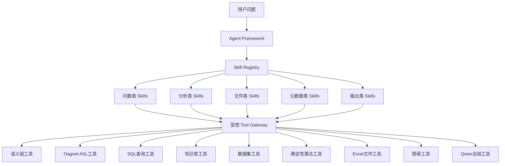

# DataAnalysis Agent Skill 与工具体系设计

> 适用项目：`E:\YouoAgent\DataAnalysis_Agent`  
> 目标：明确完整数据分析智能体需要哪些 Skill、每个 Skill 包含哪些工具，以及哪些能力不能简单封装成 Skill。  
> 更新日期：2026-08-21

## 1. 先讲清楚 Tool、Skill 和智能体框架

三者不是一回事：

| 层级 | 通俗解释 | 示例 |
|---|---|---|
| Tool | 一把具体工具，只完成一个原子动作 | 查询指标口径、生成 ASL、执行 SQL、计算同比 |
| Skill | 一套完成某类业务任务的标准流程，会组合多个 Tool | 指标查询 Skill、趋势分析 Skill、归因分析 Skill |
| Agent Framework | 决定何时使用哪个 Skill，负责记忆、追问、计划、调度、安全和兜底 | 意图识别、任务规划、状态机、可靠度门禁 |

例如用户问：

```text
分析本月销售额下降原因
```

系统不是调用一个“万能工具”，而是：

```text
智能体框架识别为归因分析
→ 调用归因分析 Skill
→ Skill 内部调用指标解析 Tool
→ 调用 Oagnet ASL Tool
→ 调用 SQL 查询 Tool
→ 调用数据质量 Tool
→ 调用贡献度分析 Tool
→ 调用知识检索 Tool
→ 调用结果校验 Tool
→ 调用 Qwen 总结 Tool
```

## 2. 总体架构



## 3. 建议建设的 Skill 清单

### 3.1 基础问数 Skills

| Skill | 功能 | 主要工具 | 当前状态 |
|---|---|---|---|
| `metric_query` | 查询一个或多个指标 | 指标解析、ASL、SQL、结果校验 | 基本具备 |
| `detail_query` | 查询订单、用户、商品等明细 | 实体解析、字段校验、ASL、SQL、脱敏 | 基本具备 |
| `ranking_query` | 查询 Top N、Bottom N | 维度解析、排序、ASL、SQL | 部分具备 |
| `metadata_definition` | 解释指标口径 | 指标定义、知识库检索 | 基本具备 |
| `data_lineage` | 查询指标来源和血缘 | 指标血缘接口 | 基本具备 |

### 3.2 数据分析 Skills

| Skill | 功能 | 主要工具 | 当前状态 |
|---|---|---|---|
| `trend_analysis` | 趋势方向、变化速度、稳定性 | 时序查询、趋势算法、图表 | 基础算法已实现 |
| `comparison_analysis` | 同比、环比、期间和对象对比 | 对比查询、变化率算法 | 基础算法已实现 |
| `composition_analysis` | 构成和占比 | 分组查询、占比算法 | 基础算法已实现 |
| `anomaly_analysis` | 识别异常点和异常区间 | 时序查询、异常检测 | 基础算法已实现 |
| `root_cause_analysis` | 分析下降或异常候选原因 | 驱动查询、贡献度、知识检索 | 基础版已实现 |
| `forecast_analysis` | 基于历史数据预测未来 | 数据适用性、回测、预测算法 | 单步基础版已实现 |
| `data_quality_analysis` | 检查缺失、重复、异常和新鲜度 | 数据质量检查工具 | 基础版已实现 |
| `report_generation` | 汇总多个分析结果形成报告 | 多任务结果、图表、Qwen总结 | 部分具备 |

### 3.3 会话与复合任务 Skills

| Skill | 功能 | 主要工具 | 当前状态 |
|---|---|---|---|
| `clarification` | 信息不足时组合追问 | 槽位检查、Redis待办状态 | 已实现 |
| `contextual_follow_up` | 基于上一问题继续追问 | 会话恢复、请求改写 | 部分具备 |
| `dataset_follow_up` | 基于上一批查询数据再计算 | dataset_id、MinIO结果快照、受控计算工具 | 部分具备（筛选、排序、TopN、聚合、选列、派生列） |
| `multi_question_analysis` | 拆分并执行多个问题 | 任务规划、DAG调度 | 规划 |
| `cross_dataset_analysis` | 多个数据集联合分析 | 数据集登记、关联校验 | 规划 |

### 3.4 文件分析 Skills

| Skill | 功能 | 主要工具 | 当前状态 |
|---|---|---|---|
| `excel_profile` | 识别Excel和各Sheet结构 | 文件读取、Sheet扫描、类型推断 | 规划 |
| `excel_query` | 对Excel进行问数 | 文件数据集、结构化查询 | 规划 |
| `excel_multi_sheet_analysis` | 多Sheet关联分析 | 关系推断、用户确认、Join | 规划 |
| `database_excel_compare` | Excel与数据库结果对比 | 双数据集查询、字段映射 | 规划 |

### 3.5 输出 Skills

| Skill | 功能 | 主要工具 | 当前状态 |
|---|---|---|---|
| `insight_generation` | 把算法事实整理成业务洞察 | 证据校验、Qwen总结 | 基本具备 |
| `chart_generation` | 生成前端图表协议 | 图表选择、ChartSpec构造 | 规划 |
| `executive_summary` | 生成管理层摘要 | 事实压缩、风险和建议模板 | 部分具备 |
| `analysis_explanation` | 展示可核验分析过程 | 分析步骤、证据引用 | 已实现基础版 |

> 运行事实说明：当前“已实现/部分具备”的查询和分析能力主要由统一 Orchestrator 与确定性 AnalysisEngine 执行，还没有全部拆成 `skills/<name>/` 形式的独立可发布包。运行时应以 `GET /v1/data-analysis/capabilities/skills` 返回的 `maturity` 和 `runtime_available` 为准；当服务仍配置为 `adapter_mode=mock` 时，查询类能力仅可演示，不能视为已经接通真实业务数据。

## 4. 完整工具清单

## 4.1 语义与指标工具

### `resolve_metric`

功能：把“销售额”“GMV”等用户说法解析成标准指标。

输入：

```json
{
  "semantic_model_id": 6,
  "metric_names": ["销售额"]
}
```

输出应包含：

- 指标 ID。
- 指标版本。
- 标准名称。
- 单位。
- 是否唯一命中。
- 歧义候选。

### `get_metric_definition`

功能：查询指标口径、公式、单位、生效时间和负责人。

### `get_metric_lineage`

功能：查询指标依赖的业务域、表、字段和上游指标。

### `normalize_entity_value`

功能：将“华东”“北京店”等输入规范成标准实体编码。

当前需要语义层团队新增或提供接口。

### `list_allowed_dimensions`

功能：查询指标允许按哪些维度拆分，防止生成不合法查询。

## 4.2 ASL 和查询工具

### `generate_asl`

提供方：Oagnet。

功能：自然语言转结构化 ASL。

必须返回：

- ASL版本。
- 实体。
- 指标。
- 维度。
- 过滤条件。
- 时间上下文。
- 排序和限制。
- 歧义列表。

### `validate_asl`

功能：按正式 Schema 检查 ASL 类型、复杂度、作用域和歧义。

该工具应在智能体内部实现，不依赖大模型自由判断。

### `translate_and_execute_query`

提供方：SQL服务。

功能：ASL转只读SQL并执行。

需要返回：

```json
{
  "success": true,
  "columns": [],
  "data": [],
  "row_count": 0,
  "snapshot_id": "",
  "data_as_of": "",
  "quality_status": "PASS",
  "data_source": {"id": "5"}
}
```

### `query_result_normalizer`

功能：统一不同查询服务的响应，检查行数、字段和快照。

### `query_guard`

功能：限制最大行数、执行时间、只读语句和敏感字段。

SQL服务必须提供底层保护，智能体再进行二次结果门禁。

## 4.3 数据集与历史结果工具

### `register_dataset`

功能：为查询结果生成 `dataset_id`，保存列、行数、快照、来源和过期时间。

### `load_dataset`

功能：用户追问时读取上一批结果。

### `transform_dataset`

功能：执行白名单操作：

- 筛选。
- 分组。
- 聚合。
- 排序。
- Top N。
- 缺失值处理。
- 字段重命名。

### `join_datasets`

功能：连接两个数据集。关联键必须由语义规则确定或由用户确认。

### `expire_dataset`

功能：删除或失效临时数据集，防止数据无限保存。

建议存储：

| 数据量 | 存储方式 |
|---|---|
| 小结果 | Redis压缩数据或内存缓存 |
| 中等结果 | MinIO/对象存储中的Parquet |
| 大结果 | 数据库结果缓存或临时表 |

## 4.4 确定性计算工具

这些工具负责得出数值，Qwen不能参与决策。

### 基础统计

- `descriptive_statistics`
- `sum_and_average`
- `growth_rate`
- `ranking`
- `group_aggregation`
- `distribution_analysis`

### 趋势和对比

- `trend_diagnostics`
- `period_comparison`
- `year_over_year`
- `month_over_month`
- `direction_consistency`
- `volatility_analysis`

### 异常

- `anomaly_detection`
- `change_point_detection`
- `outlier_explanation_candidates`

### 归因

- `dimension_contribution`
- `driver_contribution`
- `funnel_decomposition`
- `price_volume_mix`
- `reason_candidate_ranking`

归因工具必须区分：

- 已证实原因。
- 数据支持的高相关候选。
- 知识库提供的业务候选。
- 当前无法确认的原因。

### 预测

- `forecast_readiness_check`
- `time_series_frequency_check`
- `forecast_backtest`
- `forecast_model_selection`
- `forecast_one_step`
- `prediction_interval`
- `forecast_drift_monitor`

当前代码已经实现基础单步预测，后续再增加季节性、多步和多变量模型。

## 4.5 数据质量与结果校验工具

### `dataset_quality_check`

检查：

- 空值率。
- 重复率。
- 字段类型。
- 时间连续性。
- 数据新鲜度。
- 异常范围。
- 截断状态。

### `analysis_applicability_check`

判断数据是否足够执行某种算法。

例如预测至少需要：

- 指标列。
- 时间列。
- 足够历史点。
- 规则时间频率。
- 与预测粒度一致。

### `calculation_invariant_check`

检查：

- 占比之和是否合理。
- 汇总前后是否守恒。
- 同比基期是否正确。
- 是否除零。
- 单位是否一致。
- 数值是否有限。

### `evidence_grounding_check`

确保所有结论都能追溯到查询、指标、算法或知识证据。

### `llm_output_guard`

检查Qwen是否：

- 编造新数字。
- 引用未知证据。
- 把相关性写成确定因果。
- 修改算法预测值。
- 隐藏数据限制。

## 4.6 知识库工具

### `verify_metric_in_knowledge`

验证指标是否存在于当前应用绑定的知识库。

### `retrieve_analysis_context`

检索促销、节假日、业务规则和异常事件等分析背景。

### `retrieve_metric_definition_document`

返回指标口径文档及版本来源。

### `retrieve_business_event`

按照时间范围检索业务事件。知识命中只能作为候选原因，不能直接证明本次数据变化原因。

## 4.7 Excel和文件工具

### `inspect_workbook`

读取文件元数据、Sheet名称和大小，不直接进入分析。

### `profile_sheet`

识别：

- 表头位置。
- 字段名称。
- 字段类型。
- 空值率。
- 重复列。
- 合并单元格。
- 公式字段。

### `infer_sheet_relationships`

生成Sheet关联候选，但不能未经确认直接连接。

### `convert_sheet_to_dataset`

将Sheet转换为受控Parquet或临时分析表并生成 `dataset_id`。

### `file_security_scan`

检查文件大小、格式、病毒、宏、压缩炸弹和密码保护。

## 4.8 图表和输出工具

### `select_chart_type`

采用确定性规则选择图表：

| 任务 | 图表 |
|---|---|
| 趋势 | 折线图 |
| 对比 | 分组柱状图 |
| 占比 | 条形图或饼图 |
| 异常 | 带异常标记的折线图 |
| 归因 | 瀑布图或贡献度条形图 |
| 预测 | 历史+预测区间折线图 |
| 明细 | 表格 |

### `build_chart_spec`

输出前端可渲染的结构：

```json
{
  "chart_type": "LINE",
  "title": "最近12个月销售额趋势",
  "x_field": "月份",
  "y_fields": ["销售额"],
  "data": [],
  "annotations": []
}
```

### `summarize_verified_facts`

调用Qwen把已验证事实组织成自然语言。

### `build_executive_summary`

生成管理层摘要：结果、主要变化、候选原因、风险和下一步建议。

## 5. 哪些能力不应该封装成普通 Skill

以下能力属于框架基础设施，应始终执行，不能让模型决定是否调用：

| 能力 | 原因 |
|---|---|
| 身份认证和应用隔离 | 不能让模型决定是否鉴权 |
| 请求Schema校验 | 每个请求必须执行 |
| 幂等和并发控制 | 属于基础稳定性保障 |
| 会话状态CAS | 防止并发覆盖 |
| SQL只读防护 | 不能被Skill绕过 |
| 数据脱敏 | 每次明细输出都必须执行 |
| 最大行数和超时 | 属于资源保护 |
| 证据校验 | 所有结论必须经过 |
| 审计和日志 | 所有节点必须统一记录 |
| 可靠度计算 | 最终输出统一执行 |
| 安全降级 | 任意Skill失败都要进入 |

## 6. Skill 标准封装格式

每个 Skill 建议使用统一目录：

```text
skills/
└── trend_analysis/
    ├── manifest.yml
    ├── input_schema.json
    ├── output_schema.json
    ├── planner.py
    ├── executor.py
    ├── validator.py
    ├── renderer.py
    └── tests/
```

`manifest.yml` 示例：

```yaml
name: trend_analysis
version: 1.0.0
description: 分析一个指标在指定时间范围内的趋势
intents:
  - TREND_ANALYSIS
required_slots:
  - metric
  - time_range
optional_slots:
  - dimensions
tools:
  - resolve_metric
  - generate_asl
  - translate_and_execute_query
  - dataset_quality_check
  - trend_diagnostics
  - build_chart_spec
  - summarize_verified_facts
minimum_rows: 2
timeout_seconds: 30
read_only: true
supports_parallel: true
fallback_policy: safe_terminate
```

每个 Skill 必须定义：

- 能解决什么问题。
- 不能解决什么问题。
- 必填和可选参数。
- 允许调用哪些工具。
- 工具调用顺序和依赖。
- 是否允许并行。
- 数据最小要求。
- 超时、重试和降级。
- 输入输出Schema。
- 证据要求。
- 自动化测试集。

## 7. Skill 调度方式

不能让Qwen看到所有工具后自由选择。推荐流程：

```text
意图识别
→ 确定候选Skill
→ 确定性规则检查Skill是否适用
→ 检查必填参数
→ 参数不足则追问
→ 创建任务计划
→ 计划校验
→ 执行白名单工具
→ 结果校验
→ 输出
```

多Skill任务示例：

```text
用户：查询本月销售额，和上月对比，并分析下降原因

metric_query
    ↓
comparison_analysis
    ↓
root_cause_analysis
    ↓
chart_generation
    ↓
executive_summary
```

## 8. 并行调用原则

可以并行：

- 指标定义、血缘和知识库检索。
- 多个互不依赖的数据查询。
- 多个独立维度贡献计算。
- 图表数据和文本摘要的准备工作。

不能并行：

- 追问补全之前的业务查询。
- ASL生成和SQL执行。
- 数据查询和依赖该数据的算法。
- 算法结果和Qwen总结。
- 结果校验和最终对外输出。

并行调度器需要：

- 最大并发数。
- 单工具超时。
- 总任务截止时间。
- 取消传播。
- 查询去重。
- 部分成功规则。
- 并发结果合并校验。

## 9. 其他部门需要提供的工具接口

| 部门 | 需要提供 |
|---|---|
| Java后端 | 应用、语义模型、业务域、知识库和用户上下文绑定 |
| Oagnet/语义团队 | `generate_asl`、正式ASL Schema、实体值规范化 |
| SQL服务团队 | ASL转SQL、只读执行、数据源选择、快照和质量元数据 |
| 数据团队 | 指标口径、字段关系、测试数据和预期结果 |
| 知识库团队 | 指标核验、口径文档、业务事件检索 |
| 文件平台 | 文件上传、对象存储、病毒扫描和临时下载授权 |
| 运维 | Redis、MySQL、MinIO、网络、Secret、监控和告警 |
| 前端 | 追问、分析过程、可靠度、证据、表格和图表渲染 |

## 10. 建设优先级

### 第一优先级：真实问数闭环

1. `metric_query`
2. `detail_query`
3. `metadata_definition`
4. `generate_asl`
5. `validate_asl`
6. `translate_and_execute_query`
7. `dataset_quality_check`
8. `evidence_grounding_check`

### 第二优先级：完整分析闭环

1. `trend_analysis`
2. `comparison_analysis`
3. `composition_analysis`
4. `anomaly_analysis`
5. `root_cause_analysis`
6. `forecast_analysis`
7. `chart_generation`
8. `executive_summary`

### 第三优先级：复杂会话和任务

1. `register_dataset`
2. `dataset_follow_up`
3. `multi_question_analysis`
4. 任务DAG调度。
5. 工具并行执行。
6. 异步长任务。

### 第四优先级：文件和动态计算

1. `excel_profile`
2. `excel_query`
3. `excel_multi_sheet_analysis`
4. `cross_dataset_analysis`
5. 受控Python沙箱。

## 11. 当前项目已经具备与尚缺能力

当前已经有基础实现：

- 指标查询和明细查询流程。
- 规则+Qwen混合意图识别。
- 追问和Redis短期状态。
- 长期记忆治理接口。
- Oagnet ASL调用。
- SQL服务调用。
- 查询结果标准化。
- 趋势、对比、占比、异常、归因和单步预测算法。
- Qwen受控总结。
- 分析过程、证据、可靠度和安全降级。

当前最主要缺口：

- Skill注册表和统一Skill协议。
- 完整ASL Schema校验。
- 实体示例值规范化工具。
- 历史查询数据集登记和复用。
- 多问题拆分和任务DAG。
- 工具并行调度。
- 标准图表协议。
- 多Sheet Excel分析。
- 受控Python沙箱。
- 多步、季节性和多变量预测。

## 12. 最终建议

领导提出“把工具都封装成 Skill”的方向可以执行，但不应把每个接口都叫 Skill。推荐采用：

```text
原子接口和算法 = Tool
一类完整业务流程 = Skill
选择、规划、追问、安全和兜底 = Agent Framework
```

这样做的好处是：

- 每个 Skill 可以单独测试和发布。
- 工具可以被多个 Skill 复用。
- 模型不能绕过安全门禁。
- 失败位置清晰，便于监控和排查。
- 新增业务能力时不需要重写整个智能体。
- 能清楚划分各部门的接口责任。

完整智能体不应该是“一个大模型加很多随意调用的工具”，而应该是“受控框架调度标准 Skill，Skill 再组合白名单 Tool，所有结果经过确定性校验后输出”。
