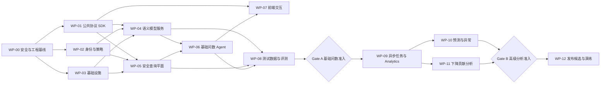

# DataAnalysis Agent 任务分工、接口与数据需求

> 文档版本：1.2  
> 对应架构：[README.md](./README.md) 1.6  
> 项目阶段：发布前设计与实施  
> 原则：P0 安全、准确性和稳定性能力未完成时，不允许通过降低可靠性或增加兜底话术绕过发布门禁。

## 1. 交付目标

交付一个能嵌入 YouoAgent 平台的企业数据分析智能体。统一主意图枚举为：

- 基础数据能力：`METRIC_QUERY`、`DETAIL_QUERY`、`TREND_ANALYSIS`、`COMPARISON_ANALYSIS`、`COMPOSITION_ANALYSIS`。
- 高级分析能力：`ANOMALY_ANALYSIS`、`ROOT_CAUSE_ANALYSIS`、`FORECAST_ANALYSIS`。
- 组合与元数据能力：`REPORT_GENERATION`、`METRIC_DEFINITION`、`DATA_LINEAGE`、`DATA_QUALITY`。
- 非数据能力：`CAPABILITY_HELP`、`CHAT`、`OUT_OF_SCOPE`。

所有意图均先完成分类、槽位和 Capability 路由；首批真正执行基础数据、元数据和受限报表能力。异常、归因和预测在 Gate A 后启用，在此之前必须明确返回“能力尚未开放”，不得伪装成普通查询。明细查询只有在独立的高风险权限、最小字段、脱敏、限行和分页门禁通过后开启。

当前代码已具备确定性 Analytics 基线，用于联调数据形状、证据链和失败门禁，不等同于 Gate B 已通过：

- 趋势：有序序列首尾变化、变化率、极值。
- 对比：仅接受明确的两行基期/对比期结果，零基期不伪造百分比。
- 占比：合计与分组份额，负值或零合计拒绝。
- 异常：至少5点的 MAD 稳健异常候选，只声明统计偏离。
- 归因：只接受维度贡献值/变化量，输出贡献候选；知识库因素保持“未验证”。
- 预测：至少6点的线性趋势基线和残差参考区间，明确要求生产模型复核。
- 报表/质量：数值描述摘要、返回结果空值与完全重复扫描。

执行器的第二轮准确性门禁：时间列必须可解析、唯一且升序；存在多个未绑定数值列时拒绝猜测；对比必须明确返回两行；重复分组先由查询层聚合；归因必须返回名称带贡献/变化/差额/影响/增量语义的列；历史全非负而线性外推为负时拒绝；拟合度较低时可靠性降级。所有这些错误都必须修正上游数据契约，不能交给大模型“理解”行顺序。

算法工程师仍需提供生产级版本化工具契约：`model_name/model_version/training_window/feature_version/forecast_horizon/prediction_interval/backtest_metrics/drift_status`；归因需提供 `baseline/current/dimension/contribution/contribution_rate/residual`；异常需提供 `method/threshold/seasonality/anomaly_score/is_anomaly`。Java 查询服务需返回明确的时间排序和基期角色，不能只给无语义顺序的行数组。

## 2. 团队角色

项目按现有四类研发人员分工，不假设另有独立 Python 后端、安全或 QA 团队。业务指标负责人仍必须由业务方指定，其职责不能由研发自行替代。

| 角色代号 | 现有团队 | 主要责任 | 不负责的边界 |
|---|---|---|---|
| `JAVA` | Java 后端 | 网关身份、租户与 Policy、语义模型管理接口、Oagnet 服务化改造、安全 Query Plane、Redis 会话、MinIO 对象、任务队列、审计、公共协议和 Agent 服务集成 | 不决定指标业务口径；不允许把任意 SQL 执行入口暴露给 Agent |
| `ALGO` | 算法工程师 | DataAnalysis Agent、意图与槽位、Typed Task DAG、QuerySpec 规划、Evidence/可靠性、趋势/异常/预测/归因算法、金标评测和模型回测 | 不持有生产数据库凭据；不在 Python/LLM 中自行实施最终权限判断或执行自由 SQL |
| `FE` | 前端 | 对话与 SSE、追问、任务状态、表格/图表、口径/证据/可靠性展示、分页、取消、错误恢复和前端安全 | 不自行拼接 SQL，不缓存未授权明细，不根据前端状态代替后端权限判断 |
| `OPS` | 运维 | 环境、容器、网关、工作负载身份、Secret、Redis/MinIO/Milvus/队列、网络策略、监控告警、备份恢复、容量、漏洞扫描和发布回滚 | 不接触业务明文数据做日常排障；不绕过审批直接修改指标或权限策略 |
| `BIZ` | 业务指标负责人（业务方指定） | 首批指标、口径、默认比较规则、质量阈值、驱动树、报表模板、样例问题和答案验收 | 不直接修改生产代码、SQL Guard 或发布配置 |

测试职责嵌入各团队：Java 后端负责契约、权限、SQL 安全和集成测试；算法工程师负责意图、数值、模型和评测集；前端负责交互与兼容测试；运维负责性能、故障注入、灾备和安全扫描。Gate A/B/C 由四个研发角色加业务负责人共同签字。涉及安全策略、指标口径和发布审批时至少双人复核，不能由同一实现者独立完成。

## 3. 总体任务依赖图



## 4. 工作包分工

### WP-00 安全与工程基线（P0）

负责人：`OPS + JAVA`；协作：`ALGO + FE`。

任务：

- 删除并轮换仓库、默认参数、测试脚本、README、Compose 中出现过的密钥。
- CI 增加 Secret Scan、SAST、依赖漏洞、许可证、SBOM 和镜像扫描。
- 建立独立开发/测试环境；禁止使用生产数据和生产账号。
- 配置内部 DNS、Secret Manager、TLS、CORS 白名单、出站网络策略。
- 禁止运行时 `print()` 输出密钥、Prompt、SQL、历史和工具结果。
- 清除非必要 `network_mode: host`、`privileged` 和 root 运行方式。
- 生成各子项目 lock 文件，禁止将不同依赖环境合并运行。

输入：代码仓库、环境清单、现有凭据清单、部署方式。  
输出：安全基线报告、轮换记录、CI Pipeline、基础镜像规范。  
完成标准：Secret Scan 为零；受控测试 Secret 可轮换；所有服务镜像可重复构建。

### WP-01 公共协议 `youo-agent-sdk`（P0）

负责人：`JAVA + ALGO`；协作：`FE + OPS`。

任务：

- 定义 Trace、Identity、Error、SSE Event、Pagination、Object Reference 契约。
- 使用 Pydantic `extra=forbid`，生成 JSON Schema/OpenAPI。
- 建立 Consumer-driven Contract Test。
- New_Agent 与 DataAnalysis Agent 依赖发布后的 SDK，不跨目录 import。

输出接口对象：

- `TrustedIdentityContext`
- `TraceContext`
- `SSEEnvelope`
- `ServiceError`
- `ObjectRef`
- `PageToken`
- `CapabilityDescriptor`

完成标准：前端、New_Agent、Oagnet、NL2SQL 和 DataAnalysis 的 CI 均通过同一契约测试。

### WP-02 身份、租户与 Policy Engine（P0）

负责人：`JAVA`；协作：`OPS + ALGO`。

任务：

- 网关认证并产生可信租户、用户、应用、角色和数据域 Claim。
- 建设指标域、实体、维度、行、列、脱敏和最小群体策略。
- 提供策略版本、决策 ID、解释码和缓存失效事件。
- 所有下游验证工作负载身份，Body 中身份字段只作显示信息或直接拒绝。

必需接口：见 6.2。  
必需数据：租户、用户、角色、组织、数据域、策略矩阵、敏感字段分类。  
完成标准：跨租户、伪造 session、伪造 rows_ref、指标枚举和连续差分攻击测试通过。

### WP-03 平台基础设施（P0）

负责人：`OPS`；协作：`JAVA + ALGO`。

任务：

- Redis：会话状态、CAS、事件日志、分布式锁、Job 状态。
- MinIO：Evidence、结果分页、文件对象，租户隔离和 TTL。
- Milvus：语义模型索引与业务知识库使用隔离的 database/collection；当前用户长期偏好以 MySQL 为权威，不混入 Milvus。
- 队列：异步 Job、租约、heartbeat、fencing、死信和背压。
- 可观测性：Trace、Metric、Log、Audit Outbox。

完成标准：故障切换、备份恢复、租户隔离、对象过期、队列过载和断线续传测试通过。

### WP-04 Oagnet Semantic Model Service（P0）

负责人：`JAVA`；协作：`ALGO + BIZ + OPS`。

任务：

- 扩展现有 `semantic_model_*`，不新建平行指标主数据。
- 补齐版本、状态、审批、有效期、权限、依赖、可加性、时间、SCD、币种、精度、去重、关系基数和质量规则。
- 删除启动自动重建，改为异步索引 Job 和 Milvus alias 原子切换。
- 将自由文本 DSL 改为结构化 `SemanticResolution/CompiledQuerySpec`。
- 指标向量召回后必须回查 MySQL 主键和有效版本。

必需接口：见 6.3。  
必需数据：见 7.1、7.2。  
完成标准：零命中、多命中、越权、索引陈旧、版本冲突、公式循环和维度不兼容测试通过。

### WP-05 安全查询平面（P0）

负责人：`JAVA`；协作：`ALGO + OPS + BIZ`。

任务：

- 按 `generate → guard → execute` 重构现有 NL2SQL。
- SQL Generator 无数据库执行权限。
- AST Guard 执行表列函数白名单、参数化、权限注入、成本和一致性校验。
- Executor 只接受签名 `approved_query_id`，不接受 SQL 文本。
- 接入只读账号、数据库资源组、statement timeout、分页和 MinIO。
- 删除客户端 DB/LLM 凭据、直接 Q→SQL 执行、全库 Schema 枚举、样例数据和无界 `fetchall()`。

必需接口：见 6.4。  
必需数据：Data Source Registry、Schema Snapshot、只读凭据、成本规则。  
完成标准：所有 SQL 对抗用例、越权、超时、取消、快照和对账测试通过。

### WP-06 基础问数 Agent（P0）

负责人：`ALGO`；协作：`JAVA + BIZ + OPS`。

任务：

- 实现专用 LangGraph 和节点状态所有权。
- 实现意图、槽位、历史重写、追问和待处理状态。
- 实现三层分类契约：主业务意图、分析算子、会话控制类型；禁止把排行、过滤、追问回复注册为主意图。
- 实现 Oagnet、Policy、Query、Knowledge Adapter。
- 实现 Typed Task DAG、Evidence Bundle、Claim-Evidence Check。
- 为 `DETAIL_QUERY` 实现独立高风险路径：查询目的、字段白名单、行列策略、脱敏、强制分页、最大范围和禁止默认导出。
- 为 `DATA_LINEAGE` 实现业务血缘/物理血缘分级授权与敏感对象裁剪。
- 为 `REPORT_GENERATION` 实现已发布模板注册表、子任务 DAG、章节级失败隔离、跨章节同一快照和整报证据校验。
- 实现可靠性等级、三层兜底和 Grounded Answer Composer。
- 不接入 Shell、任意 Python、客户端动态工具或未经用户确认就自动生效的长期记忆。

完成标准：全部主意图均可稳定分类并正确执行、追问、拒绝或报告未开放；首批启用意图达到 Gate A 指标；回答中的所有数字、指标和重要结论均可追溯。

### WP-07 前端与交互（P0）

负责人：`FE`；协作：`JAVA + ALGO + BIZ`。

任务：

- 实现 `/v1` SSE Envelope、Last-Event-ID、心跳、断线恢复和取消。
- 展示追问缺失项、指标候选与口径差异。
- 区分事实、预测、关联线索和假设。
- 展示数据截止时间、指标版本、降级原因、可靠性等级和追踪号。
- 不展示思维链、SQL、内部表名、服务地址、工具参数和堆栈。

完成标准：重复事件、乱序事件、断线、重连、过期 Turn 和终态唯一测试通过。

### WP-08 测试数据、金标集与评测（P0）

负责人：`ALGO + BIZ`；协作：`JAVA + FE + OPS`。

任务：

- 建设销售域最小测试库、语义模型、权限矩阵和质量异常样本。
- 建设自然语言→意图/槽位/指标/QuerySpec/期望数值/期望回答要点金标集。
- 建设 SQL 对抗、Prompt Injection、并发、回补、Schema Drift 和故障注入集。
- RAG 评测可参考 `rag_as`，但在线链路不依赖评测服务。

完成标准：测试集版本化、可重复初始化、无真实个人数据，覆盖第 8 节规模要求。

### WP-09 异步任务框架（P1）

负责人：`JAVA + OPS`；协作：`ALGO + FE`。

任务：Job API、队列、公平调度、租约、fencing、取消、deadline、重试、死信和清理。

完成标准：Worker 崩溃、重复投递、网络分区、超时和取消不会产生重复有效结果或资源泄漏。

### WP-10 预测与异常检测（P1）

负责人：`ALGO`；协作：`JAVA + BIZ + OPS`。

任务：数据充分性、预处理、Seasonal Naive、ETS/ARIMA、滚动回测、区间校准、漂移和层级调和。

完成标准：无时间泄漏；复杂模型未稳定优于基线时自动使用基线；数据不足时不输出伪预测。

### WP-11 下降贡献分析（P1）

负责人：`ALGO + BIZ`；协作：`JAVA + OPS`。

任务：指标依赖图、价格×销量、漏斗、结构效应、交互项、可加总、多重比较、辛普森悖论和候选线索分级。

完成标准：贡献可对账；数据不足时只确认下降并列出缺失驱动数据，不宣称根因。

### WP-12 发布候选与演练（P0 Gate）

负责人：`JAVA + ALGO + FE + OPS + BIZ`。

任务：端到端验收、压测、混沌、渗透、权限、灾备、Runbook 和最终业务签字。

完成标准：第 9 节所有 Gate 通过；任何 P0 未完成则延期发布。

## 5. RACI 总表

`A` 最终负责，`R` 实施，`C` 协作评审，`I` 知会。

| 工作域 | JAVA | ALGO | FE | OPS | BIZ |
|---|---|---|---|---|---|
| 公共协议与错误模型 | A/R | R | C | C | I |
| 身份、租户与权限 | A/R | C | I | R | C |
| 语义模型与知识索引 | A/R | R | I | C | R |
| 安全查询平面 | A/R | C | I | R | C |
| Agent 编排与可靠性 | C | A/R | I | C | C |
| 前端交互 | C | C | A/R | I | C |
| Redis/MinIO/Milvus/队列 | R | C | I | A/R | I |
| 趋势、异常、预测、归因 | C | A/R | I | C | R |
| 契约与集成测试 | A/R | R | R | C | C |
| 性能、故障与灾备测试 | C | C | C | A/R | I |
| 业务金标与答案验收 | C | R | C | I | A/R |
| 发布准入 | A | A | A | A | A |

## 6. 接口需求清单

所有接口必须经过网关或内部工作负载身份认证，包含 `schema_version/trace_id`，超时、错误和幂等遵循公共 SDK。

### 6.1 DataAnalysis Agent 对外接口

| 方法与路径 | 用途 | 主要输入 | 主要输出 | Owner |
|---|---|---|---|---|
| `POST /v1/data-analysis/chat` | 新问题/补充槽位 | `message_id, conversation_id, question, timezone` | JSON 或版本化 SSE Stream | ALGO；JAVA 负责网关集成 |
| `GET /v1/data-analysis/conversations/{id}` | 恢复会话摘要 | `conversation_id` | 当前 Turn、待补槽位、权限过滤后的历史摘要 | JAVA + ALGO |
| `POST /v1/data-analysis/turns/{id}/cancel` | 取消同步/异步 Turn | `turn_id, reason` | 取消状态 | JAVA + ALGO |
| `POST /v1/data-analysis/jobs` | 提交高级分析 | Canonical Request Ref | `job_id/status` | JAVA + ALGO |
| `GET /v1/data-analysis/jobs/{id}` | 查询任务 | `job_id` | 状态、进度、结果引用 | JAVA |
| `GET /v1/data-analysis/jobs/{id}/events` | 任务事件续传 | `Last-Event-ID` | SSE Stream | JAVA + FE |
| `POST /v1/data-analysis/jobs/{id}/cancel` | 取消 Job | `job_id` | `CANCEL_REQUESTED/CANCELLED` | JAVA |
| `DELETE /v1/data-analysis/jobs/{id}/result` | 提前删除结果 | `job_id` | 删除状态；保留强制审计摘要 | JAVA + OPS |
| `GET /live`、`GET /ready` | 健康检查 | 无 | 进程/依赖 Capability | ALGO + OPS |

### 6.2 Identity 与 Policy 接口

| 方法与路径 | 输入 | 输出 |
|---|---|---|
| `POST /v1/policy/visible-semantic-scopes` | Trusted Identity | 可见 `project/semantic_model/business_domain` ID |
| `POST /v1/policy/evaluate-query` | 身份、MetricSpec、维度、过滤、目的 | `allow/deny`、强制过滤、脱敏、预算、`policy_decision_id` |
| `POST /v1/policy/evaluate-object` | 身份、Object Ref、操作 | 对 MinIO/Milvus/会话对象的访问决策 |
| `GET /v1/policy/versions/{id}` | 策略版本 | 状态、内容哈希、生效时间 |

### 6.3 Oagnet Semantic Model 接口

| 方法与路径 | 输入 | 输出 |
|---|---|---|
| `POST /v1/semantic/resolve` | 问题片段、可见 Scope、as-of、语言 | 指标/维度/实体候选、匹配分、主键、版本、歧义原因 |
| `POST /v1/semantic/validate` | Canonical Request | 有效 MetricSpec、DimensionSpec、缺失/冲突列表 |
| `POST /v1/semantic/compile` | 已验证请求、策略上下文 | QuerySpec，不包含物理 SQL |
| `GET /v1/semantic/metrics/{id}/versions/{v}` | 指标版本 | 公式、单位、时间、可加性、依赖、质量和血缘 |
| `GET /v1/semantic/lineage/{object_type}/{id}` | 授权范围、血缘层级、as-of | 已裁剪的业务/物理血缘图、版本和证据引用 |
| `GET /v1/semantic/report-templates` | 授权范围、用途 | 可用模板、版本、必填槽位和输出格式 |
| `GET /v1/semantic/report-templates/{id}/versions/{v}` | 模板版本 | 章节、Typed Task 模板、依赖、预算和渲染策略 |
| `POST /v1/semantic/index-jobs` | 语义模型版本 | `index_job_id` |
| `GET /v1/semantic/index-jobs/{id}` | Job ID | 构建、校验、alias 切换状态 |
| `GET /v1/semantic/versions/{version}/status` | 语义模型版本 | MySQL 发布版本、Milvus 索引版本及一致性状态 |
| `GET /v1/semantic/capabilities` | 无 | Schema 版本、Embedding/索引版本、支持能力 |

### 6.4 Query Plane 接口

| 方法与路径 | 输入 | 输出 |
|---|---|---|
| `POST /v1/query/generate` | QuerySpec、Data Source ID、方言 | SQL Candidate Ref、参数、生成元数据；绝不执行 |
| `POST /v1/query/guard` | Candidate Ref、Policy Decision ID、预算 | `approved_query_id` 或结构化拒绝原因 |
| `POST /v1/query/execute` | 签名 Approved Query ID、Snapshot 要求 | Dataset Ref、Schema、行数、水位、快照、质量元数据 |
| `POST /v1/query/cancel` | Query ID | 取消状态 |
| `GET /v1/query/{id}/status` | Query ID | 状态、耗时、资源、结果引用 |
| `GET /v1/query/capabilities` | Data Source ID | 方言、快照、一致性、分页、成本能力 |

### 6.5 Knowledge、Object 与 Analytics 接口

| 方法与路径 | 用途 | 输入 | 输出 |
|---|---|---|---|
| `POST /v1/knowledge/search` | 指标文档补充检索 | Query、授权 KB ID、filters | 带来源和分数的文档片段 | JAVA；ALGO 定义检索契约 |
| `POST /v1/objects` | 写入证据/数据集 | 租户、分类、Schema、流 | 不透明 Object Ref、Checksum、TTL | JAVA + OPS |
| `GET /v1/objects/{id}` | 受权流式读取 | Object ID、范围 | Stream | JAVA + OPS |
| `POST /v1/analytics/forecast` | 预测 Job | Dataset Ref、MetricSpec、Horizon | Artifact Ref、回测、区间、诊断 | ALGO；JAVA 提供 Job 外壳 |
| `POST /v1/analytics/anomaly` | 异常检测 Job | Dataset Ref、MetricSpec、基线配置 | 异常点、分数、阈值、质量排除项 | ALGO；JAVA 提供 Job 外壳 |
| `POST /v1/analytics/root-cause` | 贡献分析 | 目标与驱动 Dataset Ref、Dependency Graph | 贡献、关联线索、缺失数据 | ALGO；JAVA 提供 Job 外壳 |
| `POST /v1/chart/render` | 图表呈现 | 限行展示数据、图表规格 | 受控 Chart Ref | JAVA + FE |

### 6.6 接口交付责任与验收

| 接口域 | 提供方 | 主要调用方 | 必须先提供的数据/配置 | 联调完成标准 |
|---|---|---|---|---|
| 网关身份上下文 | JAVA + OPS | ALGO、JAVA 服务 | Token/Claim、租户、用户、角色、组织和数据域映射 | 客户端伪造同名 Header 无效；跨租户测试全部拒绝；可通过 `trace_id` 审计 |
| Policy Engine | JAVA | ALGO、Query Plane、Object Service | 指标/实体/字段权限、行过滤、脱敏、预算和策略版本 | 同一策略在解析前、执行前、对象读取前结果一致；拒绝原因结构化且不泄漏对象信息 |
| Semantic/Oagnet | JAVA | ALGO | `semantic_model_*`、发布版本、别名、维度、实体、关系和血缘 | 唯一命中返回主键+版本；零/多命中可解释；越权指标不可召回；MySQL 为最终事实源 |
| Query Generate | JAVA | ALGO | QuerySpec Schema、数据源注册、方言、批准的 Schema Snapshot | 只返回 Candidate Ref 和参数，不执行、不返回凭据、不接受自由数据库连接 |
| SQL Guard | JAVA | Query Executor | AST 白名单、策略决策、扫描预算、超时、行数和函数规则 | 写操作、注释逃逸、系统库、越权表列和资源攻击测试全部拦截 |
| Query Execute | JAVA | ALGO、异步 Job | 签名 Approved Query、只读账号、资源组、快照/水位 | 只接受 `approved_query_id`；支持取消、超时、分页；返回 Dataset Ref、Schema、质量和快照 |
| Knowledge Search | JAVA | ALGO | 知识库 ID、文档标签、版本、租户/业务域过滤 | 返回来源、章节/页码、版本和分数；检索结果不能替代 MySQL 指标存在性校验 |
| Session/Idempotency | JAVA + OPS | ALGO、FE | Redis 命名空间、TTL、CAS、消息幂等规则 | 多实例不丢追问状态；重复 `message_id` 不重复查询；乱序更新被拒绝 |
| Object/Evidence | JAVA + OPS | ALGO、FE | MinIO Bucket、对象分类、TTL、加密和访问策略 | 对象引用不可猜测；跨租户读取拒绝；过期删除但保留规定的审计摘要 |
| Analytics Job | ALGO + JAVA | ALGO、FE | 历史序列、业务日历、模型配置、队列和结果存储 | 有回测、区间、诊断、取消和失败状态；数据不足时拒绝预测而不是输出点估计 |
| SSE/Job 状态 | JAVA + ALGO | FE | 版本化事件模型、Event ID、重连和终态规则 | 断线续传不丢终态；重复事件前端幂等；取消与超时最终状态一致 |
| 监控与审计 | OPS + JAVA | 全部团队 | 指标、日志、Trace、审计字段、告警阈值和保留期 | 不记录 Prompt/明细/密钥原文；依赖故障、越权、慢查询和积压均可告警 |

## 7. 数据需求清单

### 7.1 语义模型数据

由 `BIZ` 确认业务口径，`JAVA` 负责 MySQL 数据结构和管理接口，`ALGO` 负责消费契约与校验：

- 至少一个 `project_id/semantic_model_id/business_domain_id`。
- 10～20 个首批指标：销售额、订单量、销量、客户数、客单价、退款额、退款率等。
- 每个指标的标准名、编码、别名、描述、负责人、版本、有效期和审批状态。
- 公式、分子分母、过滤条件、事实粒度、去重键和状态口径。
- 单位、币种、精度、舍入、可加性和允许聚合维度。
- 时间字段、时区、自然/财务日历、刷新频率和闭账规则。
- 允许维度、实体关系、Join Key、Join Cardinality 和 SCD 策略。
- 指标依赖、驱动方向、数据质量规则和物理血缘。
- 明细实体的允许用途、字段分类分级、默认最小字段集、分页上限、脱敏和禁止导出策略。
- 报表模板 ID/版本、适用业务域、章节 Typed Task、必填槽位、快照要求、预算、输出格式和审批状态。

### 7.2 业务测试数据

由 `JAVA + BIZ` 提供脱敏或合成数据，`OPS` 提供隔离测试环境，`ALGO` 提供覆盖要求：

- 建议 12～24 个月日粒度销售数据，至少覆盖完整周/月/节假日周期。
- 订单、订单项、商品、客户、门店/区域、渠道、促销、退款、库存等必要表。
- 正常、取消、退款、测试、软删除等状态样本。
- 一对多 Join、重复记录、Null、零分母、极值、迟到和回补样本。
- 多币种、汇率、闰年、月末、财月、SCD 变更样本。
- 至少两个租户、三个角色、行列权限和敏感字段样本。
- 固定 Snapshot/ETL Batch 和可复算期望结果。

若无法提供某类驱动数据，对应归因能力必须标记不可用，不能用模型猜测补齐。

### 7.3 权限与治理数据

- 租户、应用、用户、角色、组织和数据域映射。
- 指标/实体/维度可见权限。
- 行过滤、列过滤、掩码、最小群体和查询预算策略。
- 数据分类分级、保留期限、删除和审计策略。
- Data Source、Model、Tool、Knowledge Base Registry 数据。

### 7.4 预测与归因数据

- 历史目标指标及训练时真实可获得时间 `available_time`。
- 节假日、促销、价格、库存等外生变量及未来是否已知标记。
- 指标依赖图和可验证驱动指标。
- 预测/归因业务容忍误差、最短历史、最大 Horizon 和最小样本量。
- 已知异常、活动和结构变化标签，用于回测与解释验证。

### 7.5 金标评测数据

每条至少包含：

```json
{
  "case_id": "sales-compare-001",
  "question": "本月销售额环比增长率是多少",
  "conversation_history": [],
  "identity_case": "tenant_a_region_east_analyst",
  "expected_intent": "COMPARISON_ANALYSIS",
  "expected_slots": {},
  "expected_metric_ids": ["sales_amount"],
  "expected_query_spec": {},
  "snapshot_id": "fixture-v1",
  "expected_value": "0.1250",
  "expected_value_status": "VALID",
  "expected_answer_facts": [],
  "forbidden_claims": [],
  "expected_policy": "ALLOW"
}
```

## 8. 最小测试规模

| 测试集 | 首次 Gate A 最低规模 |
|---|---:|
| 意图识别 | 每个主意图 ≥ 50 条，另含 150 条近邻混淆、多意图、会话控制和能力外问题 |
| 槽位与追问 | ≥ 200 条，覆盖缺一个/多个槽位、修改原问题和新问题打断 |
| 指标解析 | 每个指标 ≥ 20 种表达，包含别名冲突和零命中 |
| QuerySpec/数值 | ≥ 300 条可复算金标 |
| 权限 | ≥ 150 条允许/拒绝/脱敏/跨租户用例 |
| SQL 安全 | ≥ 200 条攻击与资源消耗用例 |
| 并发恢复 | ≥ 100 个会话场景，包含重复、乱序、断线和取消 |
| 数据质量 | ≥ 100 条迟到、回补、Null、重复、部分刷新用例 |
| 预测（Gate B） | 每种频率/模式 ≥ 30 条回测序列 |
| 归因（Gate B） | ≥ 50 个可加总合成场景和 30 个证据不足场景 |

数量是最低值，不等于覆盖完成；高风险边界应优先于追求总数。

## 9. 发布门禁

### Gate A：基础问数

- 无指标定义的数值回答率为 0。
- 越权数据泄露为 0。
- 非法 SQL 阻断率 100%。
- 金标数值精确匹配率达到业务确认目标；金额和比率不得使用模糊语义评分替代精确比对。
- 指标解析、意图和槽位指标达到双方确认阈值，并按业务域分层报告。
- 所有答案数字和重要结论 Evidence 覆盖率 100%。
- 并发、断线、取消、依赖故障和恢复测试通过。
- P95、错误预算、资源上限达到架构文档 SLO。

### Gate B：高级分析

- 预测无时间泄漏，区间覆盖率和基线提升达到算法与业务共同阈值。
- 复杂模型失败时基线降级可用，数据不足时不输出预测值。
- 下降贡献可加总，交互项明确，辛普森悖论和多重比较防护通过。
- 证据不足场景不使用“根因已确认”措辞。

### Gate C：发布候选

- Secret/SAST/依赖/镜像/渗透无未豁免 P0/P1。
- 压测、混沌、备份恢复和 RPO/RTO 演练通过。
- 告警、Runbook、Owner、值班和容量计划齐全。
- OpenAPI、Migration、指标、策略、模型、Prompt 和镜像版本冻结并可回滚。

## 10. 当前需要平台/业务方提供的信息

以下信息不阻塞架构设计，但会阻塞实现或验收：

| 编号 | 必需内容 | 负责提供/确认 | 交付物 | 阻塞能力 |
|---|---|---|---|---|
| I-01 | 首个试点业务域、项目和语义模型 | BIZ + JAVA | `project_id/semantic_model_id/business_domain_id`、负责人和测试 Scope | 全部真实查询 |
| I-02 | 首批 10～20 个指标正式口径 | BIZ；JAVA 落库；ALGO 校验 | 指标清单、公式、单位、时间口径、默认比较、版本和审批状态 | 指标查询、解释、比较、预测 |
| I-03 | 测试数据库与只读接入 | JAVA + OPS | 数据库类型/版本、Schema Snapshot、Data Source ID、只读 Secret Ref、网络策略 | Query Plane |
| I-04 | 现有 NL2SQL 处置决策 | JAVA + ALGO | 删除弱入口并按 generate/guard/execute 重构的技术决策记录 | 真实 SQL 执行 |
| I-05 | 身份与权限来源 | JAVA + OPS | Token/Claim Schema、租户/用户/角色/组织/数据域映射、Header 覆盖规则 | 所有受控数据能力 |
| I-06 | Redis/MinIO/Milvus/队列环境 | OPS | 服务地址、命名空间、配额、TLS、Secret Ref、备份和保留策略 | 多实例、证据、索引、异步任务 |
| I-07 | 模型 Profile 与配额 | ALGO + OPS | LLM/Embedding/Rerank 名称、版本、Endpoint Ref、超时、QPS、Token 预算 | 语义解析和知识检索 |
| I-08 | 指标知识库 | BIZ + JAVA | KB ID、文档来源、标签、版本、有效期、更新和删除责任人 | 口径辅助核验 |
| I-09 | 前端 SSE 基础能力 | FE + JAVA | 现有组件评估、TypeScript Schema、重连/幂等方案 | 流式交互和异步任务 |
| I-10 | 预测验收标准 | BIZ + ALGO | 频率、Horizon、误差阈值、最短历史、区间覆盖率、外生变量可用性 | 预测 Gate B |
| I-11 | 归因驱动数据 | BIZ + ALGO + JAVA | 驱动指标、依赖图、可加总公式、数据覆盖和证据等级 | 归因 Gate B |
| I-12 | 合规与安全规则 | JAVA + OPS + BIZ | 分类分级、保留期、审计期、模型出境/外发规则、敏感字段清单 | 发布 Gate C |
| I-13 | 数据质量与水位 | JAVA + BIZ | 刷新任务、批次、水位、闭账、完整性/对账规则和事故状态 | 准确回答和质量意图 |
| I-14 | 明细查询策略 | JAVA + BIZ | 实体用途、字段白名单、脱敏、最大区间、分页、总行数和下载策略 | `DETAIL_QUERY` |
| I-15 | 报表模板 | BIZ + FE + ALGO | 模板 ID/版本、章节、指标、图表、输出格式和审批状态 | `REPORT_GENERATION` |

所有 Secret 只交付 Secret Reference，不在文档、代码、工单、日志或聊天中传递明文。上述信息由对应负责人在项目看板登记状态、版本、负责人和预计交付迭代。

## 11. 建议迭代节奏

不在信息不全时承诺固定日期，按依赖完成度推进：

1. Iteration 0：WP-00、WP-01、测试环境和金标模板。
2. Iteration 1：WP-02、WP-03、WP-04 的最小销售域。
3. Iteration 2：WP-05 安全查询平面和对抗测试。
4. Iteration 3：WP-06、WP-07、WP-08，完成 Gate A。
5. Iteration 4：WP-09、WP-10，完成预测能力。
6. Iteration 5：WP-11，完成下降贡献分析。
7. Iteration 6：WP-12，完成 Gate C。

每个 Iteration 必须产生可运行、可测试、可回滚的纵向切片；不得用“Prompt 已完成”代替接口、数据、权限和测试闭环。

## 12. 长短期记忆专项分工（2026-08-20 更新）

当前不需要新增服务端口。数据分析 Agent 继续使用自身 HTTP 端口；内部复用 Redis、MySQL 和知识库 `7873`。Milvus 知识库只保存业务文档与用户上传文件，不保存个人聊天记忆。

| 团队 | 已完成 | 接下来必须提供/完成 |
|---|---|---|
| Java 后端 | 平台已有应用与知识库绑定关系 | 在聊天 DTO 增加稳定 `application_id`、`history`、`use_longterm_memory`；网关注入 `X-Application-Id` 并校验 Body；从聊天库按旧到新提供最近 20 条历史；代理长期记忆管理接口给前端 |
| 前端 | 可继续使用现有聊天入口 | 每次请求传 `application_id/conversation_id/message_id`；展示“待确认偏好”，由用户明确确认；提供“我的记忆”列表和删除按钮；不能把模型提取候选直接当作已确认值 |
| 运维 | 现有 Redis、MySQL 和知识库服务可连通 | 执行并登记 `migrations/001`、`002`；为表做备份/恢复；监控 Redis TTL/内存、MySQL 连接/慢查询/锁等待；生产启用 `DATA_AGENT_REQUIRE_TRUSTED_APPLICATION_HEADER=true`；Secret 仅从 Secret Manager 注入 |
| 算法工程师 | Redis 短期状态、history 冷恢复、MySQL 长期偏好读取及可靠降级已实现 | 建立偏好提取金标集；提取器只产 `candidate`；维护允许的结构化键和值 Schema；验证“当前问题覆盖默认偏好”、跨租户/用户/应用隔离和长期记忆故障降级 |

Java 调用聊天接口需要的数据：

```json
{
  "application_id": "APP_SALES",
  "conversation_id": "C1001",
  "message_id": "M1003",
  "question": "那华东呢？",
  "semantic_model_id": 8,
  "business_domain_id": 13,
  "knowledge_base_names": ["KB_APP_SALES"],
  "use_longterm_memory": true,
  "history": [
    {
      "role": "user",
      "content": "查询本月销售额",
      "message_id": "M1001",
      "created_at": "2026-08-20T10:00:00+08:00"
    },
    {
      "role": "assistant",
      "content": "本月销售额为 128 万元",
      "message_id": "M1002",
      "created_at": "2026-08-20T10:00:05+08:00"
    }
  ]
}
```

约束：`history` 最多 20 条、从旧到新、`message_id` 唯一、时间必须带时区，并且不能包含当前消息。`history` 是 Redis 过期后的恢复材料，不会无条件拼进提示词。

长期记忆接口及责任：

| 接口 | 用途 | 调用方 |
|---|---|---|
| `POST /v1/data-analysis/memory/candidates` | 保存待确认结构化偏好；相同来源消息和逻辑键重试幂等 | Java/算法提取器 |
| `POST /v1/data-analysis/memory/{id}/confirm?application_id=...` | 用户确认后激活，同逻辑键旧值自动替代 | 前端经 Java |
| `GET /v1/data-analysis/memory?application_id=...&status=active` | 展示当前用户在当前应用的有效记忆 | 前端经 Java |
| `DELETE /v1/data-analysis/memory/{id}?application_id=...` | 用户撤销，软删除后立即停止召回 | 前端经 Java |
| `GET /ready` | 检查 Redis 短期记忆和 MySQL 长期记忆是否可用 | 运维/Kubernetes |

长期记忆只允许结构化偏好或业务术语，例如 `default_metric`、`default_time_period`、`default_dimension`、`default_comparison`、`default_unit`、`metric_alias:*`。禁止写入原始问题、聊天全文、SQL、查询结果行、预测结果或未经用户确认的模型结论。

## 13. 四类研发人员开工清单

### 13.1 Java 后端

- [ ] 发布 OpenAPI/JSON Schema：Trusted Identity、Canonical Request、QuerySpec、Policy Decision、Dataset、Evidence、Error、SSE Event。
- [ ] 网关删除客户端伪造的身份 Header，注入签名工作负载身份和 `trace_id`。
- [ ] 实现 Policy 三个接口及策略版本查询，覆盖租户、业务域、指标、实体、行、列、脱敏、预算和对象权限。
- [ ] 将 Oagnet 包装为受控 Semantic Service；候选召回后必须回查已发布 MySQL 主键和版本。
- [ ] 把 NL2SQL 拆成 Generate、AST Guard、Execute；生成器没有数据库凭据，Executor 不接受 SQL 文本。
- [ ] 建设 Data Source Registry、Schema Snapshot、只读账号、查询超时、资源组、分页、取消和审计。
- [ ] 建设 Redis 会话 CAS/TTL/message_id 幂等、MinIO Evidence、异步 Job 和结果清理。
- [ ] 提供 Knowledge Search、数据质量/水位、业务日历、血缘和报表模板接口。
- [ ] 完成契约、权限、SQL 对抗、跨租户、并发、快照一致性和恢复测试。

### 13.2 算法工程师

- [ ] 维护主意图、分析算子、会话控制类型及每类槽位 Schema，建立近邻混淆和多轮评测集。
- [ ] 将当前规则分类器升级为“确定性规则 + 结构化模型分类”，模型输出严格 Schema 校验且低置信度追问。
- [ ] 实现真实 HTTP Adapter、超时、有限重试、熔断、Capability Handshake；不得直接访问生产数据库。
- [ ] 实现 Metric/Detail/Trend/Comparison/Composition/Quality Typed Task 与确定性计算器。
- [ ] 实现 Claim-Evidence 映射、指标知识双检索、可靠性硬门禁和有限/失败回答。
- [ ] 建立预测 Seasonal Naive 基线、回测选模、预测区间和数据不足拒绝规则。
- [ ] 建立异常检测的数据质量排除、基线选择、阈值校准和误报评测。
- [ ] 建立归因贡献拆解，区分数学贡献、关联线索和未验证假设，禁止因果幻觉。
- [ ] 与 BIZ 建立数值金标、禁止断言和业务验收集，按指标/意图/业务域分层报告。

### 13.3 前端

- [ ] 接入版本化 SSE，支持 Event ID、断线续传、重复事件幂等、取消和最终状态收敛。
- [ ] 展示待补槽位并允许逐项补充、修改、取消；新问题打断旧追问时明确提示。
- [ ] 区分事实、推断、预测；展示口径版本、数据截止时间、质量状态、可靠性等级和警告。
- [ ] 表格使用服务端游标分页；不自动拉取全部明细，不在 LocalStorage 持久化敏感结果。
- [ ] Evidence 和血缘按权限展示业务层/物理层；不直接暴露 MinIO 内部路径、SQL、表结构或堆栈。
- [ ] 支持无数据、无权限、指标歧义、能力未开放、部分报表失败、超时和降级状态。
- [ ] 图表只消费批准后的 Chart/Data Ref；前端图表计算不得改变后端指标值。
- [ ] 完成主流浏览器、弱网、断线、重复提交、超长结果、XSS 和敏感信息残留测试。

### 13.4 运维

- [ ] 为 Agent、Semantic、Policy、Query Generate/Guard/Execute、Analytics Worker 分配独立工作负载身份和最小网络权限。
- [ ] 部署 Redis、MinIO、Milvus 和队列的隔离命名空间、TLS、配额、持久化、备份和恢复演练。
- [ ] 通过 Secret Manager 注入数据库/模型/服务凭据，建立轮换、吊销和泄漏响应流程。
- [ ] 禁止 Agent/模型 Worker 直接访问业务数据库；只有 Query Executor 使用只读账号和数据库资源组。
- [ ] 建设请求量、错误率、P95/P99、慢查询、扫描量、队列积压、模型失败、可靠性失败和越权告警。
- [ ] 日志默认脱敏，不记录 Prompt、SQL 参数、完整明细、Token、连接串和 Secret；审计日志防篡改。
- [ ] 完成依赖故障、Redis/MinIO/Milvus 不可用、数据库超时、队列积压、Pod 驱逐和跨可用区恢复演练。
- [ ] 提供灰度、Feature Flag、指标/模型/索引版本原子切换和一键回滚 Runbook。

## 14. 首个真实纵向切片验收

首个真实联调只选择一个租户、一个销售业务域和 3～5 个低敏聚合指标，必须同时完成：

1. 用户通过真实网关身份进入，Policy 返回可见 Scope 和查询决策。
2. Semantic Service 将自然语言绑定到已发布 MySQL 指标主键与版本。
3. Agent 生成 QuerySpec；Query Plane 完成 generate、guard、execute，使用固定测试快照。
4. 返回值与人工基准 SQL 在相同口径和快照下完全一致。
5. Knowledge Search 返回指标文档来源，但不参与指标存在性的最终裁决。
6. 前端展示指标、时间、单位、截止时间、Evidence 和可靠性；不展示 SQL 和内部表列。
7. 重复消息不重复查询，断线可恢复；越权、歧义、超时和质量失败均 Fail Closed。
8. Trace 可串联网关、Agent、Semantic、Policy、Query 和 Evidence，日志中不存在敏感明文。

该纵向切片通过后，才依次开放明细、趋势、对比、占比、数据质量、报表以及 Gate B 高级分析。
