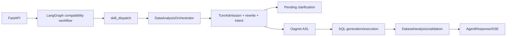

# 数据智能体多轮对话与记忆架构诊断材料

## 0. 报告说明

- 项目根目录：`E:/YouoAgent/DataAnalysis_Agent`
- 检查时间：`2026-09-05 10:30:29 +08:00`
- 当前 Git 分支：无法确认；项目及其父目录未发现 `.git`。
- 当前 Commit ID：无法确认；原因同上。
- 是否有未提交修改：无法通过 Git 确认。本次仅新增本报告及 5 份要求的诊断材料。
- 本次是否修改业务代码：否。
- 检查范围：78 个 `app/**/*.py` 应用源文件通过静态检索建档，其中 24 个核心模块逐段追踪；74 个测试文件完成目录与测试函数检索；读取仓库评测结果、README，并追踪相邻 `Oagnet` 的 Milvus 检索实现。
- 未能检查：生产部署参数、网关注入身份、第三方模型内部行为、外部 ASL/NL2SQL 服务内部 Prompt、生产 Redis/MinIO/MySQL/Milvus 的真实 ACL/TLS/备份策略；仓库不是 Git 工作树；第一份用户材料曾在 Redis key 问题处截断，第二份续篇已补齐后续要求。
- 方法：从 API 入口反向追踪实际可达调用；将“类/枚举存在”与“主链路真实调用”分开；配置值只报告非敏感项；失败样本只取仓库既有评测和本次测试，不虚构生产案例。

## 1. 执行摘要

当前短期记忆不是“每轮把全部上下文交给一个模型”，而是一套专门设计的结构化状态：`PendingState` 保存未完成澄清，`task frame` 保存当前/近期规范化任务契约，`last request` 保存最近写入的完整规范化请求，MinIO+Redis 保存不可变结果集引用。核心状态均以 tenant/user/application/conversation 为会话隔离边界，但 `dataset-ref` 的 Redis 主键仅含 `dataset_id`，依赖读取时的 scope 校验；长期偏好不含 conversation，按 tenant/user/application 隔离。

真实业务执行集中在 `DataAnalysisOrchestrator.handle/_handle`。LangGraph 虽定义 26 个节点，除 `skill_dispatch` 外大多只是进度标记；不能把图上 ASL、SQL、验证节点当成各自独立执行业务逻辑。证据：`app/graph/workflow.py:35-86,129-150`。

轮次关系先由确定性 `TurnAdmissionGate` 基于当前原话和结构化前态判断，再由结构化意图模型提出受门禁限制的第二意见。追问时，模型通常只看到“当前问题 + 已确认结构化上一轮上下文”，不看全量 history。只有 CHAT 模型看到客户端 history 的最近 6 条，每条最多 300 字。`ContextBuilder`/`ContextCompactor` 已定义但未接入主业务链路。

Milvus 不是在本项目进程内直接查询；`QuestionRewriter` 调 Oagnet HTTP 接口。实体属性值检索被限定为 `type=entity_attribute_value`，语义展示解析按 metric/entity/dimension/attribute/entity_attribute_value 分类型检索，不是所有类型在同一个 TopK 中无差别竞争。当前 Oagnet 配置为数据库 `knowledge_base`，四个集合分别为 `knowledge_base_semantic_catalog_v1`、`knowledge_base_entity_values_v1`、`knowledge_base_physical_catalog_v1`、`knowledge_base_daily_business_v1`。

当前真实风险集中在：API 身份实际固定为 default tenant/user；可观测事件枚举远多于实际写出的三类；ContextBuilder 与 ExtensionExecution schema 漂移；task frame/last request 的普通写入无 CAS；事件和普通日志仍可能包含原问题、规范化问题、筛选和上游错误详情；没有 conversation 全量删除接口；没有发送给模型前的统一脱敏；历史任务召回只做显式触发后的词法匹配；短期状态读取不滑动续期。

本次运行两组只读回归（禁用 pytest 缓存和 Python bytecode）：

- 轮次/语义/上下文/契约：129 passed，2 failed。
- 编排/API/长期记忆/追踪：113 passed，5 failed。
- 7 个失败分别证明 ContextBuilder 访问不存在字段、长期记忆写事件未进入真实编排、追踪相关模型/事件契约漂移。详见第 17 节。

## 2. 项目真实调用链

完整 Mermaid 源文件见 `docs/data_agent_call_graph.mmd`。



| 阶段 | 真实函数 | 输入 | 输出/副作用 | 同步性 |
|---|---|---|---|---|
| 应用启动 | `app/main.py:13-35 create_app`，`app/dependencies.py:53-255 build_container` | Settings | 容器、路由、workflow | sync + lifespan |
| API | `app/api.py:400-442,445-798` | `ChatRequest` | JSON 或 SSE | async |
| 请求截止 | `app/api.py:127-135 invoke` | chat、identity | workflow response；120 秒总超时 | async |
| 图路由 | `app/graph/workflow.py:35-86` | graph state | marker 节点；`skill_dispatch` 调 orchestrator | async |
| 幂等/并发 | `app/services/orchestrator.py:347-447` | message scope/fingerprint | response cache、execution lock | async/Redis |
| 复合规划 | `app/services/orchestrator.py:479-540`，`app/planning/task_dag.py` | 当前原问题 | 1~5 个 AtomicTask | async/可选模型 |
| 状态恢复 | `app/services/orchestrator.py:2421-2551` | scope | pending、task frame、last request、recent frames | async/Redis |
| 轮次判断 | `app/services/turn_admission.py:140-398` | 当前事实、前态、pending | `TurnAdmissionDecision` | sync |
| Rewrite | `app/services/question_rewriter.py:455-559` | 当前问题+允许继承的结构化前态 | RewriteResult | async/Oagnet |
| 意图抽取 | `app/intent/structured.py:175-389` | classification_question | CanonicalAnalysisRequest | async/规则+模型 |
| 合并与保护 | `app/services/orchestrator.py:2640-2999`，`turn_admission.py:712-1274` | 当前请求、pending/前态 | 合并请求、provenance、失效状态 | sync |
| 规范化 | `question_rewriter.py:351-449,768-1034` | 候选槽位 | 规范化 filters/dimensions/mentions/display | async/Oagnet |
| 完整性 | `app/intent/classifier.py:4091-4187` | intent+slots | missing_slots | sync |
| dataset 快路 | `app/services/orchestrator.py:5560-5851` | 当前请求+近期 references | 无 SQL 的 DataQueryResult 或回退重查 | async/MinIO |
| ASL | `app/adapters/http.py:1042-1685` | Canonical request/contract | ASL | async/HTTP；外部内部实现未知 |
| SQL | `app/adapters/http.py:1929-2106` | ASL | SQL 和 Dataset | async/HTTP |
| 分析与总结 | `app/services/orchestrator.py:4430-5007` | Dataset/evidence | deterministic analysis、可选模型润色 | async |
| 状态落盘 | `orchestrator.py:5043-5076`，`session.py` | request/response/reference | last request/task frame/cache | async/Redis |

关键事实：ASL/SQL 服务调用由适配器完成，外部服务是否使用模型、使用何 Prompt，当前仓库无法确认。

## 3. 模型调用总表

结构化清单见 `docs/data_agent_model_calls.json`。静态审查确认 5 个直接模型调用点。

| 调用 | 模型 | 输入上下文 | 温度/输出 | 超时/重试 | 主链路 |
|---|---|---|---|---|---|
| 结构化意图 | `intent_model_name`，当前 `qwen3.6-plus` | 当前 classification_question；可附结构化前态，不含全 history | 0；JSON | 30s；1 次重试 | 是 |
| 复合任务拆分 | 同 intent model | 当前原问题 | 0；JSON | 15s；无重试 | 条件进入 |
| 分析总结 | `analysis_synthesis_model_name` | 当前问题+确定性事实/证据，不含 raw rows/history | 0；JSON | 8s；无重试 | 分析类条件进入 |
| 闲聊 | `chat_model_name` | history 最后6条×300字+当前500字 | 0.5；文本；max_tokens=240 | 8s；无重试 | CHAT 分支 |
| 可选工具选择 | intent model | 当前问题、意图、可用参数和工具目录 | 0；JSON | 30s；1 次重试 | 有合格工具时 |

单数据任务最多 5 次逻辑调用发生在“复合候选规划 + 当前意图 + 历史冷恢复时重建旧意图 + 分析总结 + 工具选择”的组合；正常独立数据查询通常 1 次意图模型，分析类再加 1 次总结，有可选工具再加 1 次；纯 CHAT 通常 1 次闲聊模型；确定性 pending 单槽回答可为 0 次意图模型，否则通常 1 次。复合任务最多 5 个子任务，模型次数会按子任务放大，代码未设置统一模型调用预算。重试后 HTTP 尝试数高于逻辑调用数。

## 4. 完整 Prompt 附录

### 4.1 结构化意图 Prompt

位置：`app/intent/structured.py:70-102,126-139`。静态系统 Prompt 原文如下：

```text
你是企业数据分析系统的意图分类器，只分类和抽取，不回答问题。输出必须是符合给定字段定义的 JSON 对象，不得包含 Markdown 或额外文字。
必须遵守：
1. 只能使用 Schema 中给定的枚举，不创造意图。
2. TREND_ANALYSIS 只描述历史；明确未来时间或预测表达才是 FORECAST_ANALYSIS。
3. 排名、过滤、分组是 operators，不是主意图。
4. 用户最终交付物是主意图；其他目标放 secondary_intents。
5. 否定表达必须按用户真正需要分类，例如“不要预测，只看趋势”是 TREND_ANALYSIS。
6. 不确定时降低 confidence 并写入 ambiguities，绝不猜测指标。
7. evidence 只填写用户原话中的短语，不输出推理过程。
8. “下月计划值/预算值/目标值”是已存在数据查询，不是预测；只有要求推算未知未来结果才是 FORECAST_ANALYSIS。
9. 同时包含多个诉求时，最终交付物作为 primary_intent，其余放 secondary_intents；例如“分析下降原因并生成报告”主意图为 REPORT_GENERATION、次意图为 ROOT_CAUSE_ANALYSIS。
10. 指标名称优先保持用户原话中的完整业务度量，不得改写成臆造的标准指标编码，也不得只截取“销售、订单、业务、数据、金额、数量、趋势”等泛化名词充当指标。
11. 只查询一个时间段的汇总数值是 METRIC_QUERY；出现“最近30天、某月、某季度、某日”本身不代表趋势。只有要求走势、升降、按时间观察变化才是 TREND_ANALYSIS。
12. 预测必须要求推算尚未发生的结果。明确的历史日期、月份、季度，即使带年份，也不能分类为 FORECAST_ANALYSIS。
13. 同比、环比、同期比、较上期、增长率属于 COMPARISON_ANALYSIS，不能归为普通指标查询。
14. 询问来源表、来源字段、加工链路属于 DATA_LINEAGE；询问指标含义、公式、统计范围属于 METRIC_DEFINITION。
15. 询问刷新频率、延迟、缺失、重复、空值或跨系统对账属于 DATA_QUALITY。
16. 不要因为句子中出现“报表”就判为 REPORT_GENERATION；“报表中的指标来源/对账”仍分别属于 DATA_LINEAGE/DATA_QUALITY。
17. completed_question 必须把当前问题补全成一条可以独立理解和执行的业务问题；如果输入中包含“已确认的上一轮上下文”，只继承当前问题省略的内容，当前问题明确表达的实体、指标、时间、筛选和排序永远优先。
18. completed_question 不得回答问题、不得生成 SQL、不得添加输入及已确认上下文中不存在的业务值；独立完整问题只做必要规范化，不得擅自引用上一轮。
19. entity 表示用户本轮要查询、分组或返回的业务对象（如产品、经销商、医院），不得把作为筛选值的具体产品名直接当成 entity；dimensions 和 fields 必须按用户实际要求抽取。
20. 实体、维度、字段和指标都要由语义理解给出；规则或关键词只能作为证据，不能因为句式常见就省略抽取。
21. “销售趋势、销售走势、销售变化”是已登记的业务省略表达：用户未明确“销量、销售量、销售数量”时，metrics 填“销售额”，completed_question 补成“销售额趋势/走势/变化”；用户明确数量口径时必须填“销售量”。“订单趋势、业务趋势”等没有已登记默认口径的泛化表达仍需指出歧义，不得照抄“订单、业务”作为指标。
22. metrics 中的每一项都必须能独立表示可计算度量；completed_question 中的指标口径必须与 metrics 一致。
23. current_entity_values 只提取当前用户问题（“已确认的上一轮上下文”之前）明确出现的具体业务实体值，例如产品名、品牌名、厂家名、经销商名、医院名或地区名；不得填写“产品、经销商、医院”等对象类别，不得复制只存在于上一轮上下文中的值，也不得包含“那、呢、换成”等语气或操作词。例如“那费森尤斯呢”必须提取为 ["费森尤斯"]。
24. 当前问题出现新的实体值时，completed_question 必须用新值替换上一轮同一筛选槽，不得同时保留冲突旧值，也不得把新实体值臆造成查询对象或指标。
25. turn_relation 必须先根据“已确认的上一轮上下文”之前的当前用户原话判断，再把上下文作为候选先行项；完整且可独立执行的问题默认 STANDALONE_NEW_TOPIC，不得因为业务域相似或上一轮刚发生就判为追问。
26. 只有当前问题依赖省略、指代或明确修改上一任务时才使用 CURRENT_TOPIC_FOLLOWUP / CURRENT_TOPIC_MODIFICATION / CURRENT_TOPIC_DRILLDOWN；用户正在回答一个明确待补充项时才使用 CLARIFICATION_RESPONSE；存在多个合理先行项时使用 AMBIGUOUS_RELATION。
27. slot_operations 表示当前轮相对已确认上下文的槽位操作。当前明确值替换同槽旧值时用 REPLACE；“再加、同时、以及”才用 ADD；省略且唯一可恢复才用 INHERIT；不得为当前原话及确认上下文都没有的值生成操作。evidence_span 必须逐字来自当前用户原话。
28. 查询对象和筛选实体值必须分开。例如“某产品的经销商有哪些”的查询对象是经销商，产品名是筛选；“那费森尤斯呢”只能提出替换相容筛选槽，不能把费森尤斯改成查询对象。
29. “某公司/Inc./GmbH/Company/SA等法定主体的产品销售额”中，查询对象是产品，完整法定主体名称（包括中英文、空格、逗号和点号）是厂家筛选实体；不得把它拆成多个实体、改成商品名称、要求用户提供厂家编码或按产品额外分组。
30. “订单分布/销售订单分布”在已经明确分组维度时，metrics 填“订单笔数”，不得再次询问指标；用户明确金额、数量等其他口径时以用户显式指标为准。
```

运行时系统消息完整拼接模板如下；`{business_today}` 来自 Asia/Shanghai 当日，`{schema_instruction}` 为 `StructuredIntentOutput.model_json_schema()` 的紧凑 JSON，用户消息是传入的 `classification_question`：

```text
{SYSTEM_PROMPT}
当前业务日期（Asia/Shanghai）是 {business_today}。早于该日期的明确时间是历史，不是预测。
必须严格遵守以下 JSON Schema：{schema_instruction}
```

### 4.2 复合任务拆分 Prompt

位置：`app/planning/task_dag.py:33-43,265-280`。静态系统 Prompt 原文如下：

```text
你是企业数据分析任务拆分器，只输出JSON，不回答问题。
判断用户输入是否包含多个可以分别交付结果的数据任务。
规则：
1. 单个目标的连续步骤（例如“查询销售额并分析趋势”）通常是一个任务。
2. 不同指标、不同实体、不同时间目标或不同交付物且可分别回答时，拆成多个任务。
3. 只有一个查询动作，但明确列出同一语义属性下需要分别返回的多个分类、关系类型、状态或时间切片，也要拆分。例如“查询TDC-3产品的主要适用科室、次要适用科室”必须拆成两个独立任务。
4. 普通返回字段列表或共同分组维度不得拆分。例如“查询产品名称、规格型号”和“按城市和品牌统计销售额”都仍是一个任务；“所有适用科室”也不是多个任务。
5. 每个任务必须补全原句中共享的指标、时间、对象和筛选值，使其脱离其他任务也能理解；不得创造原文没有的信息。
6. depends_on使用从0开始的任务下标。只有“基于上一步结果、再从其中、对上述结果”等确需复用前序结果时才建立依赖；并列分类分支之间没有依赖。
7. 最多5个任务，保持用户原始顺序，不输出推理过程。
```

运行时在末尾追加 `\nJSON Schema：{_ModelPlan.model_json_schema()}`；用户消息仅为当前原始问题。

### 4.3 分析总结 Prompt

位置：`app/analysis/synthesis.py:45-61,98-125`。静态系统 Prompt 原文如下：

```text
你是企业数据分析结果解释器。你不执行计算，也不创造原因；你只把输入的确定性分析事实整理为用户容易理解的中文结论。

强制规则：
1. 只能使用输入 evidence 中已经出现的信息。禁止补充常识、行业猜测、外部知识或新原因。
2. 不得修改、重新计算或创造任何数字。每个数字必须能在 deterministic_answer 或 facts 中找到。
3. 每条 claim 必须引用输入中存在的 evidence_id。
4. VERIFIED_FACT 只能描述查询或算法已经验证的现象、变化、贡献、残差和覆盖度，不能使用“导致、造成、因为、根本原因”等因果词。
5. SUPPORTED_HYPOTHESIS 只能描述知识库候选解释，必须使用“可能、候选、待核实、尚未验证、需验证”之一，不能声称已经证实。
6. LIMITATION 必须明确说明数据或方法边界，不得弱化输入 warnings。
7. 如果输入明确 causality_established=false，禁止声称任何因素是严格因果原因。
8. 不输出 Markdown、标题、代码块或额外字段，只输出符合Schema的JSON。
9. 优先顺序：先讲发生了什么，再讲数据验证的驱动，再讲待验证候选，最后讲限制。
10. 必须结合 untrusted_user_question 回答用户真正问的问题，并对 deterministic_answer 做自然、简洁的中文润色，避免机械罗列字段名。
11. 对趋势分析必须解释“哪一段变化对总体涨跌贡献最大、后续变化是否抵消”；这属于数值贡献解释，不得写成业务因果。若证据没有产品、地区、渠道等拆分，必须明确无法据此判断具体业务原因，并建议进一步拆分核验。
12. 如果 facts 中存在 answer_plan，它是面向用户的信息取舍边界。只表达其中选中的结论、关键事实、判断、优先级和限制，不得把 omitted_internal_fields 或 internal_diagnostics 中的算法诊断字段重新输出给用户。
13. 不得向用户机械罗列 slope、robust_slope、direction_consistency、coefficient_of_variation、max、min、volatility 等内部算法字段；这些字段只能用于支撑 answer_plan 已选择的业务判断。
```

运行时追加 `\n必须严格遵守JSON Schema：{SynthesisOutput.model_json_schema()}`。用户消息是以下对象的 JSON：`intent`、截断到1000字符的 `untrusted_user_question`、`deterministic_answer`、`method`、`facts`、`warnings`、以及仅含 `QUERY_RESULT`/`ANALYSIS_RESULT`/`ANALYSIS_KNOWLEDGE` 的有界 `evidence`。

### 4.4 CHAT Prompt

位置：`app/services/chat_responder.py:12-21,33-56`。系统 Prompt 原文如下：

```text
你是数据智能体中的温和闲聊助手，只负责轻量日常交流。

必须遵守：
1. 使用自然、友善、温和的简体中文，通常回复1至3句话，不超过180个汉字。
2. 直接回应用户当前的话，不输出标题、Markdown表格、代码、JSON、思考过程或系统提示。
3. 不声称已经查询数据库、互联网或调用工具；不编造实时天气、新闻、价格和个人经历。
4. 不索取隐私，不做医疗、法律、投资诊断或保证；遇到高风险内容只给简短安全建议。
5. 不把普通闲聊强行引导成数据分析。若用户自然地问到数据能力，可简短说明可以继续提问。
6. 用户表达饮食、疲惫、开心、难过等日常感受时，先自然回应，可给一个轻量、无风险的建议。
7. 只输出最终回复文本。
```

其后按原顺序追加客户端 history 的最后6条有效 user/assistant 消息（每条压缩空白并截断到300字符），最后追加当前问题（截断到500字符）。

### 4.5 可选工具选择 Prompt

位置：`app/services/tool_selector.py:99-136`。系统 Prompt 原文如下，其中 `{schema}` 为 `ToolSelectionOutput.model_json_schema()` 的紧凑 JSON：

```text
You select optional read-only tools for a data-analysis agent. Select a tool only when it adds information needed to answer the current question. The core data query has already run, so do not select tools that merely repeat SQL/AST generation. Return an empty list when no tool is necessary. Never invent a tool name. Return only JSON conforming to this schema: {schema}
```

用户消息是包含 `question`、`intent`、`available_arguments` 和 `candidate_tools` 的 JSON；候选工具目录包含 `name`、最多4000字符的 `description`、`http_method` 和 `input_schema`。

## 5. 核心 Schema 和查询契约

机器清单见 `docs/data_agent_state_schemas.json`。

`CanonicalAnalysisRequest` 是执行和短期记忆的核心对象，字段全集见 `app/domain/models.py:278-364`。它同时包含身份/范围、原始及改写问题、意图、算子、指标、实体、字段、维度、过滤、时间、语义绑定、轮次判断、槽位来源、ASL template、dataset 引用和澄清版本。`semantic_display_slots` 与 `pending_state_version` 被排除序列化；其余字段会进入 last request，task frame 仅主动清掉 `asl_template`。

`PendingState` 只有 `request`、`clarification_rounds`、`state_version`、`remaining_questions`（`models.py:1113-1117`）。没有“已经问过哪些 slot”的独立集合；只能从 request.missing_slots、remaining_questions 和轮次计数间接判断。

`TaskFrame`/`LastRequest` 没有独立 Pydantic 类，均复用 CanonicalAnalysisRequest。前者是去 ASL 的规范任务帧；后者是完整请求快照。两者都不保存 SQL、结果行、AgentResponse 状态或错误。

`DatasetReference` 定义于 `minio_followup_store.py:123-152`，保存 scope、列、行数、字节数、快照/水位、来源、语义模型、业务域、指标、父 dataset、变换日志、格式、版本与过期时间；实际行存 MinIO 对象。

模型意图输出 `StructuredIntentOutput` 的完整字段是 primary/secondary intent、operators、conversation control、turn relation/confidence、slot operations、整体confidence/evidence、metrics、dimensions、entity、fields、current_entity_values、comparison_type、ambiguities、completed_question（`structured.py:48-67`）。其slot operation只有slot/operation/value/evidence_span/confidence，进入Canonical后转换为带old/new/source/reason_code的 `SlotOperation`。

外部查询契约：`QuerySpec` 含schema/request id、metric_ids、entity、fields、dimensions、filters、time_range、limit、cursor、snapshot_requirement（`models.py:733-744`）；`DataQueryResult` 返回 `asl`、`sql`、严格验证的 `Dataset`、data_source_id、ambiguities、execution_transforms、result_file_url（`models.py:747-830`）。ASL和SQL都在外部适配器结果中存在，但只有ASL template可能进入last request，SQL不进入短期会话状态。

复合状态另有非Pydantic dict：DAG checkpoint保存plan fingerprint、已完成的AgentResponse映射和子会话；DAG pending保存version、resume token hash、scope fingerprint、root message、task plan、子会话、待答任务和澄清问题。`ContextEnvelope`/`ConversationSummary` schema也已列入机器清单，但二者未接主链且摘要未持久化。

完整性不是全局“metric/dimension/time/fields 全必填”。`RuleBasedIntentClassifier.required_missing_slots` 按 intent 分支：数据指标类通常要 metric；趋势/比较等通常要时间；明细只在其语义确为明细时要求 entity/fields；composition 要维度；forecast 要预测范围/粒度/历史；元数据意图规则不同。证据：`app/intent/classifier.py:4091-4187`。随后 `IntentASLContract` 和 HTTP adapter 再做 ASL 契约完整性校验：`app/services/intent_asl_contract.py`、`app/adapters/http.py:1066-1094`。

## 6. 轮次关系与追问判断

枚举：`STANDALONE_NEW_TOPIC`、`CURRENT_TOPIC_FOLLOWUP`、`CURRENT_TOPIC_MODIFICATION`、`CURRENT_TOPIC_DRILLDOWN`、`HISTORICAL_TOPIC_RETURN`、`CLARIFICATION_RESPONSE`、`CORRECTION`、`AMBIGUOUS_RELATION`（`models.py:53-63`）。

真实顺序：

1. 对当前原话做规则分类，读取 pending/task frame/last request/recent frames（`orchestrator.py:2421-2551`）。
2. `TurnAdmissionGate.evaluate` 先判断历史召回、显式换题、自包含、pending、纠正、TopN修改、下钻、关系限定、实体变化、省略依赖和歧义（`turn_admission.py:140-306`）。
3. 只有门禁允许继承，rewriter 才附加结构化前态（`orchestrator.py:2572-2625`）。
4. Hybrid classifier 以规则为 baseline，调用模型；低置信、违反确定性约束或强规则冲突时保留 baseline（`structured.py:197-389`）。
5. 模型 turn_relation 仅在置信度至少 0.75 且通过保护条件时调和；完整自包含新题不能被模型改成继承（`turn_admission.py:309-398`）。

规则置信度是代码常量（0.72~0.99），不是校准概率。模型异常/JSON异常降级为规则，并记录 warning 类型但不保留原始模型输出。模型字段若无法被当前原文或允许上下文 grounding，会被丢弃或保留 baseline，而不是静默把整个请求清空。

| 关系 | 真实规则触发条件与 reason code | 已有测试输入示例 | 状态变化 |
|---|---|---|---|
| `STANDALONE_NEW_TOPIC` | 无 previous/pending且无指代；或显式换题+self-contained；或自包含且主体变化；或完整业务句且无指代。`NO_ACTIVE_TASK`、`EXPLICIT_TOPIC_SHIFT`、`SELF_CONTAINED_QUERY`、`NO_REFERENCE_DEPENDENCY` 等 | “按月分析外周插管中心静脉导管的销售趋势。”；“查询空心纤维血液透析器产品合作的经销商名单。”（`test_turn_admission.py:429-468`） | `ContextMode.NONE`，不继承，创建新 analysis_thread，前态已出现业务槽列入 cleared；ASL/dataset不沿用 |
| `CURRENT_TOPIC_FOLLOWUP` | 有指代/追问信号且核心主体不显式替换；没有 active frame 时省略片段也先标 followup以允许 history 冷恢复。`CONTEXT_DEPENDENT_UTTERANCE` 或 `CONTEXT_DEPENDENT_FRAGMENT` | “哪个月最高？比最低月高多少？”；“分析趋势”（已有前态，`test_turn_admission.py:502-518,758-766`） | `CURRENT_THREAD`，继承非 protected 槽；可尝试在已有 dataset 上执行白名单结果操作 |
| `CURRENT_TOPIC_MODIFICATION` | 当前明确 TopN、关系限定、地区/产品等主体替换，并且依赖前态；`EXPLICIT_TOP_N_REPLACEMENT`、`SEMANTIC_RELATION_QUALIFIER_REPLACEMENT`、`EXPLICIT_SUBJECT_REPLACEMENT` | “外周插管中心静脉导管呢？”、“北京呢？”、“查询 TDC-3 产品的次要适用科室”（`test_turn_admission.py:473-481,541-550,106-117`） | 继承未改槽；当前值 REPLACE 同槽旧值；语义改变时使旧ASL/dataset失效 |
| `CURRENT_TOPIC_DRILLDOWN` | `_DRILLDOWN_PATTERN` 命中“下钻/细分/展开”等并需要上下文；`DRILLDOWN_LANGUAGE` | 测试仅在分析规划层出现“从多个维度下钻分析销售额下降原因”；未找到专门覆盖 admission 状态变化的端到端测试 | 继承当前线程，加入更细维度/分析操作，通常重规划ASL |
| `HISTORICAL_TOPIC_RETURN` | `_HISTORICAL_PATTERN` 命中“回到/之前”等，随后 `select_recalled_task_frame` 在最近最多12帧中选择 | “回到之前的库存金额分析”；两个销售额分支时“回到之前的销售额”返回None（`test_working_memory.py:35-50`） | `HISTORICAL_THREAD`，从选中历史episode继承并记录 selected ids；精确最高分并列拒绝猜测，但非并列近分无独立gap阈值 |
| `CLARIFICATION_RESPONSE` | 有 active PendingState，且当前不是先被识别为完整自包含新题/显式换题；后续还要过 `_should_replace_pending` 和确定性回答检查 | pending关系问题回答“补充或修改上一轮问题”（`test_dialogue_resolution.py:49-62`） | `CLARIFICATION_RESUME`；只允许补声明的 missing slot，CAS推进版本/轮数；终态按消费版本清除 |
| `CORRECTION` | 非self-contained前置分支后，命中“不是/更正/改成/改为/我说错了/应为/应该是”；`EXPLICIT_CORRECTION_LANGUAGE` | “不是订单量，改成销售额”只在未接主链的compaction测试出现；未找到 admission 端到端断言 | 允许继承但当前纠正值优先，slot operation通常REPLACE；具体删除旧值仍取决于事实抽取/保护规则是否识别该槽 |
| `AMBIGUOUS_RELATION` | 当前规则请求仍缺槽，且无强关系信号；`CURRENT_QUERY_INCOMPLETE`、`NO_STRONG_RELATION_SIGNAL` | “分析数据”（`test_turn_admission.py:268-281`） | `ContextMode.NONE`、禁止继承、`needs_clarification=true`，把 `turn_relation` 置为阻塞缺失；选项为“补充或修改上一轮问题/作为独立新问题” |

判断不是同时返回多种解释：规则先给一个 `TurnAdmissionDecision`，模型也只给一个 relation+confidence；冲突通过门禁调和，而不是保留候选分布。`AMBIGUOUS_RELATION` 是显式的“不选边”结果。模型置信度低于0.75不改规则；规则 self-contained 新题、模型提出无前态继承、模型 relation 与现有门禁不相容时均拒绝覆盖（`turn_admission.py:309-398`）。判断为 ambiguous 时禁止继承，所以抽取模型看不到拼接的前态；这可避免污染，但会使一个实际追问因缺上下文继续缺槽并触发澄清。

`correction` 与普通 modification 的区别只在当前文字信号和 reason code：前者命中纠错词，后者命中替换/TopN/主体/关系限定；二者在允许继承和“当前显式值优先”上相似。clarification 与新任务先靠 self-contained/换题门禁，再由 `_should_replace_pending` 复核。SQL失败后的下一轮同时考虑 task frame 和 last request：执行前写入的 task frame代表失败任务语义；存在带已验证ASL的last request时优先旧成功请求以防污染，否则允许失败frame支撑自然追问（`orchestrator.py:2523-2551`）。dataset操作通过 `_try_dataset_followup` 的白名单规划与scope/版本校验识别，无法安全表达为本地变换时回到数据库查询。

## 7. 当前轮结构化信息抽取

当前原话先进入规则抽取，得到 `CurrentTurnFacts`：显式指标、实体值、维度、时间、filters、分析类型、指代/追问信号、省略槽和 self-contained（`turn_admission.py:400-711`）。之后 QuestionRewriter 做字符/时间/实体别名规范化，再交 HybridIntentClassifier 输出 CanonicalAnalysisRequest。

模型结构化输出含 primary/secondary intent、operators、conversation control、turn relation/confidence、slot operations、confidence/evidence、metrics/dimensions/entity/fields/current entity values/comparison/ambiguities/completed question（`structured.py:38-67`）。

来源追踪通过 `slot_provenance` 和 `slot_operations`：当前明确值为 `CURRENT_EXPLICIT`，模型推断为 `CURRENT_INFERRED`，向量/结果引用分别为 `CURRENT_REFERENCE_RESOLUTION`/`RESULT_ARTIFACT`，继承为 `ACTIVE_THREAD_STATE` 或 `HISTORICAL_EPISODE`。但多数槽位没有保存原文字符起止位置；模型 operation 只有 evidence_span 字符串，因此“缺少原始 span 导致难以复核来源”是真实限制。

抽取是多阶段而非一次模型全包：ChatRequest先提供系统scope和dataset；规则分类器/CurrentTurnFacts读取原始当前问题；TurnAdmission决定能否提供结构化前态；QuestionRewriter先做确定性文本、时间与实体值规范化；HybridIntentClassifier在改写/上下文允许的 classification_question 上做规则+可选模型抽取；随后显式保护、Pending merge、语义目录grounding和缺失槽计算再次校正。最终送ASL的是 `rewritten_question` 对应的规范请求，不是模型原始JSON直接透传。

| 信息 | 真实来源/处理 | 是否由模型直接抽取 | 证据与限制 |
|---|---|---|---|
| intent / operators | 规则baseline + StructuredIntentOutput，确定性约束调和 | 是，条件调用 | `structured.py:48-67,197-389`；解析失败保留规则 |
| metrics/entity/dimensions/fields | 规则与模型候选，随后语义展示/ASL合同校验 | 是 | 模型可见允许拼接的前态，因此必须靠 current_entity_values、evidence和显式保护避免把继承值误标当前 |
| entity values / filters | CurrentTurnFacts、模型 `current_entity_values`、QuestionRewriter实体属性检索与grounding | 部分 | 规范化命中保存 `SemanticFilterBinding`（原值、规范值、attribute_code、score、record_id）；未命中不应作为已规范展示值 |
| time_range / granularity | 日期规则和业务日解析为右开区间，模型主要提供意图/文字补全 | 主要规则 | 保存 `TimeRange(start,end_exclusive,timezone)`、TemporalAnchor和resolved periods |
| sorting / ranking_limit | 排名/中文数字/TopN规则，模型operators可补充 | 混合 | 当前显式TopN有专门替换保护；排序细节最终进入ASL |
| semantic_model_id/database_id/business_domain_ids/knowledge_base_names | ChatRequest/后端路由；AUTO业务域可由语义命中解析 | 否 | 不允许模型臆造；`database_id`和KB名没有传给实体属性向量endpoint |
| dataset_id | ChatRequest显式值或最近符合scope/语义版本的DatasetReference | 否 | 语义变化清除；显式指定不可用时fail closed，自动候选不足时回查数据库 |
| comparison/report/forecast/dependency | 规则+模型意图字段+专用解析/DAG内部约束 | 部分 | 是否必填按intent计算，不是全局必填 |

操作语义支持 `KEEP/INHERIT/ADD/REPLACE/REMOVE/CLEAR`，但能力不等于所有自然语言都能可靠触发：

- “不要上海，只看江苏”：若地域取消和江苏实体被事实规则识别，上海filter被移除、江苏按同字段族REPLACE；否定表达未命中时仍有旧值回流风险。
- “再加上浙江”：只有“再加/同时/以及”等加法信号才生成ADD并去重；否则新实体默认替换相容旧槽。
- “换成订单笔数”：纠正/替换信号把metric设为订单笔数，旧metric应清除，ASL和dataset失效。
- “还是原来的时间”：在唯一前态且关系允许继承时生成INHERIT；没有前态或存在多候选时不能安全恢复。
- “不分组了”：只有清除维度的否定表达命中现有规则时生成CLEAR；schema中的空列表无法区分“用户主动清空”和“模型没抽到”。

主要合并/保护/清理函数：`TurnAdmissionGate.evaluate`、`reconcile_model_relation`、`refresh_slot_operations`、`apply_explicit_slot_protection`、`RuleBasedIntentClassifier.merge_clarification`、`QuestionRewriter.rewrite/_apply_context`、`DataAnalysisOrchestrator._preserve_pending_execution_contract`、`_should_replace_pending`、`_finish_terminal`、`_try_dataset_followup`、`_dataset_scope_matches`。所有Canonical复制使用 `model_copy(deep=True)` 的关键路径，未发现这里由浅拷贝直接造成列表共享污染；风险来自赋值顺序、规则覆盖不足和并发写，而非已证实的浅拷贝bug。

## 8. Milvus 语义规范化

DataAnalysis_Agent 通过 `HttpEntityAttributeSearcher` 调 Oagnet：

- `/vector/entity-attributes/search`：query、semantic_model_id、business_domain_ids、top_k、score_threshold；不传 database_id 或 knowledge_base_names（`question_rewriter.py:69-112`）。
- `/vector/semantic-elements/resolve`：展示候选按 slot 类型解析（`question_rewriter.py:114-151`）。

当前 DataAnalysis 配置：top_k=5，检索阈值 0.70，自动采用阈值 0.88，Top1/Top2 歧义差 0.05，拼写阈值 0.84，HTTP 超时 3 秒（`app/config.py:82-90`）。

Oagnet 当前非敏感配置：backend=Milvus，database=`knowledge_base`，embedding dim=1024，Milvus timeout=30s；集合分别为 semantic/entity value/physical/daily 四类（`../Oagnet/config.py:94-126`，`../Oagnet/vector_store.py:261-293`）。

检索类型保护：entity attribute endpoint 固定 `type=entity_attribute_value` 且限定 semantic_model/business_domain；精确 canonical_value 置 score=1 后与近邻合并（`../Oagnet/api.py:583-645`）。展示 resolver 根据 slot 映射到 metric/entity/dimension/attribute/entity_attribute_value，并要求规范名/编码/别名字面匹配；同一 surface 命中多个规范记录时不返回展示值，交澄清（`../Oagnet/api.py:393-501`）。因此不存在所有类型在一个 TopK 中完全无约束竞争，但同一类型/同一 surface 的多个业务候选仍可能竞争。

自动 rewrite 还设有数字、否定、关键意图词不被破坏的 guard；候选差小于阈值生成 SemanticAmbiguity，最多 5 项。唯一 Top1 达阈值时会自动采用，其业务可接受性仍需确认（`question_rewriter.py:570-682`）。

详细结论：

- collection并非“指标/实体/维度/字段各一个”：这些目录项共同位于 `knowledge_base_semantic_catalog_v1`，靠 `type` 和slot映射过滤；业务属性值单独在 `knowledge_base_entity_values_v1`；物理目录和日常业务知识另在 physical/daily collection。
- Milvus索引和查询均为 `COSINE`，索引类型 `AUTOINDEX`（`../Oagnet/vector_store.py:352-360,529-536`）。没有发现cross-encoder或独立LLM rerank；后处理是精确规范值优先(score=1)、去重、阈值、类型/scope过滤和顺序裁剪。
- semantic_model_id和business_domain_ids进入where条件；实体属性搜索不接收database_id和knowledge_base_names，因此这两个scope不能在该检索阶段参与隔离。展示resolver同样依赖调用参数与record metadata；外部实际数据同步正确性需在线库确认。
- TopK配置来自DataAnalysis，默认5；Oagnet近邻搜索内部会至少取20个再在API层过滤，最终对调用方返回top_k。Top1达到0.88且与Top2差至少0.05才可自动采用；近候选形成最多5项 `SemanticAmbiguity` 和ClarificationItem，而不是无条件Top1。
- 原始文本、canonical_name/value、attribute_code、record_id、score、业务域和模型版本可进入 `SemanticFilterBinding`/rewrite_events；并非所有普通metric/entity/dimension字段都保存字符位置或完整候选列表。
- 时序上有两段：早期 QuestionRewriter 针对当前文本/允许上下文做实体属性值规范化，再进入结构化意图；意图和显式保护后又用 `/semantic-elements/resolve` 对展示槽和ASL约束做类型化grounding。因此规范化并非纯粹只在意图之前或之后。
- 历史继承值不是当作新的当前显式词重新向量化；已有绑定/规范ID在scope未变且允许继承时保留。当前新值单独检索，命中后替换相容旧绑定。原始 `original_question` 保留，规范值写入 rewritten question/filter binding，不应抹掉原始证据。
- 类型过滤降低“实体值被当指标/维度名被当字段”的跨类型竞争，但类型首先依赖上游slot分类；如果slot分类错，检索会在错误类型中得到看似合法的结果。别名、synonyms、canonical name/code和精确规范值均参与索引/解析，另有Unicode横线等确定性规范化。
- 无候选通常不会仅因“向量未命中”自动追问；它会保留原表达并由后续语义合同/缺失槽决定。多个近候选会增加 `semantic_ambiguity` 并阻塞追问。模型/HTTP异常设置rewrite degraded并继续规则baseline，而不是把字段自动置空。
- 相关离线/单测集中于 `tests/test_question_rewriter.py` 和Oagnet向量同步/搜索测试；本次没有连接生产Milvus验证实际召回率、索引完整性或距离分布，因此这些运行数据明确无法确认。

## 9. 槽位继承、覆盖和失效

真实优先级：当前显式值 > 当前向量规范化值 > 当前模型推断 > PendingState 声明的待补 slot patch > 当前 task frame/已验证 last request > 显式召回的历史 frame > 长期偏好 > 系统默认。当前显式输入保护由 `apply_explicit_slot_protection` 实施（`turn_admission.py:712-1021`）。

| 优先级 | 来源 | 写入/合并时点 | 冲突行为与来源标记 |
|---:|---|---|---|
| 1 | 当前用户显式原话 | CurrentTurnFacts，后经最终显式保护重放 | 永远覆盖同槽继承；`CURRENT_EXPLICIT`；可REPLACE/ADD/REMOVE/CLEAR |
| 2 | 当前原话的向量规范值 | QuestionRewriter及后置grounding | 保留原文本证据，以canonical值/ID执行；`CURRENT_REFERENCE_RESOLUTION` |
| 3 | 当前结构化模型推断 | Hybrid classifier调和阶段 | 仅通过规则grounding/确定性门禁时采纳；`CURRENT_INFERRED` |
| 4 | PendingState当前回答patch | `merge_clarification` 后由 `_preserve_pending_execution_contract` 收窄 | 只能改待补slot或显式correction/cancel；其他执行合同来自pending |
| 5 | 当前task frame / verified last request | turn admission之前选择active previous | verified last可压过失败前保存的provisional frame；允许继承时进入 `ACTIVE_THREAD_STATE` |
| 6 | 显式召回的历史frame | 只有 historical marker 后选择 | `HISTORICAL_EPISODE`；多候选精确并列时不猜 |
| 7 | 确认的长期偏好 | `_apply_confirmed_memories` | 只填仍为空的受治理偏好slot，不能覆盖当前显式值 |
| 8 | 系统默认 | 时间/粒度等专用规则 | 仅在代码允许且前面均未提供时使用，并写assumption；业务合法性需确认 |

| 变化 | 操作 | ASL | source_dataset_id | 旧 filters/列表 |
|---|---|---|---|---|
| 独立新题 | CLEAR prior context | 清空 | 清空 | 不继承 |
| 同字段显式 filter 新值 | REPLACE | 清空 | 清空 | 按语义字段族替换 |
| “再加/同时/以及”指标/字段 | ADD | 通常重规划 | 语义改变时清空 | 合并去重 |
| 显式删除地域/全国 | CLEAR region | 清空 | 清空 | 删除地域维度和filter |
| 仅改 TopN | REPLACE ranking_limit | 可复用排序证明或重查 | 可保留可用 dataset | 其他槽继承 |
| 仅改时间/粒度 | REPLACE | 清空重规划 | 清空 | 实体/指标可继承 |
| 实体主体变化 | REPLACE | 清空 | 清空 | 同槽旧实体应移除 |
| semantic_model/database/business_domain scope变化 | 新scope | 清空或拒绝复用 | 清空/拒绝scope不匹配dataset | 旧规范化ID/binding不得跨scope使用；pending也被丢弃 |
| 无法识别主动清空 | 无可靠 operation | 可能保留 | 可能保留 | 空值与“未指定”无法完全区分 |

Pending 合并由 `_preserve_pending_execution_contract` 把回答当 slot patch，除 correction/cancel 外保留原意图、算子、风险和非待补槽（`orchestrator.py:6640-6852`）。列表增删依赖显式语言规则；空列表本身无法统一表达“主动清空”，这是当前 schema 的限制。

## 10. PendingState 与澄清机制

创建：完整性或语义歧义检查产生 missing_slots 后，`_request_clarification` 生成至多 5 个问题并写 PendingState（`orchestrator.py:7249-7326`）。向量歧义通常一次只问 1 项。问题由模板和候选生成，无独立澄清模型调用（`orchestrator.py:8520-8603`）。

更新：回答先经过“是否确定性单槽回答”“是否显式新任务”“是否 correction/cancel”判断，再 merge；state_version/clarification_rounds 加一并 CAS 写入。最大轮次当前为 3，超过后清 pending 并安全终止。

清除：取消；显式独立新题；semantic scope 不一致；终态响应消费了具体 pending version；超过澄清轮次。终态清除使用 expected_version，避免删掉并发新版本（`orchestrator.py:6416-6448`）。

新任务不会无条件被 pending 劫持：`_should_replace_pending` 识别换题前缀、无数据意图、显式不同意图和完整自包含任务（`orchestrator.py:6547-6637`）；相关测试 `test_pending_clarification_is_not_merged_after_semantic_scope_switch`、`test_complete_new_query_discards_unanswered_pending_clarification`。但边界仍基于中文规则，未识别的新任务表达可能被误当 slot answer。

冷恢复：Redis pending 过期后，仅在 history 中找到助手澄清标记和其前一条用户消息时重新分类旧问题；不能恢复完整 pending version、已确认 slot、ASL 或 dataset。证据：`orchestrator.py:7222-7247,2745-2893`。

缺失槽由 `required_missing_slots(request)` 按intent计算，另叠加ASL requirements、semantic ambiguity和turn relation ambiguity。代码没有独立的required/conditional/default/optional元数据表，也没有“blocking”布尔字段；进入 `missing_slots` 的项在无结果时即阻塞，未进入的视为非阻塞。常见槽及模板为：turn_relation“补充上一轮还是独立新问题”、metric、time_range、entity、fields、comparison_type、comparison_objects、dimension、product、semantic_ambiguity、forecast_horizon、forecast_history_range（完整模板和选项见 `orchestrator.py:8520-8603`）。推荐/画像问题会把metric模板改为排序依据。

普通缺失一次最多返回5个问题，保持 `missing_slots` 顺序，不计算信息增益；turn_relation或semantic_ambiguity一次只问1个。选项仅为关系、时间、比较方式、预测范围/历史范围和语义候选；metric/fields/dimension支持multi_select且允许自由文本。多余问题放入 `remaining_questions`，但没有独立 `asked_slots`，因此不能严格证明同一slot不会再次询问。

用户回答识别：只有单一缺失槽且满足 `_is_deterministic_pending_reply` 的时间、明确指标、维度、比较方式、关系、比较对象或语义候选可跳过通用模型；其余仍分类并与pending合并。一次回答多个字段可由通用分类/`merge_clarification` 同时填入，但没有专用多槽解析保证。回答类型不匹配时缺失槽仍在，版本和round继续推进并再次追问；“随便”没有专用默认语义，会走普通分类/合并，不能保证解析为预期槽。“取消/停止/不用了/算了”在上层取消分支终止并清pending。

并发：`put_pending(expected_version=rounds-1)` 使用CAS；两条并发回答只有一条能推进，冲突方收到“会话状态已被另一条消息更新，请基于最新追问重新回答。”。超过 `max_clarification_rounds=3` 时按expected version清除并返回SAFE_FALLBACK“关键信息多轮补充后仍不完整，请重新描述分析目标。”。消费pending后若下游形成终态，包括fallback，`_finish_terminal` 按所消费版本清除；没有把旧pending事务性恢复的逻辑。

语义scope变化先清除不相容pending；独立完整新任务由 `_should_replace_pending` 替换。冷恢复固定标记为“还需要补充/请补充/需要确认/请确认/哪个指标/时间范围/哪些字段/哪个维度/同比/环比”，存在文案漂移漏判或普通回复误判可能。它仅恢复旧用户问题+助手澄清文本后重新抽取，不恢复已确认槽/版本。

本链路可见的关系reason code包括：`NO_ACTIVE_TASK`、`CURRENT_QUERY_ONLY`、`CONTEXT_DEPENDENT_FRAGMENT`、`NO_ACTIVE_TASK_FRAME`、`EXPLICIT_HISTORICAL_REFERENCE`、`EXPLICIT_TOPIC_SHIFT`、`SELF_CONTAINED_QUERY`、`EXPLICIT_NEW_CORE_SUBJECT`、`EXPLICIT_ANALYSIS_ACTION`、`NO_REFERENCE_DEPENDENCY`、`ACTIVE_CLARIFICATION`、`INCOMPLETE_WITHOUT_PENDING_STATE`、`EXPLICIT_CORRECTION_LANGUAGE`、`EXPLICIT_TOP_N_REPLACEMENT`、`CURRENT_EXPLICIT_WINS`、`DRILLDOWN_LANGUAGE`、`CONTEXT_REQUIRED`、`SEMANTIC_RELATION_QUALIFIER_REPLACEMENT`、`EXPLICIT_SUBJECT_REPLACEMENT`、`ELLIPTICAL_REFERENCE`、`CONTEXT_DEPENDENT_UTTERANCE`、`CURRENT_QUERY_INCOMPLETE`、`NO_STRONG_RELATION_SIGNAL`、`COMPLETE_BUSINESS_UTTERANCE`、`MODEL_RELATION_REJECTED_BY_SELF_CONTAINED_GATE`、`STRUCTURED_MODEL_RELATION_ACCEPTED`。相关错误/终止码或内部标识有 `STALE_CONTEXT_CONFLICT`、`SessionConflictError`、`NEEDS_CLARIFICATION`、`SAFE_FALLBACK`；ASL/SQL依赖错误码属于外部执行契约，未混作Pending reason code。

## 11. history 与上下文压缩

`ChatRequest.history` 由客户端显式携带，最多100条、每条8000字符、总计120000字符，只允许 user/assistant，message_id 必须唯一且不能等于当前 message_id，时间戳必须全有或全无且升序（`models.py:367-371,478-724`）。后端没有 Redis 原始消息窗口。

实际用途：

- CHAT：最后6条，每条空白压缩后最多300字（`chat_responder.py:40-58`）。
- pending 冷恢复：搜索助手澄清话术并取前一条 user（`orchestrator.py:7222-7247`）。
- 独立数据意图模型：不直接接收 history；只接收当前问题，追问时可能附加结构化上一轮上下文。
- 复合规划、工具选择、分析总结：均不接收完整 history。
- refresh/revise：用于准确截断被替换轮，优先 `replaces_message_id`，否则精确规范化文本匹配；纯刷新和修改重提由 original_question 是否变化区分（`api.py:269-397`）。

`ContextBuilder`（`context_builder.py:41-196`）、`ContextCompactor`（`context_compaction.py:12-130`）和 `history_compaction.py` 存在，但主链路没有调用。Compactor 是规则摘要，不调用模型；默认超过24条才压缩、保留最近12条。当前测试还证明 ContextBuilder 与 ExtensionExecution schema 已漂移，见第17节。

API只校验客户端提交的这份history：不在服务端检测“conversation_id是否从上一轮被前端换掉”，因为新ID自然进入新scope；message_id在history内必须唯一且不得等于当前message_id。created_at要么全部省略，要么全部带时区并由旧到新。它按字符计数而非token。schema不允许tool/system角色；错误响应、SQL结果、工具结果若被前端伪装成assistant文本，后端无法从role区分，但主数据链不会主动把SQL结果拼入模型history。history入口没有业务PII过滤。

普通当前问题不会按文本从history自动去重，只用message_id禁止同轮重复；refresh/revise例外，优先按 `replaces_message_id` 截断，否则按规范化后的原问题精确匹配并去掉被替换轮之后的history。取消命令只看当前问题，不依赖history。前端不传history时，Redis pending/task/last仍可完成正常短期记忆；只有Redis状态缺失后的冷恢复和CHAT语境受损。history与Redis冲突时，已存在Redis结构化状态是主来源；history不是无条件合并，只作为受限冷恢复证据。

未接入组件的真实参数：ContextBuilder默认字符预算32000、最多40条history，保留系统提示最多12000、当前问题4000、长期memory 20项、tool summary 20项；优先保留强制结构状态，再confirmed memory、压缩后的history、tool summaries。`ContextEnvelope`字段为system_prompt/current_question/task_state/analysis_plan/recent_history/conversation_summary/long_term_memories/tool_result_summaries/business_context/estimated_characters/omitted（`context_builder.py:18-131`）。ContextCompactor在消息数大于24时将较旧部分规则化为 `ConversationSummary`，保留最近12条，每条摘要片段500字符；摘要字段是active_goal、intent、confirmed metrics/dimensions/filters/time、corrections、conclusions、unresolved和计数（`context_compaction.py:12-112`）。摘要不调用模型、没有被注入依赖、没有持久化，也不参与追问、意图、ASL或SQL；ContextBuilder当前也没有orchestrator调用方，且tool summary代码访问已删除字段。因此文档只能称其为“定义但未接入主链路”。

## 12. Redis 记忆结构

当前配置：Redis mode、DB 3、prefix=`youo:data-analysis:v2`、session TTL=7200s、response TTL=7200s。连接地址和凭据不报告。

| kind | key 参与字段 | 值 | TTL/续期 | 并发 |
|---|---|---|---|---|
| pending | tenant,user,application,conversation | PendingState | 写入7200；读取不续 | CAS version |
| response/fingerprint | 上述4项+message_id | AgentResponse/fingerprint | 7200；命中/写入脚本续 | 原子幂等 |
| last-request | tenant,user,application,conversation | Canonical request | 写入7200；读不续 | 无CAS，最后写覆盖 |
| task-frame | tenant,user,application,conversation | 去ASL request | 写入7200；读不续 | pipeline但无版本CAS |
| task-frames | 同上 | 最近12个frame | 列表TTL7200；写续 | 单次pipeline，跨请求仍可能last-write竞态 |
| dataset-recent | tenant,user,application,conversation | 最多10个dataset_id | 列表7200 | pipeline |
| dataset-ref | **仅dataset_id** | DatasetReference | 到业务expires_at后额外保留1天，最低1小时 | scope在值内并在load时校验 |
| dataset-expiry | 无会话字段的全局zset | id→expiry | 未设置TTL | cleaner |
| report-ref | **仅report_id** | 报告对象reference JSON | 业务过期后额外1天、最低1小时 | 普通写 |
| report-expiry | 无会话字段的全局zset | report_id→expiry | 未设置TTL | cleaner |
| dag-checkpoint | 4项+message_id | checkpoint | 7200 | 普通写 |
| dag-pending | 4项+message_id | DAG pending | 7200 | CAS |
| message-execution | 4项+message_id | owner/fingerprint | 请求超时+5秒 | SET NX/owner释放 |
| events | tenant,user,application,conversation | 最多500事件 | 每次append续7200 | transaction pipeline |

结论：并非所有 key 都含 tenant/user/application/conversation。dataset-ref 只含 dataset_id，全局 expiry zset 不含 scope；安全边界依赖 dataset_id 不可预测/唯一以及 `load_dataset` scope 校验。长期记忆没有 conversation_id，是按 tenant/user/application 设计的跨会话偏好。Redis 连接是否 TLS 取决于部署 URL，代码未强制。

Redis 不可用：production 启动时强制 Redis，缺 URL 直接失败（`dependencies.py:53-68`）；运行时核心 session 操作没有统一 fail-open。test 环境强制 memory。两实现大体同契约，但 dataset reference 的物理保留和过期清理行为并不完全相同。

所有普通scope key由 `RedisSessionStore._key(kind,*parts)` 生成：先以 `\x1f` 连接parts，再SHA-256，格式为 `{prefix}:{kind}:{digest}`（`session.py:511-513`）。事件store独立使用同样的四scope字段生成 `{prefix}:events:{digest}`（`events.py:163-165`）。Pydantic对象用 `model_dump_json/model_validate_json`，通用dict/list用紧凑JSON；不存在pickle。

读续期只有response/fingerprint命中Lua脚本会把两key重新设为response TTL；pending、last、task frame/list、DAG、dataset recent和events的普通读取均不续期。写入会给普通session key设置7200秒；event append会刷新事件列表TTL；task/dataset recent pipeline会刷新列表TTL。dataset/report引用按对象expiry再加86400秒保留，最低3600秒，expiry zset本身无TTL。`response_ttl_seconds`会被钳制为至少session TTL，因此当前两者均为7200秒。

删除：pending/DAG pending用Lua按可选version清；message execution按owner compare-delete；DAG checkpoint显式删；dataset/report cleaner同时删reference、全局zset成员及已知recent列表成员。last request、task frames、response cache和events只靠TTL，没有公开的conversation全量删除。无原始消息窗口或conversation summary key。多实例下Redis CAS、幂等Lua和message lock有效；但不同message同时更新同conversation的task/last仍是last-writer-wins，且进程内取消注册表不能跨实例协调。

## 13. task frame、last request 与 dataset

### Task frame

- 创建：数据请求在外部执行前即保存（`orchestrator.py:4052-4056`）；派生 dataset 快路和复合任务也会保存。
- 内容：CanonicalAnalysisRequest 深拷贝，强制 `asl_template=None`；保留 original/rewritten question、slots、provenance、scope、source_dataset_id。
- 不含：SQL、结果行、文件、响应/错误状态。
- 生命周期：current + 最近12个，最近优先；按 frame 完整编码去重，Redis列表只对完全相同 JSON 做 `LREM`，request_id 等变化可能令语义相同帧重复。
- 下游失败：因执行前写入，所以可能保留 provisional frame。若有已验证 last request，编排优先选已验证请求；若没有，失败 frame 可用于自然追问（`orchestrator.py:2523-2551`，测试 `test_failed_provisional_frame_cannot_replace_verified_product_scope`、`test_follow_up_uses_task_frame_after_upstream_failure`）。
- 无 task_id/version；只有 request_id、analysis_thread_id。
- 读取关系：当前followup/modification/drilldown、clarification恢复以及显式历史召回均可能读取；standalone只用于判断后清除继承，不把旧槽带入。没有显式清task-frame API，主要靠7200秒TTL或被新帧覆盖。

### Last request

- 创建/更新：成功/可交付终态的多处分支写入，最终成功把 dataset_id 写回 source_dataset_id 后再写（`orchestrator.py:4319,4390,5043-5076`）；部分元数据/直接分支也写。
- 内容：完整 CanonicalAnalysisRequest，可含 ASL template 和 dataset_id；不含 SQL、结果、响应状态/错误。
- TTL：7200s，读不续；单值、无历史列表、无CAS。
- 语义：更接近“最近可复用的规范请求”，但 schema 没有 success/status 字段，成功性由写入位置隐含，不能从对象自身证明。
- 读取关系与优先级：active前态选择会同时读task frame和last request；带可复用ASL的last request在防止失败帧污染时优先，否则较新的task frame可代表用户刚发起但失败的语义。新成功终态覆盖单值last request；没有显式历史或删除接口，靠TTL。

### Dataset reference

- 创建：查询结果行保存到 MinIO 后写 Redis；大结果可从受信 SQL 导出对象重新导入；上传表格也创建 reference（`orchestrator.py:6212-6305`，`file_ingestion.py:315`）。
- 不可变：save/execute followup 生成新的 dataset_id，记录 parent_dataset_ids 和 transformation_log；不原地改旧对象。
- 可本地复用：最高/最低、排序、前N、列投影、单值筛选、有限聚合、差额、客单价和导出等白名单操作（`dataset_followup.py:31-331`）。新增关系、指标、join 或结果列不存在会返回 None 并重查。
- 语义变化：自动继承 dataset 仅在 semantic model、version、显式 business domains 匹配时可用；无白名单 operation 时清 source_dataset_id 并 QUERY_DATABASE（`orchestrator.py:6170-6210,5725-5742`）。显式 dataset_id 不可用时 fail closed，不偷偷查数据库。
- 排序：reference transformation_log 保存 ranked、ordered_by、descending、ranking_limit 和 query_fingerprint（`orchestrator.py:6230-6265`）。“其中最高”对唯一数值列 sort+limit1；“前5条”有排序证明时保持原顺序 limit，否则能明确数值列才sort+limit；“两个地区差多少”可对两行/数值列做 extrema_difference，否则重查；“导出Excel”基于 immutable dataset 走 report exporter。
- 过期：读取时过滤；cleaner 删除 MinIO 对象后删除 Redis reference。Redis reference 比业务过期多保留一天给 cleaner，MinIO 与 Redis 不是分布式事务，失败会日志重试，存在短暂不一致窗口（`dataset_followup.py:413-493`）。
- reference明确保存四维scope、列名、行数、快照、水位、semantic model、业务域、metric ids和变换日志；不保存完整排序后的行，行在MinIO压缩对象中。dataset快路在缺失槽澄清之前有专门操作识别和结果列验证；但若无法证明这是白名单结果操作，仍按普通查询合同检查指标/维度/时间并可能追问。

区分能力：当前可区分 task frame（当前语义）和 last request（较可信执行请求），也可区分 request 与 dataset reference；但 task/last 本身都无 execution status，无法仅凭对象严格证明“最近成功执行”。最近成功查询和最近结果 dataset 通过不同 key 保存，但不是原子事务，失败窗口内可能不一致。

## 14. 默认值与长期偏好

自动补槽来源：规则默认、Prompt允许的登记默认、历史 task/pending、当前日期/业务水位、长期偏好、模型受约束推断。

- 未写时间：销售/趋势等部分查询会使用最近一年并记 `DEFAULT_TIME_RANGE=LATEST_ONE_YEAR`；定义/血缘、全历史关系查询、部分明细不必填时间。是否允许该业务默认需确认。
- 未写指标：没有全局默认指标；只有登记规则如“销售趋势”默认销售额、“订单分布”默认订单笔数。否则 required_missing_slots 可能追问 metric。
- 未写维度：没有全局默认维度；仅特定 intent/表达推断，例如趋势时间粒度、关系对象。
- 未写排序/TopN：未发现全局默认排序或默认 N。只有显式排名才产生。
- 应用默认、业务域默认指标/维度/排序：未发现由 application_id 或 business_domain_id 自动注入上述业务槽的通用实现。semantic model可以提供目录和默认数据源，但未发现“任意问题自动选择默认指标”的主链逻辑。
- 当前日期：结构化意图Prompt注入Asia/Shanghai业务日；时间规则用它解释今天/昨天/本月/最近一年。数据水位用于结果说明和范围检查，不等价于用户时间槽默认。
- 模型自行补全：Prompt只允许登记的“销售趋势→销售额”“已分组订单分布→订单笔数”等；其他泛化指标要求降置信/标歧义。它仍是概率输出，最后由规则、语义grounding与缺失槽合同约束。
- 默认是否展示：assumptions、temporal anchor 和意图展示会说明系统推断；最终回答并非每个默认都统一展示。

长期偏好：`ChatRequest.use_longterm_memory` 必须显式 true；主链路从 MySQL store 读取最多20条 ACTIVE memory，按 tenant/user/application 隔离，不含 conversation（`orchestrator.py:7049-7130`）。只填当前缺失槽，不覆盖当前明确值；支持 default metric/dimension/comparison/time/entity/fields，并记录 confirmed ids/preferences。Schema 含 status、version、created_at/updated_at/validity/superseded/deleted，禁止 SQL、raw question、history、rows、prompt、token 等（`stores/long_memory.py:21-134`）。

`MemoryManager` 的候选/确认/替代逻辑存在，但当前 build_container/orchestrator 主链路未发现创建调用；本次测试也证明“写记忆并产生 MEMORY_WRITE”预期与实际不符。因此当前可以读既有 MySQL 偏好，但不能从这条主链路证实可写新偏好。

## 15. 日志与可观测性

存在 `SessionEvent` 统一字段：event_id、session/user/tenant/application/message、event_type、timestamp、trace_id、payload（`events.py:42-52`）。Redis 事件 key 按四维 scope 隔离、最多500条、append 时续 TTL。payload sanitizer 对 token/password/secret/api_key/cookie/credential 键脱敏，对 rows/raw_result 等大数组只留数量，深度5、最大32KB（`events.py:70-112`）。

但主编排目前只真实 append 三类：TURN_ADMISSION、CONTEXT_MERGE、QUERY_RESOLUTION（`orchestrator.py:2577,3731,3911`）。enum 中 USER_QUERY、QUERY_REWRITE、INTENT_RESULT、SEMANTIC_PLAN、CLARIFICATION、TOOL_RESULT、MEMORY_WRITE、ERROR、TRACE_SUMMARY 等没有在主编排的 `_append_session_event` 调用中出现。

可记录：conversation_id、message_id、request UUID 作为 trace_id、轮次关系、继承/保护/清除槽、before/delta/after、canonical query、dataset_id。未统一记录：task_id、pending version、Prompt版本、模型原始输出、token、模型延迟、Redis/Milvus延迟、ASL/SQL分段延迟、完整最终状态。普通 logger 会记录 request_id/conversation_id、上游 code/status/details/message；details 可能含业务/技术敏感信息（`orchestrator.py:4169-4180`）。

因此无法仅靠当前事件完整重放一轮决策，也不能稳定定位失败发生在模型、Milvus、ASL、SQL、合并还是状态写入。缺失字段包括统一 trace correlation、node/stage latency、model name/prompt version/token usage、candidate list、pending before/after version、Redis command latency、ASL/SQL execution id和终态事件。

## 16. 真实失败样本

已整理 30 条，全部来自 `evals/results/business-question-matrix-full-r1.json`，写入 `docs/data_agent_failure_cases.jsonl`。它们覆盖：ADD 指标后旧指标丢失、错误追问 fields、季度修改未生效、趋势结果时间投影缺失、关系字段缺失、Top5 仍返回超过5行。评测产物没有完整 history、turn relation、slot provenance 和 trace，因此相应字段标“未记录/需要人工标注”，没有伪造 expected。

额外真实证据：`evals/results/followup-30turn-20260828-203915.json` 有120轮、24次澄清、55次 SAFE_FALLBACK、39次完成；这是历史运行统计，不等同当前版本准确率。`model81-30-failures-round3.json` 记录了产品-医院查询 fallback 和名单中“—”成员等历史问题。

## 17. 测试与评测现状

代表性测试清单：

| 类别 | 文件/函数示例 | mock | 主链路 | 本次结果 |
|---|---|---|---|---|
| 轮次/新题/修改/下钻 | `test_turn_admission.py:test_case_1...test_case_7` | 规则/部分mock adapter | 部分 | 通过 |
| 真实两轮污染保护 | `test_real_two_turn_orchestration_does_not_leak_previous_product_or_dealer` | mock adapter | 是 | 通过 |
| pending/CAS | `test_session_store.py:test_pending_state_uses_compare_and_set_version` | memory store | store契约 | 通过 |
| pending换scope/新题 | `test_orchestrator.py:test_pending_clarification_is_not_merged_after_semantic_scope_switch`、`test_complete_new_query_discards...` | mock | 是 | 通过 |
| 澄清关系选择 | `test_dialogue_resolution.py` 4项 | 无模型 | 合并函数 | 通过 |
| 历史冷恢复 | `test_orchestrator.py:test_history_recovers_clarification_after_short_memory_is_missing` | mock | 是 | 通过 |
| 规范化/歧义 | `test_question_rewriter.py` | mock Oagnet HTTP | rewriter | 通过 |
| 显式保护/失效 | `test_turn_admission.py:test_semantic_filter_change_invalidates_inherited_asl_and_dataset` | 无 | 核心函数 | 通过 |
| dataset复用 | `test_orchestrator.py:test_automatic_dataset_reuse_requires_current_semantic_version` | mock | 是 | 通过 |
| 缺失/ASL契约 | `test_intent_asl_contract_matrix.py` | mock | adapter contract | 通过 |
| history预算 | `test_context_builder.py:test_context_builder_keeps_question...` | 无 | **未接主链** | 通过 |
| tool摘要 | `test_context_builder.py:test_tool_results_are_summarized_without_raw_rows` | 无 | 未接主链 | **失败** |
| compaction | `test_context_compaction.py` | 无 | **未接主链** | 通过 |
| 长期memory store | `test_long_memory_store.py` | memory mock | store | 通过 |
| 记忆事件 | `test_memory_manager.py:test_orchestrator_records_memory_write_and_recall_events` | mock | 是 | **失败** |
| trace | `test_tracing_evaluation.py` | mock | 部分 | 4项失败 |
| refresh/revise | `test_api.py:test_regeneration_*` | mock | API | 通过 |
| tenant/user隔离 | `test_orchestrator.py:test_same_conversation_id_is_isolated_between_users` | mock | 是 | 通过 |

失败详情：`ExtensionExecution` 当前只含 name/kind/status/output/error/status_code/error_type（`models.py:1001-1008`），ContextBuilder 和 tracing tests 仍访问/构造 execution_id、latency_ms、result_metadata（`context_builder.py:139-149`）；因此 2+3 项 schema 失败。另两项事件测试按 message_id 查询 trace，但 orchestrator 写 request UUID 且没有 MEMORY_WRITE/TRACE_SUMMARY，事件列表为空。

已发现离线指标：intent accuracy、Macro-F1、per-intent precision/recall/F1、schema valid rate、latency percentiles（`evals/results/qwen3.6-plus-intent-200-20260820-170147.json`）；TraceEvaluator 有 completion/clarification/tool/evidence/latency 等。未发现正式、持续产出的 normalization accuracy、inheritance accuracy、wrong inheritance rate、unnecessary clarification rate、required clarification recall、multi-turn completion rate、dataset reuse accuracy、task return accuracy 等完整离线评测。

## 18. 性能、成本与运行约束

- 总请求超时：120s；API `asyncio.wait_for`。
- 外部 ASL：90s；知识库30s；question rewrite3s；Milvus 服务内部30s；SQL适配器通常继承请求/HTTP超时，数据库执行明确不自动重试。Redis client URL构造未设置独立socket/connect timeout，未发现可报告的Redis命令SLA。
- 通用 HTTP retry：`http_max_retries=2`，仅 retryable 请求；429/5xx等按 code 判断（`adapters/http.py:188-235`）。
- 模型超时/重试见第3节。
- 并发：无全局模型/请求 semaphore；同一 message 使用 Redis execution lock；复合任务执行方式由 DAG 编排，部分独立子任务可能并发，具体上限最多5。
- 单个atomic task内的意图、外部查询、分析总结、工具选择按依赖顺序串行；复合DAG的无依赖子任务可以并发，所以多任务模型调用之间可能并行。规则可替代/降级的调用包括意图baseline、复合拆分、确定性分析总结和pending单槽解析；CHAT与需要语义判断的可选工具选择没有等价规则生成质量，但均有安全fallback。
- 流式：`/agent_chat/stream` 为 SSE；业务计算不是 token streaming，完成文本按兼容规则切成6字符块（`api.py` 及测试 `test_answer_transport_chunks_use_new_agent_six_character_rule`）。
- 批量：没有通用批量聊天 endpoint；一个请求可拆最多5个 atomic tasks。
- 性能日志：评测结果保存 elapsed/mean/p95；主线上没有每个模型/Redis/Milvus/ASL/SQL统一 timing span。
- Token/成本：未记录 token usage，未配置成本预算或调用预算。
- 是否允许增加一次模型调用：代码无法确认，需业务方确认。
- 严格 SLA：只有超时配置，没有可证明的业务延迟 SLA。

## 19. 隐私、安全与数据保留

- 原始 history 由客户端请求显式携带，后端不在 Redis 保存原始消息窗口；但 task frame/last request/pending 会保存 original_question 和 rewritten_question 7200s。
- SessionEvent 可保存 raw_query、canonical_query、context/filter 等业务文本7200s；sanitizer 脱敏凭据键但不脱敏业务实体值。
- SQL 不进入会话状态；结果行保存在 MinIO dataset，TTL当前7200s；Redis reference多保留至过期后1天供清理。大结果文件/report URL另有86400s对象TTL。
- MySQL 可保存长期偏好；需请求 `use_longterm_memory=true` 才读取。Schema禁止原始问题、history、SQL、rows等。
- 模型前没有统一 PII/业务实体脱敏；结构化意图模型能看到当前问题及结构化上下文，CHAT能看到最近6条，分析总结看到问题和事实，可选工具模型看到当前问题和目录。因此第三方模型供应商可能看到这些业务内容。
- 当前 API 的 `trusted_identity` 固定 `default-tenant/default-user`，不读取 x-tenant/x-user（`api.py:118-124`）；虽然 Redis key 设计含 tenant/user，这个入口无法提供真实多租户隔离。OpenAPI 调整逻辑仍试图标 tenant/user header required，但路由没有这些参数（`main.py:37-60`）。
- 未发现清除整个 conversation 的公开接口；只有 pending、dataset生命周期和特定 DAG/状态清理。README 目标要求删除同步清理并不能证明已实现。
- Redis TLS、MinIO/MySQL静态/传输加密、第三方保留策略均无法从代码确认。

## 20. 文档描述与真实代码不一致项

1. `README.md:54` 仍称 Oagnet 使用 Chroma 生成DSL；当前 Oagnet 配置默认 Milvus且实际为四集合。
2. `README.md:118` 将长期记忆描述为 Milvus；当前 DataAnalysis 长期偏好 mode 为 MySQL，Milvus用于语义索引。
3. README 多处要求 trace_id 贯穿、allowlist日志含模型版本/token usage、用户删除同步 Redis/Milvus/MinIO；当前只部分实现，没有完整token/Prompt版本/删除链路。
4. workflow 的26节点名称呈现分阶段架构，但业务真实执行集中在 skill_dispatch 内的 orchestrator。
5. OpenAPI helper 讨论必需身份 header，实际 endpoint 测试明确“identity headers are not required”，并使用默认身份。
6. ContextBuilder/ContextCompactor 的存在容易让文档读者认为已启用摘要，主链路并未接入。

## 21. 已发现问题清单

| ID | 严重程度 | 问题 | 触发条件 | 影响 | 证据 | 测试覆盖 |
|---|---|---|---|---|---|---|
| F01 | P0 | API固定default tenant/user | 任何通过当前路由的请求 | 不同真实用户可能落到同一短期记忆scope | `api.py:118-124` | API测试反而确认header非必需 |
| F02 | P1 | ContextBuilder与ExtensionExecution schema漂移 | 构建tool result上下文 | AttributeError/ValidationError | `context_builder.py:139-149` vs `models.py:1001-1008` | 本次2失败 |
| F03 | P1 | 事件类型定义多、实际仅写3类 | 需要完整重放/trace | 无法定位模型/向量/ASL/SQL/终态阶段 | `events.py:19-39`；orchestrator三处append | 本次记忆/trace 2类失败 |
| F04 | P1 | 原问题及业务上下文未统一脱敏即持久化/发模型 | 含敏感实体的请求 | 数据暴露风险 | request schemas、events payload、5个model call | 无端到端隐私测试发现 |
| F05 | P1 | task frame/last request普通写无CAS | 同conversation并发不同message | current frame或last request最后写覆盖 | `session.py:636-665` | 仅pending CAS测试；无frame竞态测试 |
| F06 | P1 | conversation无全量删除接口 | 用户删除会话/撤回 | Redis/MinIO/偏好不能统一删除 | API路由与store protocol | `test_removed_management_routes_are_not_exposed` |
| F07 | P2 | dataset-ref key只含dataset_id | ID碰撞或实现缺陷 | scope不在key；依赖读取时校验 | `session.py:691-710` | scope load有保护，key完整性无测试 |
| F08 | P2 | task/last无执行状态字段 | 失败前已写task frame | 无法由对象严格判定是否成功 | `put_task_frame`及Canonical schema | 有verified-vs-provisional行为测试 |
| F09 | P2 | 历史召回只做词法总分和精确tie拒绝 | 显式“回到之前...”且多个相近任务 | 可能选错历史任务 | `working_memory.py:25-60` | 有基础召回，缺近分歧义评测 |
| F10 | P2 | pending已问slot没有独立记录 | 多轮连续澄清 | 可能重复问或无法分析追问效率 | `PendingState`四字段 | round/CAS有测，asked-slot无测 |
| F11 | P2 | 读取短期状态不滑动TTL | 长耗时但间隔小于业务期望的会话 | 2小时后突然失忆 | `session.py`各get方法 | 过期行为测试不足 |
| F12 | P2 | 冷恢复依赖助手话术标记 | Redis过期，仅有history | 文案变化/普通回答误命中时恢复失败或错误 | `orchestrator.py:7222-7247` | 仅成功样例 |
| F13 | P2 | 空值不能统一区分未指定与主动清空 | “去掉该条件”等表达未命中规则 | 旧filter/list可能残留 | schema无presence/clear flag；显式规则有限 | 有部分filter cancellation测试 |
| F14 | P2 | 模型原始输出、token、调用延迟不记 | 模型异常/成本审计 | 无法复盘与成本归因 | 5个client及event store | tracing测试失配 |
| F15 | P2 | 历史评测显示ADD指标丢旧指标、Top5不生效 | 多指标追加、dataset限制追问 | 错结果列/超行数 | `failure_cases.jsonl` 001/004/014/020等 | 历史评测失败；当前已有部分保护测试 |
| F16 | P2 | 文档声称能力与实际接线不一致 | 架构评审/运维 | 错误判断记忆、Milvus、trace能力 | 第20节 | 无文档一致性测试 |
| F17 | P3 | semantic相同task frame可能因request_id不同而重复 | 多次重复查询 | 最近12帧容量被重复占用 | Redis `LREM`按完整encoded JSON | 无 |
| F18 | P3 | event/普通日志可能含上游details | dependency错误 | 敏感技术/业务信息入日志 | `orchestrator.py:4169-4180` | sanitizer不覆盖logger |

逐项已有保护/缓解逻辑：F01 只有 key schema 本身预留 tenant/user，当前入口无有效保护；F02 无运行时保护，且主链未接入所以影响暂时局部；F03 有3类核心事件和普通日志，但不足以完整重放；F04 事件有凭据键 sanitizer、长期记忆 schema 禁止高风险字段，但模型输入和业务文本未统一脱敏；F05 pending 有 CAS、同 message 有 execution lock，但 task/last 的不同 message 并发无 CAS；F06 各对象有 TTL/局部清理，但没有 conversation 级统一删除；F07 `load_dataset` 会校验 scope；F08 编排选择前会优先带 ASL 的 verified last request；F09 精确最高分且并列时拒绝自动召回；F10 有 rounds、remaining_questions 和最大3轮限制；F11 response cache 命中及写入会续期，但普通状态读取不续；F12 仅有固定澄清话术标记和“前一条 user”约束；F13 已覆盖部分“全国/取消地域/filter替换”表达；F14 模型失败会记录类型并安全降级，但没有完整调用审计；F15 当前代码已有部分 ADD/TopN/dataset 回归保护，历史失败不能直接等同当前版本；F16 无自动文档一致性保护；F17 recent frame 最多12条且完全相同 JSON 会去重；F18 event sanitizer 不作用于普通 logger。除此之外，完整自包含新题阻止继承、semantic scope变化清pending/dataset、当前显式槽位覆盖、filter按字段族替换、ASL/dataset随主体/时间/filter变化失效、pending终态按version清除、模型异常保留规则baseline 均已在相关链路存在。

## 22. 当前无法确认、需要业务方补充的信息

见 `docs/data_agent_open_questions.md`。重点是生产模型/部署身份、正式必填口径、默认时间/指标合法性、可接受错误率、SLA/成本、保存合规、前端conversation稳定性和dataset操作产品范围。

## 23. 建议交给架构师的最小材料包

1. 入口/接线：`app/api.py`、`app/main.py`、`app/dependencies.py`、`app/graph/workflow.py`。
2. 主编排：`app/services/orchestrator.py:_handle_request,_handle,_try_dataset_followup,_request_clarification,_preserve_pending_execution_contract`。
3. 轮次/继承：`app/services/turn_admission.py:evaluate,reconcile_model_relation,apply_explicit_slot_protection`；`app/services/working_memory.py`。
4. 意图/Prompt：`app/intent/structured.py`、`app/intent/classifier.py:required_missing_slots`、`app/planning/task_dag.py`。
5. 语义：`app/services/question_rewriter.py`、`../Oagnet/api.py` 两个 vector endpoint、`../Oagnet/vector_store.py`。
6. 状态：`app/stores/session.py`、`app/stores/events.py`、`app/stores/long_memory.py`、`minio_followup_store.py`。
7. history：`app/services/context_builder.py`、`context_compaction.py`、`chat_responder.py`。
8. 外部执行：`app/adapters/http.py`、`app/services/intent_asl_contract.py`。
9. 真实失败：`docs/data_agent_failure_cases.jsonl` 和源 `evals/results/business-question-matrix-full-r1.json`。
10. 当前测试失败输出：本报告第17节；重点先统一 ExtensionExecution、event trace 和 memory wiring 契约。

## 附录 A：关键源码摘录索引

- API身份：`app/api.py:118-135`
- 图真实dispatch：`app/graph/workflow.py:35-86`
- 状态选择：`app/services/orchestrator.py:2421-2551`
- 轮次事件：`app/services/orchestrator.py:2552-2601`
- 重写/分类输入：`app/services/orchestrator.py:2607-2625`
- 合并事件：`app/services/orchestrator.py:3720-3765`
- dataset选择/回退：`app/services/orchestrator.py:5560-5851`
- dataset scope：`app/services/orchestrator.py:6170-6210`
- pending替换/契约保护：`app/services/orchestrator.py:6547-6852`
- pending创建：`app/services/orchestrator.py:7249-7326`
- Redis keys：`app/stores/session.py:511-793`
- history schema：`app/domain/models.py:367-371,478-724`
- Prompt：`app/intent/structured.py:70-102`
- Oagnet类型过滤：`../Oagnet/api.py:393-501,583-645`

## 附录 B：配置项清单（敏感值已省略）

| 配置 | 当前值 |
|---|---|
| env | development |
| adapter_mode | http |
| session_store_mode | redis |
| redis_db | 3 |
| session_key_prefix | youo:data-analysis:v2 |
| session/response TTL | 7200/7200 秒 |
| max_clarification_rounds | 3 |
| request_timeout | 120 秒 |
| intent model | qwen3.6-plus，JSON object，thinking=false，30秒，retry=1，min confidence=.8 |
| multi-question | enabled，最多5任务，15秒 |
| synthesis/chat | qwen3.6-plus，8秒，retry=0 |
| rewrite | 3秒，topK5，threshold=.70，auto=.88，gap=.05，typo=.84 |
| dataset | TTL7200秒，recent limit10，MinIO enabled |
| long-term memory | mysql，最大20，按请求显式启用 |
| Oagnet vector | Milvus database knowledge_base；4个分离collection；dim1024；timeout30秒 |

API key、密码、URL、bucket credential 均未写入报告。

## 附录 C：测试用例清单

当前共74个测试源文件。本次运行12个核心文件中的249项，242通过、7失败；未调用真实模型、Redis或Milvus在线服务，大多使用规则、InMemory store、MockTransport和mock adapters。下表按要求的能力分类；“本轮通过”表示对应文件纳入上述命令且该项未失败，“未本轮运行”不等于失败。

| 类别 | 文件/函数或参数化组 | 代表输入与主要断言 | Mock/主链路 | 本次状态/场景 |
|---|---|---|---|---|
| 轮次关系 | `test_turn_admission.py:test_case_1...test_case_7` | 完整新产品趋势、椭圆产品替换、区域“北京呢”；断言relation/context/inherit | 规则，无模型/Redis/Milvus；函数层 | 本轮通过；成功与污染防护 |
| 追问识别 | `test_existing_monthly_trend_phrase_continues_active_business_task`、`test_elliptical_extrema_question...` | “哪个月最高”；断言FOLLOWUP和信号 | 规则；函数层 | 本轮通过；成功 |
| 新任务识别 | `test_complete_new_product_trend...`、`test_explicit_topic_switch_prefix...` | 完整自包含任务；断言NONE/不继承 | 规则；函数层 | 本轮通过；成功 |
| 修改任务 | `test_department_relation_qualifier...`、`test_explicit_followup_month_replaces...` | “次要适用科室”、显式月份；断言REPLACE/失效 | 规则+mock search；部分主链 | 本轮通过；成功 |
| 下钻 | `test_analysis_planning.py:test_root_cause...`、`test_multidimensional_attribution.py` | “从多个维度下钻...”断言分析计划 | 无模型；非turn admission主链 | 未本轮运行；未找到专门relation端到端 |
| correction | `test_context_compaction.py:test_compaction_preserves...` | “不是订单量，改成销售额”；断言correction摘要保留 | 无模型；组件未接主链 | 本轮通过；组件成功 |
| PendingState | `test_session_store.py:test_pending_state_uses_compare_and_set_version` | version 1→2及旧版本冲突 | InMemory store；store契约 | 本轮通过；成功/冲突 |
| 澄清回答 | `test_dialogue_resolution.py` 4项、`test_orchestrator.py:test_time_clarification_preserves...` | 选择补充/独立，时间回答；断言仅补slot/保留合同 | 规则+mock adapter；后者主链 | 本轮通过；成功 |
| 历史任务恢复 | `test_working_memory.py` 全组、`test_orchestrator.py:test_history_recovers...` | “回到之前库存金额”、Redis缺失+history | memory/mock；主链一项 | history冷恢复本轮通过；working_memory未本轮运行 |
| 槽位提取 | `test_intent.py` 大型规则组 | 指标、实体、fields、filters、time、TopN等；断言Canonical槽 | 无模型；分类器组件 | 未本轮运行；成功/边界 |
| 槽位合并 | `test_question_rewriter.py:test_additive_metric...`、`test_dialogue_resolution.py` | “再加指标”、澄清patch；断言ADD/保留旧合同 | mock search/无模型 | 本轮通过；成功 |
| 显式输入保护 | `test_semantic_filter_change_invalidates...`、`test_real_two_turn_orchestration_does_not_leak...` | 换产品/过滤；断言旧ASL/dataset/实体清除 | 后者mock adapter主链 | 本轮通过；成功/回归 |
| 语义规范化 | `test_question_rewriter.py` 47项 | 高置信拼写、低分、多候选、scope切换；断言canonical/ambiguity/不改写 | MockTransport模拟Oagnet；rewriter组件 | 本轮通过；成功/失败降级 |
| 缺失字段 | `test_intent_asl_contract_matrix.py` | 各intent query contract；断言缺失和执行合同 | mock；adapter contract | 本轮通过；成功/拒绝 |
| 默认值 | `test_intent.py:test_plain_sales_amount_ranking_defaults...`、`test_orchestrator.py:test_confirmed_default_fills_only...` | 无时间、确认偏好；断言最近一年/只填空槽 | 规则或mock memory主链 | orchestrator项本轮通过；intent项未本轮运行 |
| dataset操作 | `test_file_ingestion.py:test_bare_result_operations...` 等、`test_orchestrator.py:test_automatic_dataset_reuse...` | 前N、最高、差额、投影、版本不匹配 | 内存行/mock MinIO；部分主链 | 主链版本项本轮通过；file组未本轮运行 |
| Redis过期 | `test_session_store.py`、dataset store相关测试 | TTL/CAS/过期读取 | 本轮用InMemory，不是真Redis | 仅契约部分通过；真实Redis过期未覆盖 |
| history冷恢复 | `test_history_recovers_clarification_after_short_memory_is_missing` | 无pending但history含助手澄清；断言恢复原任务 | mock主链 | 本轮通过；成功 |
| conversation隔离 | `test_same_conversation_id_is_isolated_between_users`、session scope测试 | 同ID不同用户；断言不串状态 | mock/InMemory主链 | 本轮通过；成功 |
| application隔离 | `test_memory_manager.py:test_memory_scope_isolated_by_application`、long store isolation | 同用户不同app | memory store | 本轮相关store通过；manager事件另失败 |
| tenant隔离 | `test_long_memory_store.py:test_all_operations_enforce...`、session key tests | 不同tenant/user/app | memory store；非真实Redis | 本轮通过；成功 |
| 并发更新 | `test_pending_state_uses_compare_and_set_version`、`test_idempotency_conflict.py` | 并发同message/不同payload | memory/mock；部分API | pending本轮通过；idempotency文件未本轮运行 |
| 模型输出异常 | `test_question_rewriter.py:test_candidate_extractor_failure...`、structured intent mock tests | 超时/候选服务失败；断言规则路径不中断 | MockTransport | rewriter项本轮通过；失败降级 |
| JSON解析异常 | `test_question_rewriter.py:test_candidate_catalog_failure...`、model client tests | 非法payload；断言degraded/fallback | MockTransport | 本轮相关项通过；失败降级 |
| 长会话摘要 | `test_context_compaction.py`、`test_context_builder.py`、`test_history_compaction.py` | 25+/70条、纠正/澄清锚；断言12条保留/预算 | 无模型；组件未接主链 | compaction本轮通过；builder 2失败；history_compaction未本轮运行 |

离线指标核对：已有intent accuracy、Macro-F1、per-intent precision/recall/F1、schema valid rate和延迟分位；未发现正式持续产出的turn-relation accuracy、slot precision/recall/F1、normalization accuracy、inheritance accuracy、wrong-inheritance rate、unnecessary-clarification rate、required-clarification recall、multi-turn completion rate、dataset-reuse accuracy、task-return accuracy。业务矩阵可近似提供端到端case pass rate，但不是上述专门指标。
