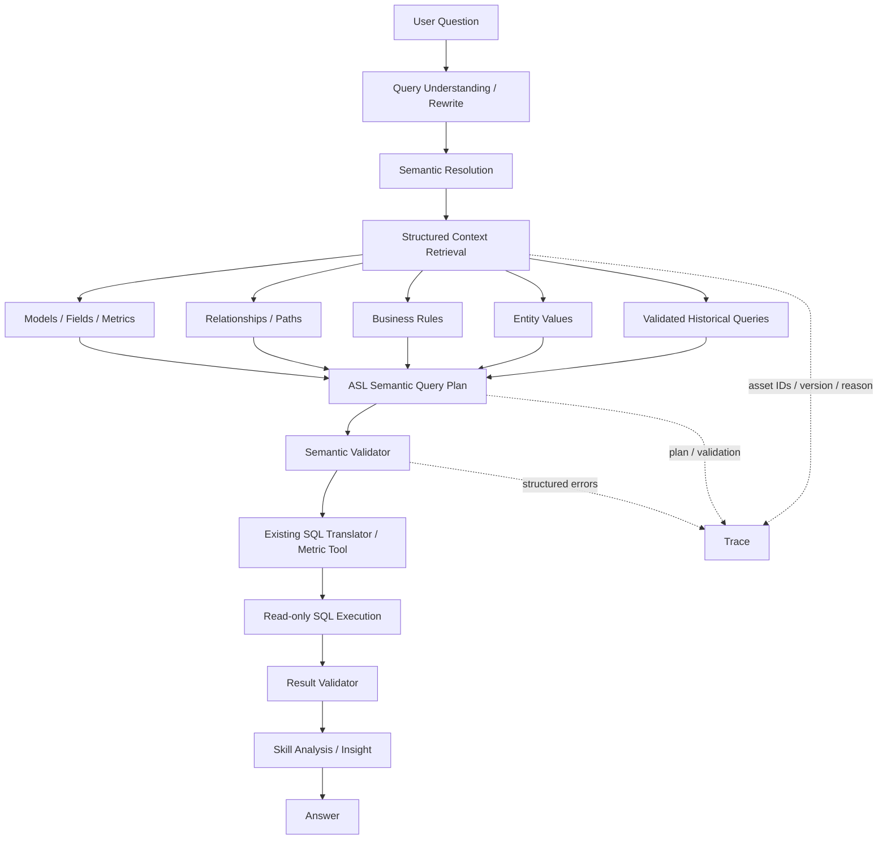

# 当前数据智能体 Semantic / Context Layer 架构分析

> 阶段：WrenAI 增量融合 Phase 1（研究、现状扫描与 Gap Analysis）  
> 日期：2026-08-31  
> 约束：本阶段不修改业务代码、数据库结构、`.env`、`app/config.py`、外部 API 或 SSE 协议。

## 1. 结论摘要

当前系统已经具备完整的 `自然语言 → CanonicalAnalysisRequest → 指标绑定 → ASL → 只读 SQL → 数据集 → 分析 → 验证 → 回答` 链路，不是直接把原始 Schema 交给 LLM 的传统 Text-to-SQL。

与最新版 WrenAI 对比，当前最值得保留的能力是：

- 调用方绑定指标 ID，并将指标选择作为执行硬约束；
- Oagnet 按语义模型和业务域隔离召回实体、属性、关系、指标、维度和实体值；
- ASL 输出经过确定性归一化、作用域验证、字段验证、时间锚点验证和歧义门禁；
- SQL Translator 只从已注册语义元数据构造 Join，并具有关系路径搜索；
- 已实现一对多 Join 下 `SUM/AVG/COUNT(*)` 膨胀风险阻断；
- 指标已经包含公式、单位、格式、业务定义、时间口径、全局过滤、依赖指标、绑定实体和绑定维度；
- 已有预算化 Context Builder、会话压缩、长期记忆、事件日志、Trace 和结果验证。

当前真正的核心缺口不是“再建一套 MDL”，而是：

1. 现有语义对象分散在 MySQL 表、Oagnet 向量元数据、SQL Translator 缓存和 DataAnalysis 领域对象中，缺少统一、可审计的语义上下文快照。
2. Business Rule 目前混在指标描述、维度特殊规则、知识库、代码规则和 Prompt 中，没有独立的结构化召回对象。
3. Context Retrieval 已按对象类型检索，但尚未形成统一的 `RelevantModels / Metrics / Relationships / Rules / Entities / History` 结构化结果与跨类型排序。
4. 没有完整的“已验证历史查询”契约；现有会话/DAG/数据集记忆不能替代带语义版本和 Validator 状态的 NL→Semantic Query→SQL 案例库。
5. `version=current` 和 lineage 接口已经存在，但还不是可复现的不可变 Semantic Snapshot。
6. SQL 语义校验已有较强基础，但错误仍以字符串异常为主，尚未形成供有限修复循环消费的统一结构化错误。

因此后续应增量形成：

```text
现有 MySQL Semantic Metadata
        ↓
统一 Semantic Context Snapshot（只读投影，不复制第二份真相）
        ↓
分类型检索 + 跨类型排序 + 关系闭包
        ↓
Semantic Query Plan
        ↓
现有 ASL / SQL Translator
        ↓
结构化 Semantic Validation
```

## 2. 研究范围与版本判断

本次只研究 WrenAI 当前 `main` 分支和官方 Core 文档，没有把旧版 Wren GenBI Classic 当作目标架构。

官方资料：

- [WrenAI main 仓库](https://github.com/Canner/WrenAI)
- [WrenAI Core README](https://github.com/Canner/WrenAI/blob/main/core/wren/README.md)
- [What is MDL](https://docs.getwren.ai/oss/engine/concept/what_is_mdl)
- [MDL Schema Reference](https://docs.getwren.ai/oss/reference/mdl)
- [What is Context](https://docs.getwren.ai/oss/concepts/what_is_context)
- [Core CLI / Memory Reference](https://github.com/Canner/WrenAI/blob/main/docs/core/reference/cli.md)
- [LangChain / LangGraph Integration](https://github.com/Canner/WrenAI/blob/main/docs/core/sdk/langchain.md)
- [Skills Reference](https://github.com/Canner/WrenAI/blob/main/docs/core/reference/skills.md)
- [新旧仓库迁移说明](https://github.com/Canner/WrenAI/discussions/2205)

### 2.1 最新版 WrenAI

当前 main 的定位是 Open Context Layer / Context Engine，主要面向 AI Agent、SDK 和 MCP 客户端。核心目录包括：

- `core/wren-core`：基于 Apache DataFusion 的 Rust 语义规划与执行核心；
- `core/wren-core-base`：Manifest 与 MDL 基础类型；
- `core/wren-core-py`：Python 绑定；
- `core/wren-core-wasm`：WASM 构建；
- `core/wren`：Python SDK 与 CLI；
- `core/wren-mdl`：MDL JSON Schema；
- `sdk/wren-langchain`：LangChain / LangGraph 薄集成；
- `skills` 与内置 Skill：建立、使用和丰富 Context 的操作流程。

### 2.2 与旧版 GenBI Classic 的差异

| 方面 | 最新 main | 旧版 GenBI Classic |
|---|---|---|
| 核心定位 | 面向 Agent 的开放 Context Engine | 面向终端用户的完整 GenBI 产品 |
| 主要入口 | CLI、Python SDK、LangChain、MCP、Skill | Web UI、对话产品和可视化建模 |
| 语义资产 | Git 可版本化的 YAML/MDL 与 `knowledge/` | UI 管理的模型和知识资产 |
| 内存 | `knowledge/sql/*.md` 为真相，grep/LanceDB 为检索实现 | 产品内部问答与历史能力 |
| UI | 新 main 不继续迁移旧建模 UI | `legacy/v1` / `v1-final` 保留 |
| 集成方式 | 给现有 Agent 提供 Context/SQL 工具 | 更接近一套完整应用 |

这意味着本项目应学习其“显式上下文契约、按需检索、受治理规划”的思想，不应引入其旧 UI 或替换现有 LangGraph Runtime。

## 3. WrenAI 最值得借鉴的 10 个设计

1. **MDL 是可执行语义契约，不是 Schema 文档。** Model、Column、Relationship、Calculated Field、View、Cube 共同约束 Agent 和执行引擎。
2. **Context 大于 Semantic Layer。** Structural、Semantic、Business、Operational、Behavioral 五层分离，避免把所有知识塞进一个 Prompt。
3. **语义资产可审查、可构建。** 源文件可版本化，编译产物可重建，修改后先 validate 再 build。
4. **Agent 按需取 Context。** 小 Schema 可完整描述，大 Schema 用 `type/model/limit` 定向检索，不默认全量注入。
5. **关系是声明式契约。** Join 类型和条件属于模型定义，而不是 LLM 根据同名字段猜测。
6. **聚合对象显式化。** Cube 的 measures、dimensions、time dimensions 和 hierarchies 为常用聚合提供稳定接口。
7. **历史查询的源与索引分离。** 经确认 NL→SQL 存在可审查文件中，LanceDB 只是派生索引，可重建、可降级。
8. **业务上下文渐进丰富。** Schema 生成只提供骨架，描述、单位、枚举含义、默认规则、标准表和成功案例逐步补全。
9. **Skill 负责流程而非业务定义。** Skill 指导 Agent 如何建立、验证和使用 Context，业务含义仍落入 MDL/knowledge。
10. **SDK 是薄适配层。** Wren 不要求替换 LangGraph；Toolkit 只把 Context、Memory 和 SQL 能力接到现有 Agent。

## 4. 当前项目完整能力扫描

### 4.1 Semantic Layer 与 Metadata

语义真相主要存储在现有平台 MySQL 元数据中，并由 Oagnet 与 SQL Translator 分别读取：

- 语义模型、业务域；
- 实体、实体属性、物理字段映射；
- 实体关系、关系语义、关系约束、Join Key；
- 指标、指标公式、依赖指标、全局过滤；
- 维度、维度层级、枚举、特殊规则、指标绑定和实体绑定；
- 物理表、物理字段和数据源作用域。

现有表达能力对照：

| 语义能力 | 当前状态 | 判断 |
|---|---|---|
| Model / Entity | 已实现 | 保留 |
| Field / Attribute | 已实现，含物理映射和类型 | 保留 |
| Dimension | 已实现，含层级、枚举、时间维度 | 保留 |
| Measure / Metric | 已实现，指标体系比普通 MDL 更细 | 保留并统一投影 |
| Calculated Field | 指标公式和依赖指标已支持；普通实体计算字段不统一 | 部分缺失 |
| Relationship / Join Condition | 已实现 | 保留 |
| Cardinality | 已有 `relation_type`，并参与聚合风险校验 | 保留并标准化枚举 |
| Primary / Foreign Key | 物理映射和关系键存在，主键标识并非所有实体完整 | 需要质量审计 |
| Business Name / Description | 已实现 | 保留 |
| Alias / Synonym | 实体、指标、维度已支持 | 保留 |
| Example Value | 有实体属性值向量和枚举，但不是统一字段级示例 | 部分实现 |
| Aggregation / Formula | 指标公式已实现 | 保留 |
| Default Time Field | 指标 `time_anchor` 已实现 | 保留 |
| Unit / Format | 已实现 | 保留 |
| Filter / Business Rule | 指标全局过滤已实现；跨对象业务规则不独立 | 部分缺失 |
| Source / Confidence / Status | 向量结果有 score，部分元数据有状态；没有统一资产来源与置信度 | 缺失 |
| Immutable Semantic Version | API 有 `current` 和 lineage version，但不能复现当时完整上下文 | 缺失 |

### 4.2 Query Understanding 与 Rewrite

DataAnalysis Agent 已先生成 `CanonicalAnalysisRequest`，包含：

- 主/次意图与候选置信度；
- 指标引用及 metric ID/version；
- 实体、字段、维度、过滤、时间范围；
- 分析算子、排名、比较、预测参数；
- 语义歧义、缺失槽位、假设；
- 会话作用域、业务域和语义模型。

问题不会直接变成 SQL。Question Rewrite、多轮补全、待澄清状态、任务帧和结构化意图都已经存在，方向与 WrenAI 的“先 Context/Plan、后 SQL”一致。

### 4.3 Semantic Retrieval

Oagnet 当前分别检索：

- entity；
- attribute；
- relation；
- metric；
- dimension；
- entity_attribute_value。

检索已有以下优点：

- semantic model / business domain 强作用域隔离；
- 先取小候选池，再用业务名称和同义词进行确定性重排；
- 调用方绑定指标时，不允许向量排名替换指标；
- 通用“销售趋势”会保留销售额、销售量等候选用于歧义判断；
- 关系闭包会补全已召回实体之间必要的受限路径；
- 空召回时禁止编造语义编码。

主要不足：

- 检索结果最终仍被格式化为三大文本段，结构化 Context 没有贯穿到 DataAnalysis Trace；
- Business Rule、Historical Query 和经过验证的 Example 尚未作为一等检索类型；
- 跨类型排序主要是规则拼接，没有统一解释每个 Context 为什么入选；
- `top_k/candidate_k` 是对象级固定策略，未根据任务复杂度分配 Context 预算；
- 关系闭包解决“能否连通”，但尚未输出独立、可审计的候选路径评分与选择理由。

### 4.4 Context Builder

DataAnalysis Agent 已有预算化 `ContextEnvelope`，包含问题、任务状态、分析计划、近期历史、会话摘要、长期记忆、工具摘要和 business context。

优点：

- 具有确定性字符预算；
- 不把原始大数据集直接放入 Prompt；
- 保留当前问题和必要结构化状态；
- 对历史、记忆和工具结果进行压缩；
- 有 omitted 计数，能看到被裁剪内容。

不足：

- `business_context` 仍是无类型 dict；
- Context 优先级固定为记忆→历史→工具，没有按当前 Query 的语义相关性统一排序；
- Semantic Retrieval 的 models/metrics/relationships/rules/history 尚未作为明确字段进入 Envelope；
- Context 选择结果没有记录 asset ID/version/source/confidence/reason。

### 4.5 Text-to-SQL 与 Query Plan

当前实际链路是：

```text
CanonicalAnalysisRequest
  → 指标 ID 绑定
  → Oagnet 语义召回
  → ASL 生成与规范化
  → ASL 确定性校验
  → SQL Translator 语义翻译
  → 只读 SQL 安全校验
  → 独立 SQL 执行服务
```

ASL 已经是项目自己的 Semantic Query Plan，包含 subject、metrics、dimensions、filters、time_context、sort、limit、having 和 ambiguity。没有必要再引入另一种 Wren MDL Query Plan；后续应增强 ASL 的证据与验证报告。

### 4.6 Relationship / Join / Grain

SQL Translator 已实现：

- 从主实体出发的关系路径 BFS；
- 只使用注册关系构建 Join；
- 维度、过滤、时间锚点和指标公式涉及的额外 Join 检测；
- 缺失 Join 基数时对高风险聚合 fail closed；
- 一对多路径下阻止 `SUM/AVG/COUNT(*)` 被重复放大；
- `COUNT(DISTINCT ...)` 作为稳定计数口径；
- 指标依赖展开与循环检测。

这是当前项目最成熟、最不应重写的部分。

仍有改进空间：

- 当前高风险策略以“拒绝”为主，尚未安全生成预聚合子查询；
- 缺少明确的 Query Grain 对象，粒度主要从指标公式、主实体和维度隐式推导；
- 多对多、半可加指标、快照指标和跨时间粒度可加性尚未形成统一契约；
- 结构化 Validation Result 尚未完整告诉上层具体关系边、基数和建议修复。

### 4.7 SQL Validator 与 Correction

已有校验：

- ASL 容器和字段类型；
- 实体、指标、维度、物理字段存在性与作用域；
- 时间锚点和逻辑时间维度绑定；
- 指标公式、依赖和全局过滤；
- Join 路径与聚合基数风险；
- LIMIT、投影模式、HAVING；
- 最终只读 SQL 安全检查。

缺口：

- 校验失败主要抛出 `ValueError` 文本；
- 现有有限修复反馈尚未统一为 `error_type / object_id / expected / actual / suggested_fix / retryable`；
- 没有统一区分 Syntax、Semantic、Business 三类验证报告；
- 执行后的 Result Validator 很强，但“SQL语义正确率”尚未单独进入评测指标。

### 4.8 Memory / Historical Query / Feedback

现有 Memory 能力包括：

- Redis/内存会话状态；
- pending clarification；
- task frame；
- DAG checkpoint；
- 数据集追问；
- 结构化会话压缩；
- 长期用户偏好候选、确认、作用域和撤销；
- append-only Session Event Log；
- Trace Summary。

这些能力主要解决“用户和任务记忆”，不是 WrenAI 所说的“经验证查询记忆”。当前没有完整记录：

```text
question
semantic_request
semantic_context_version
metric_ids
model_ids
relationship_ids
asl
sql
validator_status
execution_status
user_feedback
```

因此不能把历史 SQL 安全地用作 Few-shot，也无法判断它是否因语义定义更新而过期。

### 4.9 Skill / Tool / LangGraph 分工

当前职责基本正确：

- Semantic Layer：业务对象、指标、维度、关系与时间口径；
- Skill：趋势、归因、预测、异常等分析方法；
- Tool：语义查询、SQL 执行、HTTP/MCP、文件、知识库等执行；
- LangGraph/Orchestrator：状态、路由、拆解、恢复、事件和输出；
- LLM：问题理解、受约束的 ASL 规划和结果解释。

不需要迁移到 WrenAI Runtime，也不需要让 Wren Toolkit 接管现有 Tool。

## 5. 容易产生错误的位置

### 5.1 SQL 幻觉

当前已通过作用域校验显著降低风险，但仍可能发生在：

- 向量召回遗漏必要对象，LLM 用近似候选替代；
- 同一业务词在多个对象类型中重名，跨类型排序不统一；
- 业务规则只存在于 Prompt 或代码，未随相关对象一起召回；
- ASL 能通过字段存在性验证，但选择的业务对象不是用户真正含义。

### 5.2 业务口径错误

- “销售额/GMV/收入/订单金额/开票金额”缺乏统一冲突组和默认规则对象；
- 指标版本 `current` 无法让历史答案复现；
- 业务规则来源与置信度不可见；
- 数据水位与指标时间口径已有保护，但默认时间粒度规则没有统一 Context 资产。

### 5.3 Join 错误

当前不会自由猜 Join，风险主要剩余在：

- 元数据关系本身配置错误或基数缺失；
- 多条合法路径并存但缺少 canonical path 优先级；
- 多对多与桥表语义不完整；
- 关系校验报错不能结构化反馈给修复循环。

### 5.4 上下文过多

- Oagnet 候选池在复杂问题下可能把多个对象完整元数据格式化进 Prompt；
- 实体记录嵌套 attributes/relations/bind_assets，可能重复出现独立 attribute/relation 信息；
- DataAnalysis Context 与 Oagnet Prompt 分别构建，存在重复上下文预算。

### 5.5 上下文不足

- 独立 Business Rule；
- 经验证 Historical Query；
- 当前语义版本与资产来源；
- 多路径 Join 的选择理由；
- 指标冲突组、默认指标和可加性；
- 字段级 example values 的可信来源与采样时间。

## 6. 当前重复设计

1. Oagnet 和 SQL Translator 都读取并转换语义元数据，字段命名和缓存模型不完全一致。
2. DataAnalysis 的 `MetricRef`、Oagnet metric metadata、SQL Translator `SemanticCatalog` 都表达指标身份，但没有共同快照 ID。
3. DataAnalysis `ContextBuilder` 与 Oagnet `PromptBuilder` 各自控制一层上下文，没有共享结构化 Context Selection 结果。
4. 关系图在 Oagnet 用于召回闭包，在 SQL Translator 用于 Join 规划，算法职责合理但缺少同一 relationship ID/path evidence。
5. Business Rule 分散在 classifier 规则、指标 global filters、维度 special rules、Prompt 和知识库。

这些重复不应通过“大一统重写”解决，应先增加轻量只读契约，让各服务引用相同 asset ID、version 和 evidence。

## 7. 与 WrenAI 的差异矩阵

| 能力 | WrenAI 最新版 | 当前项目 | Phase 1 判断 |
|---|---|---|---|
| 可执行语义契约 | MDL + Core Engine | MySQL DSL + ASL + SQL Translator | 思想一致，不替换 |
| 文件化版本管理 | YAML → mdl.json | DB 元数据 + `current` | 需要轻量快照 |
| 模型/字段/关系 | 完整 | 完整 | 保留 |
| Cube | 明确聚合接口 | 指标 + 维度绑定 | 不机械引入，可增强可加性 |
| Business Knowledge | `knowledge/rules` | 分散在多处 | 需要独立对象 |
| Context Retrieval | schema/context fetch | 分类型向量召回 | 已有基础，需统一结果 |
| Historical Query | 可审查 NL→SQL + 派生索引 | 无验证查询契约 | 需要新增 |
| Context Build/Validate | CLI validate/build | 运行时校验 | 增加发布前一致性检查 |
| Relationship Governance | MDL relationship | 注册关系 + 路径 + 基数门禁 | 当前较强，增强错误结构 |
| Agent Integration | SDK/Toolkit 薄接入 | 原生 LangGraph/FastAPI | 不引入 Toolkit |
| Memory Backend | grep/LanceDB | Redis/MySQL/vector store | 不引入 LanceDB |
| Trace | Agent/工具自行集成 | 已有事件和 Trace | 增加语义选择 Span |

## 8. 决定不引入的能力

### 8.1 不引入 Wren Core / DataFusion

当前 SQL Translator 已支持现有 MySQL 语义表、ASL、关系规划、指标公式、安全校验和数据源执行。引入 Rust Core 会制造第二套语义执行真相，并增加跨语言部署复杂度。

### 8.2 不引入 Wren MDL YAML 作为新主数据

现有平台数据库已经是配置入口。后续可以生成类似 MDL 的只读快照用于审计和测试，但不能让 YAML 与 MySQL 双写竞争。

### 8.3 不引入 LanceDB / sentence-transformers

项目已有常驻 Oagnet 向量服务，避免 Wren CLI 冷启动加载大模型的额外延迟。Wren 官方当前也保留 grep fallback，说明索引实现不是 Context 架构本身。

### 8.4 不引入 Wren LangChain Toolkit

当前 LangGraph、Tool Runtime、组合语义查询器和 SSE 协议均已稳定。Toolkit 只会增加一层转发。

### 8.5 不引入旧 GenBI UI

旧 UI 不属于最新版 main 的核心方向，本项目也已有自己的前后端和语义配置平台。

### 8.6 暂不自动修改业务语义

自动 Context Enrichment 可以生成候选，但高风险 Metric、Relationship、Join、默认规则必须人工确认后发布，不能让 LLM 自动覆盖现有定义。

## 9. 建议目标架构



## 10. 后续增量实施计划

### Phase 2：Semantic Context Contract

在现有领域模型上增加只读结构：`SemanticAssetRef`、`SemanticContextSnapshot`、`BusinessRuleRef`、`RelationshipPathRef`。只做投影，不新建第二套存储。

验收重点：相同请求能记录选中的 asset ID、版本、来源、置信度和选择理由；现有 ASL/SQL 不变。

#### Phase 2 实施结果

- 已新增上述四种严格只读契约；语义资产仅保存引用与来源，不复制上游语义模型。
- `CompositeSemanticQueryTool` 在指标完成权威绑定后生成确定性的 `SemanticContextSnapshot`。
- 快照记录 asset ID、类型、标准名称、版本、来源、置信度、选择理由及内容指纹。
- 快照字段被明确排除在下游请求序列化之外，因此现有 ASL、SQL 和外部 API 契约不变。
- 成功查询会追加 `SEMANTIC_CONTEXT` Session Event，支持按 message/trace 复盘实际选中的语义资产。
- 当前 Phase 2 只投影已选中的指标、实体、维度和字段；业务规则与关系路径结构已经预留，实际召回和填充属于 Phase 3/4。

### Phase 3：Metric / Relationship / Business Context

- 标准化关系基数枚举和 canonical path；
- 补充指标 grain、additivity、conflict_group、default_for_intent；
- 将真正跨对象的业务规则从 Prompt/代码中投影为独立可检索资产；
- 建立元数据完整性审计，不直接修改生产定义。

#### Phase 3 第一批实施结果

- 指标资产已补充 `grain`、`aggregation`、`additivity`、`default_time_field`、`conflict_group` 和 `default_for_intents` 统一字段。
- 组合语义查询器在权威指标绑定后读取指标 definition，并将声明公式、绑定实体、业务域、适用场景投影进请求快照。
- `SUM`、`COUNT DISTINCT`、`AVG` 等聚合与可加性由确定性规则识别；推导字段在 metadata 中明确标记，不冒充上游声明。
- 指标的全局过滤条件投影为独立 `BusinessRuleRef`，记录来源、版本、适用指标和选择理由。
- 关系基数已使用受限枚举契约；当前 definition/lineage 接口没有提供完整 Join condition，因此不从物理血缘猜测关系路径，待下一批从语义关系表投影 canonical path。
- definition 暂时不可用时安全降级为 Phase 2 基础快照，不阻断已经受治理的查询链路。

#### Phase 3 关系路径实施结果

- SQL Translator 新增 `/v1/semantic/relationships:resolve`，只从已发布实体关系配置构建关系图。
- 支持正向和反向遍历，并在反向遍历时同步反转 `ONE_TO_MANY / MANY_TO_ONE` 基数。
- 返回 canonical path、关系 ID、精确 Join condition、逐跳 cardinality 和 `LOW / FANOUT / HIGH` 风险。
- 数据智能体从实体、维度、字段和过滤字段提取显式目标实体，将返回结果投影到 `RelationshipPathRef` 并写入 `SEMANTIC_CONTEXT` 事件。
- 空实体编码、无表限定的 `id = id`、恒等自连接等脏关系禁止进入关系图；不存在声明路径时不按字段名称猜 Join。
- 模型 81 实测 `hospital -> sales_order -> product`，两跳基数为 `ONE_TO_MANY -> MANY_TO_ONE`，风险标记为 `FANOUT`。

### Phase 4：Semantic Retrieval

- 增加 Business Rule 和 Validated Query 两类召回；
- 输出结构化分类型结果；
- 跨类型排序考虑精确业务词、指标绑定、关系必要性、Session 和历史案例；
- 基于字符预算而不是固定 TopK 选择最小充分 Context。

#### Phase 4 实施结果

- 新增统一检索结果 `SemanticRetrievalItem / SemanticRetrievalSummary`，按 Metric、Entity、Dimension、Field、Business Rule、Relationship Path、Validated Query 分类记录。
- 排序综合权威类型基础分、问题精确词命中、上游置信度和执行必要性；相同输入的排序与快照指纹确定一致。
- 默认采用 12000 字符预算，不再使用固定 TopK；每个候选记录字符成本、得分、是否必需和选择理由。
- 指标、查询主体、指标全局业务规则和执行所需 Join 路径属于 required context，预算不足时也不会静默丢弃，并显式标记预算超限。
- 低优先级字段、维度和历史案例超过预算时进入 dropped 清单，支持 Trace 解释为什么未注入。
- 已预留 `ValidatedQueryRef`，当前不直接复用历史 SQL；只有 Phase 7 通过验证门槛的查询才允许进入候选集。
- 语义快照仍为内部字段，不改变 ASL、SQL、SSE 与外部请求协议。

### Phase 5：Semantic Query Planning

保留 ASL，在其外增加 `plan_evidence`：选择的 Metric、Models、Relationship Path、Business Rules、Entity Resolution 和 Grain。

#### Phase 5 实施结果

- 新增内部只读 `SemanticPlanEvidence`，以语义快照为输入生成确定性 plan ID 和 fingerprint。
- 记录所选 Metric、Entity、Grouping Dimension、Business Rule、Relationship Path、时间粒度和过滤字段解析证据。
- 过滤字段区分 `SEMANTIC_FIELD / LOGICAL_DIMENSION / UNRESOLVED`，记录置信度与选择依据；列表值只记录数量摘要，避免把大批值写入 Trace。
- Join 路径的 `FANOUT / HIGH` 风险会进入规划 warning，使后续 Semantic Validator 可以执行聚合膨胀检查。
- 规划状态区分 `COMPLETE / PARTIAL`，未解析过滤字段、必需上下文预算超限或关系风险不会被静默忽略。
- 成功查询追加 `SEMANTIC_PLAN` Session Event，可按 message ID 复盘该次 SQL 之前采用的语义计划。
- `semantic_plan_evidence` 被排除在下游请求序列化之外，现有 ASL、SQL、API 和 SSE 均保持兼容。

### Phase 6：SQL Semantic Validator

把现有字符串异常升级为结构化错误；增加 Syntax / Semantic / Business 三层报告、Query Grain 和多对多风险。修复最多有限次数。

#### Phase 6 实施结果

- SQL Translator 在翻译成功后返回 `semantic_validation_report`，严格包含 Syntax、Semantic、Business 三层。
- Syntax 层检查单条只读语句、危险操作和 ASL 结构；Semantic 层检查资产作用域、声明关系、指标公式和聚合基数；Business 层检查全局指标过滤规则、时间锚点和查询形状。
- 原有强制门禁继续生效：未注册实体/字段/指标、缺失 Join 基数、一对多重复累计、缺失关系路径及非法明细/聚合组合会在 SQL 执行前失败。
- 失败结果新增稳定错误码，包括 `SEMANTIC_ASSET_NOT_FOUND`、`JOIN_CARDINALITY_MISSING`、`AGGREGATION_FANOUT_RISK`、`RELATIONSHIP_PATH_NOT_FOUND`、`QUERY_SHAPE_INVALID`。
- 数据智能体使用严格 Pydantic 契约验证三层报告；报告非法或状态非 PASS 时禁止进入 SQL 执行。
- 验证报告随 `DataQueryResult` 保存，并追加 `VALIDATION_RESULT(validation_scope=SQL_SEMANTIC)` Session Event。
- 滚动部署期间旧 SQL Translator 未返回报告时进入显式 `COMPATIBILITY_MODE`，不会伪装成三层校验已通过。

### Phase 7：Validated Query Recall

只保存通过 Semantic Validator、执行成功且满足可靠性门槛的查询。记录 semantic snapshot/version；召回只作 Few-shot，必须再次验证。

### Phase 8：Context Enrichment

从 Schema、人工描述、成功查询和业务文档生成候选；区分 `manual / inferred / query_history / llm_generated`，携带 confidence/status，关键资产走人工确认。

### Phase 9：Semantic Evaluation

增加 Metric Resolution、Entity Resolution、Model Recall、Relationship Accuracy、SQL Semantic Accuracy、Clarification Accuracy 和 Answer Accuracy。明确区分“能执行”和“语义正确”。

## 11. Phase 1 验收结论

- 已研究最新版 WrenAI main、Core、MDL、Context、Memory、Skill 和 LangGraph SDK；
- 已明确最新版与旧 GenBI Classic 的边界；
- 已扫描 DataAnalysis Agent、Oagnet 和 SQL Translator 的相关实现；
- 已识别已有能力、缺口、重复、SQL 幻觉风险、口径风险、Join 风险和 Context 预算问题；
- 已给出不引入项和原因；
- 本阶段没有修改任何业务代码、数据表、配置、API 或 SSE 标签；
- 下一步应从 Phase 2 的统一只读 Semantic Context Contract 开始，不应先改 SQL 生成器。
